MLH1 Data Report
================
April Peterson
some date

#### Research Description

Measure nMLH1 foci per meiotic cell to estimate recombination rate for diverse strains of house mice abd related rodents. Comparison the differences in recombination rates across sexes and genetic background to inform models of how meiotic recombination rates evolve.

#### Description of Report

-   Display plots and figures of distributions of MLH1 counts to assess intial overall patterns.

-   *Report basic statistics of results and to help keep track of the number of images for each category and mouse*

#### Discription of quantification process

Cell images are quantified in batches after file names are anonymized. The number of MLH1 foci, number of "achiasmate" and asynasped bivalents are quantified. A quality score is given; 1 to 5 (best to worst).

#### Initial Patterns from MLH1 distributions

After taking the data from 2 highest cell quality, some but not all mouse means converge.

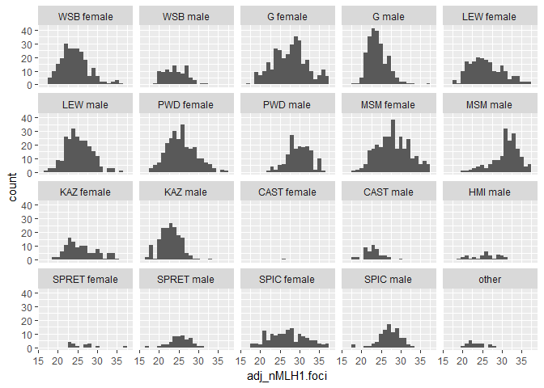

#### Comparison of MLH1 distributions

After taking the data from 2 highest cell quality, some but not all mouse means converge. For some mice (mostly female) the majority of cells are excluded. This is especially true for PWD and WSB females.

#### Tests for quality and nMLH1 foci number

> *How do the distributions change across different quality scores?*

> *How do the distributions change across mice with a good number of cells?*

##### Effects of quality

Human quantification seems to be biased towards rating cells with more MLH1 foci as higher quality. Unbiased cell quality assignment, would not show a positive correlation with quality and nMLH1. (CAST female data is fake)

    ## Warning: Removed 14 rows containing missing values (geom_point).

    ## Warning: Removed 5 rows containing missing values (geom_point).

I ploted the mean of each quality bin with a red dot. From the pattern of the red dots, there is definately a negative relationship with quality and nMLH1 foci across the data. This is most pronounced in MSM males and least pronounced in G males. The CAST female data is dummy data.

#### Assessing the Distributions by mouse

latice plot of scatter plots for jitter plots of cell oberservations by quality. The category mean is in black and the mouse specific mean is in red.

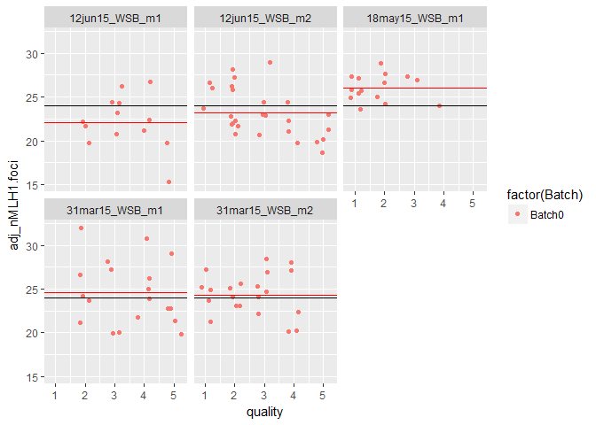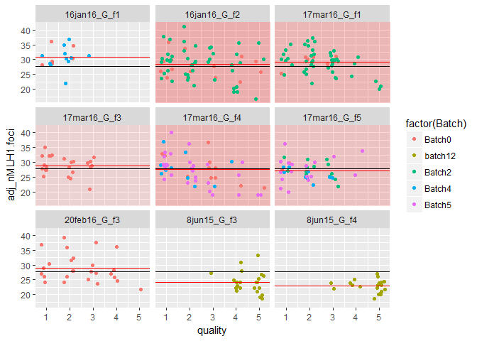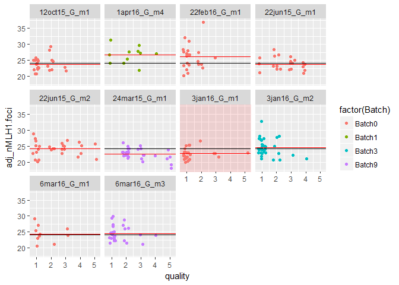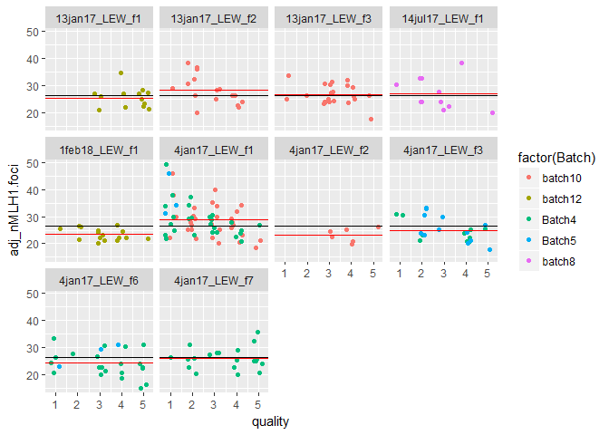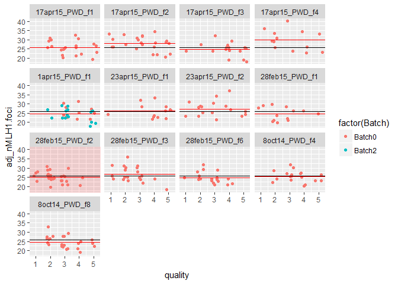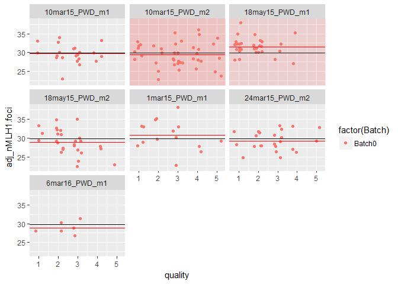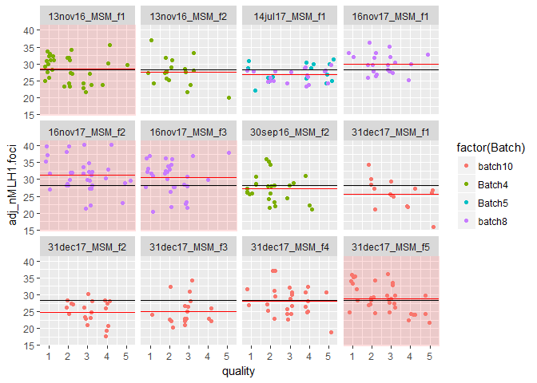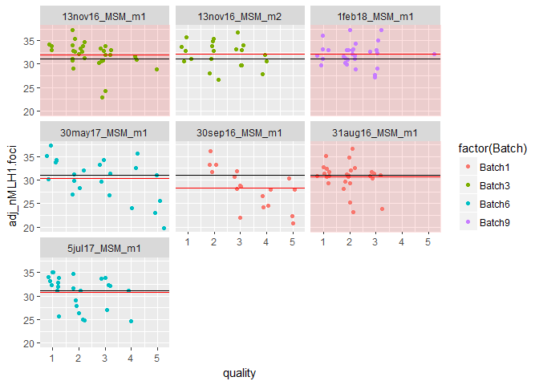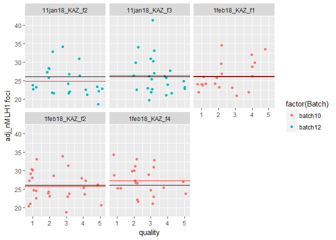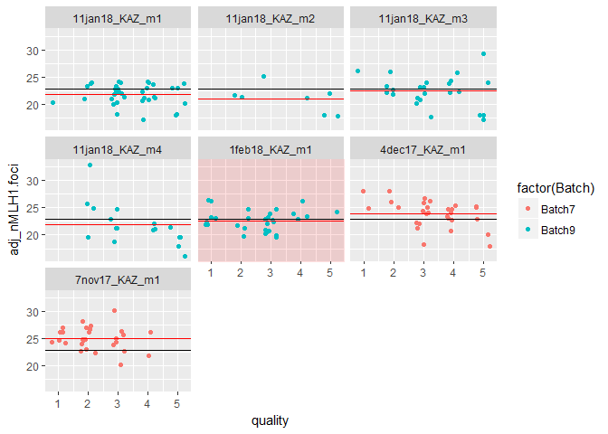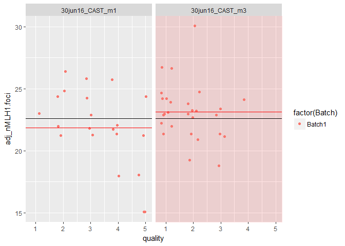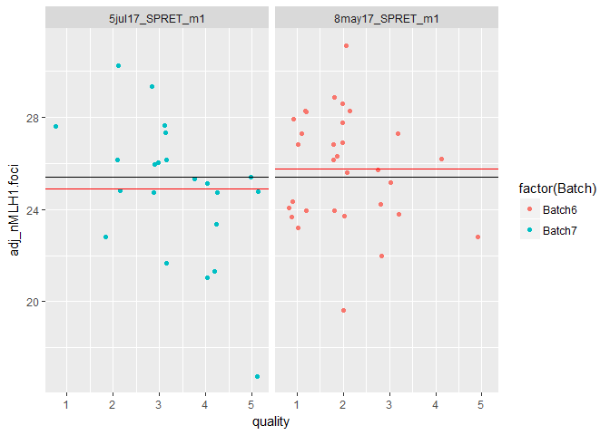

Making all of these scatter plots, allows us to look at the whole distributions of the data for each mouse. The distance of the red line from the black could be a indicator of slides or mice with slide specific technical noise.

PWD females and a very large range. This is driven by data from 17apr15\_PWD\_f4. These data should be looked at more closely.

In some mice there seems to be bimodel cell populations, those of clearly high quality and those of lower quality. This may be due to the screening of images before quantification, and allowing more bad cells data remain in the data set, instead of deleting them.

#### Mice table

Table of the mice used and MLH1 stats.

| mouse               |  Nmice|  Ncells|  mean\_co|         cV| var    |     sd|     se| subsp    | strain | sex    |
|:--------------------|------:|-------:|---------:|----------:|:-------|------:|------:|:---------|:-------|:-------|
| 10mar15\_PWD\_m1    |      1|      42|    29.667|   8.109960| 5.789  |  2.406|  0.371| Musc     | PWD    | male   |
| 10mar15\_PWD\_m2    |      1|      80|    29.400|  10.599696| 9.711  |  3.116|  0.348| Musc     | PWD    | male   |
| 11jan18\_KAZ\_m1    |      1|      36|    21.722|   8.981525| 3.806  |  1.951|  0.325| Musc     | KAZ    | male   |
| 11jan18\_KAZ\_m2    |      1|       7|    21.000|  11.664237| 6.000  |  2.449|  0.926| Musc     | KAZ    | male   |
| 11jan18\_KAZ\_m3    |      1|      24|    22.417|  12.883299| 8.341  |  2.888|  0.590| Musc     | KAZ    | male   |
| 11jan18\_KAZ\_m4    |      1|      17|    21.882|  17.467689| 14.610 |  3.822|  0.927| Musc     | KAZ    | male   |
| 11jan18\_WxL.F1\_m1 |      1|      21|    23.381|   9.319138| 4.748  |  2.179|  0.475| other    | other  | male   |
| 12jun15\_WSB\_f1    |      1|      34|    22.941|  10.345379| 5.633  |  2.373|  0.407| Dom      | WSB    | female |
| 12jun15\_WSB\_f2    |      1|      16|    22.500|  10.764979| 5.867  |  2.422|  0.606| Dom      | WSB    | female |
| 12jun15\_WSB\_m1    |      1|      26|    22.077|  13.371077| 8.714  |  2.952|  0.579| Dom      | WSB    | male   |
| 12jun15\_WSB\_m2    |      1|      54|    23.185|  11.429031| 7.022  |  2.650|  0.361| Dom      | WSB    | male   |
| 12oct15\_G\_m1      |      1|      48|    23.833|   8.361798| 3.972  |  1.993|  0.288| Dom      | G      | male   |
| 13jan17\_LEW\_f2    |      1|      32|    28.250|  18.709391| 27.935 |  5.285|  0.934| Dom      | LEW    | female |
| 13jan17\_LEW\_f3    |      1|      44|    26.636|  13.622876| 13.167 |  3.629|  0.547| Dom      | LEW    | female |
| 13nov16\_LEWES\_m1  |      1|      50|    25.160|  13.080491| 10.831 |  3.291|  0.465| Dom      | LEW    | male   |
| 13nov16\_MSM\_f1    |      1|      62|    28.484|  13.600705| 15.008 |  3.874|  0.492| Musc     | MSM    | female |
| 13nov16\_MSM\_f2    |      1|      36|    27.667|  14.406104| 15.886 |  3.986|  0.664| Musc     | MSM    | female |
| 13nov16\_MSM\_m1    |      1|      64|    31.906|   8.735798| 7.769  |  2.787|  0.348| Musc     | MSM    | male   |
| 13nov16\_MSM\_m2    |      1|      42|    32.190|   8.211546| 6.987  |  2.643|  0.408| Musc     | MSM    | male   |
| 14jul17\_LEW\_f1    |      1|      22|    27.000|  21.075653| 32.381 |  5.690|  1.213| Dom      | LEW    | female |
| 14jul17\_MSM\_f1    |      1|      70|    26.914|   8.782067| 5.587  |  2.364|  0.283| Musc     | MSM    | female |
| 14jul17\_SPRET\_f2  |      1|       4|    26.500|  15.250762| 16.333 |  4.041|  2.021| outgroup | SPRET  | female |
| 14jul17\_SPRET\_f3  |      1|      12|    27.167|  23.005577| 39.061 |  6.250|  1.804| outgroup | SPRET  | female |
| 16jan16\_G\_f1      |      1|      34|    30.706|  11.605369| 12.699 |  3.564|  0.611| Dom      | G      | female |
| 16jan16\_G\_f2      |      1|     122|    28.328|  17.991098| 25.974 |  5.096|  0.461| Dom      | G      | female |
| 16jun15\_WSB\_f4    |      1|      30|    23.467|   8.354532| 3.844  |  1.961|  0.358| Dom      | WSB    | female |
| 16nov17\_MSM\_f1    |      1|      42|    30.048|  10.050288| 9.120  |  3.020|  0.466| Musc     | MSM    | female |
| 16nov17\_MSM\_f2    |      1|      66|    31.333|  15.728306| 24.287 |  4.928|  0.607| Musc     | MSM    | female |
| 16nov17\_MSM\_f3    |      1|      62|    30.516|  15.830037| 23.336 |  4.831|  0.614| Musc     | MSM    | female |
| 17apr15\_PWD\_f1    |      1|      44|    25.545|  14.263812| 13.277 |  3.644|  0.549| Musc     | PWD    | female |
| 17apr15\_PWD\_f2    |      1|      48|    27.667|  13.734805| 14.440 |  3.800|  0.548| Musc     | PWD    | female |
| 17apr15\_PWD\_f3    |      1|      32|    24.688|  14.529827| 12.867 |  3.587|  0.634| Musc     | PWD    | female |
| 17apr15\_PWD\_f4    |      1|      26|    29.769|  17.475649| 27.065 |  5.202|  1.020| Musc     | PWD    | female |
| 17mar16\_G\_f1      |      1|     106|    29.189|  13.036021| 14.478 |  3.805|  0.370| Dom      | G      | female |
| 17mar16\_G\_f3      |      1|      50|    28.840|  10.516231| 9.198  |  3.033|  0.429| Dom      | G      | female |
| 17mar16\_G\_f4      |      1|     106|    27.547|  17.550481| 23.374 |  4.835|  0.470| Dom      | G      | female |
| 17mar16\_G\_f5      |      1|      82|    27.195|  12.371497| 11.319 |  3.364|  0.371| Dom      | G      | female |
| 18may15\_PWD\_m1    |      1|      60|    31.633|   7.565620| 5.728  |  2.393|  0.309| Musc     | PWD    | male   |
| 18may15\_PWD\_m2    |      1|      54|    28.926|  11.274577| 10.636 |  3.261|  0.444| Musc     | PWD    | male   |
| 18may15\_WSB\_m1    |      1|      32|    26.125|   5.648261| 2.177  |  1.476|  0.261| Dom      | WSB    | male   |
| 18nov17\_WSB\_f1    |      1|      38|    25.526|  14.986481| 14.634 |  3.825|  0.620| Dom      | WSB    | female |
| 18nov17\_WSB\_f2    |      1|      42|    24.238|  18.174487| 19.405 |  4.405|  0.680| Dom      | WSB    | female |
| 18nov17\_WSB\_f3    |      1|      80|    24.725|  14.039680| 12.050 |  3.471|  0.388| Dom      | WSB    | female |
| 18nov17\_WSB\_f4    |      1|      44|    25.591|  18.488905| 22.387 |  4.731|  0.713| Dom      | WSB    | female |
| 1apr15\_PWD\_f1     |      1|      52|    24.577|  13.491173| 10.994 |  3.316|  0.460| Musc     | PWD    | female |
| 1apr16\_G\_m4       |      1|      22|    26.636|   9.868145| 6.909  |  2.629|  0.561| Dom      | G      | male   |
| 1feb18\_KAZ\_f1     |      1|      40|    26.300|  15.311152| 16.215 |  4.027|  0.637| Musc     | KAZ    | female |
| 1feb18\_KAZ\_f2     |      1|      52|    25.885|  14.887075| 14.849 |  3.853|  0.534| Musc     | KAZ    | female |
| 1feb18\_KAZ\_f4     |      1|      44|    27.273|  13.795854| 14.156 |  3.763|  0.567| Musc     | KAZ    | female |
| 1feb18\_KAZ\_m1     |      1|      31|    22.581|   8.067150| 3.318  |  1.822|  0.327| Musc     | KAZ    | male   |
| 1feb18\_LEW\_m1     |      1|      27|    22.963|  10.067808| 5.345  |  2.312|  0.445| Dom      | LEW    | male   |
| 1feb18\_MSM\_m1     |      1|      30|    32.067|   7.367598| 5.582  |  2.363|  0.431| Musc     | MSM    | male   |
| 1mar15\_PWD\_m1     |      1|      30|    30.800|  12.367677| 14.510 |  3.809|  0.695| Musc     | PWD    | male   |
| 1mar17\_CAST\_f1    |      1|       2|    26.000|   0.000000| 0.000  |  0.000|  0.000| Cast     | CAST   | female |
| 20dec16\_LEW\_m1    |      1|      54|    26.222|  14.415712| 14.289 |  3.780|  0.514| Dom      | LEW    | male   |
| 20dec16\_LEW\_m2    |      1|      72|    25.694|  14.717161| 14.300 |  3.781|  0.446| Dom      | LEW    | male   |
| 20dec16\_LEW\_m3    |      1|      82|    24.951|  13.357952| 11.109 |  3.333|  0.368| Dom      | LEW    | male   |
| 20feb16\_G\_f3      |      1|      52|    29.000|  16.188256| 22.039 |  4.695|  0.651| Dom      | G      | female |
| 21aug17\_SPI\_f1    |      1|      18|    23.778|  11.499952| 7.477  |  2.734|  0.644| outgroup | SPIC   | female |
| 21aug17\_SPI\_f2    |      1|     100|    27.060|  16.365865| 19.613 |  4.429|  0.443| outgroup | SPIC   | female |
| 22feb16\_G\_m1      |      1|      44|    26.091|  14.549397| 14.410 |  3.796|  0.572| Dom      | G      | male   |
| 22jun15\_G\_m1      |      1|      44|    23.818|   8.061838| 3.687  |  1.920|  0.289| Dom      | G      | male   |
| 22jun15\_G\_m2      |      1|      60|    24.200|   8.767437| 4.502  |  2.122|  0.274| Dom      | G      | male   |
| 23apr15\_PWD\_f1    |      1|      26|    26.077|  13.412976| 12.234 |  3.498|  0.686| Musc     | PWD    | female |
| 23apr15\_PWD\_f2    |      1|      34|    27.235|  15.261359| 17.276 |  4.156|  0.713| Musc     | PWD    | female |
| 23apr15\_WSB\_f1    |      1|      18|    24.778|   9.744832| 5.830  |  2.415|  0.569| Dom      | WSB    | female |
| 24mar15\_G\_m1      |      1|      29|    22.517|   7.839116| 3.116  |  1.765|  0.328| Dom      | G      | male   |
| 24mar15\_PWD\_m2    |      1|      46|    29.261|   8.718537| 6.508  |  2.551|  0.376| Musc     | PWD    | male   |
| 28feb15\_PWD\_f1    |      1|      26|    24.615|  14.123341| 12.086 |  3.477|  0.682| Musc     | PWD    | female |
| 28feb15\_PWD\_f2    |      1|      62|    25.032|  10.703853| 7.179  |  2.679|  0.340| Musc     | PWD    | female |
| 28feb15\_PWD\_f3    |      1|      40|    26.600|  15.248188| 16.451 |  4.056|  0.641| Musc     | PWD    | female |
| 28feb15\_PWD\_f6    |      1|      36|    24.722|  12.215888| 9.121  |  3.020|  0.503| Musc     | PWD    | female |
| 30jun16\_CAST\_m1   |      1|      42|    21.857|  14.452806| 9.979  |  3.159|  0.487| Cast     | CAST   | male   |
| 30jun16\_CAST\_m3   |      1|      56|    23.143|  10.004779| 5.361  |  2.315|  0.309| Cast     | CAST   | male   |
| 30may17\_MSM\_m1    |      1|      46|    30.435|  14.156175| 18.562 |  4.308|  0.635| Musc     | MSM    | male   |
| 30oct17\_SPIC\_m1   |      1|       2|    18.000|   0.000000| 0.000  |  0.000|  0.000| outgroup | SPIC   | male   |
| 30sep16\_MSM\_f2    |      1|      50|    27.200|  14.630660| 15.837 |  3.980|  0.563| Musc     | MSM    | female |
| 30sep16\_MSM\_m1    |      1|      36|    28.333|  14.758561| 17.486 |  4.182|  0.697| Musc     | MSM    | male   |
| 31aug16\_MSM\_m1    |      1|      54|    30.704|   9.915775| 9.269  |  3.045|  0.414| Musc     | MSM    | male   |
| 31dec17\_MSM\_f1    |      1|      30|    25.667|  16.285185| 17.471 |  4.180|  0.763| Musc     | MSM    | female |
| 31dec17\_MSM\_f2    |      1|      40|    24.900|  13.046861| 10.554 |  3.249|  0.514| Musc     | MSM    | female |
| 31dec17\_MSM\_f3    |      1|      36|    25.111|  15.519380| 15.187 |  3.897|  0.650| Musc     | MSM    | female |
| 31dec17\_MSM\_f4    |      1|      52|    28.154|  15.010023| 17.858 |  4.226|  0.586| Musc     | MSM    | female |
| 31dec17\_MSM\_f5    |      1|      66|    28.909|  14.342466| 17.192 |  4.146|  0.510| Musc     | MSM    | female |
| 31dec17\_SPIC\_f1   |      1|      32|    26.188|  18.566929| 23.641 |  4.862|  0.859| outgroup | SPIC   | female |
| 31jul17\_HMI\_m1    |      1|      16|    26.125|  19.611389| 26.250 |  5.123|  1.281| Cast     | HMI    | male   |
| 31mar15\_WSB\_m1    |      1|      38|    24.579|  14.734131| 13.115 |  3.621|  0.587| Dom      | WSB    | male   |
| 31mar15\_WSB\_m2    |      1|      42|    24.333|   9.803809| 5.691  |  2.386|  0.368| Dom      | WSB    | male   |
| 3jan16\_G\_m1       |      1|      56|    22.679|   6.836631| 2.404  |  1.550|  0.207| Dom      | G      | male   |
| 3jan16\_G\_m2       |      1|      64|    24.656|  10.699329| 6.959  |  2.638|  0.330| Dom      | G      | male   |
| 3nov15\_WSB\_f1     |      1|     128|    23.812|  14.314057| 11.618 |  3.409|  0.301| Dom      | WSB    | female |
| 4apr15\_WSB\_f1     |      1|      26|    24.308|   9.926020| 5.822  |  2.413|  0.473| Dom      | WSB    | female |
| 4apr15\_WSB\_f2     |      1|      14|    27.429|  18.072241| 24.571 |  4.957|  1.325| Dom      | WSB    | female |
| 4dec17\_HMI\_m1     |      1|      50|    25.160|  13.031104| 10.749 |  3.279|  0.464| Cast     | HMI    | male   |
| 4dec17\_KAZ\_m1     |      1|      58|    23.828|  10.492421| 6.250  |  2.500|  0.328| Musc     | KAZ    | male   |
| 4dec17\_SPIC\_f1    |      1|      36|    24.778|  16.629457| 16.978 |  4.120|  0.687| outgroup | SPIC   | female |
| 4dec17\_SPIC\_f2    |      1|      64|    29.812|  16.201419| 23.329 |  4.830|  0.604| outgroup | SPIC   | female |
| 4dec17\_SPIC\_m1    |      1|      90|    26.333|   9.793998| 6.652  |  2.579|  0.272| outgroup | SPIC   | male   |
| 4jan17\_LEW\_f1     |      1|     120|    28.783|  22.312793| 41.247 |  6.422|  0.586| Dom      | LEW    | female |
| 4jan17\_LEW\_f2     |      1|      12|    23.333|   9.897433| 5.333  |  2.309|  0.667| Dom      | LEW    | female |
| 4jan17\_LEW\_f3     |      1|      46|    24.913|  17.706502| 19.459 |  4.411|  0.650| Dom      | LEW    | female |
| 4jan17\_LEW\_f6     |      1|      48|    24.375|  19.586276| 22.793 |  4.774|  0.689| Dom      | LEW    | female |
| 4jan17\_LEW\_f7     |      1|      40|    26.050|  15.080722| 15.433 |  3.929|  0.621| Dom      | LEW    | female |
| 4jan17\_LEW\_m1     |      1|      68|    26.941|   9.973857| 7.220  |  2.687|  0.326| Dom      | LEW    | male   |
| 5jul17\_MSM\_m1     |      1|      50|    30.840|  11.027368| 11.566 |  3.401|  0.481| Musc     | MSM    | male   |
| 5jul17\_SPRET\_m1   |      1|      44|    24.909|  11.610200| 8.364  |  2.892|  0.436| outgroup | SPRET  | male   |
| 6mar16\_G\_m1       |      1|      20|    24.400|   9.985916| 5.937  |  2.437|  0.545| Dom      | G      | male   |
| 6mar16\_G\_m3       |      1|      25|    24.600|  10.094624| 6.167  |  2.483|  0.497| Dom      | G      | male   |
| 6mar16\_PWD\_m1     |      1|      12|    28.833|   4.867488| 1.970  |  1.403|  0.405| Musc     | PWD    | male   |
| 7nov17\_KAZ\_m1     |      1|      56|    25.000|   8.215285| 4.218  |  2.054|  0.274| Musc     | KAZ    | male   |
| 7nov17\_SPIC\_m1    |      1|      94|    28.213|   7.742468| 4.771  |  2.184|  0.225| outgroup | SPIC   | male   |
| 8may17\_LEW\_m1     |      1|      18|    24.333|  10.261878| 6.235  |  2.497|  0.589| Dom      | LEW    | male   |
| 8may17\_LEW\_m2     |      1|      54|    24.667|  10.023609| 6.113  |  2.472|  0.336| Dom      | LEW    | male   |
| 8may17\_SPRET\_m1   |      1|      62|    25.774|   9.144217| 5.555  |  2.357|  0.299| outgroup | SPRET  | male   |
| 8oct14\_PWD\_f4     |      1|      38|    25.368|  11.822922| 8.996  |  2.999|  0.487| Musc     | PWD    | female |
| 8oct14\_PWD\_f8     |      1|      50|    24.520|  12.876709| 9.969  |  3.157|  0.446| Musc     | PWD    | female |

#### Power Calculations

Main questions to address:

> *How many cells per mouse should be sampled?*

> *How many mice per strain should be sampled?*

Outline discription of the loop for comparing sample size effects

1.  take ~100 independant samples of total images across different sample sizes (10%, 25%, 50%, 75%, 90%)
2.  then run t.tests across those samples, and report the p value
3.  make a table of the p values for these sample permutations
4.  plot the p values or mean p values across sample sizes

Currently this section is under construction.
