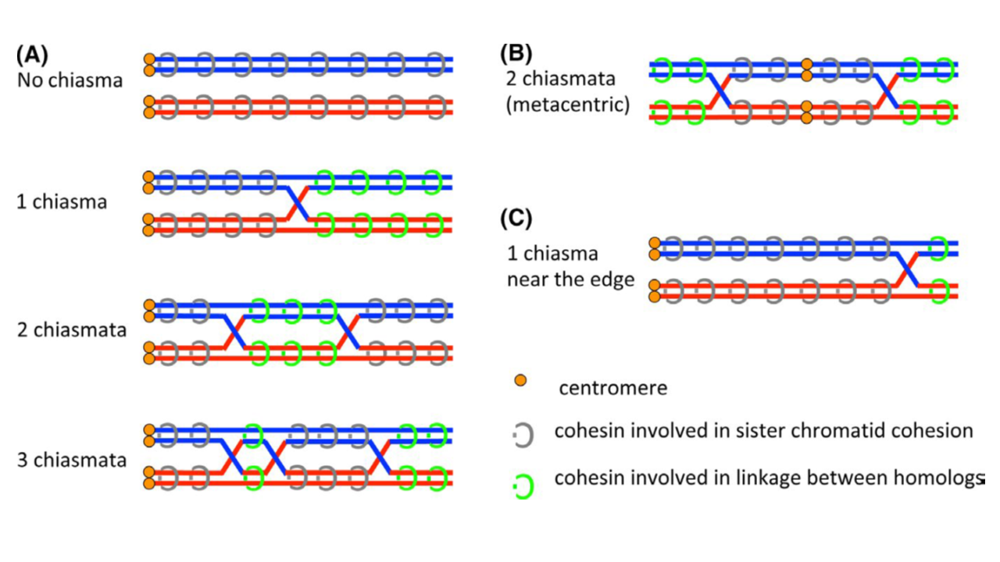

```{r setup, include=FALSE}
library(knitr)
library(ggplot2)
#library(pwr)
library(plyr)
library(lattice)
library(dplyr)
library(raster)
library(lme4)
library(nlme)
library(RLRsim)
library(reshape2)
#library(lmerTest) #loading this package will mess up RLRsim's exactRTRL()
#for got the function i wanted to use


#setwd("C:/Users/alpeterson7/Documents/MLH1repo/")
#setwd("C:/Users/April/Desktop/MLH1repo")
#load(file="data/MLH1/MLH1_data_setup.RData")

setwd("~./MLH1repo/")
#load Clean BivData
load(file="data/CleanBivData_1.22.20.RData")


#load other data files, MLH1
load(file="~./MLH1repo/data/MLH1_data_setup_1.5.20.RData")#added batch18

#load(file="C:/Users/alpeterson7/Documents/MLH1repo/data/MLH1/MLH1_data_setup_1.5.20.RData")#added batch18

load(file="data/MLH1/MLH1_data_setup_11.12.19.RData")#added batch17
#fyi loading mulitple RData files doesn't earase ther files -- but it can overwrite files named the same thing

#load functions
source("~./MLH1repo/src/CommonFunc_MLH1repo.R")
```

# Setup and Discription of Dataset

Bivalent level traits and metrics have been added in the src/Setup_BivData.Rmd script. These observations are from the automated image analysis algorithm and have been currated (threw out incorrect algorithm output).  

The breakdown of curated bivalents by category

`r data.frame(table(droplevels(Curated_BivData$category) ) )`


```{r tech.ect, echo=FALSE, eval=FALSE}
#this fig not needed

nBiv.per.cell <- ggplot(cell.level.BivData_table, aes(nbivs)) + ggtitle("Number of passing bivalents per cell") + geom_histogram(bins = 30) +facet_wrap( ~ category)
nBiv.per.cell

#for cells with close to 20 - they are almost complete
#they should be used to 

#This isn't the same as curated/passing bivalents           
#This plot illustrates how well the algorithm seperated indiviual bivalents per cell image. 
#Several MSM male spreads had tight cells with a high degree of overlap, so fewer bivalents were indiviudally #segmented.
           
```


# Chrm Class proportions

The figure below shows the average percentages of chromosome classes per category.


```{r Chrm.props, echo=FALSE}

#barplots for proportions of chrm classes

#consider adding this the the setup block (could have done this to category level table)
mouse.level.BivData_table$per.0CO <- mouse.level.BivData_table$CO0 / mouse.level.BivData_table$nboxes_passed

mouse.level.BivData_table$per.1CO <- mouse.level.BivData_table$CO1 / mouse.level.BivData_table$nboxes_passed

mouse.level.BivData_table$per.2CO <- mouse.level.BivData_table$CO2 / mouse.level.BivData_table$nboxes_passed

mouse.level.BivData_table$per.3CO <- mouse.level.BivData_table$CO3 / mouse.level.BivData_table$nboxes_passed

mouse.level.BivData_table$per.4CO <- mouse.level.BivData_table$CO4 / mouse.level.BivData_table$nboxes_passed


#DF needs to be melted -- so they all in 1 col
#per code, I've done this by hand

#subset DF for ease
skinny.mouse.level <- mouse.level.BivData_table[-c(11:15 ) ]
col.names.list.99 <- colnames(skinny.mouse.level)
           
#"mouse"         "ncells"        "boxs.IDd"      "nboxes_passed" "Nbiv"          "CO0"           "CO1"       #[8] "CO2"           "CO3"           "CO4"           "per.0CO"       "per.1CO"       "per.2CO"       "per.3CO"      [15] "per.4CO"                

#all of the cols to use
MELT_Chrm.Proportion <- melt(skinny.mouse.level[,c(  "mouse", "ncells","boxs.IDd",    "nboxes_passed","Nbiv","CO0","CO1","CO2", "CO3","CO4",
             
               #leave out the Foci
                "per.0CO", "per.1CO", "per.2CO", "per.3CO", "per.4CO")], 
  id=c("mouse", "ncells","boxs.IDd",    "nboxes_passed","Nbiv","CO0","CO1","CO2", "CO3","CO4"))

#MELT_Chrm.Proportion <- MELT_Chrm.Proportion[(!is.na(MELT_Chrm.Proportion$value)),]

#MELT_Chrm.Proportion <- MELT_Chrm.Proportion[!(is.na(MELT_Chrm.Proportion$value) | MELT_Chrm.Proportion$value==0), ]

MELT_Chrm.Proportion <- add_category(MELT_Chrm.Proportion)
MELT_Chrm.Proportion <- add_sex(MELT_Chrm.Proportion)
MELT_Chrm.Proportion <- add_strain(MELT_Chrm.Proportion)

#then this DF has to be summarized into categories
chrm.class.category_MELT <- ddply(MELT_Chrm.Proportion, c("strain","sex", "variable"), summarise,
                             mean.percent.type = mean(value)
                             #sum is the wrong!
                             #used average percentage, might consider a different summary
)


#ggplot

chrm.class.barplot <- ggplot(data = chrm.class.category_MELT, aes(y = mean.percent.type, x = strain, fill=as.factor(variable)) ) + geom_col(position = "dodge")+ggtitle("Chrm Proportions from BivData Data")+ylim(c(0,1)) + facet_wrap(~sex, scales = "free")
chrm.class.barplot

```

These results align with the previous figure I made using percentages from hand measured results (dozens of observations, instead of hundreds). These results fit with the rapid male evolution of gwRR in MSM and PWD.  

- Look into ordering the mouse strains to highlight the MSM and PWD differences, renameing the chrm type labels, spacing out the x axis labels or removing some of the other mice.


# Chromosome Size Effect

In an attempt to test for and metigate noise based on chromosome identity/physical size, I tried to isolate bivalents which are in the top quartille for SC length from their cells.

Since the majority of cells from the Automated BivData set do not have the complete completement of bivalents this subset is much smaller and might have 'smaller' bivalents from cells missing the longer bivalents. But assuming the algorithm's identification of bivalents in random, with a large enough sample size, hopefully this error would be minimized.

Below are examples of plots which show the SC length distributions across cells. The top figure shows whole cell hand measured data and the bottom shows the Automated bivData from cells with at least 15 bivalents measured. There are plot pairs for each category, but they are excluded for space.  


Each point is a bivalent ploted by cell on the x axis. X's are the 4th quartile, big point is the mean and smaller black point is the median. I'm using these to compare the patterns of these statistics in the automated dataset which is missing some bivalent data.  


```{r SC.distb_manual_Auto, echo=FALSE}

#calq the mouse means
manual_summary_stats <- ddply(whole.cell.data_manual, c("fileName"), summarise,

                        mean_SC = as.numeric(format(round(  mean(SC.length, na.rm = TRUE), 3 ), nsmall=3) ),
                        median_SC = median(SC.length, na.rm = TRUE),
                        Qar.4 = quantile(SC.length, na.rm = TRUE)[[4]]
#                        var_SC = format(round(   as.numeric(var(SC.length)),3), nsmall=3)
                   
)

manual_summary_stats <- add_mouse(manual_summary_stats)
manual_summary_stats <- add_strain(manual_summary_stats)
manual_summary_stats <- add_sex(manual_summary_stats)
manual_summary_stats <- add_subsp(manual_summary_stats)

###
#calq the mouse means
Biv_Data_mean_table <- ddply(almost_whole_cell_BivData, c("fileName"), summarise,

                        mean_SC = as.numeric(format(round(  mean(chromosomeLength), 3 ), nsmall=3) ),
                        median_SC = median(chromosomeLength),
                        Qar.4 = quantile(chromosomeLength)[[4]],
                        
                        var_SC = format(round(   as.numeric(var(chromosomeLength)),3), nsmall=3)
        #add Q4                
                        
                        
)
Biv_Data_mean_table <- add_mouse(Biv_Data_mean_table)
Biv_Data_mean_table <- add_strain(Biv_Data_mean_table)
Biv_Data_mean_table <- add_sex(Biv_Data_mean_table)
Biv_Data_mean_table <- add_subsp(Biv_Data_mean_table)


show.the.cells_females_dom <- ggplot(whole.cell.data_manual[(whole.cell.data_manual$sex == "female") & (whole.cell.data_manual$subsp == "Dom"),], aes(x=fileName, y= SC.length, color=strain))+geom_point()+
  
   geom_point(data=manual_summary_stats[(manual_summary_stats$sex == "female") &(manual_summary_stats$subsp == "Dom"),],aes(y=mean_SC, x=fileName, col="red", size=2))+
  geom_point(data=manual_summary_stats[(manual_summary_stats$sex == "female") & (manual_summary_stats$subsp == "Dom"),],aes(y=median_SC, x=fileName, col="black", size=1.5))+
  
   geom_point(data=manual_summary_stats[(manual_summary_stats$sex == "female") & (manual_summary_stats$subsp == "Dom"),],aes(y=Qar.4, x=fileName, col="black", size=2.6), shape=4)+
  
  facet_wrap(~strain, scales="free")+ylim(c(30,200))+ggtitle("Female whole cell manual measures")
show.the.cells_females_dom
#PWD seems to have the biggest variance across cells


almost_cells_DOM_f <- ggplot(almost_whole_cell_BivData[(almost_whole_cell_BivData$sex == "female") & (almost_whole_cell_BivData$subsp == "Dom"),], aes(x=fileName, y= chromosomeLength, color=strain))+
  geom_point()+ 
  geom_point(data=Biv_Data_mean_table[(Biv_Data_mean_table$sex == "female") & (Biv_Data_mean_table$subsp == "Dom"),],aes(y=mean_SC, x=fileName, col="red", size=2))+
  geom_point(data=Biv_Data_mean_table[(Biv_Data_mean_table$sex == "female") & (Biv_Data_mean_table$subsp == "Dom"),],aes(y=median_SC, x=fileName, col="black", size=1.5))+
   geom_point(data=Biv_Data_mean_table[(Biv_Data_mean_table$sex == "female") & (Biv_Data_mean_table$subsp == "Dom"),],aes(y=Qar.4, x=fileName, col="black", size=2.6), shape=4)+
  
  facet_wrap(~strain, scales="free")+ylim(c(30,200))+ggtitle("Dom female, almost whole cell \nMean, median, 4th Quartille ploted")
almost_cells_DOM_f


#### Musc female

show.the.cells_females_musc <- ggplot(whole.cell.data_manual[(whole.cell.data_manual$sex == "female") & (whole.cell.data_manual$subsp == "Musc"),], aes(x=fileName, y= SC.length, color=strain))+geom_point()+
  
   geom_point(data=manual_summary_stats[(manual_summary_stats$sex == "female") &(manual_summary_stats$subsp == "Musc"),],aes(y=mean_SC, x=fileName, col="red", size=2))+
  geom_point(data=manual_summary_stats[(manual_summary_stats$sex == "female") & (manual_summary_stats$subsp == "Musc"),],aes(y=median_SC, x=fileName, col="black", size=1.5))+
  
   geom_point(data=manual_summary_stats[(manual_summary_stats$sex == "female") & (manual_summary_stats$subsp == "Musc"),],aes(y=Qar.4, x=fileName, col="black", size=2.6), shape=4)+
  
  facet_wrap(~strain, scales="free")+ylim(c(30,200))+ggtitle("Female Musc whole cell manual measures")


almost_cells_Musc_f <- ggplot(almost_whole_cell_BivData[(almost_whole_cell_BivData$sex == "female") & (almost_whole_cell_BivData$subsp == "Musc"),], aes(x=fileName, y= chromosomeLength, color=strain))+
  
  geom_point()+ 
  geom_point(data=Biv_Data_mean_table[(Biv_Data_mean_table$sex == "female") & (Biv_Data_mean_table$subsp == "Musc"),],aes(y=mean_SC, x=fileName, col="red", size=2))+
  geom_point(data=Biv_Data_mean_table[(Biv_Data_mean_table$sex == "female") & (Biv_Data_mean_table$subsp == "Musc"),],aes(y=median_SC, x=fileName, col="black", size=1.5))+
   geom_point(data=Biv_Data_mean_table[(Biv_Data_mean_table$sex == "female") & (Biv_Data_mean_table$subsp == "Musc"),],aes(y=Qar.4, x=fileName, col="black", size=2.6), shape=4)+
  
  facet_wrap(~strain, scales="free")+ylim(c(30,200))+ggtitle("Musc female, almost whole cell \nMean, median, 4th Quartille ploted")


### Dom Male
show.the.cells_male_dom <- ggplot(whole.cell.data_manual[(whole.cell.data_manual$sex == "male") & (whole.cell.data_manual$subsp == "Dom"),], aes(x=fileName, y= SC.length, color=strain))+geom_point()+
  
   geom_point(data=manual_summary_stats[(manual_summary_stats$sex == "male") &(manual_summary_stats$subsp == "Dom"),],aes(y=mean_SC, x=fileName, col="red", size=2))+
  geom_point(data=manual_summary_stats[(manual_summary_stats$sex == "male") & (manual_summary_stats$subsp == "Dom"),],aes(y=median_SC, x=fileName, col="black", size=1.5))+
  
   geom_point(data=manual_summary_stats[(manual_summary_stats$sex == "male") & (manual_summary_stats$subsp == "Dom"),],aes(y=Qar.4, x=fileName, col="black", size=2.6), shape=4)+
  
  facet_wrap(~strain, scales="free")+ylim(c(30,150))+ggtitle("Male Dom whole cell manual measures")


almost_cells_Dom_m <- ggplot(almost_whole_cell_BivData[(almost_whole_cell_BivData$sex == "male") & (almost_whole_cell_BivData$subsp == "Dom"),], aes(x=fileName, y= chromosomeLength, color=strain))+
  
  geom_point()+ 
  geom_point(data=Biv_Data_mean_table[(Biv_Data_mean_table$sex == "male") & (Biv_Data_mean_table$subsp == "Dom"),],aes(y=mean_SC, x=fileName, col="red", size=2))+
  geom_point(data=Biv_Data_mean_table[(Biv_Data_mean_table$sex == "male") & (Biv_Data_mean_table$subsp == "Dom"),],aes(y=median_SC, x=fileName, col="black", size=1.5))+
   geom_point(data=Biv_Data_mean_table[(Biv_Data_mean_table$sex == "male") & (Biv_Data_mean_table$subsp == "Dom"),],aes(y=Qar.4, x=fileName, col="black", size=2.6), shape=4)+
  
  facet_wrap(~strain, scales="free")+ylim(c(30,150))+ggtitle("Dom male, almost whole cell \nMean, median, 4th Quartille ploted")


#MUSC male
show.the.cells_male_musc <- ggplot(whole.cell.data_manual[(whole.cell.data_manual$sex == "male") & (whole.cell.data_manual$subsp == "Musc"),], aes(x=fileName, y= SC.length, color=strain))+geom_point()+
  
   geom_point(data=manual_summary_stats[(manual_summary_stats$sex == "male") &(manual_summary_stats$subsp == "Musc"),],aes(y=mean_SC, x=fileName, col="red", size=2))+
  geom_point(data=manual_summary_stats[(manual_summary_stats$sex == "male") & (manual_summary_stats$subsp == "Musc"),],aes(y=median_SC, x=fileName, col="black", size=1.5))+
  
   geom_point(data=manual_summary_stats[(manual_summary_stats$sex == "male") & (manual_summary_stats$subsp == "Musc"),],aes(y=Qar.4, x=fileName, col="black", size=2.6), shape=4)+
  
  facet_wrap(~strain, scales="free")+ylim(c(30,150))+ggtitle("Musc Dom whole cell manual measures")


almost_cells_Musc_m <- ggplot(almost_whole_cell_BivData[(almost_whole_cell_BivData$sex == "male") & (almost_whole_cell_BivData$subsp == "Musc"),], aes(x=fileName, y= chromosomeLength, color=strain))+
  
  geom_point()+ 
  geom_point(data=Biv_Data_mean_table[(Biv_Data_mean_table$sex == "male") & (Biv_Data_mean_table$subsp == "Musc"),],aes(y=mean_SC, x=fileName, col="red", size=2))+
  geom_point(data=Biv_Data_mean_table[(Biv_Data_mean_table$sex == "male") & (Biv_Data_mean_table$subsp == "Musc"),],aes(y=median_SC, x=fileName, col="black", size=1.5))+
   geom_point(data=Biv_Data_mean_table[(Biv_Data_mean_table$sex == "male") & (Biv_Data_mean_table$subsp == "Musc"),],aes(y=Qar.4, x=fileName, col="black", size=2.6), shape=4)+
  
  facet_wrap(~strain, scales="free")+ylim(c(30,150))+ggtitle("Musc male, almost whole cell \nMean, median, 4th Quartille ploted")

#show.the.cells_male <- ggplot(whole.cell.data_manual[whole.cell.data_manual$sex == "male",], aes(x=fileName, y= SC.length, color=strain))+geom_point()+
  
#   geom_point(data=manual_summary_stats[manual_summary_stats$sex == "male",],aes(y=mean_SC, x=fileName, col="red", size=2))+
  
#  geom_point(data=manual_summary_stats[manual_summary_stats$sex == "male",],aes(y=median_SC, x=fileName, col="black", size=1.5))+
  
#   geom_point(data=manual_summary_stats[manual_summary_stats$sex == "male",],aes(y=Qar.4, x=fileName, col="black", size=2.6), shape=4)+
  
 # facet_wrap(~strain, scales="free")+ylim(c(30,150))+ggtitle("Male whole cell manual measures")
#show.the.cells_male

#almost_whole_cell_BivData
#almost_whole_cell_wsb <- almost_whole_cell_BivData[almost_whole_cell_BivData$strain == "WSB",]
#almost_whole_cell_DOM <- almost_whole_cell_BivData[almost_whole_cell_BivData$subsp == "Dom",]
#almost_whole_cell_MUSC <- almost_whole_cell_BivData[almost_whole_cell_BivData$subsp == "Musc",]

```


All the plots above show the distrtributions of manually whole cell measured SC lengths compared to the SC length distributions from the automated bivalent data. It shows the amount of within cell variance across strains. There is a bit of variance across the SC length distributions in the PWD females.   

I'm purposing to take all the automated biv measures above the cell's 4th quartille as a dataset for 'longest' bivalents which we would predict to exclude the shortest chromsomes which would have stronger chromsome size effects.  

But this dataset might be noisy, given the amount of variance in the SC length distributions across cells (PWD females, WSB females). But it's easier to just run another set of analysis.


```{r long.chrm.dataset, echo=FALSE}

#1. how many biv's are from cells with >15 bivalents

over_15_biv_cell_DF <- cell.level.BivData_table[cell.level.BivData_table$Nbiv >15, ]
BivData_from_15biv_cells <- Curated_BivData[ Curated_BivData$fileName %in% over_15_biv_cell_DF$fileName, ]

#check for blank obj.id
BivData_from_15biv_cells$Obj.ID <- paste(BivData_from_15biv_cells$fileName, BivData_from_15biv_cells$boxNumber, sep = "_")

#check for dup
#length(duplicated(BivData_from_15biv_cells$Obj.ID))#2605
#anyDuplicated(BivData_from_15biv_cells$Obj.ID)#1997
dups.dummy <- BivData_from_15biv_cells[duplicated(BivData_from_15biv_cells$Obj.ID),]

#remove duplicate obj.ids
BivData_from_15biv_cells <- BivData_from_15biv_cells %>% distinct() #distinct doesn't work for chr type
BivData_from_15biv_cells <- BivData_from_15biv_cells[ ! BivData_from_15biv_cells$fileName %in% dups.dummy$fileName, ]


#make sure obj.id and fileName are charcter for str stuff
BivData_from_15biv_cells$fileName <- as.character(BivData_from_15biv_cells$fileName)
BivData_from_15biv_cells$Obj.ID <- as.character(BivData_from_15biv_cells$Obj.ID)

#make sure 
missing_from_cell_table <- BivData_from_15biv_cells[ ! BivData_from_15biv_cells$fileName %in% Biv_Data_mean_table$fileName, ]#there are 75, objs 3 cells
#these are bivalents which don't appear the in cell level table, which can break the loop
BivData_from_15biv_cells <- BivData_from_15biv_cells[ ! BivData_from_15biv_cells$fileName %in% missing_from_cell_table$fileName, ]

#final cleaned BivData table, 2428


for(  i in 1:length( unique(BivData_from_15biv_cells$Obj.ID) ) ){
  
  newfile.str = strsplit( BivData_from_15biv_cells$Obj.ID[i], "_")[[1]][1:7]
  new.egg <- paste0(newfile.str, collapse = "_")
  
  the.Q4 <- Biv_Data_mean_table$Qar.4[which( grepl(new.egg, Biv_Data_mean_table$fileName ) )]
  #the above can produe mulitple Q4
  
  BivData_from_15biv_cells$cell.Q4[i] <- the.Q4
  #these are just using the last index, 
    
  the.FN <- Biv_Data_mean_table$fileName[which(grepl(new.egg, Biv_Data_mean_table$fileName ) )]
  
  BivData_from_15biv_cells$Q4.FN[i] <- the.FN
   # print(c(i, the.FN, the.Q4))

}


BivData_from_15biv_cells$long.Biv <- ifelse( (BivData_from_15biv_cells$chromosomeLength >= BivData_from_15biv_cells$cell.Q4), "yes", "no" )

real.long.bivData <- BivData_from_15biv_cells[BivData_from_15biv_cells$long.Biv == "yes",]
#table(real.long.bivData$fileName)
#!!! omg it finally worked!~!!#OMFG

```


The DF **real.long.bivData** contains `r length(real.long.bivData$Obj.ID)` bivalent measures. full dataset is 
`r length(Curated_BivData$Obj.ID)`. This is the breakdown of bivalent observations by category `r data.frame(table(droplevels(real.long.bivData$category)))`.  


Still very unbalanced across sexes and strains ~ merge with the manual whole cell biv measures later...
Musc males are very under-represented. MSM male only has data from 1 cell. 

- Try to merge this DF with the whole.cell manual measures.  

- Try estimating which 'loose' bivalent observations might be within the long class of bivalents.  


```{r mouse.av.long.bivData, echo=FALSE}
#real.long.bivData

#calq the mouse averages for 

Long_biv_mouse.avs_4MM <- ddply(real.long.bivData, c("mouse"), summarise,
                        Nmice = length(unique(mouse)),
                        Ncells  = length(Obj.ID),
                        mean_SC = as.numeric(format(round(  mean(chromosomeLength), 3 ), nsmall=3) ),
                        cV = cv(chromosomeLength),
                        var = as.numeric(format(round(   var(chromosomeLength),3), nsmall=3) ),
                        sd   = round(sd(chromosomeLength), 3),
                        se   = round(sd / sqrt(Ncells), 3),
                       #IFD things
                #  mean_IFD_ABS = as.numeric(format(round(  mean(IFD1_ABS, na.rm = TRUE), 3 ), nsmall=3) ),
                # mean_IFD_PER = as.numeric(format(round(  mean(IFD1_PER, na.rm = TRUE), 3 ), nsmall=3) ),
                 
                 mean_IFD.2CO_ABS = mean(IFD1_ABS[which(hand.foci.count == 2)], na.rm = TRUE),
                 mean_IFD.2CO_PER = mean(IFD1_PER[which(hand.foci.count == 2)], na.rm = TRUE),
                  
                       #CO position things, requires the melt?
              norm.first.foci.pos =  mean(PER_Foci_1[which(hand.foci.count == 1)])
                  
)

Long_biv_mouse.avs_4MM <- add_sex(Long_biv_mouse.avs_4MM)
Long_biv_mouse.avs_4MM <- add_strain(Long_biv_mouse.avs_4MM)
Long_biv_mouse.avs_4MM <- add_subsp(Long_biv_mouse.avs_4MM)

```

in code chunk above I ran the mouse averages for the longest bivalets. (680 bivalents, from 54 mice. 
10202 bivalents from 86 mice.


```{r show.long.SC, echo=FALSE}

female_long_biv_plot <- ggplot(real.long.bivData[real.long.bivData$sex == "female",], aes(x=fileName, y=chromosomeLength, color=strain))+geom_point()+facet_wrap(~category, scales="free")+ylim(c(30,200))+ggtitle("Long Bivalent Dataset, \nFemale")
female_long_biv_plot


male_long_biv_plot <- ggplot(real.long.bivData[real.long.bivData$sex == "male",], aes(x=fileName, y=chromosomeLength, color=strain))+geom_point()+facet_wrap(~category, scales="free")+ylim(c(30,200))+ggtitle("Long Bivalent Dataset, \nmale")
male_long_biv_plot

```

These plots show the SC lengths for the 'long SC data set'. They are supposed to be the longest 4-5 SC from cells where I could get good measures. These longer bivalents are useful because their patterns shouldn't be affect by chromsome size effect (which effects, CO position). Hopefully this data set will have less noise from chromosome identity, but there was still data missing (they don't come from whole cell measures).


# Adjusting for XX

The female mouse averages should have adjustments for the XX. working on code to estimate the SC length from 3rd largest bivalent from female whole cell data across strains. Subtract this amount from the female mouse averages ... This isn't the best solution -- since I can't determine what proportion of cells for female mouse averages include the XX, (most cells are missing at least 3 bivalents)


- Of all female single bivalents observations, 5% are XXs (1 of 20). 

- The XX is large, likely within the top 25% longest bivalents of the cell (3rd largest by Mb).

- The average % of XX for whole cell SC (sum(all bivalents)) can be calculated from the whole.cell dataset. Lets guess 12% of a cell's total SC area is XX.

- 


# Applying Mix Model framework

I will use two different mixed models using lme() and lmer(), because the different models have limitations for reporting p values for fixed and random effects.


Pros and con list for using mouse averages vs single bivalent traits.  

**Pro Bivalent level**  

- The data are continous and closer to normal/gaussian expectations than the MLH1 counts.

- There is within cell variance that is an issue.


**Pro Mouse level averages**  

- Mouse average is a conserved framework, it would summarize general patterns which fits with the paper.

- Simple application of the same MM.

- Limited work to add to the dataset if I can justify that the collection of single bivalents are random and equivilent across mice. 


The mouse averages for all the metrics is what is used in the mixed models.

```{r clean.biv.data4.MM, echo=FALSE}

#remove all the non-used strains!!
Curated_BivData <- Curated_BivData[Curated_BivData$strain != "AST",]
Curated_BivData <- Curated_BivData[Curated_BivData$strain != "TOM",]
Curated_BivData <- Curated_BivData[Curated_BivData$strain != "CZECH",]
Curated_BivData$strain <- droplevels(Curated_BivData$strain)
#MOLF

#non-ordered factors, 
Curated_BivData$subsp <- factor(Curated_BivData$subsp, ordered = FALSE)
Curated_BivData$sex <- factor(Curated_BivData$sex, ordered = FALSE)
Curated_BivData$strain <- factor(Curated_BivData$strain, ordered = FALSE)

#all numbers, numbers
#all relavent factors unordered

#the mouse averages will be used

mouse.avs_4MM <- ddply(Curated_BivData, c("mouse"), summarise,
                        Nmice = length(unique(mouse)),
                        Ncells  = length(Obj.ID),
                        mean_SC = as.numeric(format(round(  mean(chromosomeLength), 3 ), nsmall=3) ),
                        cV = cv(chromosomeLength),
                        var = as.numeric(format(round(   var(chromosomeLength),3), nsmall=3) ),
                        sd   = round(sd(chromosomeLength), 3),
                        se   = round(sd / sqrt(Ncells), 3),
                       #IFD things
                #  mean_IFD_ABS = as.numeric(format(round(  mean(IFD1_ABS, na.rm = TRUE), 3 ), nsmall=3) ),
                # mean_IFD_PER = as.numeric(format(round(  mean(IFD1_PER, na.rm = TRUE), 3 ), nsmall=3) ),
                 
                 mean_IFD.2CO_ABS = mean(IFD1_ABS[which(hand.foci.count == 2)], na.rm = TRUE),
                 mean_IFD.2CO_PER = mean(IFD1_PER[which(hand.foci.count == 2)], na.rm = TRUE),
                  
                       #CO position things, requires the melt?
              norm.first.foci.pos =  mean(PER_Foci_1[which(hand.foci.count == 1)]),
                  
              #sis.co.ten!!
              mean.siscoten = mean(SisCoTen, na.rm=TRUE)
)

#vari
mouse.avs_4MM <- add_sex(mouse.avs_4MM)
mouse.avs_4MM <- add_strain(mouse.avs_4MM)
mouse.avs_4MM <- add_subsp(mouse.avs_4MM)
#unordered
mouse.avs_4MM$subsp <- factor(mouse.avs_4MM$subsp, ordered = FALSE)
mouse.avs_4MM$sex <- factor(mouse.avs_4MM$sex, ordered = FALSE)
mouse.avs_4MM$strain <- factor(mouse.avs_4MM$strain, ordered = FALSE)

#MAKE the same version of the TABLE but for the longest_biv_Dataset (when I get around to making it)

#code if males are high or low?


```

In the chunk above the mouse averages table is made -- may need to add all the extra metrics (IFD, .

## Predictions, Heterochiasmy

Using the Mixed model framework which tests the effects (and interactions) of subspecies, sex and strain, I will test for evolution of the following traits.

Two bivalent level traits are predicted to display heterochiasmy (ie significant effects of sex); 

1) SC length will be sexually dimorphic (sex effect will be signicant)(cite Lynn)  


2.A) Normalized 1CO positions will be sexually dimorphic (sedell and Kirkpatrick). 
 
  B) **sis**ter **co**hesion **ten**sion (sis-co-ten) will be sexually dimorphic as it reflects the general property of unifrom vs telomere/biased CO positioning.
  
  C) Centromere and telomere distances will be sexually dimorphic.


3) Interference / IFD will not be sexually dimorphic. Previous measures has been shown to lack sexual dimorphism (cite petkov).


## Predictions, Male Polymorphism (High vs Low Rec strains)


A) **SC lengths** will be longer for high Rec strains.  

B.1) **Interfernce/IFD** will be shorter in high Rec strains.  


C.1) It's unknown if **1CO normalized positions** between high and low musc strains, will differ. (no good predictions come to mind)


C.2) sis-co-ten metric will be maximized in higher recombining strains .. because.  


C.3) telomere and centromere distances will be shorter in low rec strains

Using the same MM framework we would expect the random strain effect would be significant for these predictions.

Use just the male (Musc male data)

$$mouse \ average \ SC  \ length ~=~ rand(strain) + \varepsilon $$

$$mouse \ average \ IFD \ trait  ~=~ rand(strain) + \varepsilon $$
The IFD traits are:  

- IFD_ABS  

- IFD_PER  

$$mouse \ average \ CO \ position \ trait  ~=~ rand(strain) + \varepsilon $$

The CO position traits are:  

- 1CO position  

- centromere and telomere distance  

- sis-co-ten


# SC Lengths


```{r show.SC.length, echo=FALSE}
#compile data
#main figures, show both mouse and bivalent level

#Curated_BivData

#Mouse_average - BivTable?

#for now remove the 
Curated_BivData.99 <- Curated_BivData[Curated_BivData$hand.foci.count <5,]

first.SC.plot <- ggplot(Curated_BivData, aes(y = chromosomeLength, x= strain, fill= hand.foci.count))+geom_jitter(aes(alpha=0.2))+geom_boxplot(aes(alpha=0.5))+  ggtitle("SC Length for Bivalents")+facet_wrap(sex~subsp, scales = "free")
first.SC.plot
#add boxplots for mouse level means
#add second x axis, hand.foci.count

other_thing22 <- ggplot(data = Curated_BivData.99, aes(y = chromosomeLength, x = hand.foci.count, fill=as.factor(mouse)) ) + geom_jitter() + facet_wrap(sex~subsp, scales = "free")+theme(legend.position="none")

SC.lengths.1CO <- ggplot(Curated_BivData[Curated_BivData$hand.foci.count == 1,], aes(y = chromosomeLength, x=strain, fill=sex))+geom_boxplot(aes(alpha=0.5))+geom_jitter(aes(alpha=0.2))+  ggtitle("1COs male and females") +ylim(c(30,250))


#sfsL <- ggplot(lowGEN, aes(variable, prop, fill=as.factor(Group.2))) + geom_col(position = "dodge") + #scale_fill_viridis(name="Migration Rate", discrete = TRUE) + theme(axis.text.x=element_blank()) + #xlab("Frequency in the sample") + ylab("Proportion of Total Junctions") + ggtitle("C. Generation = #2,000") + ylim(0,1)

#geom_boxplot(alpha = .2, position = "dodge")+

```


First draft of the SC length plot. I'd like to add the hand foci count to the x axis.
(also add the PWD - male data)

TRY ADDING NESTED boxplots for hand.foci.count


$$mouse \ average \ SC  \ length ~=~ subsp * sex + rand(strain*sex) + \varepsilon $$

To estimate random effects, I'm using lmer (not lme where I could do the rand(strain*sex)). So now it's just random(strain).


Above is the model we are testing evolution of SC lengths.  remember for the MM use the table **mouse.avs_4MM**

remeber the long biv data set in **real.long.bivData**

```{r MM_2.SC.Length, echo=FALSE}
#get a list of the old mice to double check
#old.mice <- DF.HetC.MixedModel.HQ$mouse[DF.HetC.MixedModel.HQ$age.weeks < 25,]
#MIXED MODEL
lme_MM_SC.length <- lme(mean_SC ~ subsp * sex, data= mouse.avs_4MM, random=list(strain=pdDiag(~sex) ) )
as.data.frame( round(  summary(lme_MM_SC.length)$tTable, 6 ) )
#p


#model for long Bivs
long_bivData_SC.Length_MM <- lme(mean_SC ~ subsp * sex, data= Long_biv_mouse.avs_4MM, random=list(strain=pdDiag(~sex) ) )
as.data.frame( round(  summary(long_bivData_SC.Length_MM)$tTable, 6 ) )


```

I used the mixed model with the lme() for the full Curated BivData and long bivdata


$$mouse \ average \ SC  \ length ~=~ subsp * sex + rand(strain) + \varepsilon $$

```{r MM_2_SC.length, echo=FALSE, eval=FALSE}
#Long_biv_mouse.avs_4MM
#as.data.frame( round(  summary(BivData.MixedModel.HQ)$tTable, 6 ) )

#did model isn't working
SC_length.lmer.MM <- lmer(mean_SC ~ subsp * sex + (1|strain), data=mouse.avs_4MM, REML = TRUE)

#anova(SC_length.lmer.MM)
#thing1  <- summary(SC_length.lmer.MM)
#thing2 <- drop1(SC_length.lmer.MM, test="Chisq") 

rand_SC.Length_MM <- exactRLRT(SC_length.lmer.MM)
rand_SC.Length_MM

#this pvalue for ran is 0.0027 -- the strain effect 

##long bivalents
#long.bivs_SC_length.lmer.MM <- lmer(mean_SC ~ subsp * sex + (1|strain), data=Long_biv_mouse.avs_4MM, REML = TRUE)

#anova(long.bivs_SC_length.lmer.MM) 
#sex is larges explantion of variance
#thing1  <- summary(long.bivs_SC_length.lmer.MM)
#thing2 <- drop1(long.bivs_SC_length.lmer.MM, test="Chisq") 

#rand_SC.Length_MM <- exactRLRT(long.bivs_SC_length.lmer.MM)
#rand_SC.Length_MM
#strain no sig, but underpowered
```


```{r justify.mouse.level, echo=FALSE, eval=FALSE}

#start the permutation code here
#make a randomized BivData DF

#30 cells worth of bivs? 
#30 cells * ( 19 or 20 bivs ) * 70% segment rate = decent sample size for comparing Biv-based patterns?
# I think this would address if the sample sizes are affecting the pattern

#
#justify mouse averages
#is sampling -- bivalent dataset 
# random samples 
#equivalent sample size

```


### Heterochiasmy Prediction

> Is sex a significant effect for SC length? (as predicted)

- Sex is a significant effect for SC length
The results seem to indicate that sex is a significant factor. Consider writing a subsampling approach (randomize / permute a data set of BivData)  


- According to anova, sex effect explains most of the variance in single bivalent SC lengths.  

- The Long Biv Data set largely agrees with the full curated dataset

- I caveat I haven't addressed yet, is the XX in the female Biv data averages --- 


> Is the random Effect of strain an effect on SC length?

The exactRLRT() test indicates that the random strain effect might be significant, p= xx


### Male polymorphism Predcition

Preidction, High rec males have longer SC.


```{r male.poly.test.MM, echo=FALSE, eval=FALSE}
#t.test comparisons of PWD_SC vs (KAZ, SKIVE, )
#MSM_SC vs MOLF_SC

#2. logistic regression for sc length and chrm class?
#if the prediction / significance 

#isolate data
mouse.avs_4MM_male <- mouse.avs_4MM[mouse.avs_4MM$sex == "male",]
mouse.avs_4MM_M.male <- mouse.avs_4MM_male[mouse.avs_4MM_male$subsp == "Musc",]

mouse.avs_4MM_M.male$mouse <- factor(mouse.avs_4MM_M.male$mouse, ordered = FALSE)

#build and test MM
lme_MM_SC_length_male.poly <- lme(mean_SC ~ mouse + 1|strain, data= mouse.avs_4MM_M.male)#this syntax not working
as.data.frame( round(  summary(lme_MM_SC.length)$tTable, 6 ) )


lmer_MM_SC_length_male.poly <- lmer(mean_SC ~ (1|strain), data=mouse.avs_4MM_M.male, REML = TRUE)

anova(lmer_MM_SC_length_male.poly)

rand_SC.Length_MM.male.poly <- exactRLRT(lmer_MM_SC_length_male.poly)#this won't work either...hmm

```


I can't get the above mixed models to work for testing high vs low rec groups


```{r logreg, echo=FALSE}

mouse.avs_4MM_male <- mouse.avs_4MM[mouse.avs_4MM$sex == "male",]
mouse.avs_4MM_M.male <- mouse.avs_4MM_male[mouse.avs_4MM_male$subsp == "Musc",]

#divide musc males into groups
mouse.avs_4MM_male$Rec.group <- ifelse(grepl("PWD", mouse.avs_4MM_male$strain), 1, 
                                    ifelse(grepl("MSM", mouse.avs_4MM_male$strain), 1, 0))


log.reg_SC.length <- glm(Rec.group ~ mean_SC, 
                            data=mouse.avs_4MM_male, family=binomial(link="logit"))

log.reg_SC.length_Musc <- glm(Rec.group ~ mean_SC, 
                            data=mouse.avs_4MM_male[mouse.avs_4MM_male$subsp == "Musc",], family=binomial(link="logit"))


summary(log.reg_SC.length_Musc)

#mean SC slightly sig-- these are all mean SC--should I try distinguishing by chrm classes?
```


```{r long.sc_log.res_meanSC}


long.SC.mouse.avs_4MM_male <- Long_biv_mouse.avs_4MM[Long_biv_mouse.avs_4MM$sex == "male",]
long.SC.mouse.avs_4MM_Mmale <- long.SC.mouse.avs_4MM_male[long.SC.mouse.avs_4MM_male$subsp == "Musc",]

#divide musc males into groups
long.SC.mouse.avs_4MM_male$Rec.group <- ifelse(grepl("PWD", long.SC.mouse.avs_4MM_male$strain), 1, 
                                    ifelse(grepl("MSM", long.SC.mouse.avs_4MM_male$strain), 1, 0))

long.biv.log.reg <- glm(Rec.group ~ mean_SC, 
                            data=long.SC.mouse.avs_4MM_male, family=binomial(link="logit"))

summary(long.biv.log.reg)#NS effect (likelt underpowered)
```


When all male mice are used, the predictive power is greater, than when just the Musc strains are used. When, just the Musc strain are used, The mouse mean SC is slightly significant in predicting if a mouse is in the high or low (should I consider running on female too?)


> Is the prediction, high rec musc male strains have long SC met?  


In a logistic regression, mouse average SC length is slightly predictive telling if a mouse is in a high or low Rec strain.  I counldn't get the Mixed models working for the male polymorphism predictions...


# IFD

ToDo fix the function to calculat IFD2, IFD3

**I**nter**f**ocal **D**istance, a indication of CO interference.


How can I highlight the result (I need to verify this first) for greater IFD in high rec male mice?

The raw measures are pretty nosy, this might not be the best way to display these results.


```{r show.IFD, echo=FALSE, warning=FALSE}
colors_of_strains <- c('WSB'= "#56B4E9",'G' ='cadetblue','LEW'= 'lightblue','PERC'= 'blue',
                       #blues
                       
                       'PWD'= 'red2',
                       'SKIVE'= 'coral1','KAZ'= 'coral4', 'TOM'= 'indianred1','AST' = 'red4',
                       'CZECH'= 'indianred4',
                       
                       'MSM'= 'deeppink', 'MOLF'= 'hotpink', #mol are pinks, bc they are fancy mice
                       
                    'CAST'='green','HMI'= 'forestgreen', #greens
                    
                    'SPRET'='gold','SPIC'= 'goldenrod1', #browns? color of mounds?
                    'CAROLI'='gold3',
                    
                    "F1"='grey', "other" = 'grey'
                    )
#first draft of the IFD comparisons
#make the mouse boxplots -- instead of geom_points

#Only use 2CO bivalents
Curated_BivData.22 <- Curated_BivData[Curated_BivData$hand.foci.count == 2,]
Curated_BivData.22 <- Curated_BivData.22[(!is.na(Curated_BivData.22$hand.foci.count)),]

#boxplots
boxplots_first.IFD.plot_ABS <- ggplot(Curated_BivData.22, aes(y = IFD1_ABS, x= mouse, color=strain))+geom_boxplot(alpha=.2)+
  geom_jitter(alpha=.2)+
  ggtitle("Interfocal Distances, ABS")+
  scale_color_manual(values=colors_of_strains)+  facet_wrap(sex~subsp, scales = "free")+ylim(c(20,160))+theme(legend.position="none")
boxplots_first.IFD.plot_ABS
#order is out of wack, but -- good for now


boxplots_first.IFD.plot_PER <- ggplot(Curated_BivData.22, aes(y = IFD1_PER, x= mouse, color=strain))+geom_boxplot(alpha=.2)+
  geom_jitter(alpha=.2)+
  ggtitle("Interfocal Distances, ABS")+
  scale_color_manual(values=colors_of_strains)+  facet_wrap(sex~subsp, scales = "free")+theme(legend.position="none")+ylim(c(0,1))
boxplots_first.IFD.plot_PER


first.IFD.plot_ABS <- ggplot(Curated_BivData.22, aes(y = IFD1_ABS, x= strain, color=mouse))+geom_jitter()+ggtitle("Interfocal Distances, ABS")+facet_wrap(sex~subsp, scales = "free")+ylim(c(20,160))+theme(legend.position="none")

first.IFD.plot_PER <- ggplot(Curated_BivData.22, aes(y = IFD1_PER, x= strain, color=chromosomeLength))+geom_jitter()+ggtitle("Interfocal Distances, PER")+facet_wrap(sex~subsp, scales = "free")+ylim(c(0,1)) 

#+theme(legend.position="none")


```


```{r blah.again}
#long SC Long_biv_mouse.avs_4MM
#real.long.bivData


#Only use 2CO bivalents
real.long.bivData.22 <- real.long.bivData[real.long.bivData$hand.foci.count == 2,]
real.long.bivData.22 <- real.long.bivData.22[(!is.na(real.long.bivData.22$hand.foci.count)),]


long.biv_IFD_look_ABS <- ggplot(real.long.bivData.22, aes(y = IFD1_ABS, x= mouse, color=strain))+geom_boxplot(alpha=.2)+
  geom_jitter(alpha=.2)+
  ggtitle("Interfocal Distances, ABS")+
  scale_color_manual(values=colors_of_strains)+  facet_wrap(sex~subsp, scales = "free")+ylim(c(20,160))+theme(legend.position="none")

long.biv_IFD_look_ABS


long.biv_IFD_look_PER <- ggplot(real.long.bivData.22, aes(y = IFD1_PER, x= mouse, color=strain))+geom_boxplot(alpha=.2)+
  geom_jitter(alpha=.2)+
  ggtitle("Interfocal Distances, ABS")+
  scale_color_manual(values=colors_of_strains)+  facet_wrap(sex~subsp, scales = "free")+ylim(c(0,1))+theme(legend.position="none")

long.biv_IFD_look_PER

```


Above is the first plots of IFDs. Each point is a IFD observation. colors are by mouse. 
Maybe add mouse level lines for the means

Maybe I should try binned the SC lengths.

mixed model analysis for IFD (interference), the first set of models are made with the lme() functions.

$$mouse \ average \ IFD ~=~ subsp * sex + rand(strain*sex) + \varepsilon $$

```{r MM_1.SC.Length, echo=FALSE}
#get a list of the old mice to double check
#old.mice <- DF.HetC.MixedModel.HQ$mouse[DF.HetC.MixedModel.HQ$age.weeks < 25,]
#MIXED MODEL

#remove the SKIVE male line which is na
mouse.avs_4MM <- mouse.avs_4MM[!(is.na(mouse.avs_4MM$mean_IFD.2CO_ABS) | mouse.avs_4MM$mean_IFD.2CO_ABS==""), ]

lme_MM_IFD_ABS <- lme(mean_IFD.2CO_ABS ~ subsp * sex, data= mouse.avs_4MM, random=list(strain=pdDiag(~sex) ) )
as.data.frame( round(  summary(lme_MM_IFD_ABS)$tTable, 6 ) )
#p

lme_MM_IFD_PER <- lme(mean_IFD.2CO_PER ~ subsp * sex, data= mouse.avs_4MM, random=list(strain=pdDiag(~sex) ) )
as.data.frame( round(  summary(lme_MM_IFD_PER)$tTable, 6 ) )
```


### second set of Mixed Models

These seond set of models are made using the lmer()

$$mouse \ average \ IFD ~=~ subsp * sex + rand(strain) + \varepsilon $$

$$mouse \ average \ normalized IFD ~=~ subsp * sex + rand(strain) + \varepsilon $$

I tested 2 versions of the mixed model for this flavor of trait, raw IFD and normalized IFD measure. The tables below are from anova( for the lmer model )


```{r MM.IFD, echo=FALSE}
#ugg what changed, FFF kntir is broken!!

library(RLRsim)
IFD_ABS.MM <- lmer(mean_IFD.2CO_ABS ~ subsp * sex + (1|strain), data=mouse.avs_4MM, REML = TRUE)

anova(IFD_ABS.MM) 

#thing1  <- summary(IFD_ABS.MM)
IFD.ABS_chi <- drop1(IFD_ABS.MM, test="Chisq") 
IFD.ABS_chi

rand_test_IFD.ABS.MM <- exactRLRT(IFD_ABS.MM)
rand_test_IFD.ABS.MM


IFD_PER.MM <- lmer(mean_IFD.2CO_PER ~ subsp * sex + (1|strain), data=mouse.avs_4MM, REML = TRUE)

anova(IFD_PER.MM)

Chis.sp_IFD.PER.MM <- drop1(IFD_PER.MM, test="Chisq") 
Chis.sp_IFD.PER.MM

rand_test_IFD.PER.MM <- exactRLRT(IFD_PER.MM)
rand_test_IFD.PER.MM

```


```{r compare.IFD}

#make t.tests for pooled high and low

```


### Heterochiasmy Prediction

> Do the IFD measures lack significant sex effect? (as predicted)

There are sex effects for the lme() models for both the ABS and PER IFD measures. There is slight evidence for significant strain effect.


> Are there signiticant strain effects?

The random strain effect was tested for raw and normalized IFD, neither are signifcant.


### Male Polymorphism Prediction

> prediction A, Is the Male polymorphism Prediction met? High rec strains have shorter IFDs?


```{r IFD.t.test, echo=FALSE, eval=FALSE}

#pool the whole groups

ABS.t.test <- t.test( mouse.avs_4MM_M.male$mean_IFD.2CO_ABS[mouse.avs_4MM_M.male$Rec.group == 1],
  mouse.avs_4MM_M.male$mean_IFD.2CO_ABS[mouse.avs_4MM_M.male$Rec.group == 0])

PER.t.test <- t.test( mouse.avs_4MM_M.male$mean_IFD.2CO_PER[mouse.avs_4MM_M.male$Rec.group == 1],
  mouse.avs_4MM_M.male$mean_IFD.2CO_PER[mouse.avs_4MM_M.male$Rec.group == 0])

#compare strain by strain
# p = `r ABS.t.test$p.value`  and p = `r PER.t.test$p.value`.
```


Neither t.test are sig for both the ABS and PER when I test just the Musc strains.
The above t.tests are breaking the knitr

```{r IFD.poly_log.reg, echo=FALSE}

#test. for the high vs low strains and IFD
#mouse.avs_4MM_male

mouse.avs_4MM_M.male <- mouse.avs_4MM_male[mouse.avs_4MM_male$subsp == "Musc", ]

log.reg_IFD.ASB <- glm(Rec.group ~ mean_IFD.2CO_ABS, 
                            data=mouse.avs_4MM_M.male, family=binomial(link="logit"))
#slightly sig

 #summary(log.reg_IFD.ASB)

log.reg_IFD.PER <- glm(Rec.group ~ mean_IFD.2CO_PER, 
                            data=mouse.avs_4MM_M.male, family=binomial(link="logit"))
 #summary(log.reg_IFD.PER)

#not significant
```


None of the logistic regression models for ABS or PER IFD lengths are sigificant, even when just the Musc strains are used.


Post-hoc comparisons ideas?

Preliminary results from an independant dataset indecated that PWD had longer IFDs, which goes agaisnt the simple prediction of more COs ~ denser spacing of foci on the same bivalent. This also indecated that interference distance may evolved in the house mouse complex.


> Prediction B, Is there evidence for the alternative IFD meansure


# General CO Positions

There are a few traits that fall within the CO positions  

- 1CO normalized position  


- sis.co.ten (sorta interference)  


- centromere and telomere distance  


for the long chrm, pull the object ids out of the melt table.

### Normalized 1CO positions

```{r CO.positions.figs, echo=FALSE}
#main figure of density plots,

MELT_Curated_BivData <- add_sex(MELT_Curated_BivData)
MELT_Curated_BivData <- add_strain(MELT_Curated_BivData)
MELT_Curated_BivData <- add_subsp(MELT_Curated_BivData)#subsp, needs strain

#clean up all the non 1 to 4 hand.foci counts
MELT_Curated_BivData.1CO <- MELT_Curated_BivData[MELT_Curated_BivData$hand.foci.count < 2, ]

MELT_Curated_BivData.1CO <- MELT_Curated_BivData.1CO[MELT_Curated_BivData.1CO$PER.Foci.Pos < 1.01, ]

# remove the na's
MELT_Curated_BivData.1CO <- MELT_Curated_BivData.1CO[!(is.na(MELT_Curated_BivData.1CO$hand.foci.count) | MELT_Curated_BivData.1CO$hand.foci.count==""), ]

CO.Pos.density_1CO <- ggplot(MELT_Curated_BivData.1CO, aes(x=PER.Foci.Pos, fill=strain) ) + geom_density(alpha=.2) + facet_wrap(sex~subsp, ncol=2)+ggtitle("Normalized 1CO Foci Positions")
CO.Pos.density_1CO


#category specific plots, don't run for now.
Dom.female_MELT_curBivData <- MELT_Curated_BivData[ ((MELT_Curated_BivData$sex == "female") & (MELT_Curated_BivData$subsp == "Dom") ), ]
CO.Pos.density_Dom_female <- ggplot(Dom.female_MELT_curBivData, aes(x=PER.Foci.Pos, fill=strain) ) + geom_density(alpha=.2) + facet_wrap(~hand.foci.count, ncol=1)+ggtitle("Dom female \nNormalized Foci Positions")
#Musc male
Musc.male_MELT_curBivData <- MELT_Curated_BivData[ ((MELT_Curated_BivData$sex == "male") & (MELT_Curated_BivData$subsp == "Musc") ), ]

CO.Pos.density_Musc_male <- ggplot(Musc.male_MELT_curBivData, aes(x=PER.Foci.Pos, fill=strain) ) + geom_density(alpha=.2) + facet_wrap(~hand.foci.count, ncol=1)+ggtitle("Musc male \nNormalized Foci Positions")
#Dom male
Dom.male_MELT_curBivData <- MELT_Curated_BivData[ ((MELT_Curated_BivData$sex == "male") & (MELT_Curated_BivData$subsp == "Dom") ), ]

CO.Pos.density_Dom_male <- ggplot(Dom.male_MELT_curBivData, aes(x=PER.Foci.Pos, fill=strain) ) + geom_density(alpha=.2) + facet_wrap(~hand.foci.count, ncol=1)+ggtitle("Dom male \nNormalized Foci Positions")


```


Above plot focuses on the 1CO bivalent normalized positions -- since CO interference controls the general position of COs when there are multiple COs. This plot shows the sexual dimorphism in the density plots.

consider adding annotate_text for the number of observations in each category.
think about adding a vertical line for centromere, for the position means. Think about removing the extra Musc strains.


```{r norm.CO.pos_longBiv, echo=FALSE, eval=FALSE}
#real.long.bivData
#MELT_Curated_BivData

MELT_long_biv <- MELT_Curated_BivData[ MELT_Curated_BivData$Obj.ID %in% real.long.bivData$Obj.ID, ]

MELT_long_biv <- add_sex(MELT_long_biv)
MELT_long_biv <- add_strain(MELT_long_biv)
MELT_long_biv <- add_subsp(MELT_long_biv)
MELT_long_biv <- add_category(MELT_long_biv)


long.biv_Dom.male <- MELT_long_biv[ (MELT_long_biv$subsp == "Dom") & (MELT_long_biv$sex == "male"), ]

Dom.male_MELT_long <- ggplot( long.biv_Dom.male, aes(x=PER.Foci.Pos, fill=strain) ) + geom_density(alpha=.2) + facet_wrap(~hand.foci.count, ncol=1)+ggtitle("Dom male long biv\nNormalized Foci Positions")
Dom.male_MELT_long


long.biv_Musc.male <- MELT_long_biv[ (MELT_long_biv$subsp == "Musc") & (MELT_long_biv$sex == "male"), ]

Musc_male_MELT_long <- ggplot( long.biv_Musc.male, aes(x=PER.Foci.Pos, fill=strain) ) + geom_density(alpha=.2) + facet_wrap(~hand.foci.count, ncol=1)+ggtitle("Musc male long biv\nNormalized Foci Positions")
Musc_male_MELT_long

#there are v few observations in this dataset

```

Tired runnin plots for the long biv data set, I think there are too few observations.

add boxplots for 

```{r CO1_foci_pos_boxplot, echo=FALSE}

CO.Pos.boxplots_1CO <- ggplot(MELT_Curated_BivData.1CO, aes(x= strain, y=PER.Foci.Pos, fill=strain) ) + geom_boxplot(alpha=.2) + facet_wrap(sex~subsp, ncol=2, scales="free")+ggtitle("boxy plots")+geom_jitter(alpha=.1)
CO.Pos.boxplots_1CO

```

These bosplots show that females have a much more medial poition of single foci bivalents, (much closer to 50% compared to males). They also show that Musc males' Foci1 position is slightly more central / medial compared to the same type of positions in the Dom male strains. MOLF males have much more medial positions than other strains.

##### Mixed models norm 1CO positions

the distribution of SC lengths and sis-coten seems very different across sexes

$$mouse \ average \ F1 position ~=~ subsp * sex + rand(strain) + \varepsilon $$

The mixed model data should only come from 1CO bivalent data.


```{r MM_CO_pos, echo=FALSE}
#use the 1CO
#Use MELT DF
#MELT_Curated_BivData

#isolate the 1COPos.CO.avs
#Pos.CO.avs_1CO <- Pos.CO.avs[Pos.CO.avs$Foci_Type == "Foci1",]
#Pos.CO.avs_1CO <- Pos.CO.avs_1CO[!(is.na(Pos.CO.avs_1CO$mouse) | Pos.CO.avs_1CO$mouse==""), ]
#BivData.CO.PER.POS.lme <- lme(mean_PER_pos ~ subsp * sex, data=Pos.CO.avs_1CO, random=list(strain=pdDiag(~sex) ) )
#as.data.frame( round(  summary(BivData.CO.PER.POS.lme)$tTable, 6 ) )

#can't make the 
CO_position.MM <- lmer(norm.first.foci.pos ~ subsp * sex + (1|strain), data=mouse.avs_4MM, REML = TRUE)

#library(lmerTest)
#anova(CO_position.MM)
anova(CO_position.MM, verbose = TRUE)

summary(CO_position.MM) #no p values,,
#these just give t and F stats, no pvalue

#CO_pos_fix.est <- drop1(CO_position.MM, test="Chisq")
#CO_pos_fix.est
#this test, the full model is more predictive than an empty model?

#as.data.frame( round(  summary(CO_position.MM)$tTable, 6 ) )  #lme() needed for this
#thing2 <- drop1(SC_length.MM, test="Chisq") 

CO_pos_rand <- exactRLRT(CO_position.MM)
CO_pos_rand
```


### Siscoten

The metric Sis-co-ten measures the amount of sister cohesion connected to the other pole.

The logic of how the sis-co-ten metric is outlined in the figure below. The goal is to use this metric to model different tension ative cohesin amounts as a consequence of different numbers and placements of chiasmata/CO. This metric is calculated using SC area as a proxy to the amount of cohesion at metaphase.




```{r show.siscoten, echo=FALSE}
#think of a good way to display this

sis.co.ten.plot_WSB_female <- ggplot(data = Curated_BivData[Curated_BivData$category == "WSB female",], aes(y=SisCoTen, x=chromosomeLength, color = as.factor(hand.foci.count) ))+
  geom_point()+facet_wrap(sex~strain)
sis.co.ten.plot_WSB_female


sis.co.ten.plot_WSB_male <- ggplot(data = Curated_BivData[Curated_BivData$category == "WSB male",], aes(y=SisCoTen, x=chromosomeLength, color = as.factor(hand.foci.count) ))+
  geom_point()+facet_wrap(sex~strain)
sis.co.ten.plot_WSB_male


sis.co.ten.plot_LEW_female <- ggplot(data = Curated_BivData[Curated_BivData$category == "LEW female",], aes(y=SisCoTen, x=chromosomeLength, color = as.factor(hand.foci.count) ))+
  geom_point()+facet_wrap(sex~strain)
sis.co.ten.plot_LEW_female

sis.co.ten.plot_LEW_male <- ggplot(data = Curated_BivData[Curated_BivData$category == "LEW male",], aes(y=SisCoTen, x=chromosomeLength, color = as.factor(hand.foci.count) ))+
  geom_point()+facet_wrap(sex~strain)
sis.co.ten.plot_LEW_male


sis.co.ten.plot_PWD_female <- ggplot(data = Curated_BivData[Curated_BivData$category == "PWD female",], aes(y=SisCoTen, x=chromosomeLength, color = as.factor(hand.foci.count) ))+
  geom_point()+facet_wrap(sex~strain)
sis.co.ten.plot_PWD_female


sis.co.ten.plot_PWD_male <- ggplot(data = Curated_BivData[Curated_BivData$category == "PWD male",], aes(y=SisCoTen, x=chromosomeLength, color = as.factor(hand.foci.count) ))+
  geom_point()+facet_wrap(sex~strain)
sis.co.ten.plot_PWD_male


Curated_BivData <- Curated_BivData[Curated_BivData$hand.foci.count < 5,]
Curated_BivData <- Curated_BivData[!(is.na(Curated_BivData$hand.foci.count) | Curated_BivData$hand.foci.count==""), ]


jitter_siscoten_PWDf <- ggplot(data = Curated_BivData[Curated_BivData$category == "PWD female",], aes(y=SisCoTen, x=hand.foci.count, color = as.factor(hand.foci.count) ))+ ggtitle("PWD female Sis.co.ten")+
  geom_jitter()+facet_wrap(sex~strain)
jitter_siscoten_PWDf

jitter_siscoten_PWDm <- ggplot(data = Curated_BivData[Curated_BivData$category == "PWD male",], aes(y=SisCoTen, x=hand.foci.count, color = as.factor(hand.foci.count) ))+ggtitle("PWD male sis.co.ten")+
  geom_jitter()+facet_wrap(sex~strain)
jitter_siscoten_PWDm

jitter_siscoten_WSBf <- ggplot(data = Curated_BivData[Curated_BivData$category == "WSB female",], aes(y=SisCoTen, x=hand.foci.count, color = as.factor(hand.foci.count) ))+ggtitle("WSB female sis.co.ten")+
  geom_jitter()+facet_wrap(sex~strain)
jitter_siscoten_WSBf

jitter_siscoten_WSBm <- ggplot(data = Curated_BivData[Curated_BivData$category == "WSB male",], aes(y=SisCoTen, x=hand.foci.count, color = as.factor(hand.foci.count) ))+ggtitle("WSB male sis.co.ten")+
  geom_jitter()+facet_wrap(sex~strain)
jitter_siscoten_WSBm
```

Males have much clearer seperation of siscoten across chrm classes. This is emphasized when SC length is also plotted. It seems like musc males have higher amounts of this metric compared to Dom males (which might)


To formally test the differences in sis-co-ten I plan to write a subsampling / permutation loop to compare the mean(sis.co.ten) of the same numbers of bivalents of the same class.


```{r sis.co.ten.test_HetC, echo=FALSE}
#mouse.avs_4MM  - mouse averages with mean sis.co.ten

#MM
lme_MM_siscoten <- lme(mean.siscoten ~ subsp * sex, data= mouse.avs_4MM, random=list(strain=pdDiag(~sex) ) )
as.data.frame( round(  summary(lme_MM_siscoten)$tTable, 6 ) )

#sex and sex*subsp interaction effect are significant for mean sis.co.ten

lmer_MM_siscoten <- lmer(mean.siscoten ~ subsp * sex + (1|strain), data=mouse.avs_4MM, REML = TRUE)
#anova(lmer_MM_siscoten) 

#thing1  <- summary(lmer_MM_siscoten)
#drop1(lmer_MM_siscoten, test="Chisq") 

rand_siscoten_MM <- exactRLRT(lmer_MM_siscoten)
rand_siscoten_MM
#slightly sig
```


The fixed effects, sex and sex*subsp are significant. The random strain effect is also significant.

> Is the heterochiasmy prediction met?

Yes, model od predicting the mouse average siscoten, sex and sex-subp interaction are significant factors. The Random strain effect is also significant.  


```{r siscoten.test.poly, echo=FALSE}

mouse.avs_4MM$Rec.group <- ifelse(grepl("PWD", mouse.avs_4MM$strain), 1, 
                                    ifelse(grepl("MSM", mouse.avs_4MM$strain), 1, 0))

#test high vs low Musc strains
mouse.avs_4MM

```


> is the male polymorphism 


### Telomere and centromere Distance

My metric for telomere and centromere distance measure the distance of the nearest foci to the ends of the bivalent (SC). In the plots below each point is a single bivalent. I choose not to use the mark for centromere because it seems noisy and inconsistant... 


```{r telo.dist, echo=FALSE}

sis.co.ten.plot_WSB_female <- ggplot(data = Curated_BivData[Curated_BivData$category == "WSB female",], aes(y=SisCoTen, x=chromosomeLength, color = as.factor(hand.foci.count) ))+
  geom_point()+facet_wrap(sex~strain)


Curated_BivData <- Curated_BivData[Curated_BivData$hand.foci.count < 5,]
Curated_BivData <- Curated_BivData[!(is.na(Curated_BivData$hand.foci.count) | Curated_BivData$hand.foci.count==""), ]


telo.dist_boxplots <- ggplot(Curated_BivData, aes(x= hand.foci.count, y=telo_dist ) )+ geom_boxplot(aes( fill=hand.foci.count, group=strain), alpha=.2) + facet_wrap(sex~subsp, ncol=2, scales="free")+ggtitle("boxy plots")+ ylim(c(0, 150))


telo_jitter <- ggplot(Curated_BivData, aes(x= strain, y=telo_dist, color=as.factor(hand.foci.count) ) )+ geom_jitter(alpha=.2) + facet_wrap(sex~subsp, ncol=2, scales="free")+ggtitle("raw telomere distance")+ ylim(c(0, 150))
telo_jitter


nrm.telo_jitter <- ggplot(Curated_BivData, aes(x= strain, y=telo_dist_PER, color=as.factor(hand.foci.count) ) )+ geom_jitter(alpha=.2) + facet_wrap(sex~subsp, ncol=2, scales="free")+ggtitle("Normalized telomere distance")+ylim(c(0,1.2))
nrm.telo_jitter

#why do a different number of rows removed each time??

```

Males on average have much lower raw telomere distance (reflects the telomere bias) compared to females. In Males, 2CO bivalents have very low telomere distances, while the 1CO bivalents have a greater range. In females the ranges of telomere distances have much more overlap.   


```{r cent.dist, echo=FALSE}


cent.dist_boxplots <- ggplot(Curated_BivData, aes(x= strain, y=dis.cent ) )+ geom_boxplot(aes( fill=hand.foci.count, group=strain), alpha=.2) + facet_wrap(sex~subsp, ncol=2, scales="free")+ggtitle("raw centromere distance")+ ylim(c(0, 150))


cent.dist_jitter <- ggplot(Curated_BivData, aes(x= strain, y=dis.cent, color=as.factor(hand.foci.count) ) )+ geom_jitter(alpha=.2) + facet_wrap(sex~subsp, ncol=2, scales="free")+ggtitle("raw centromere dist")+ ylim(c(0, 200))
cent.dist_jitter

norm.cent.dist_jitter <- ggplot(Curated_BivData, aes(x= strain, y=dis.cent.PER, color=as.factor(hand.foci.count) ) )+ geom_jitter(alpha=.2) + facet_wrap(sex~subsp, ncol=2, scales="free")+ggtitle("Normalized centromere distance")+ylim(c(0,1.2))
norm.cent.dist_jitter

```


The normalized centromere plots show that in Musc males, on 2CO bivalents the 1st CO is closer to the centromere end than in Dom males.

Females have more overlap in the distributions of centromere distances across chromosome class compared to males.


### Heterochiasmy Prediction

> Is sex a significant effect for the 1CO normalized CO position? (as predicted)


> is random strtain effect significant?

The random strain effect seems very significant.

remember to use the mouse average table **mouse.avs_4MM**  (I don't think I need the MELT data frame)


```{r pos_t.test}
#make point plots / boxplots which show differences in mean positions 

#scatter + boxplot for t.tests


```


Dr. Broman suggested that the Smirnov K /(curve comparison) wasn't the best test to differences in general CO position. He sugggested doing simple t-test for the positions


```{r F1.by.F2}

#try remaking the plot Megan suggested
# for 2CO positions, Foci1, Position  on x and Foci 2 position on y

CurBivData_2CO <- Curated_BivData[Curated_BivData$hand.foci.count == 2,]

CurBivData_2CO <- CurBivData_2CO[!(is.na(CurBivData_2CO$Foci2) | CurBivData_2CO$Foci2==""), ]

#isolate 2COs
#facet by sex and subsp

F1.x.F2 <- ggplot(CurBivData_2CO, aes(x=Foci1,y=Foci2, color=strain) ) + geom_point()+ facet_wrap(~sex)+ggtitle("test plot")
F1.x.F2

```


```{r CO.pos.ANOVA, eval=FALSE}
#what is the pattern of variance
#run analyses for each subsp*sex
#use non-melt DF

#how is the variance partioned across
#cell, mouse, strain

female.Dom <- Curated_BivData[Curated_BivData$sex == "female",]
female.Dom <- female.Dom[female.Dom$subsp == "Dom",]

female.Dom$Foc1.PER <- female.Dom$Foci1 / female.Dom$chromosomeLength

#unorder strain and mouse

female.Dom$mouse <- as.factor(female.Dom$mouse)


female.Dom$strain <- unclass(female.Dom$strain)
female.Dom$strain <- as.factor(female.Dom$strain)

female.Dom_1CO <- female.Dom[female.Dom$hand.foci.count == 1,]
female.Dom_1CO <- female.Dom_1CO[(!is.na(female.Dom_1CO$hand.foci.count)),]

#1CO first
modo <- lm(Foc1.PER ~ fileName + mouse + strain, data=female.Dom_1CO)

#can't get mouse and strain to have sum of square
#residual size decreases with per.F1
#residuals much larger than fileName, mouse and strain no 

#model <- lm(breaks ~ wool * tension, 
#            data = warpbreaks, 
#            contrasts = list(wool = "contr.sum", tension = "contr.poly"))

male.Dom <- Curated_BivData[Curated_BivData$sex == "male",]
male.Dom <- male.Dom[male.Dom$subsp == "Dom",]

male.Dom$mouse <- as.factor(male.Dom$mouse)

male.Dom$strain <- unclass(male.Dom$strain)
male.Dom$strain <- as.factor(male.Dom$strain)

male.Dom <- male.Dom[male.Dom$hand.foci.count == 1,]
male.Dom <- male.Dom[(!is.na(male.Dom$hand.foci.count)),]

male.Dom$Foc1.PER <- male.Dom$Foci1 / male.Dom$chromosomeLength


male.modo <- lm(Foc1.PER ~  fileName | mouse | strain, data=male.Dom)
summary(aov(male.modo))

#only file name is registering as effect
#Review ANOVA frameworks
#http://www.biostathandbook.com/nestedanova.html

```


### Male Polymorphism Prediction

I didn't have a good prediction for the male polymorphism... So I'll just do post-hoc comparisons for the groups to test if they are different.


```{r CO.pos.poly}

#CO_pos

```


# old drafts


I went on a kick thinking of the sis-coten metric, I'm not so sure this is a good metric anymore.  Do paired t-tests for all the male strains; test is foci position distributions are different.

1CO(F1)  1CO(F1)

2CO(F1) vs 2CO(F1)   2CO(F2) vs 2CO(F2)

```{r block1, echo=FALSE}
#new.Curate.FULL

#new.Curate.FULL <- add_strain(new.Curate.FULL)
#new.Curate.FULL <- add_sex(new.Curate.FULL)
#Curated_BivData

Curated_BivData <- subset(Curated_BivData, hand.foci.count < 5)

staggered <- ggplot(Curated_BivData, aes(y = chromosomeLength, x=hand.foci.count, color=mouse))+geom_jitter(aes(alpha=0.2))+ facet_wrap(strain~sex)+ ggtitle("SC lengths by foci count")+theme(legend.position="none") #+ ylim(c(30,250))


fill.by.ifd <- ggplot(Curated_BivData, aes(y = chromosomeLength, x=hand.foci.count, color=IFD1_PER))+geom_jitter(aes(alpha=0.2))+ facet_wrap(strain~sex)+ ggtitle("SC length Fill by IFD")#+theme(legend.position="none") #+ ylim(c(30,250))
```

 Predictions for sis-coten stabilizing selection

Because it enables tighter regulation of the spindle assembly checkpoint (SAC) the centrosomic metaphase spindle in male gametogenesis can impose selection on relative CO placement (broad scale REC landscape). (OR generally due to the stronger sensitivity of the SAC in sperm/males). Following certain assumptions, the axis length and relative positions of COs can change the amount sister-cohesin over which tension is generated on the metaphase I spindle. This can be thought of as the bivalent structure when they are in the process of bipolar orientation.

under strong purifying selection, (the idea is that bivalent structures evolve to efficienctly pass the SAC) (there might be mulitple ways to do this)

- similar amount of sister cohesion tension -related to the rate of sister cohesion degregation. So all bivalents seperate at a similar rate (enter anaphase and complete anaphase in a synchronized manner).

- tension for SAC detection


 1. In MSM and PWD males (the high recombining strains), 1COs should have less of a telomere bias compared to the other low rec mice (IFD). 

The MSM and PWD males have approximately 50% 1CO, 50% 2CO compared to lower recombining strains (Dom and musc) 75% 1CO, 25% 2CO.


If the metaphase spindle / SAC evolved a new optimal amount of sister cohesion for the spindle tension to be spread over, the parameters of relative co placement and CO interference can evolve so that they are similar across .


```{r rand.1CO.pos, echo=FALSE, warning=FALSE, eval=FALSE}

PER.1CO.pos <- ggplot(Curated_BivData[(Curated_BivData$hand.foci.count == 1) & (Curated_BivData$sex == "male"),], aes(y = PER_Foci_1, x = strain, color=strain)) + geom_jitter()+ geom_boxplot(aes(alpha=.5))+ggtitle("Relative CO Position of 1CO across strains")

LOG.PER.1CO.pos <- ggplot(Curated_BivData[(Curated_BivData$hand.foci.count == 1) & (Curated_BivData$sex == "male"),], aes(y = log(PER_Foci_1), x = strain, color=strain)) + geom_jitter()+ geom_boxplot(aes(alpha=.5))+ggtitle("Log of Relative CO Position of 1CO across strains")


#log(foci position, makes a bigger range), means don't really change
#but WSB, G, LEW seem to have stronger centromere supression
PER.1CO.pos
LOG.PER.1CO.pos
```


In terms of percent position, PWD, LEW and MSM have similar mean Foci1 pos. LEW is sort of the odd one out. Interestingly, LEW seems to have stronger centromere supression compared to PWD and MSM (the distribution of foci positions is larger in MSM, PWD and KAZ).


 2. Sister cohesin tension area for 1COs should trend more similar to 2COs in high recombining strains.

what's the rational for this prediction?

```{r siscoten.stabilizing, echo=FALSE, warning=FALSE, eval=FALSE}

plot.1CO <- ggplot(Curated_BivData[(Curated_BivData$hand.foci.count == 1) & (Curated_BivData$sex == "male"),], aes(y = dis.cent, x = chromosomeLength, color=strain)) + geom_jitter()+facet_wrap(~strain)

sis.coten <- ggplot(Curated_BivData[(Curated_BivData$sex == "male"),], aes(y = SisCoTen, x = chromosomeLength, color=strain)) + geom_jitter()+facet_wrap(~strain)

sis.coten.boxplot <- ggplot(Curated_BivData[(Curated_BivData$sex == "male"),], aes(y = SisCoTen, x = strain,  color=hand.foci.count)) +geom_boxplot()+geom_jitter()

#
sfsL <- ggplot(Curated_BivData[(Curated_BivData$sex == "male"),], aes(strain, SisCoTen, fill=as.factor(hand.foci.count))) + geom_col(position = "dodge")

sfsL <- ggplot(Curated_BivData[(Curated_BivData$sex == "male") & (Curated_BivData$hand.foci.count < 3),], aes(strain, SisCoTen, fill=as.factor(hand.foci.count))) + geom_boxplot(aes()) + geom_jitter(aes(color=hand.foci.count))


Curated_BivData$PER.siscoten <- Curated_BivData$SisCoTen / Curated_BivData$chromosomeLength


boxplot_per.siscoten <- ggplot(Curated_BivData[(Curated_BivData$sex == "male") & (Curated_BivData$hand.foci.count < 4),], aes(mouse, PER.siscoten, fill=as.factor(hand.foci.count))) + geom_boxplot(aes()) +  facet_wrap(~ strain, nrow = 3, scales="free")  + ggtitle("PERCENT SIS-COTEN by mouse")+theme(axis.title.x=element_blank(), axis.text.x=element_blank())


boxplot_siscoten.mouse <- ggplot(Curated_BivData[(Curated_BivData$sex == "male") & (Curated_BivData$hand.foci.count < 4),], aes(mouse, SisCoTen, fill=as.factor(hand.foci.count))) + geom_boxplot(aes())+ facet_wrap(~ strain, nrow = 3, scales="free")  + ggtitle("SISCOTEN by mouse") + theme(axis.title.x=element_blank(), axis.text.x=element_blank())
  
boxplot_siscoten.mouse
boxplot_per.siscoten

#+ scale_fill_viridis(name="Migration Rate", discrete = TRUE) + theme(axis.text.x=element_blank()) + xlab("Frequency in the sample") + ylab("Proportion of Total Junctions") + ggtitle("C. Generation = 2,000") + ylim(0,1)
```

Mouse is shown on the x axis. It seems like PWD and MSM might have a higher variance in the range od siscoten values for 2COs, but overall the averages sis-co-tens across the strains for 2CO are very similar across all of the mice.


# 3. Lack of strain specific patterns in females


```{r female.siscoten,eval=FALSE,echo=FALSE, warning=FALSE}

boxplot_siscoten.mouse.female <- ggplot(Curated_BivData[(Curated_BivData$sex == "female") & (Curated_BivData$hand.foci.count < 4),], aes(mouse, SisCoTen, fill=as.factor(hand.foci.count))) + geom_boxplot(aes())+ facet_wrap(~ strain, nrow = 3, scales="free")  + ggtitle("SISCOTEN by mouse, female") + theme(axis.title.x=element_blank(), axis.text.x=element_blank())+ylim(c(0,150))
boxplot_siscoten.mouse.female


boxplot_PERsiscoten.mouse.female <- ggplot(Curated_BivData[(Curated_BivData$sex == "female") & (Curated_BivData$hand.foci.count < 4),], aes(mouse, PER.siscoten, fill=as.factor(hand.foci.count))) + geom_boxplot(aes())+ facet_wrap(~ strain, nrow = 3, scales="free")  + ggtitle("PER SISCOTEN by mouse, female") + theme(axis.title.x=element_blank(), axis.text.x=element_blank())
boxplot_PERsiscoten.mouse.female


```


the vls are much closer in females


# SC length traits


 Females have higher variance in more meiotic traits

```{r female.SC.plots, echo=FALSE, warning=FALSE}

SC.lengths.1CO <- ggplot(Curated_BivData[Curated_BivData$hand.foci.count == 1,], aes(y = chromosomeLength, x=strain, fill=sex))+geom_boxplot(aes(alpha=0.5))+geom_jitter(aes(alpha=0.2))+  ggtitle("1COs male and females") +ylim(c(30,250))

SC.lengths.2CO <- ggplot(Curated_BivData[Curated_BivData$hand.foci.count == 2,], aes(y = chromosomeLength, x=strain, fill=sex))+geom_boxplot(aes(alpha=0.5))+geom_jitter(aes(alpha=0.2))+  ggtitle("2COs male and females") +ylim(c(30,250))

SC.lengths.1CO
SC.lengths.2CO
```

The above plots seperate bivalent classes. 
(Make a table of pvalues for t.tests of male to female SC lengths across strains.)


```{r anova, echo=FALSE}
#try doing anova

ano <- aov(lm(chromosomeLength ~ hand.foci.count+sex + strain,  Curated_BivData))
summary(ano)
```

By ANOVA analysis, everything has a significant effect.


# PERMUTATIONS Accounting for sample size differences 

Currently the category with the fewest observations is G female (~30). I also have may more Kaz male bivalent measures (1000)

`r kable(table(Curated_BivData$category))`

Below is code where I implement a subsampling approach/permute dataset with randomly sampled bivalent observations. 25 random bivalents are sampled from each category, and this is permuted 1000 times. 

The plots shown below are histograms of p values from t.tests for **SC length** across the labeled categories from the replicated/subsampled dataset. 


```{r sub.sample, echo=FALSE, eval=FALSE}

#the problem with sub-sampling is that there are so many groups I need to compare
#Easist is probably to recreate the whole data set
#G female have the lowest number of obs, 30


#sample from all the categories, the samplings are mini DFs
#-- then merge them together

#outer loop is the permutations / replications
BIG.DF.LIST <- replicate(1000, 
  
        #filling the permuted DF is inner loop                 
         #add subsample to a list, this works!!!
list( bind_rows(list(
  
  Curated_BivData[ sample( which(Curated_BivData$category=="WSB female"), Biv.sample.Number ), ],
                                SubSample.WSB.male <-  Curated_BivData[ sample( which(Curated_BivData$category=="WSB male"), Biv.sample.Number ), ], 
                                
                                Curated_BivData[ sample( which(Curated_BivData$category=="G female"), Biv.sample.Number ), ],
                                Curated_BivData[ sample( which(Curated_BivData$category=="G male"), Biv.sample.Number ), ],
                                
                       Curated_BivData[ sample( which(Curated_BivData$category=="LEW female"), Biv.sample.Number ), ], 
                       Curated_BivData[ sample( which(Curated_BivData$category=="LEW male"), Biv.sample.Number ), ],
                      
                       Curated_BivData[ sample( which(Curated_BivData$category=="PWD female"), Biv.sample.Number ), ], 
                       Curated_BivData[ sample( which(Curated_BivData$category=="PWD male"), Biv.sample.Number ), ], 
                       
                       Curated_BivData[ sample( which(Curated_BivData$category=="MSM female"), Biv.sample.Number ), ], 
                       Curated_BivData[ sample( which(Curated_BivData$category=="MSM male"), Biv.sample.Number ), ],
                      
                        Curated_BivData[ sample( which(Curated_BivData$category=="KAZ male"), Biv.sample.Number ), ], 
                       Curated_BivData[ sample( which(Curated_BivData$category=="KAZ female"), Biv.sample.Number ), ], 
                       
                       Curated_BivData[ sample( which(Curated_BivData$category=="SKIVE female"), Biv.sample.Number ), ], 
                       Curated_BivData[ sample( which(Curated_BivData$category=="SKIVE male"), Biv.sample.Number ), ]))
)
      )
#Accessing big list / matrix
#the replicated DFs are now is a list of DFs
#head(BIG.DF.LIST[[2]]) returns head of the 2nd replicated DF


#Loop through the list of DFs and do the t.tests!
#i is this index of the dataframes in the list?

p.vals.DF <- data.frame(sex.test.pval = rep(0, length(BIG.DF.LIST) ) )
for(i in 1:length(BIG.DF.LIST)){  #current data from
  #print(i)
  #test sex
  p.vals.DF$sex.test.pval[i] <- t.test(BIG.DF.LIST[[i]]$chromosomeLength[BIG.DF.LIST[[i]]$sex == "female"],
         BIG.DF.LIST[[i]]$chromosomeLength[BIG.DF.LIST[[i]]$sex == "male"], paired = FALSE)$p.value

   #test female subsp
   p.vals.DF$female.subsp[i] <- t.test(BIG.DF.LIST[[i]]$chromosomeLength[ ( BIG.DF.LIST[[i]]$sex == "female" ) & ( BIG.DF.LIST[[i]]$subsp == "Dom") ],
         BIG.DF.LIST[[i]]$chromosomeLength[ ( BIG.DF.LIST[[i]]$sex == "female" ) & ( BIG.DF.LIST[[i]]$subsp == "Musc")], paired = FALSE )$p.value
  
   #test male subsp
     p.vals.DF$male.subsp[i] <- t.test(BIG.DF.LIST[[i]]$chromosomeLength[ ( BIG.DF.LIST[[i]]$sex == "male" ) & ( BIG.DF.LIST[[i]]$subsp == "Dom") ],
         BIG.DF.LIST[[i]]$chromosomeLength[ ( BIG.DF.LIST[[i]]$sex == "male" ) & ( BIG.DF.LIST[[i]]$subsp == "Musc")],paired = FALSE )$p.value
     
      p.vals.DF$male.PWD.MSM[i] <- t.test(BIG.DF.LIST[[i]]$chromosomeLength[ ( BIG.DF.LIST[[i]]$sex == "male" ) & ( BIG.DF.LIST[[i]]$strain == "PWD") ],
         BIG.DF.LIST[[i]]$chromosomeLength[ ( BIG.DF.LIST[[i]]$sex == "male" ) & ( BIG.DF.LIST[[i]]$strain == "MSM")],paired = FALSE )$p.value
     
      p.vals.DF$male.PWD.KAZ[i] <- t.test(BIG.DF.LIST[[i]]$chromosomeLength[ ( BIG.DF.LIST[[i]]$sex == "male" ) & ( BIG.DF.LIST[[i]]$strain == "PWD") ],
         BIG.DF.LIST[[i]]$chromosomeLength[ ( BIG.DF.LIST[[i]]$sex == "male" ) & ( BIG.DF.LIST[[i]]$strain == "KAZ")],paired = FALSE )$p.value
      
            p.vals.DF$male.PWD.SKIVE[i] <- t.test(BIG.DF.LIST[[i]]$chromosomeLength[ ( BIG.DF.LIST[[i]]$sex == "male" ) & ( BIG.DF.LIST[[i]]$strain == "PWD") ],
         BIG.DF.LIST[[i]]$chromosomeLength[ ( BIG.DF.LIST[[i]]$sex == "male" ) & ( BIG.DF.LIST[[i]]$strain == "SKIVE")],paired = FALSE )$p.value
      
      #what about a null test?
        
      #female    
      p.vals.DF$female.PWD.MSM[i] <- t.test(BIG.DF.LIST[[i]]$chromosomeLength[ ( BIG.DF.LIST[[i]]$sex == "female" ) & ( BIG.DF.LIST[[i]]$strain == "PWD") ],
         BIG.DF.LIST[[i]]$chromosomeLength[ ( BIG.DF.LIST[[i]]$sex == "female" ) & ( BIG.DF.LIST[[i]]$strain == "MSM")],paired = FALSE )$p.value     
            
            #female    
      p.vals.DF$female.PWD.KAZ[i] <- t.test(BIG.DF.LIST[[i]]$chromosomeLength[ ( BIG.DF.LIST[[i]]$sex == "female" ) & ( BIG.DF.LIST[[i]]$strain == "PWD") ],
         BIG.DF.LIST[[i]]$chromosomeLength[ ( BIG.DF.LIST[[i]]$sex == "female" ) & ( BIG.DF.LIST[[i]]$strain == "KAZ")],paired = FALSE )$p.value    
      
            #female    
      p.vals.DF$female.PWD.SKIVE[i] <- t.test(BIG.DF.LIST[[i]]$chromosomeLength[ ( BIG.DF.LIST[[i]]$sex == "female" ) & ( BIG.DF.LIST[[i]]$strain == "PWD") ],
         BIG.DF.LIST[[i]]$chromosomeLength[ ( BIG.DF.LIST[[i]]$sex == "female" ) & ( BIG.DF.LIST[[i]]$strain == "SKIVE")],paired = FALSE )$p.value
      
      
      
      #test male strains (Dom)
     p.vals.DF$male.WSB.G[i] <- t.test(BIG.DF.LIST[[i]]$chromosomeLength[ ( BIG.DF.LIST[[i]]$sex == "male" ) & ( BIG.DF.LIST[[i]]$strain == "WSB") ],
         BIG.DF.LIST[[i]]$chromosomeLength[ ( BIG.DF.LIST[[i]]$sex == "male" ) & ( BIG.DF.LIST[[i]]$strain == "G")],paired = FALSE )$p.value
     
      p.vals.DF$male.WSB.LEW[i] <- t.test(BIG.DF.LIST[[i]]$chromosomeLength[ ( BIG.DF.LIST[[i]]$sex == "male" ) & ( BIG.DF.LIST[[i]]$strain == "WSB") ],
         BIG.DF.LIST[[i]]$chromosomeLength[ ( BIG.DF.LIST[[i]]$sex == "male" ) & ( BIG.DF.LIST[[i]]$strain == "LEW")],paired = FALSE )$p.value
     
      p.vals.DF$male.WSB.KAZ[i] <- t.test(BIG.DF.LIST[[i]]$chromosomeLength[ ( BIG.DF.LIST[[i]]$sex == "male" ) & ( BIG.DF.LIST[[i]]$strain == "WSB") ],
         BIG.DF.LIST[[i]]$chromosomeLength[ ( BIG.DF.LIST[[i]]$sex == "male" ) & ( BIG.DF.LIST[[i]]$strain == "KAZ")],paired = FALSE )$p.value
      
            p.vals.DF$male.WSB.PWD[i] <- t.test(BIG.DF.LIST[[i]]$chromosomeLength[ ( BIG.DF.LIST[[i]]$sex == "male" ) & ( BIG.DF.LIST[[i]]$strain == "WSB") ],
         BIG.DF.LIST[[i]]$chromosomeLength[ ( BIG.DF.LIST[[i]]$sex == "male" ) & ( BIG.DF.LIST[[i]]$strain == "PWD")],paired = FALSE )$p.value
      
            
            
       #test female strains (Dom)
     p.vals.DF$female.WSB.G[i] <- t.test(BIG.DF.LIST[[i]]$chromosomeLength[ ( BIG.DF.LIST[[i]]$sex == "female" ) & ( BIG.DF.LIST[[i]]$strain == "WSB") ],
         BIG.DF.LIST[[i]]$chromosomeLength[ ( BIG.DF.LIST[[i]]$sex == "female" ) & ( BIG.DF.LIST[[i]]$strain == "G")],paired = FALSE )$p.value
     
      p.vals.DF$female.WSB.LEW[i] <- t.test(BIG.DF.LIST[[i]]$chromosomeLength[ ( BIG.DF.LIST[[i]]$sex == "female" ) & ( BIG.DF.LIST[[i]]$strain == "WSB") ],
         BIG.DF.LIST[[i]]$chromosomeLength[ ( BIG.DF.LIST[[i]]$sex == "female" ) & ( BIG.DF.LIST[[i]]$strain == "LEW")],paired = FALSE )$p.value
     
      p.vals.DF$female.WSB.KAZ[i] <- t.test(BIG.DF.LIST[[i]]$chromosomeLength[ ( BIG.DF.LIST[[i]]$sex == "female" ) & ( BIG.DF.LIST[[i]]$strain == "WSB") ],
         BIG.DF.LIST[[i]]$chromosomeLength[ ( BIG.DF.LIST[[i]]$sex == "female" ) & ( BIG.DF.LIST[[i]]$strain == "KAZ")],paired = FALSE )$p.value
      
            p.vals.DF$female.WSB.PWD[i] <- t.test(BIG.DF.LIST[[i]]$chromosomeLength[ ( BIG.DF.LIST[[i]]$sex == "female" ) & ( BIG.DF.LIST[[i]]$strain == "WSB") ],
         BIG.DF.LIST[[i]]$chromosomeLength[ ( BIG.DF.LIST[[i]]$sex == "female" ) & ( BIG.DF.LIST[[i]]$strain == "PWD")],paired = FALSE )$p.value
}


#these tests might be more appropriate for averages (mouse averages)?

#melt the DF's within the BIG list for easier ggploting
Melted.pval.DF <- melt(p.vals.DF, c("sex.test.pval",    "female.subsp",     "male.subsp",       "male.PWD.MSM",     "male.PWD.KAZ",     "male.PWD.SKIVE",   "female.PWD.MSM", "female.PWD.KAZ",   "female.PWD.SKIVE", "male.WSB.G", "male.WSB.LEW", "male.WSB.KAZ",  "male.WSB.PWD","female.WSB.G", "female.WSB.LEW", "female.WSB.KAZ", "female.WSB.PWD" ), 
                         id=c() )

#clean up dm1 (there are a bunch of rows without useful information)
Melted.pval.DF <- Melted.pval.DF[(!is.na(Melted.pval.DF$value)),]
colnames(Melted.pval.DF) <- c("Test.type", "pval") 

#BIG ggplot collections (skip the first type?)
biggie <- ggplot(Melted.pval.DF, aes(pval) )+geom_histogram(bins = 50)+facet_wrap(.~Test.type, scales = "free") + ggtitle("pvalues for 1000 replicated t.tests")
#I could also add the observed t.test pvalue as verticle line...
biggie
#want to try spreading the data across mulitple plots
#this is not saving mulitple pdfs
#for (i in seq(1, length(unique(Melted.pval.DF$Test.type)), 6)) {
#  pdf(paste0("tryplot_",i,".pdf"), 7, 5)
# 
#  print(ggplot(Melted.pval.DF, aes(pval) )+geom_histogram(bins = 50)+facet_wrap(.~Test.type, scales = "free") + ggtitle("pvalues for 1000 replicated t.tests"))
#
# dev.off()
#
# }


#pvals.subsamp.DF.1 <- ggplot(p.vals.DF, aes(male.PWD.MSM ) )+geom_histogram(bins = 50)#PWD and MSM not sig different (with randomized subsample)
#pvals.subsamp.DF.B <- ggplot(p.vals.DF, aes(male.PWD.KAZ ) #)+geom_histogram(bins = 50)
#pvals.subsamp.DF.C <- ggplot(p.vals.DF, aes(male.PWD.SKIVE ) #)+geom_histogram(bins = 50)

#Fpvals.subsamp.DF.A <- ggplot(p.vals.DF, aes(female.PWD.MSM ) #)+geom_histogram(bins = 50)
#Fpvals.subsamp.DF.B <- ggplot(p.vals.DF, aes(female.PWD.KAZ ) #)+geom_histogram(bins = 50)
#Fpvals.subsamp.DF.C <- ggplot(p.vals.DF, aes(female.PWD.SKIVE ) #)+geom_histogram(bins = 50)
#these 3 female plots have close to uniform pvalus dist


#summaries to compare / test
#SC.by.sex.T.test <- t.test(subsampled.DF$chromosomeLength[subsampled.DF$sex == "female"],
#                           subsampled.DF$chromosomeLength[subsampled.DF$sex == "male"], paired = #FALSE)$p.value


#SubSample.WSB.female  <-  Curated_BivData[ sample( which(Curated_BivData$category=="WSB female"), Biv.sample.Number ), ]
#SubSample.WSB.male <-  Curated_BivData[ sample( which(Curated_BivData$category=="WSB male"), Biv.sample.Number ), ]
#SubSample.G.female <- Curated_BivData[ sample( which(Curated_BivData$category=="G female"), Biv.sample.Number ), ]
#SubSample.G.male <- Curated_BivData[ sample( which(Curated_BivData$category=="G male"), Biv.sample.Number ), ]
#SubSample.LEW.female <- Curated_BivData[ sample( which(Curated_BivData$category=="LEW female"), Biv.sample.Number ), ]
#SubSample.LEW.male <- Curated_BivData[ sample( which(Curated_BivData$category=="LEW male"), Biv.sample.Number ), ]
#SubSample.PWD.female <- Curated_BivData[ sample( which(Curated_BivData$category=="PWD female"), Biv.sample.Number ), ]
#SubSample.PWD.male <- Curated_BivData[ sample( which(Curated_BivData$category=="PWD male"), Biv.sample.Number ), ]
#SubSample.MSM.female <- Curated_BivData[ sample( which(Curated_BivData$category=="MSM female"), Biv.sample.Number ), ]
#SubSample.MSM.male <- Curated_BivData[ sample( which(Curated_BivData$category=="MSM male"), Biv.sample.Number ), ]
#SubSample.KAZ.female <- Curated_BivData[ sample( which(Curated_BivData$category=="KAZ female"), Biv.sample.Number ), ]
#SubSample.KAZ.male <- Curated_BivData[ sample( which(Curated_BivData$category=="KAZ male"), Biv.sample.Number ), ]
#SubSample.SKIVE.female <- Curated_BivData[ sample( which(Curated_BivData$category=="SKIVE female"), Biv.sample.Number ), ]
#SubSample.SKIVE.male <- Curated_BivData[ sample( which(Curated_BivData$category=="SKIVE male"), Biv.sample.Number ), ]


#how do I make this replicate loop so that is returns the T.test pvalue in a DF?
# 1. make a big list of many subsampled DFs
# 2. make a loop for applying t.test across all of the 


#The t.test( ) function produces a variety of t-tests. Unlike most statistical packages, the default assumes #unequal variance and applies the Welsh df modification.
#n use the var.equal = TRUE
#https://www.statmethods.net/stats/ttest.html
```


```{r lm.sc, echo=FALSE}
#should cell be random?
#should I compare mouse means instead?
sc.model.1CO <- lm(chromosomeLength ~ sex + strain +mouse, data = Curated_BivData[Curated_BivData$hand.foci.count == 1,])


sc.model.2CO <- lm(chromosomeLength ~ sex + strain+fileName, data = Curated_BivData[Curated_BivData$hand.foci.count == 2,])

```

Modeling SC lengths at the bivalent level is noisey. There are many levels and unequal sampling.

maybe I should compare the longest bivalent from a cell?  or the shortest 4?


# Centromere supression

Anecdotally I would say that males have stronger centromere supression. I will also add a metric for telomere distance.


```{r cent.supression.plot, echo=FALSE, warning=FALSE, eval=FALSE}
#I need to change the purple color

#simple plots for centromere - dis
cent.distance.all <- ggplot(Curated_BivData, aes(y = dis.cent, x=strain, color=sex))+geom_boxplot(aes(alpha=0.1))
#+geom_jitter(aes(alpha=0.05))+  ggtitle("1COs male and females")

cent.distance.1CO <- ggplot(Curated_BivData[Curated_BivData$hand.foci.count == 1,], aes(y = dis.cent, x=strain, fill=sex))+geom_boxplot(aes(alpha=0.5))+geom_jitter(aes(alpha=0.2))+  ggtitle("1COs male and females")

cent.dist.2CO <- ggplot(Curated_BivData[Curated_BivData$hand.foci.count == 2,], aes(y = dis.cent, x=strain, fill=sex))+geom_boxplot(aes(alpha=0.5))+geom_jitter(aes(alpha=0.2))+  ggtitle("2COs male and females")

cent.distance.all
cent.distance.1CO
cent.dist.2CO
```


Intesting that the distance from centromere is sexually dimorphic for 2CO bivalents but not 1CO bivalents. Females have a stronger centromere supression, strange. Did I calculate this wrong?
This indecates that female has stronger centromere supression, but only for 2CO bivalents...


```{r telomere.bias, echo=FALSE, eval=FALSE}

#I have to change the t.tests
#dis.cent


#BIG.DF.LIST
Cent.Dist.p.vals.DF <- data.frame(sex.cent.dist = rep(0, length(BIG.DF.LIST) ) )
for(i in 1:length(BIG.DF.LIST)){  #current data from
  #print(i)

      #female vs male
      Cent.Dist.p.vals.DF$sex.cent.dist[i] <- t.test(BIG.DF.LIST[[i]]$dis.cent[ ( BIG.DF.LIST[[i]]$sex == "female" ) ],
         BIG.DF.LIST[[i]]$dis.cent[ ( BIG.DF.LIST[[i]]$sex == "male" )],paired = FALSE )$p.value     
            
#subsp
Cent.Dist.p.vals.DF$female.subsp[i] <- t.test(BIG.DF.LIST[[i]]$dis.cent[ ( BIG.DF.LIST[[i]]$sex == "female" ) & ( BIG.DF.LIST[[i]]$subsp == "Dom") ],
         BIG.DF.LIST[[i]]$dis.cent[ ( BIG.DF.LIST[[i]]$sex == "female" ) & ( BIG.DF.LIST[[i]]$subsp == "Musc")],paired = FALSE )$p.value
         
Cent.Dist.p.vals.DF$male.subsp[i] <- t.test(BIG.DF.LIST[[i]]$dis.cent[ ( BIG.DF.LIST[[i]]$sex == "male" ) & ( BIG.DF.LIST[[i]]$subsp == "Dom") ],
         BIG.DF.LIST[[i]]$dis.cent[ ( BIG.DF.LIST[[i]]$sex == "male" ) & ( BIG.DF.LIST[[i]]$subsp == "Musc")],paired = FALSE )$p.value


Cent.Dist.p.vals.DF$male.PWD.MSM[i] <- t.test(BIG.DF.LIST[[i]]$dis.cent[ ( BIG.DF.LIST[[i]]$sex == "male" ) & ( BIG.DF.LIST[[i]]$strain == "PWD") ],
         BIG.DF.LIST[[i]]$dis.cent[ ( BIG.DF.LIST[[i]]$sex == "male" ) & ( BIG.DF.LIST[[i]]$strain == "MSM")],paired = FALSE )$p.value
     
      Cent.Dist.p.vals.DF$male.PWD.KAZ[i] <- t.test(BIG.DF.LIST[[i]]$dis.cent[ ( BIG.DF.LIST[[i]]$sex == "male" ) & ( BIG.DF.LIST[[i]]$strain == "PWD") ],
         BIG.DF.LIST[[i]]$dis.cent[ ( BIG.DF.LIST[[i]]$sex == "male" ) & ( BIG.DF.LIST[[i]]$strain == "KAZ")],paired = FALSE )$p.value
      
            Cent.Dist.p.vals.DF$male.PWD.SKIVE[i] <- t.test(BIG.DF.LIST[[i]]$dis.cent[ ( BIG.DF.LIST[[i]]$sex == "male" ) & ( BIG.DF.LIST[[i]]$strain == "PWD") ],
         BIG.DF.LIST[[i]]$dis.cent[ ( BIG.DF.LIST[[i]]$sex == "male" ) & ( BIG.DF.LIST[[i]]$strain == "SKIVE")],paired = FALSE )$p.value
      
      #what about a null test?
        
      #female    
      Cent.Dist.p.vals.DF$female.PWD.MSM[i] <- t.test(BIG.DF.LIST[[i]]$dis.cent[ ( BIG.DF.LIST[[i]]$sex == "female" ) & ( BIG.DF.LIST[[i]]$strain == "PWD") ],
         BIG.DF.LIST[[i]]$dis.cent[ ( BIG.DF.LIST[[i]]$sex == "female" ) & ( BIG.DF.LIST[[i]]$strain == "MSM")],paired = FALSE )$p.value     
            
            #female    
      Cent.Dist.p.vals.DF$female.PWD.KAZ[i] <- t.test(BIG.DF.LIST[[i]]$dis.cent[ ( BIG.DF.LIST[[i]]$sex == "female" ) & ( BIG.DF.LIST[[i]]$strain == "PWD") ],
         BIG.DF.LIST[[i]]$dis.cent[ ( BIG.DF.LIST[[i]]$sex == "female" ) & ( BIG.DF.LIST[[i]]$strain == "KAZ")],paired = FALSE )$p.value    
      
            #female    
      Cent.Dist.p.vals.DF$female.PWD.SKIVE[i] <- t.test(BIG.DF.LIST[[i]]$dis.cent[ ( BIG.DF.LIST[[i]]$sex == "female" ) & ( BIG.DF.LIST[[i]]$strain == "PWD") ],
         BIG.DF.LIST[[i]]$dis.cent[ ( BIG.DF.LIST[[i]]$sex == "female" ) & ( BIG.DF.LIST[[i]]$strain == "SKIVE")],paired = FALSE )$p.value
      
      


      Cent.Dist.p.vals.DF$female.PWD.KAZ[i] <- t.test(BIG.DF.LIST[[i]]$dis.cent[ ( BIG.DF.LIST[[i]]$sex == "female" ) & ( BIG.DF.LIST[[i]]$strain == "PWD") ],
         BIG.DF.LIST[[i]]$dis.cent[ ( BIG.DF.LIST[[i]]$sex == "female" ) & ( BIG.DF.LIST[[i]]$strain == "KAZ")],paired = FALSE )$p.value    
   
      Cent.Dist.p.vals.DF$female.PWD.SKIVE[i] <- t.test(BIG.DF.LIST[[i]]$dis.cent[ ( BIG.DF.LIST[[i]]$sex == "female" ) & ( BIG.DF.LIST[[i]]$strain == "PWD") ],
         BIG.DF.LIST[[i]]$dis.cent[ ( BIG.DF.LIST[[i]]$sex == "female" ) & ( BIG.DF.LIST[[i]]$strain == "SKIVE")],paired = FALSE )$p.value
      
      
      #test male strains (Dom)
     Cent.Dist.p.vals.DF$male.WSB.G[i] <- t.test(BIG.DF.LIST[[i]]$dis.cent[ ( BIG.DF.LIST[[i]]$sex == "male" ) & ( BIG.DF.LIST[[i]]$strain == "WSB") ],
         BIG.DF.LIST[[i]]$dis.cent[ ( BIG.DF.LIST[[i]]$sex == "male" ) & ( BIG.DF.LIST[[i]]$strain == "G")],paired = FALSE )$p.value
     
      Cent.Dist.p.vals.DF$male.WSB.LEW[i] <- t.test(BIG.DF.LIST[[i]]$dis.cent[ ( BIG.DF.LIST[[i]]$sex == "male" ) & ( BIG.DF.LIST[[i]]$strain == "WSB") ],
         BIG.DF.LIST[[i]]$dis.cent[ ( BIG.DF.LIST[[i]]$sex == "male" ) & ( BIG.DF.LIST[[i]]$strain == "LEW")],paired = FALSE )$p.value
     
      Cent.Dist.p.vals.DF$male.WSB.KAZ[i] <- t.test(BIG.DF.LIST[[i]]$dis.cent[ ( BIG.DF.LIST[[i]]$sex == "male" ) & ( BIG.DF.LIST[[i]]$strain == "WSB") ],
         BIG.DF.LIST[[i]]$dis.cent[ ( BIG.DF.LIST[[i]]$sex == "male" ) & ( BIG.DF.LIST[[i]]$strain == "KAZ")],paired = FALSE )$p.value
      
            Cent.Dist.p.vals.DF$male.WSB.PWD[i] <- t.test(BIG.DF.LIST[[i]]$dis.cent[ ( BIG.DF.LIST[[i]]$sex == "male" ) & ( BIG.DF.LIST[[i]]$strain == "WSB") ],
         BIG.DF.LIST[[i]]$dis.cent[ ( BIG.DF.LIST[[i]]$sex == "male" ) & ( BIG.DF.LIST[[i]]$strain == "PWD")],paired = FALSE )$p.value
      
            
            
       #test female strains (Dom)
     Cent.Dist.p.vals.DF$female.WSB.G[i] <- t.test(BIG.DF.LIST[[i]]$dis.cent[ ( BIG.DF.LIST[[i]]$sex == "female" ) & ( BIG.DF.LIST[[i]]$strain == "WSB") ],
         BIG.DF.LIST[[i]]$dis.cent[ ( BIG.DF.LIST[[i]]$sex == "female" ) & ( BIG.DF.LIST[[i]]$strain == "G")],paired = FALSE )$p.value
     
      Cent.Dist.p.vals.DF$female.WSB.LEW[i] <- t.test(BIG.DF.LIST[[i]]$dis.cent[ ( BIG.DF.LIST[[i]]$sex == "female" ) & ( BIG.DF.LIST[[i]]$strain == "WSB") ],
         BIG.DF.LIST[[i]]$dis.cent[ ( BIG.DF.LIST[[i]]$sex == "female" ) & ( BIG.DF.LIST[[i]]$strain == "LEW")],paired = FALSE )$p.value
     
      Cent.Dist.p.vals.DF$female.WSB.KAZ[i] <- t.test(BIG.DF.LIST[[i]]$dis.cent[ ( BIG.DF.LIST[[i]]$sex == "female" ) & ( BIG.DF.LIST[[i]]$strain == "WSB") ],
         BIG.DF.LIST[[i]]$dis.cent[ ( BIG.DF.LIST[[i]]$sex == "female" ) & ( BIG.DF.LIST[[i]]$strain == "KAZ")],paired = FALSE )$p.value
      
            Cent.Dist.p.vals.DF$female.WSB.PWD[i] <- t.test(BIG.DF.LIST[[i]]$dis.cent[ ( BIG.DF.LIST[[i]]$sex == "female" ) & ( BIG.DF.LIST[[i]]$strain == "WSB") ],
         BIG.DF.LIST[[i]]$dis.cent[ ( BIG.DF.LIST[[i]]$sex == "female" ) & ( BIG.DF.LIST[[i]]$strain == "PWD")],paired = FALSE )$p.value
}


#melt the DF's within the BIG list for easier ggploting
Cent.Melted.pval.DF <- melt(Cent.Dist.p.vals.DF, c("sex.cent.dist",  "female.subsp","male.subsp","male.PWD.MSM",     "male.PWD.KAZ","male.PWD.SKIVE", "female.PWD.MSM", 
                              "female.PWD.KAZ",   "female.PWD.SKIVE", "male.WSB.G", "male.WSB.LEW", "male.WSB.KAZ",  "male.WSB.PWD","female.WSB.G", "female.WSB.LEW", "female.WSB.KAZ", "female.WSB.PWD" ), 
                         id=c() )

#clean up dm1 (there are a bunch of rows without useful information)
Cent.Melted.pval.DF <- Cent.Melted.pval.DF[(!is.na(Cent.Melted.pval.DF$value)),]
colnames(Cent.Melted.pval.DF) <- c("Test.type", "pval") 


biggie2 <- ggplot(Cent.Melted.pval.DF, aes(pval) )+geom_histogram(bins = 50)+ ggtitle("Cent Distance pvalues for 1000 replicated t.tests")+facet_wrap(.~Test.type) 
#sex difference is skewed
biggie2

```


Verbalizing the inference from all the p values. 


Using the same permuted / subsampled data frame -- I'll look at centromere and telomere distance

How would these distributions change normalized distances?

t.tests for centromere dis and telomere distance
This result and the IFD could be the same mechanism.


## Higher recombining males have stronger interference


Do the same figure things for IFD

There might be too little 2CO observations for many dom chrm to get the IFDs

`r kable(table(Curated_BivData$category[Curated_BivData$hand.foci.count == 2]))`


```{r interference, echo=FALSE, eval=FALSE}
#for interference I might have to subsample only from 2COs

#have to seperate the hand foci number

IFD.p.vals.DF <- data.frame(sex.IFD.test = rep(0, length(BIG.DF.LIST) ) )
for(i in 1:length(BIG.DF.LIST)){  #current data from
  #print(i)

      #female vs male
      IFD.p.vals.DF$sex.IFD.test[i] <- t.test(BIG.DF.LIST[[i]]$IFD1[ ( BIG.DF.LIST[[i]]$sex == "female" ) & (BIG.DF.LIST[[i]]$hand.foci.count == 2) ],
         BIG.DF.LIST[[i]]$IFD1[ ( BIG.DF.LIST[[i]]$sex == "male" ) & (BIG.DF.LIST[[i]]$hand.foci.count == 2)], na.action=na.omit, paired = FALSE )$p.value     

  #subsp
  IFD.p.vals.DF$female.subsp[i] <- t.test(BIG.DF.LIST[[i]]$IFD1[ ( BIG.DF.LIST[[i]]$sex == "female" ) & ( BIG.DF.LIST[[i]]$subsp == "Dom") & (BIG.DF.LIST[[i]]$hand.foci.count == 2)],
         BIG.DF.LIST[[i]]$IFD1[ ( BIG.DF.LIST[[i]]$sex == "female" ) & ( BIG.DF.LIST[[i]]$subsp == "Musc")& (BIG.DF.LIST[[i]]$hand.foci.count == 2)],paired = FALSE )$p.value
           
IFD.p.vals.DF$male.subsp[i] <- t.test(BIG.DF.LIST[[i]]$IFD1[ ( BIG.DF.LIST[[i]]$sex == "male" ) & ( BIG.DF.LIST[[i]]$subsp == "Dom") & (BIG.DF.LIST[[i]]$hand.foci.count == 2)],
         BIG.DF.LIST[[i]]$IFD1[ ( BIG.DF.LIST[[i]]$sex == "male" ) & ( BIG.DF.LIST[[i]]$subsp == "Musc")& (BIG.DF.LIST[[i]]$hand.foci.count == 2)],na.action=na.omit, paired = FALSE, na.action=na.omit)$p.value

#strain comarisons
IFD.p.vals.DF$male.PWD.MSM[i] <- t.test(BIG.DF.LIST[[i]]$IFD1[ ( BIG.DF.LIST[[i]]$sex == "male" ) & ( BIG.DF.LIST[[i]]$strain == "PWD") & (BIG.DF.LIST[[i]]$hand.foci.count == 2)],
         BIG.DF.LIST[[i]]$dis.cent[ ( BIG.DF.LIST[[i]]$sex == "male" ) & ( BIG.DF.LIST[[i]]$strain == "MSM")& (BIG.DF.LIST[[i]]$hand.foci.count == 2)],na.action=na.omit, paired = FALSE )$p.value


#IFD.p.vals.DF$male.PWD.SKIVE[i] <- t.test(BIG.DF.LIST[[i]]$IFD1[ ( BIG.DF.LIST[[i]]$sex == "male" ) & ( BIG.DF.LIST[[i]]$strain == "PWD") & (BIG.DF.LIST[[i]]$hand.foci.count == 2)],
#         BIG.DF.LIST[[i]]$dis.cent[ ( BIG.DF.LIST[[i]]$sex == "male" ) & ( BIG.DF.LIST[[i]]$strain == "SKIVE")& (BIG.DF.LIST[[i]]$hand.foci.count == 2)],na.action=na.omit, paired = FALSE )$p.value


#IFD.p.vals.DF$male.WSB.G[i] <- t.test(BIG.DF.LIST[[i]]$IFD1[ ( BIG.DF.LIST[[i]]$sex == "male" ) & ( #BIG.DF.LIST[[i]]$strain == "WSB") & (BIG.DF.LIST[[i]]$hand.foci.count == 2)],
#         BIG.DF.LIST[[i]]$dis.cent[ ( BIG.DF.LIST[[i]]$sex == "male" ) & ( BIG.DF.LIST[[i]]$strain #== "G")& (BIG.DF.LIST[[i]]$hand.foci.count == 2)],na.action=na.omit, paired = FALSE )$p.value


#females  (not enough PWD-MSM)
#IFD.p.vals.DF$female.PWD.SKIVE[i] <- t.test(BIG.DF.LIST[[i]]$IFD1[ ( BIG.DF.LIST[[i]]$sex == #"female" ) & ( BIG.DF.LIST[[i]]$strain == "PWD") & (BIG.DF.LIST[[i]]$hand.foci.count == 2)],
#         BIG.DF.LIST[[i]]$dis.cent[ ( BIG.DF.LIST[[i]]$sex == "female" ) & ( BIG.DF.LIST[[i]]$strain #== "SKIVE")& (BIG.DF.LIST[[i]]$hand.foci.count == 2)],na.action=na.omit, paired = FALSE )$p.value

}


#melt the DF's within the BIG list for easier ggploting
IFD.Melted.pval.DF <- melt(IFD.p.vals.DF, c( "sex.IFD.test","female.subsp", "male.subsp", "male.PWD.MSM"), 
  id=c() )
  
#  "sex.cent.dist",  "female.subsp","male.subsp","male.PWD.MSM",     "male.PWD.KAZ","male.PWD.SKIVE", "female.PWD.MSM", 
#                              "female.PWD.KAZ",   "female.PWD.SKIVE", "male.WSB.G", "male.WSB.LEW", "male.WSB.KAZ",  #"male.WSB.PWD","female.WSB.G", "female.WSB.LEW", "female.WSB.KAZ", "female.WSB.PWD" ), 
                         

#clean up dm1 (there are a bunch of rows without useful information)
IFD.Melted.pval.DF <- IFD.Melted.pval.DF[(!is.na(IFD.Melted.pval.DF$value)),]
colnames(IFD.Melted.pval.DF) <- c("Test.type", "pval") 


biggie3 <- ggplot(IFD.Melted.pval.DF, aes(pval) )+geom_histogram(bins = 50)+ ggtitle("ABS IFD pvalues for 1000 replicated t.tests")+facet_wrap(.~Test.type) 
#sex difference is skewed
biggie3

```


The 


## more variation across traits for females than males


## High recombining male mice have more total SC?

I think with total SC, this is true, but it doesn't seem true for the single bivalent data. This could also be due to sampling issues.


```{r total.sc, echo=FALSE}
#FIND TOTAL sc code
```


```{r block2, echo=FALSE, eval=FALSE}
#Curated_BivData
# mmore SC based plots

#Curated_BivData99 <- Curated_BivData[Curated_BivData$hand.foci.count <= 3,]
#Curated_BivData99 <- droplevels(Curated_BivData99)
#why does this making so many Fing NAs?

#use subset instead!!

Curated_BivData99 <- subset(Curated_BivData, hand.foci.count <= 3)

Curated_BivData <- subset(Curated_BivData, hand.foci.count <= 3)

Curated_BivData <- Curated_BivData[!(is.na(Curated_BivData$sex) ), ]

#this plot is too busy for all the data 
SC.length.points.bivs_Musc <- ggplot(Curated_BivData[Curated_BivData$subsp == "Musc",], aes(x=dis.cent, y=chromosomeLength, color= as.factor(mouse) ))+
  geom_jitter()+ xlim(c(0,120)) + ylim(c(40,120))+
  facet_grid(sex ~ hand.foci.count) + ggtitle("")+theme(legend.position="none")


SC.length.points.bivs_Dom <- ggplot(Curated_BivData[Curated_BivData$subsp == "Dom",], aes(x=dis.cent, y=chromosomeLength, color= as.factor(mouse) ))+
  geom_jitter()+ xlim(c(0,120)) + ylim(c(40,120))+
  facet_grid(sex ~ hand.foci.count) + ggtitle("")


#Making centromere rect
  #geom_vline(aes(xintercept = mean.cent.dis.PWD$mean.dist_cent ) ) +
  #annotate("rect", 
 # xmin =  ( mean.cent.dis.PWD$mean.dist_cent - (mean.cent.dis.PWD$dis.cent)*2), 
#  xmax = ( mean.cent.dis.PWD$mean.dist_cent + (mean.cent.dis.PWD$dis.cent)*2),
#              ymin=0,  ymax=Inf, alpha=0.2, fill="purple" ) +
#  labs(x="", y='Density') 


```


# Interfocal comparisons


```{r IFD, echo=FALSE, eval=FALSE}

IFD.ABS.comp <- ggplot(Curated_BivData, aes(y = IFD1, x=hand.foci.count, color=mouse))+geom_jitter(aes(alpha=0.2))+ facet_wrap(strain~sex)+ ggtitle("IFD1 raw distributions")+theme(legend.position="none")

IFD.PER.comp <- ggplot(Curated_BivData, aes(y = IFD1_PER, x=hand.foci.count, color=mouse))+geom_jitter(aes(alpha=0.2))+ facet_wrap(strain~sex)+ ggtitle("IFD1 normalized distributions")+theme(legend.position="none")+ylim(c(0,1.05))


IFD.ABS.comp
IFD.PER.comp
```

The above plots shows the distribution the raw and normalized distribution of the first Inter Focal Distance.


# Sis Co ten Metric


```{r sis.co.ten, echo=FALSE, eval=FALSE}

sis.co.ten.hist.full <- ggplot(Curated_BivData, aes(SisCoTen)) + geom_histogram(bins = 50) +facet_wrap( ~ category)+ggtitle("Distribution of Sis-co-ten per bivalent")

sis.co.ten.hist <- ggplot(Curated_BivData[Curated_BivData$hand.foci.count == 2,], aes(SisCoTen)) + geom_histogram(bins = 50) +facet_wrap(hand.foci.count ~ category)+ggtitle("")
#the male histograms look almost bimodal, and the female data looks more uniform
#the telomere bias skews the distribution to lower sis-co-ten measures
#PWD has sig larger 

sis.co.ten.hist.full
sis.co.ten.hist

#ARE THE SIS_CO_TEN distributions different across foci.number for males and females
#males; yes?
#females


#sis.co.ten.hist.poin <- ggplot(master_curated_BivData, aes(x=SisCoTen, y=chromosomeLength, color= as.factor(hand.foci.count)  ))+
#  geom_point(aes(alpha=.5)) +facet_wrap(~ category)

#sis.co.ten.hist.poin99 <- ggplot((master_curated_BivData[1:50,]), aes(x=SisCoTen, y=chromosomeLength, color= #as.factor(hand.foci.count)  ))+
#  geom_point(aes(alpha=.5)) +facet_wrap(~ mouse)
```


