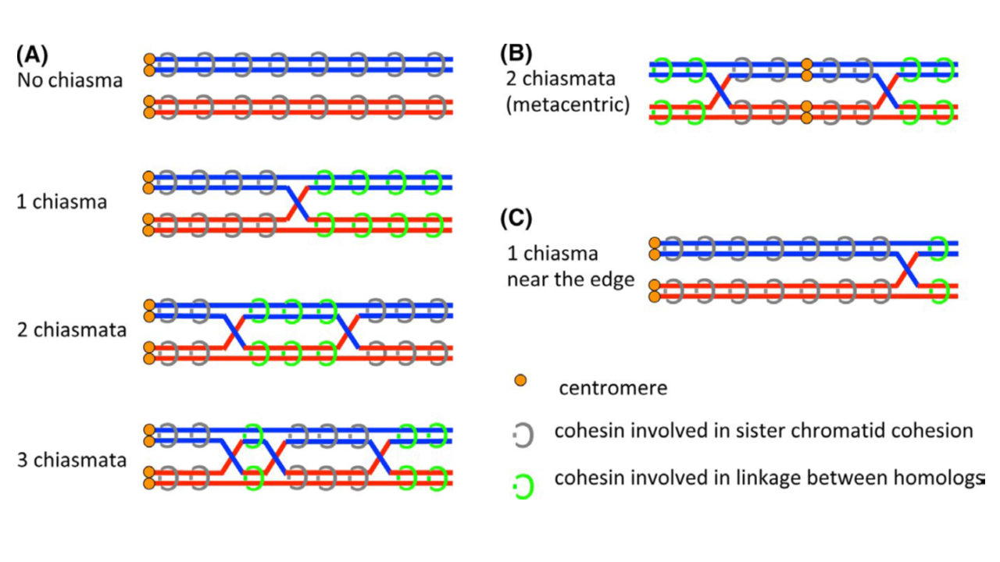

```{r setup, echo=FALSE, include = FALSE}
library(knitr)
library(ggplot2)
#library(pwr)
library(plyr)
library(lattice)
library(dplyr)
library(raster)
library(lme4)
library(nlme)
library(RLRsim)
library(ggpubr)
library(reshape2)

options(digits=2)

setwd("~.")

load(file = "~./MLH1repo/data/MLH1/MLH1_data_setup_1.31.20.RData")

#load(file = "C:/Users/alpeterson7/Documents/MLH1repo/data/MLH1/MLH1_data_setup_1.31.20.RData")

#2.2.20
#load(file="C:/Users/April/Documents/MLH1repo/data/CleanBivData_1.27.20.RData")
#load(file="C:/Users/alpeterson7/Documents/MLH1repo/data/CleanBivData_1.27.20.RData")

load(file="~./MLH1repo/data/CleanBivData_13.2.20.RData")

load(file="~./MLH1repo/data/total_SC_30.12.19.RData")

#skeletonize
SC.skel = read.csv("~./SC_skeletonize/data/SCskel_output_feb20.csv", header = TRUE, strip.white = TRUE)

#load(file="~./MLH1repo/data/MLH1_data_setup_1.5.20.RData")

#setwd("~./MLH1repo/doc/")
#setwd("C:/Users/alpeterson7/Documents/MLH1repo/doc/")
#setwd("C:/Users/April/Documents/MLH1repo")
#load(file="data/MLH1/MLH1_data_setup.RData")

#load main data file
#load(file="C:/Users/April/Documents/MLH1repo/data/MLH1/MLH1_data_setup_1.5.20.RData")#added batch18
#load(file="C:/Users/April/Documents/MLH1repo/data/CleanBivData_1.28.20.RData")
#load(file="C:/Users/alpeterson7/Documents/MLH1repo/data/CleanBivData_1.28.20.RData")

#this MLH1 only goes up to batch16!
#load(file="C:/Users/alpeterson7/Documents/MLH1repo/data/MLH1/MLH1_data_setup_12.20.19.RData")#batch18
#load(file="C:/Users/alpeterson7/Documents/MLH1repo/data/MLH1/MLH1_data_setup_12.20.19.RData")#fixing bugs, formating
#load(file="data/MLH1/MLH1_data_setup_12.3.19.RData")#removed exclude mice
#load(file="data/MLH1/MLH1_data_setup_11.12.19.RData")#added batch17
#load(file="data/MLH1/MLH1_data_setup_11.11.19.RData")#deleted DUP image
#load(file="data/MLH1/MLH1_data_setup_9.26.19.RData")#added batch16
#load(file="data/MLH1/MLH1_data_setup_8.29.19.RData") #

#load(file="data/MetaData.RData") #this was replacing most updated data file

#load functions
source("~./MLH1repo/src/CommonFunc_MLH1repo.R")
```


```{r organizing.data, echo=FALSE }
#set the order of another column, based on another variable. consistant order for ploting

#Terminology Note, leptonema, zygonema, and pachynema diplonema diakinesis, are the stage names.
#-ene endings refer to the cells/units within the cell stage? (I think)

#apply this before ploting
MLH1_data <- MLH1_data %>%
  arrange(strain, sex, category, mouse) %>%
  mutate(Original.Name = factor(Original.Name)) #another category that you want the order to match
MLH1_data <- with(MLH1_data, MLH1_data[order(sex, strain),])

# sort your dataframe, by the focal categories
MLH1_data$mouse <- factor(MLH1_data$mouse, levels=unique(MLH1_data$mouse))
#use the above line for when order is out of wak


#count the non-quality measures,  #remove non qualit
#length(MLH1_data[ !(is.na(MLH1_data$quality) | MLH1_data$quality==""), ] )  #15 rows with out quality scores, remove.
#MLH1_data <- MLH1_data[ !(is.na(MLH1_data$quality) | MLH1_data$quality==""), ]

#MLH1_by_F_strain <- MLH1_data[MLH1_data$sex == "female", ]
#MLH1_by_M_strain <- MLH1_data[MLH1_data$sex == "male", ]

#MLH1_data <- MLH1_data %>%
#  arrange(category) %>%
#  mutate(Original.Name = factor(Original.Name)) #another category that you want the order to match

#MLH1_data <- with(MLH1_data, MLH1_data[order(category),])
AP_mouse_table.HQ$var <- as.numeric(AP_mouse_table.HQ$var)

AP_category_table <-  ddply(.data=AP_mouse_table.HQ,
                 .(strain,sex),
                 summarize,
                 sum.ncells = sum(Ncells),
                 mean.MLH1 = mean(mean_co),
                 var.MLH1 = var(mean_co),
                 AV.var_MLH1 = mean(var, na.rm=TRUE)
                                  
)

#there might be an error for changing wd
#write.table(AP_category_table, "~./MLH1repo/strain_table_variances.csv", sep=",", row.names = FALSE)

AP_mouse_table.HQ_target <- AP_mouse_table.HQ[!(is.na(AP_mouse_table.HQ$sex) | AP_mouse_table.HQ$sex==""), ]

remove_strains <- c("TOM","AST","CZECH","CAST","HMI","SPRET","CAROLI", "F1", "PERC")
AP_mouse_table.HQ_target <- AP_mouse_table.HQ_target[ ! AP_mouse_table.HQ_target$strain %in% remove_strains, ]

  
var.plot <- ggplot(AP_mouse_table.HQ_target, aes(y=var, x = sex, color=sex))+geom_jitter()+facet_wrap(~strain)+ggtitle("Plots of mouse Variances for MLH1 counts")+
  scale_color_manual(values=c("royalblue", "limegreen"))+theme_bw()

```


```{r misc.setup, echo=FALSE}

colors_of_strains <- c('WSB'= "#56B4E9",'G' ='cadetblue','LEW'= 'lightblue','PERC'= 'blue',
                       #blues
                       
                       'PWD'= 'red2',
                       'SKIVE'= 'coral1','KAZ'= 'coral4', 
                       
                       'TOM'= 'indianred1','AST' = 'tan2',
                       'CZECH'= 'brown1',
                       
                       'MSM'= 'deeppink', 'MOLF'= 'hotpink', #mol are pinks, bc they are fancy mice
                       
                    'CAST'='green','HMI'= 'forestgreen', #greens
                    
                    'SPRET'='gold','SPIC'= 'goldenrod1', #browns? color of mounds?
                    'CAROLI'='gold3',
                    
                    "F1"='grey', "other" = 'grey'
                    )

color_chrm_class <- c( '0' = "#00BFC4", '1' = "#7CAE00", '2' = "#F8766D", '3' = "#C77CFF", '4'= "#F564E3")
#4!!

show_col(hue_pal()(5))

#add Rec group,
#reclassified SKIVE as intermediate
Curated_BivData$Rec.group_alt <- ifelse(grepl("PWD male", Curated_BivData$category), 1, 
                              ifelse(grepl("MSM male", Curated_BivData$category), 1,
                                ifelse(grepl("SKIVE male", Curated_BivData$category), 1, 0)))

Curated_BivData$Rec.group <- ifelse(grepl("PWD male", Curated_BivData$category), 1, 
                              ifelse(grepl("MSM male", Curated_BivData$category), 1, 0))


#apply this before ploting, to display strains in desired order
#MLH1_data <- MLH1_data %>%
#  arrange(strain, sex, category, mouse) %>%
#  mutate(Original.Name = factor(Original.Name)) #another category that you want the order to match
#MLH1_data <- with(MLH1_data, MLH1_data[order(sex, strain),])

# sort your dataframe, by the focal categories
#MLH1_data$mouse <- factor(MLH1_data$mouse, levels=unique(MLH1_data$mouse))


```


```{r FEMALE.TABLE, echo=FALSE}

female_mouse.av <- subset(AP_mouse_table_w.Ages, select= -c(sex.y,sex.x,
                            subsp.y,subsp.x,
                    category.y,category.x, strain.x,
                    strain.y, mouse.1  )  )

female_mouse.av <- add_sex(female_mouse.av)
female_mouse.av <- add_strain(female_mouse.av)
female_mouse.av <- add_subsp(female_mouse.av)
female_mouse.av <- add_species(female_mouse.av)

female_mouse.avs_for.analysis <-  female_mouse.av %>% filter(sex== "female") %>% filter(species == "M.musculus") 

female_mouse.avs_for.analysis$subsp <- factor(female_mouse.avs_for.analysis$subsp, ordered = FALSE)
female_mouse.avs_for.analysis$sex <- factor(female_mouse.avs_for.analysis$sex, ordered = FALSE)
female_mouse.avs_for.analysis$strain <- factor(female_mouse.avs_for.analysis$strain, ordered = FALSE)
female_mouse.avs_for.analysis$species <- factor(female_mouse.avs_for.analysis$species, ordered = FALSE)


Musc.female_mouse.av <-  female_mouse.avs_for.analysis %>% filter(sex== "female") %>% filter(subsp == "Musc")

#Mol
#Mol.female_mouse.av <-  female_mouse.avs_for.analysis %>% filter(sex== "female") %>% filter(subsp == "Mol")

#Dom 
Dom.female_mouse.av <-  female_mouse.avs_for.analysis %>% filter(sex== "female") %>% filter(subsp == "Dom")


```

```{r MALE.TABLE, echo=FALSE}


male_mouse.av <- subset(AP_mouse_table_w.Ages, select= -c(sex.y,sex.x,
                            subsp.y,subsp.x,
                    category.y,category.x, strain.x,
                    strain.y, mouse.1  )  )

male_mouse.av <- add_sex(male_mouse.av)
male_mouse.av <- add_strain(male_mouse.av)
male_mouse.av <- add_subsp(male_mouse.av)
male_mouse.av <- add_species(male_mouse.av)

fomo.male_mouse.av <-  male_mouse.av %>% filter(sex== "male") %>% filter(species == "M.musculus") 

fomo.male_mouse.av$subsp <- factor(fomo.male_mouse.av$subsp, ordered = FALSE)
fomo.male_mouse.av$sex <- factor(fomo.male_mouse.av$sex, ordered = FALSE)
fomo.male_mouse.av$strain <- factor(fomo.male_mouse.av$strain, ordered = FALSE)
fomo.male_mouse.av$species <- factor(fomo.male_mouse.av$species, ordered = FALSE)


Musc.male_mouse.av <-  fomo.male_mouse.av %>% filter(sex== "male") %>% filter(subsp == "Musc")
Mol.male_mouse.av <-  fomo.male_mouse.av %>% filter(sex== "male") %>% filter(subsp == "Mol")
#Dom version 
Dom.male_mouse.av <-  fomo.male_mouse.av %>% filter(sex== "male") %>% filter(subsp == "Dom")
```

```{r MIXED.MODEL.setup, echo=FALSE, warning=FALSE, eval=TRUE}
#DF.HetC.MixedModel.HQ

#https://rcompanion.org/handbook/G_03.html
#testing random effects within lme

#What are the main DFs for this code chunk
#AP_mouse_table_w.Ages   <- used to remove males which are too old (includes outgroups) 
#DF.HetC.MixedModel   <- only Mmusculus
#DF.HetC.MixedModel.HQ <- only mice of certain age, Q5 excluded


#variance is still chr
AP_mouse_table_w.Ages$var <- as.numeric(AP_mouse_table_w.Ages$var)

#use the merged DF to filter by age 
AP_mouse_table_w.Ages$strain <- AP_mouse_table_w.Ages$strain.x
AP_mouse_table_w.Ages$sex <- AP_mouse_table_w.Ages$sex.x
AP_mouse_table_w.Ages$subsp <- AP_mouse_table_w.Ages$subsp.x
#main file, make everything unordered factors
AP_mouse_table_w.Ages <- add_species(AP_mouse_table_w.Ages)

DF.HetC.MixedModel <- AP_mouse_table_w.Ages[AP_mouse_table_w.Ages$species == "M.musculus",]

#remove the extra merged cols
DF.HetC.MixedModel <- subset(DF.HetC.MixedModel, select= -c(sex.y,sex.x,
                            subsp.y,subsp.x,
                    category.y,category.x, strain.x,
                    strain.y, mouse.1  )  )
#DONT NEED CATEGORY


#REMOVE EXTRA STRAINS
DF.HetC.MixedModel <- DF.HetC.MixedModel[DF.HetC.MixedModel$subsp != "Cast",]
#remove musc strains
DF.HetC.MixedModel <- DF.HetC.MixedModel[DF.HetC.MixedModel$strain != "AST",]
DF.HetC.MixedModel <- DF.HetC.MixedModel[DF.HetC.MixedModel$strain != "TOM",]
#remove PERC, MOLF, CZECH, (no females)
DF.HetC.MixedModel <- DF.HetC.MixedModel[DF.HetC.MixedModel$strain != "CZECH",]
DF.HetC.MixedModel <- DF.HetC.MixedModel[DF.HetC.MixedModel$strain != "PERC",]

DF.HetC.MixedModel <- droplevels(DF.HetC.MixedModel)#remove levels not used


#main df with variables coded as chr
DF.HetC.MixedModel.HQ$subsp <- factor(DF.HetC.MixedModel.HQ$subsp, ordered = FALSE)
DF.HetC.MixedModel.HQ$sex <- factor(DF.HetC.MixedModel.HQ$sex, ordered = FALSE)
DF.HetC.MixedModel.HQ$strain <- factor(DF.HetC.MixedModel.HQ$strain, ordered = FALSE)
DF.HetC.MixedModel.HQ$species <- factor(DF.HetC.MixedModel.HQ$species, ordered = FALSE)

#kable(table(DF.HetC.MixedModel.HQ$sex, DF.HetC.MixedModel.HQ$strain))


all.cell.MM.HQ <- ddply(.data=DF.HetC.MixedModel.HQ,
                 .(sex, strain),
                 summarize,
                 all.cells = sum(Ncells)
)

```


```{r totSC_setup, echo=FALSE}
#SC.skel
#"anon.batch" "rand_name"  "bin_size"   "skel_size" , all batches included

SC.skel.OG <- SC.skel #5683

#MERGEING MLH1 with SKEL
MLH1.merge.Skel <- merge(original_DF, SC.skel, by.x = "Random.Name", by.y = "rand_name", all= F)

MLH1.merge.Skel <- add_mouse(MLH1.merge.Skel)
MLH1.merge.Skel <- add_strain(MLH1.merge.Skel)
MLH1.merge.Skel <- add_sex(MLH1.merge.Skel)
MLH1.merge.Skel <- add_subsp(MLH1.merge.Skel)
MLH1.merge.Skel <- add_category(MLH1.merge.Skel)
MLH1.merge.Skel <- add_subsp(MLH1.merge.Skel)
#5110, 

OG.MLH1.merge.Skel <- MLH1.merge.Skel #raw version of DF

#check for DUPs, #check for duplicatations of the random name
MLH1.merge.Skel$ fileName  <- as.character(MLH1.merge.Skel$fileName)
tot.SC.dupies <- MLH1.merge.Skel[duplicated(MLH1.merge.Skel$ fileName ),]

MLH1.merge.Skel <- MLH1.merge.Skel %>% filter( X == "") %>% filter(REDO.crop == "no")

MLH1.merge.Skel$bin_size <- as.numeric(MLH1.merge.Skel$bin_size)
MLH1.merge.Skel$skel_size <- as.numeric(MLH1.merge.Skel$skel_size)
#table(MLH1.merge.Skel$category)

#remove outliers
MLH1.merge.Skel <- MLH1.merge.Skel  %>% filter(bin_size < 60000)

```


```{r tot.sc.viz4outliers, echo=FALSE}

tot.sc <- ggplot(data= MLH1.merge.Skel, aes(y = bin_size, x=strain))+ geom_jitter()+facet_wrap(~category, scales = "free")

#seems like the outliers have been removed

MLH1.merge.Skel.wsb.male <- MLH1.merge.Skel  %>% filter(category < "WSB male" ) 

tot.sc.wsb.male <- ggplot(data= MLH1.merge.Skel.wsb.male, aes(y = bin_size, x=strain))+ geom_jitter()+facet_wrap(~category, scales = "free")

tot.sc.single.male <- ggplot(data= MLH1.merge.Skel  %>% filter(category == "G female" ) , aes(y = bin_size, x=strain))+ geom_jitter()+facet_wrap(~category, scales = "free")


```

Checking the outliers at category level, 

WSB male,
10apr15_31mar15_WSB_m3_sp1_4_rev.tif

G outliers, 
G 19oct15_12oct15_G_m1_sp1_17.1_rev.tif

LEW, low outlier, 
6mar18_1feb18_LEW_m1_sp1_21.5_rev

PWD outliers, 6mar15_1mar15_PWD_m1_sp4_6.1_rev.tif, 7mar15_1mar15_PWD_m1_sp4_2_rev.tif, and 20jul15_18may15_PWD_m2_sp1_10.2_rev.tif

G female; 1mar16_20feb16_G_f3_sp1_8_rev.tif and 21nov16_16jan16_G_f2_sp1_15_rev.tif


```{r tot.skel.table, echo=FALSE}

totSC.mouse.av.table <- ddply(.data=MLH1.merge.Skel, 
                 .(mouse),
                 summarize, 
                 ncells = length(unique(Original.Name)),
                 nmice = length(unique(mouse)),
                # mean.MLH1 = mean(adj_nMLH1.foci, na.rm = TRUE),
                # var.MLH1 = var(adj_nMLH1.foci, na.rm = TRUE),
                 
                 mean.skel = mean(skel_size, na.rm = TRUE),
                #se for skel
                
                 mean.bin =  mean(bin_size, na.rm = TRUE)
                 
)

totSC.mouse.av.table <- add_strain(totSC.mouse.av.table)
totSC.mouse.av.table <- add_sex(totSC.mouse.av.table)
totSC.mouse.av.table <- add_category(totSC.mouse.av.table)
totSC.mouse.av.table <- add_subsp(totSC.mouse.av.table)

#unorder the factors
totSC.mouse.av.table$subsp <- factor(totSC.mouse.av.table$subsp, ordered = FALSE)
totSC.mouse.av.table$sex <- factor(totSC.mouse.av.table$sex, ordered = FALSE)
totSC.mouse.av.table$strain <- factor(totSC.mouse.av.table$strain, ordered = FALSE)

#add rec group
totSC.mouse.av.table$Rec.group <- ifelse(grepl("PWD male", totSC.mouse.av.table$category), 1, 
                              ifelse(grepl("MSM male", totSC.mouse.av.table$category), 1,
                                ifelse(grepl("SKIVE male", totSC.mouse.av.table$category), 1, 0)))

OG.totSC.mouse.av.table <- totSC.mouse.av.table

totSC.mouse.av.table <- totSC.mouse.av.table %>% filter(strain!="CAST" & strain !="F1"& strain !="SPIC" & strain !=  "CAROLI" & strain !="SPRET"& strain !="HMI"& strain !="PERC")

tot.sc99 <- ggplot(data= totSC.mouse.av.table, aes(y = mean.skel, x=mouse, color=strain))+ geom_point()+scale_color_manual(values=colors_of_strains)+
  facet_wrap(sex~subsp, scales="free")

tot.sc77 <- ggplot(data= OG.totSC.mouse.av.table[OG.totSC.mouse.av.table$sex == "male",], aes(y = mean.skel, x=mouse, color=strain))+ geom_point()+scale_color_manual(values=colors_of_strains)+
  facet_wrap(Rec.group~subsp, scales="free")+ylim(c(0, 800))+ theme(axis.title.x=element_blank(),        axis.text.x=element_blank(),
        axis.ticks.x=element_blank())


tot.sc_bin <- ggplot(data= OG.totSC.mouse.av.table[OG.totSC.mouse.av.table$sex == "male",], aes(y = mean.bin, x=mouse, color=strain))+ geom_point()+scale_color_manual(values=colors_of_strains)+
  facet_wrap(Rec.group~subsp, scales="free")+ theme(axis.title.x=element_blank(),        axis.text.x=element_blank(),
        axis.ticks.x=element_blank())  +ylim(c(0, 3000))

#there should be tom


```
From this figure of the male mouse average of total sc measures, Confirm the general pattern of more SC area for the higher rec strains, compared to the low. But there are some exceptions.


the low rec musc strains which are higher are czech (1) and ast (2) -- the PWD mouse which is lower 24sep14_PWD_m1

INSERT TABLE FOR THE TOTAL SC means ect

The difference between 

bin is short for binary, it reports the binarized area of the SC

skel -- takes the skeletonized midline of the bin objects

# Main Figure


```{r table.for.plot, echo=FALSE}
#why do I add in a different table?

#this move this to the setup file
#MLH1_data  %>% filter(quality < 5)  -- low quality cells removed

#pooled
strain.table.HQ_Fig.og <- ddply(MLH1_data  %>% filter(quality < 5), c("subsp","strain", "sex"), summarise,
                        Nmice =length(unique(mouse)),
                        Ncells  =length(nMLH1.foci),
                        mean_co =as.numeric(format(round(mean(nMLH1.foci), 3 ), nsmall=3) ),
                        cV = cv(nMLH1.foci, na.rm = TRUE),
                        var = as.numeric(format(round(   var(nMLH1.foci, na.rm = TRUE),3), nsmall=3)), 
                        sd   = round(sd(nMLH1.foci, na.rm = TRUE), 3),
                       #Standard error (mice vs cells)
                        se  = round(sd / sqrt(Ncells), 3)
                       
                       #range_mouse_means = range()
                   #consider adding crhm proportions?
    )


strain.table.HQ_Fig <-  strain.table.HQ_Fig.og %>% filter(strain != "F1" & strain != "PERC" &
                       strain != "TOM" &  strain != "AST" & strain != "CZECH" & strain != "CAROLI" & strain != "HMI")

#adjust order of plot here
strain.table.HQ_Fig$strain <- factor(strain.table.HQ_Fig$strain,levels =c(
     "MSM", "MOLF",   
  "PWD", "SKIVE",  "KAZ",
  "WSB","G","LEW","PERC",
                     "CAST",
                         "SPRET","SPIC" ), order=T )

```


```{r Fig1, echo=FALSE, warning=FALSE}

#might need to nudge the X values

Fig1_v1_strain <- ggplot(strain.table.HQ_Fig, aes(y=mean_co, x=strain, color=strain, shape=sex))+ 
  ylab("Average MLH1 Foci per Cell")+

  geom_point(aes(shape = sex), size=3, position=position_dodge(.5))+

    geom_errorbar(aes(ymin=mean_co-(se*2), ymax=mean_co+(se*2) ), width=.3, position = position_dodge(.5), size=1.001)+
  
  ylim(c(18, 35))+
 scale_color_manual(values=colors_of_strains)+ 

    theme(legend.position="none",
  panel.grid.major = element_blank(), panel.grid.minor = element_blank(),
  panel.background = element_blank(), axis.line=element_line(colour = "black"),
  axis.title.x=element_blank(),axis.text.x=element_blank(),axis.ticks.x=element_blank())
#remove y labfor male 
 
   #segments
#  annotate("segment", x=.75, xend=4.5, y=19.5, yend=19.5, colour="black", size=1)+
  #Musc
#  annotate("segment", x= 5.5, xend=10.2, y=19.5, yend=19.5, colour="black", size=1)+
  #mol
#  annotate("segment", x=11, xend=12.25, y=19.5, yend=19.5, colour="black", size=1)+
  #cast
#  annotate("segment", x=13, xend=14, y=19.5, yend=19.5, colour="black", size=1)+
  #outgroups
 # annotate("segment", x=14.5, xend=16, y=19.5, yend=19.5, colour="black", size=1)+
  #label

 #   annotate("text", x = c(2,4.4,6,8, 10), #list of all x points 
   #        y = c(18.5,18.5,33,18.5, 18.5),
           
  # label = c("M. m. domesticus","M. m. musculus", "M. m. molossinus", "M. m. castaneus", "Outgroups"),
    #       fontface = 'italic', hjust = 0.5, size=3.5)


Fig1_v1_strain
```

This is a draft of the main figure. Outgroups are not included in the analysis below.

<!--  insert Details of data set cleaning etc is in SetupData.rmd
Effects from different factors are reviewed in Effects.Rmd -->


```{r main.fig1s, echo=FALSE, include=FALSE}


strain.table.HQ_Fig_F <-  strain.table.HQ_Fig %>% filter(sex == "female") %>% filter(strain != "CAST" & strain != "SPRET" & strain != "SPIC" )

Fig1_Female <- ggplot(strain.table.HQ_Fig_F, aes(y=mean_co, x=strain, color=strain, shape=sex))+ 
  ylab("Average MLH1 Foci per Cell")+

  geom_point( size=3, position=position_dodge(.5))+

    geom_errorbar(aes(ymin=mean_co-(se*2), ymax=mean_co+(se*2) ), width=.3, position = position_dodge(.5), size=1.001)+
  
  ylim(c(18, 35))+
 scale_color_manual(values=colors_of_strains)+ 

    theme(legend.position="none",
  panel.grid.major = element_blank(), panel.grid.minor = element_blank(),
  panel.background = element_blank(), axis.line=element_line(colour = "black"),
  axis.title.x=element_blank(),axis.text.x=element_blank(),axis.ticks.x=element_blank())


#strain.table.HQ_Fig.og

strain.table.HQ_Fig_M <-  strain.table.HQ_Fig.og %>% filter(sex == "male") %>% filter(strain != "CAST" & strain != "SPRET" & strain != "SPIC" & strain != "PERC" & strain != "F1" & strain != "HMI" & strain != "CAROLI")

strain.table.HQ_Fig_M$strain <- factor(strain.table.HQ_Fig_M$strain,levels =c(
     "MSM", "MOLF",   
  "PWD", "SKIVE",  "KAZ", "TOM", "AST","CZECH",
  "WSB","G","LEW"), order=T )


Fig1_Male <- ggplot( strain.table.HQ_Fig_M, aes(y=mean_co, x=strain, color=strain, shape=sex))+ 
  ylab("Average MLH1 Foci per Cell")+

  geom_point(size=3, position=position_dodge(.5))+

    geom_errorbar(aes(ymin=mean_co-(se*2), ymax=mean_co+(se*2) ), width=.3, position = position_dodge(.5), size=1.001)+
  
  ylim(c(18, 35))+
 scale_color_manual(values=colors_of_strains)+ 

    theme(legend.position="none",
  panel.grid.major = element_blank(), panel.grid.minor = element_blank(),
  panel.background = element_blank(), axis.line=element_line(colour = "black"),
  axis.title.x=element_blank(),axis.text.x=element_blank(),axis.ticks.x=element_blank())

```


```{r basic.numbers, echo=FALSE, eval=FALSE}

kable(table(AP_mouse_table.HQ$category), col.names = c("Category", "mice"), label = "Number of mice by category" )


kable(table(MLH1_data$category), col.names = c("Category","Cells"), label = "Number of Cells by category" )

```


```{r rand.misc, echo=FALSE, include=FALSE, eval=FALSE}
#str(AP_mouse_table_w.Ages)

AP_mouse_table.HQ$var <- as.numeric(AP_mouse_table.HQ$var)

#remove sex.x == na, and strain.x=na or F1
AP_mouse_table.HQ <- AP_mouse_table.HQ[!(is.na(AP_mouse_table.HQ$sex) | AP_mouse_table.HQ$sex==""), ]

AP_mouse_table.HQ <- AP_mouse_table.HQ[!(is.na(AP_mouse_table.HQ$var) | AP_mouse_table.HQ$var==""), ]
#plot variance and mean (facet sex)

AP_mouse_table_w.Ages <- AP_mouse_table_w.Ages[!( AP_mouse_table_w.Ages$strain.x =="F1"), ]

VandMean.mouse <- ggplot(aes(x=mean_co, y = var), data=AP_mouse_table.HQ )+geom_point(aes(color=strain))+facet_wrap(~sex)+ggtitle("mouse MLH1 averages; variance by mean")

cVandMean.mouse <- ggplot(aes(x=mean_co, y = cV), data=AP_mouse_table.HQ )+geom_point(aes(color=strain))+facet_wrap(~sex)+ggtitle("mouse MLH1 averages; cV by means")

str(AP_mouse_table.HQ)

cor(AP_mouse_table.HQ$mean_co[AP_mouse_table.HQ$sex == "female"], AP_mouse_table.HQ$var[AP_mouse_table.HQ$sex == "female"])
#[1] 0.5750399
cor(AP_mouse_table.HQ$mean_co[AP_mouse_table.HQ$sex == "male"], AP_mouse_table.HQ$var[AP_mouse_table.HQ$sex == "male"])
#0.321601

cor(AP_mouse_table.HQ$mean_co[AP_mouse_table.HQ$sex == "female"], AP_mouse_table.HQ$cV[AP_mouse_table.HQ$sex == "female"])
# 0.3515544
cor(AP_mouse_table.HQ$mean_co[AP_mouse_table.HQ$sex == "male"], AP_mouse_table.HQ$cV[AP_mouse_table.HQ$sex == "male"])
#-0.03713536

cor.test(AP_mouse_table.HQ$mean_co[AP_mouse_table.HQ$sex == "male"], 
    AP_mouse_table.HQ$var[AP_mouse_table.HQ$sex == "male"] )
# p-value = 8.623e-09

cor.test(AP_mouse_table.HQ$mean_co[AP_mouse_table.HQ$sex == "male"], 
    AP_mouse_table.HQ$cV[AP_mouse_table.HQ$sex == "male"] )


#remove mice with fewer than 10 cells

AP_mouse_table.HQ.10plus <- AP_mouse_table.HQ[AP_mouse_table.HQ$Ncells >= 10,]

VandMean.mouse.10plus <- ggplot(aes(x=mean_co, y = var), data=AP_mouse_table.HQ.10plus )+geom_point(aes(color=strain))+facet_wrap(~sex)+ggtitle("10 plus mouse MLH1 averages; variance by mean")


cor(AP_mouse_table.HQ.10plus$mean_co[AP_mouse_table.HQ.10plus$sex == "female"], AP_mouse_table.HQ.10plus$cV[AP_mouse_table.HQ.10plus$sex == "female"])


cor.test(AP_mouse_table.HQ.10plus$mean_co[AP_mouse_table.HQ.10plus$sex == "female"], 
    AP_mouse_table.HQ.10plus$var[AP_mouse_table.HQ.10plus$sex == "female"] )


#why did I male just a female table?
female.musc.cells <- MLH1_data[( MLH1_data$sex == "female") & (MLH1_data$subsp == "Musc" ), ]

female.musc.mice.table <- ddply(female.musc.cells, c("sex"), summarise,
                        Nmice = length(unique(mouse)),
                        Ncells  = length(adj_nMLH1.foci),
                        mean_co = as.numeric(format(round(  mean(adj_nMLH1.foci), 3 ), nsmall=3) ),
                        cV = cv(adj_nMLH1.foci),
                        var = format(round(   var(adj_nMLH1.foci),3), nsmall=3),
                        sd   = round(sd(adj_nMLH1.foci), 3),
                        se   = round(sd / sqrt(Ncells), 3)
                        #quality?
)
```

# Genome wide recombiantion rate estimates


```{r MLH1.summ.stats, echo=FALSE}

#strain.table.HQ_Fig.og  all strains
#strain.table.HQ_Fig  extra strains removed

main.table <- strain.table.HQ_Fig.og  %>% filter(strain != "F1")

main.table <- add_subsp(main.table)

kable(head(main.table),  caption = "Table 1. MLH1 counts per cell summary statistics by strain")

#strain.table.HQ_Fig

#sum( (main.table  %>% filter(sex == "male"))$Ncells)
#the kable version is bulkier than the other versaion
```

In order to estimate the genome wide recombination rates across our panel of `r length(unique(main.table$strain))` strains, MLH1 foci were quantified from a total of `r sum( (main.table  %>% filter(sex == "male"))$Ncells)` spermatocytes and `r sum( (main.table  %>% filter(sex == "female"))$Ncells)`.

The strain means for females were pretty similar. For female Domesticus strains the means are `r (main.table  %>% filter(sex == "female") %>% filter(subsp == "Dom")  )$mean_co` for _M. m. domesticus^WSB^_, _M. m. domesticus^G^_, and _M. m. domesticus$^LEW^_ respectively. In the three Musculus strains the means are `r (main.table  %>% filter(sex == "female") %>% filter(subsp == "Musc")  )$mean_co` for _M. m. musculus^ PWD}^_, _M. m. musculus^ SKIVE^_, and _M. m. musculus^KAZ^_ respectively. In the molossinus strains the means are `r (main.table  %>% filter(sex == "female") %>% filter(subsp == "Mol")  )$mean_co` for _M. m. molossinus^ MSM^_ and _M. m. molossinus^MOLF^_ respectively. 


While in two of the subspecies, the means for males show a greater range across means, notable in the mmmolossinus strains `r (main.table  %>% filter(sex == "male") %>% filter(subsp == "Mol")  )$mean_co` for _M. m. molossinus^MSM^_ and  _M. m. molossinus^MOLF^_ respectively. In the musculus the strain means are `r (main.table  %>% filter(sex == "male") %>% filter(subsp == "Musc")  )$mean_co` for _M. m. musculus^PWD^_, _M. m. musculus^SKIVE^_, _M. m. musculus^KAZ^_, _M. m. musculus^TOM^_, _M. m. musculus^AST^_, and _M. m. musculus^CZECH^_ respectively. In the male Dom strains the means for MLH1 count per cell are `r (main.table  %>% filter(sex == "male") %>% filter(subsp == "Dom")  )$mean_co`  for  _M. m. domesticus^WSB^_, _M. m. domesticus^G^_, _M. m. domesticus^LEW^_ and _M. m. domesticus^PERC^_ respectively. These 

<!-- mouse level means-->
The ranges of mean MLH1 counts per cell are 


<!--(the figure is made from pooling MLH1 cells)
the male 

- the ranges of mouse means are displayed in Sup table X

- How the means were calculated

-The male gwRR is adjusted for the PAR
-The means for each strains are report in Table 1

-Normality was assessed for the MLH1 counts (include in Supplement histograms)


, -->


# Analysis for Evolutionary Patterns

In order to test the effects of subspecies, sex and strain on the mean and variance of MLH1 counts per cell, we fit a data set of `r length(DF.HetC.MixedModel.HQ$mean_co )` mouse averages for MLH1 foci per cell. We constructed the model to set subspecies, sex and their interaction as fixed effects, which strain was coded as a random effect. The predicted coeffecients and pvalues are reporter below in table X. 

$$mouse \ av.\ MLH1\ foci\ per\ cell ~=~ subsp * sex + rand(strain) + \varepsilon $$


<!--
This is the break down of mice used within the Mixed model

`r kable(table( DF.HetC.MixedModel.HQ$sex, DF.HetC.MixedModel.HQ$strain))`

add number of cells

`r kable(table( all.cell.MM.HQ$sex, all.cell.MM.HQ$strain))`


 $$mouse \ av \ meteric ~=~ subsp * sex  + rand(1|strain) + \varepsilon$$

In order to understand the variance within an evolutionary framework, we fit `r length(DF.HetC.MixedModel.HQ$mean_co )` mouse level MLH1 foci per cell means as the dependant variable with a mixed model. 

Setting up the data set for using the mixed model (base data set, HQ data set)

- only Mus musculus strains with sex matched observations  
- Male gwRR have been adjusted for the PAR
- Q5 excluded
- All the effects are un-ordered factors  
- male ages within 5 - 20 weeks
- Molossinus is coded as a subsp level

subspecies levels: 3, Musc, Dom and Molossinus
strain levels: Dom: 3, Musc: 3  Mol: 2
sex: 2 female male  
-->


```{r MLH1co.MM, echo=FALSE, digits = 3}
#THIS IS THE NEW MIXED MODEL
#should be able to use the loaded 
#DF.HetC.MixedModel.HQ

MLH1.MM.M1 <- lmer(mean_co ~ subsp * sex + (1|strain), data=DF.HetC.MixedModel.HQ) 
MLH1.MM.M1.reduce.sex <- lmer( mean_co ~ subsp  +(1|strain), data=DF.HetC.MixedModel.HQ )
MLH1.MM.M1.reduce.subp <- lmer( mean_co ~ sex  +(1|strain), data=DF.HetC.MixedModel.HQ )

summary(MLH1.MM.M1)$coefficients

MLH1.MM_interaction <- drop1(MLH1.MM.M1, test="Chisq")$`Pr(Chi)`[2]
MLH1.MM_sex <- anova(MLH1.MM.M1, MLH1.MM.M1.reduce.sex)$`Pr(>Chisq)`[2]
MLH1.MM_subp <- anova(MLH1.MM.M1, MLH1.MM.M1.reduce.subp)$`Pr(>Chisq)`[2]
MLH1.MM_strain<- MM.rand.pval <- exactRLRT(MLH1.MM.M1)$p.value 

MLH1.MMlmer_results <- data.frame(sub.sp = MLH1.MM_subp, 
sex.results =  MLH1.MM_sex, 
               interaction.pval = MLH1.MM_interaction,  rand.pval = 
MLH1.MM_strain)

```


Because all of the mixed model effects had significant effects, (p= `r  round(MLH1.MMlmer_results$sub.sp, 4)`, `r  round(MLH1.MMlmer_results$sex.results, 4)`, and  `r  round(MLH1.MMlmer_results$interaction.pval, 4)` for the sex, subspecies and interaction fixed effects and `r  MLH1.MMlmer_results$rand.pval` for the random strain effect), we followed up with two general linear models to investigate the specific strain effects.

 $$mouse \ av.\ MLH1\ foci\ per\ cell ~=~ subsp * sex * strain + \varepsilon$$

and 

$$mouse \ av.\ MLH1\ foci\ per\ cell ~=~ sex * strain + \varepsilon$$

```{r MixedModel.2, echo=FALSE,  digits = 3}
#strain = fixed
glm.strain.fixed.full <- glm(mean_co ~ subsp * sex * strain, data=DF.HetC.MixedModel.HQ)

summ <- summary(glm.strain.fixed.full)
#table of just coeff anf pvalue
#round(summ$coefficients[,c(1,4)],5 )

#write.table(summ$coefficients , "~./MLH1repo/glm.strain.fixed.full.csv", sep=",",row.names = TRUE)
```

In the first glm, the fixed subspecies effects were not significant, so we only report for values for the second model which is limited to sex and strain fixed effects.

```{r MixedModel.3, echo=FALSE, digits = 3}

strain.fixed <- lm(mean_co ~ sex * strain, data=DF.HetC.MixedModel.HQ)

summ.strain.fixed <- summary(strain.fixed)

round(summ.strain.fixed$coefficients[,c(1,4)],5)

#write.table(summ.strain.fixed$coefficients , "~./MLH1repo/summ.strain.fixed.csv", sep=",",row.names = TRUE)
```

In both models strain by sex interaction effects were significant for (p = `r summ.strain.fixed$coefficients[,4][12]` and `r summ.strain.fixed$coefficients[,4][13]` for the second mixed model) for _M. m. musculus^PWD^_ and _M. m. molossinus^MSM^_  respectively. These results confirm the qualitative observation that within these two strains there has been sex-specific in the average MLH1 count per cell.

Additionally, _M. m. domesticus^G^_ had significant strain and sex by strain effects (p =`r  summ.strain.fixed$coefficients[,4][3]` and `r summ.strain.fixed$coefficients[,4][10]` for strain and strain by sex effect). These results confirm the qualtative pattern of the _M. m. domesticus^G^_ strain having the largest degree of sexual dimorphism (heterochiasmy) in the dataset.

The second model were strain was (nested and random), the fixed effects, sex and interaction of (subsp and sex), are much more significant. The coefficients indicate, males in general have 1 less in average, and the musc and molf subsp have ~3 more on average.


# Within Mouse Variance in CO Count per Cell

In order to more fully discribe the distributions we examined the variance in addition to the mean applying the same mixed models and linear models, with _within mouse variance_ of MLH1 counts per cell as the dependant variable.

<!--
motivation / background: maybe checkpoint / regulation

limitations: observations at the mouse level, decreased power to estiamate the variance --


setup

-quality / technical error

- variance and cv

The mixed models have most significant variables, 


M3.glm for variance was less significant (0.044181 ), 

the Q12 models in general were more significant

cV's were more significant than var


var, full.mixed, q12,mixed, M3.glm.full, M3.glm.q12
1.618e-10 ***, 2.092e-11, 0.044181 * (male),  0.000228 ***

cv, full.mixed, q12,mixed, M3.glm.full, M3.glm.q12
5.033e-12 ***, 1.315e-12,  3.195e-12 ***, 3.16e-05 ***
-->

$$mouse\ variance\ for\ MLH1\ foci\ per\ cell   ~=~ subsp * sex + rand(strain)+ \varepsilon$$

```{r M1.MLH1.var_cv, echo=FALSE, warning=FALSE, message=FALSE}

MLH1var_M1 <- lmer( var ~ subsp * sex +(1|strain), data=DF.HetC.MixedModel.HQ )
MLH1var_M1.reduce.sex <- lmer( var ~ subsp  +(1|strain), data=DF.HetC.MixedModel.HQ )
MLH1var_M1.reduce.subp <- lmer( var ~ sex  +(1|strain), data=DF.HetC.MixedModel.HQ )

#summary(MLH1var_M1)
LmerMLH1_VAR_int <- drop1(MLH1var_M1, test="Chisq")$`Pr(Chi)`[2]
LmerMLH1_VAR_sex <- anova(MLH1var_M1, MLH1var_M1.reduce.sex)$`Pr(>Chisq)`[2]
LmerMLH1_VAR_subsp <- anova(MLH1var_M1, MLH1var_M1.reduce.subp)$`Pr(>Chisq)`[2]
LmerMLH1_VAR_strain <- exactRLRT(MLH1var_M1)$p.value

LmerMLH1_VAR_results <- data.frame(sub.sp = LmerMLH1_VAR_subsp,
sex.results =  LmerMLH1_VAR_sex, interaction.pval = LmerMLH1_VAR_int,  rand.pval = LmerMLH1_VAR_strain)
LmerMLH1_VAR_results

#CV
MLH1cV_M1 <- lmer( cV ~ subsp * sex +(1|strain), data=DF.HetC.MixedModel.HQ )
MLH1cV_M1.reduce.sex <- lmer( cV ~ subsp  +(1|strain), data=DF.HetC.MixedModel.HQ )
MLH1cV_M1.reduce.subp <- lmer( cV ~ sex  +(1|strain), data=DF.HetC.MixedModel.HQ )

LmerMLH1_CV_int <- drop1(MLH1cV_M1, test="Chisq")$`Pr(Chi)`[2]
LmerMLH1_CV_sex <- anova(MLH1cV_M1, MLH1cV_M1.reduce.sex)$`Pr(>Chisq)`[2]
LmerMLH1_CV_subsp <- anova(MLH1cV_M1, MLH1cV_M1.reduce.subp)$`Pr(>Chisq)`[2]
LmerMLH1_CV_strain <- exactRLRT(MLH1cV_M1)$p.value

LmerMLH1_CV_results <- data.frame(sub.sp = LmerMLH1_CV_subsp,
sex.results =  LmerMLH1_CV_sex, interaction.pval = LmerMLH1_CV_int,  rand.pval = LmerMLH1_CV_strain)
LmerMLH1_CV_results


#USE Q12 (Q123) table
#Q12_mouse_table_w.Ages
#Q12 var
MLH1var_M1_Q12 <- lmer( var ~ subsp * sex +(1|strain), data=Q12_mouse_table_w.Ages )
MLH1var_M1_Q12reduce.sex <- lmer( var ~ subsp  +(1|strain), data=Q12_mouse_table_w.Ages )
MLH1var_M1_Q12reduce.subp <- lmer( var ~ sex  +(1|strain), data=Q12_mouse_table_w.Ages )

LmerMLH1_M1_Q12VAR_int <- drop1(MLH1var_M1_Q12, test="Chisq")$`Pr(Chi)`[2]
LmerMLH1_M1_Q12_VAR_sex <- anova(MLH1var_M1_Q12, MLH1var_M1_Q12reduce.sex)$`Pr(>Chisq)`[2]
LmerMLH1_M1_Q12_VAR_subsp <- anova(MLH1var_M1_Q12, MLH1var_M1_Q12reduce.subp)$`Pr(>Chisq)`[2]
LmerMLH1_M1_Q12_VAR_strain <- exactRLRT(MLH1var_M1_Q12)$p.value

LmerMLH1_M1_Q12_VAR_results <- data.frame(sub.sp = LmerMLH1_M1_Q12_VAR_subsp,
sex.results =  LmerMLH1_M1_Q12_VAR_sex, interaction.pval = LmerMLH1_M1_Q12VAR_int,  rand.pval = LmerMLH1_M1_Q12_VAR_strain)
LmerMLH1_M1_Q12_VAR_results

#Q12 cv
MLH1cv_M1_Q12 <- lmer( cV ~ subsp * sex +(1|strain), data=Q12_mouse_table_w.Ages )
MLH1cv_M1_Q12reduce.sex <- lmer( cV ~ subsp  +(1|strain), data=Q12_mouse_table_w.Ages )
MLH1cv_M1_Q12reduce.subp <- lmer( cV ~ sex  +(1|strain), data=Q12_mouse_table_w.Ages )

LmerMLH1_M1_Q12_CV_int <- drop1(MLH1cv_M1_Q12, test="Chisq")$`Pr(Chi)`[2]
LmerMLH1_M1_Q12_CV_sex <- anova(MLH1cv_M1_Q12, MLH1cv_M1_Q12reduce.sex)$`Pr(>Chisq)`[2]
LmerMLH1_M1_Q12_CV_subsp <- anova(MLH1cv_M1_Q12, MLH1cv_M1_Q12reduce.subp)$`Pr(>Chisq)`[2]
LmerMLH1_M1_Q12_CV_strain <- exactRLRT(MLH1cv_M1_Q12)$p.value

LmerMLH1_M1_Q12_VAR_results <- data.frame(sub.sp = LmerMLH1_M1_Q12_CV_subsp,
sex.results =  LmerMLH1_M1_Q12_CV_sex, interaction.pval = LmerMLH1_M1_Q12_CV_int,  rand.pval = LmerMLH1_M1_Q12_CV_strain)

LmerMLH1_M1_Q12_VAR_results
```

These are the p values for the effects of the mixed models of the foloowing mixed models: VAR.FULL, CV.FULL, VAR.Q12 and cv.Q12


```{r cv.plots, echo=FALSE, eval=FALSE}

cV.Hist.total.mice <- ggplot(DF.HetC.MixedModel, aes(x =cV , fill=sex)) + 
  geom_histogram(binwidth = 1, alpha=.6)  +
  ggtitle("cV of within mouse variance, all mice")
cV.Hist.total.mice <- cV.Hist.total.mice   + facet_wrap(~ strain, scales="free")
cV.Hist.total.mice

#DF.HetC.MixedModel.HQ
cV.Hist <- ggplot(DF.HetC.MixedModel.HQ, aes(x = cV, fill=sex)) + 
  geom_histogram(binwidth = 1, alpha=.6)  + 
  ggtitle("cV of within mouse variance, 10 cell min")
cV.Hist <- cV.Hist   + facet_wrap(~ strain, scales="free")
cV.Hist
```


```{r M2.MLH1.var, echo=FALSE, include=FALSE, eval=FALSE}
#not including this model for now / brivity
#$$mouse CO metric  ~=~ subsp * sex * strain + \varepsilon$$

MLH1var_M3 <- lm( var ~ subsp * sex * strain,  data=DF.HetC.MixedModel.HQ )

#summary(MLH1var_M3)
anova(MLH1var_M3)  
as.data.frame( round(summary(MLH1var_M3)$coefficients, 6))


MLH1cv_M3 <- lm(cV ~ subsp*sex*strain, data=DF.HetC.MixedModel.HQ)

#summary(MLH1cv_M3)

anova(MLH1cv_M3)
as.data.frame( round(summary(MLH1cv_M3)$coefficients, 6))


#Q12 var
MLH1var_M3_Q12 <- lm( var ~ subsp*sex*strain,  data=Q12_mouse_table_w.Ages )

#summary(MLH1var_M3_Q12)
anova(MLH1var_M3_Q12)  
as.data.frame( round(summary(MLH1var_M3_Q12)$coefficients, 6))

#Q12 cv
MLH1cv_M3_Q12 <- lm( cV ~ subsp*sex*strain, data=Q12_mouse_table_w.Ages )

#summary(MLH1cv_M3_Q12)
anova(MLH1cv_M3_Q12)#sex large F

as.data.frame( round(summary(MLH1cv_M3_Q12)$coefficients, 6))

```

We followed up the mixed models with glms. The coefficients are listed below for the following glms: VAR.FULL, CV.FULL, VAR.Q12 and cv.Q12


$$mouse\ variance\ in \ CO \ per cell  ~=~ sex * strain + \varepsilon$$

```{r M3.MLH1.var, echo=FALSE}

glmMLH1Var_M3 <- glm( var ~ sex * strain,  data=DF.HetC.MixedModel.HQ )
glmMLH1Var_M3_sum <- summary(glmMLH1Var_M3)
round(glmMLH1Var_M3_sum$coefficients[,c(1,4)], 5)


MLH1cv_M3 <- glm(cV ~ sex * strain, data=DF.HetC.MixedModel.HQ)
#summary(MLH1cv_M4)
round(summary(MLH1cv_M3)$coefficients[,c(1,4)], 6)


### Q12 var
MLH1var_M3_Q12 <- glm( var ~ sex*strain, data=Q12_mouse_table_w.Ages )

MLH1var_M3_Q12_sum <- summary(MLH1var_M3_Q12)
#as.data.frame( round(summary(MLH1var_M3_Q12)$coefficients[,c(1,4)], 6))
round(summary(MLH1var_M3_Q12)$coefficients[,c(1,4)], 6)

#Q12 cv
MLH1cv_M4_Q12 <- glm( cV ~ sex*strain, data=Q12_mouse_table_w.Ages )
round(summary(MLH1cv_M4_Q12)$coefficients[,c(1,4)], 6)

```


Across all four data sets, the sex effect has the most significant p value. The highest p value is for the sex effect for VAR and Cv in the full models. This might be due to extra noise from technical sources.

<!--
var, full.mixed, q12,mixed, M3.glm.full, M3.glm.q12
1.618e-10 ***, 2.092e-11, 0.044181 * (male),  0.000228 ***

cv, full.mixed, q12,mixed, M3.glm.full, M3.glm.q12
5.033e-12 ***, 1.315e-12,  3.195e-12 ***, 3.16e-05 ***
-->

For both the mixed model and linear model, sex was the most signifcant effect (p= `r LmerMLH1_VAR_results$sex.results` p= `r MLH1var_M3_Q12_sum$coefficients[,4][2]` (for the high quality dataset)  ) respectively.

The measures for variance are more supciptibal to thechnical error effects (noise). For this reasons, we analysze the models by restricting the data to a subset cells which were scored as highest quality. Sex was also the most significant effect (p)


<!--
Unequal variance across strains might indicate that the within animal variance for MLH1 foci per cell may have evolved, yet --our low power and number of mice is not equal, -- number of mice across 

Check that the one PWD female with like 0 variance... wtf, that mouse 8oct14_PWD_f2 has 3 cells. make sure it's removed from this table.

<!-- 

even tho it's an important trait for XX reasons, -- there are limitations for our analysis

Unlike the mean MLH1 counts -- the mean per mouse is calculated across a sample of cells (which serve as replicates)

the within mouse variance for MLH1 count per cell, on the other hand -- is calculated at the mouse level, var()

-- the replicates are at the level of mouse, unlike MLH1 counts per cell

Within animal variance in CO count / genome wide RR is important because it could shape constraints (and determine how effective stabilizing selection can act (ref))

RW's main qtl paper used the within animal variance, 
"We mapped QTL for
MLH1 count variance within individuals, applying an approach
to deconvolve the mean-variance relationship (see
Materials and Methods)."

The fig5 also has a histogram of within animal variances in MLH1 counts (For F2s, with the parents as reference) (I could do this for males and females)
QTL on chrm 14, decreased variance in GG genotype, compared to hetZ and WSB (I think this also raised the mean)

@article{wang2017genetics,
  title={Genetics of genome-wide recombination rate evolution in mice from an isolated Island},
  author={Wang, Richard J and Payseur, Bret A},
  journal={Genetics},
  volume={206},
  number={4},
  pages={1841--1852},
  year={2017},
  publisher={Genetics Soc America}
}

references for phenotypic variance connected to robustness to environment, increase in developmental consistency
Waddington 1942, Rutherford and Lindquist 2998, Mackay and Lyman 2005, Levy and Siegal 2008)

phenotypic variance leading to adaptation - 
(Losick and desplan 2008, Beaumont 2009, Eldar and Eloqitz 2010)

Previous vQTLs (Shen etal 2012, Hulse and Cai 2013, Mulder et al 2016)
meiotic Checkpoints for ensuring consistency (Hochwagen and Amon 2006, Li and Schimenti 2007, Jaramillo-Lambert 2010 and Kauppi 2013)
-->s


```{r mouse.var.plots.female, echo=FALSE, fig.width = 4, fig.height=2.5, include=FALSE, eval=FALSE}
Musc.female_mouse.av <-  female_mouse.avs_for.analysis %>% filter(sex== "female") %>% filter(subsp == "Musc")

#variance plots
musc.female.VAR.plot <- ggplot(Musc.female_mouse.av, aes(color= strain))+geom_jitter(aes(x = as.factor(strain), y =var, color= strain, alpha=0.5), width = .2 )+ ggtitle("Musc female of within mouse MLH1 distributions")+scale_color_manual(values=colors_of_strains)
musc.female.VAR.plot

#Mol.female.VAR.plot <- ggplot(Mol.female_mouse.av, aes(color= strain))+geom_jitter(aes(x = as.factor(strain), y = var, color= strain, alpha=0.5), width = .2 )+ ggtitle("Mol female of within mouse MLH1 distributions")+scale_color_manual(values=colors_of_strains)
#Mol.female.VAR.plot

Dom.female.VAR.plot <- ggplot(Dom.female_mouse.av, aes(color= strain))+geom_jitter(aes(x = as.factor(strain), y = var, color= strain, alpha=0.5), width = .2 )+ ggtitle("Dom feale ofwithin mouse  MLH1 distributions")+scale_color_manual(values=colors_of_strains)
Dom.female.VAR.plot

```


```{r mouse.var.plots.male, echo=FALSE, fig.width = 4, fig.height=2.5, include=FALSE, include=FALSE}

#variance plots
musc.male.VAR.plot <- ggplot(Musc.male_mouse.av, aes(color= strain))+geom_jitter(aes(x = as.factor(strain), y =var, color= strain, alpha=0.5), width = .2 )+ ggtitle("VAR Musc male of within mouse MLH1 distributions")+scale_color_manual(values=colors_of_strains)
musc.male.VAR.plot

Mol.male.VAR.plot <- ggplot(Mol.male_mouse.av, aes(color= strain))+geom_jitter(aes(x = as.factor(strain), y = var, color= strain, alpha=0.5), width = .2 )+ ggtitle("VAR Mol male of within mouse MLH1 distributions")+scale_color_manual(values=colors_of_strains)
Mol.male.VAR.plot

Dom.male.VAR.plot <- ggplot(Dom.male_mouse.av, aes(color= strain))+geom_jitter(aes(x = as.factor(strain), y = var, color= strain, alpha=0.5), width = .2 )+ ggtitle("VAR Dom male ofwithin mouse  MLH1 distributions")+scale_color_manual(values=colors_of_strains)
Dom.male.VAR.plot


```


## Female Specific Analysis

In order to more finely discirbe the sex specific patterns, we foucsed on data sets including single sexes.

```{r female.show.plots, echo=FALSE, fig.width = 4, fig.height=2.5}

female_mouse.av <- subset(AP_mouse_table_w.Ages, select= -c(sex.y,sex.x,
                            subsp.y,subsp.x,
                    category.y,category.x, strain.x,
                    strain.y, mouse.1  )  )

female_mouse.av <- add_sex(female_mouse.av)
female_mouse.av <- add_strain(female_mouse.av)
female_mouse.av <- add_subsp(female_mouse.av)
female_mouse.av <- add_species(female_mouse.av)

female_mouse.avs_for.analysis <-  female_mouse.av %>% filter(sex== "female") %>% filter(species == "M.musculus") 

female_mouse.avs_for.analysis$subsp <- factor(female_mouse.avs_for.analysis$subsp, ordered = FALSE)
female_mouse.avs_for.analysis$sex <- factor(female_mouse.avs_for.analysis$sex, ordered = FALSE)
female_mouse.avs_for.analysis$strain <- factor(female_mouse.avs_for.analysis$strain, ordered = FALSE)
female_mouse.avs_for.analysis$species <- factor(female_mouse.avs_for.analysis$species, ordered = FALSE)

#table( droplevels(female_mouse.avs_for.analysis$strain) )
#there are cast strains too


Musc.female_mouse.av <-  female_mouse.avs_for.analysis %>% filter(sex== "female") %>% filter(subsp == "Musc")

female.specific.plot <- ggplot(female_mouse.avs_for.analysis, aes(color= strain))+geom_jitter(aes(x = as.factor(strain), y = mean_co, color= strain, alpha=0.5), width = .2 )+ ggtitle("Female mouse av. MLH1 count per cell ")+scale_color_manual(values=colors_of_strains)+ylim(c(20,34))+
  theme(legend.position="none",
  panel.grid.major = element_blank(), panel.grid.minor = element_blank(),
  panel.background = element_blank(), axis.line=element_line(colour = "black"))

female.specific.plot

musc.female.plot <- ggplot(Musc.female_mouse.av, aes(color= strain))+geom_jitter(aes(x = as.factor(strain), y = mean_co, color= strain, alpha=0.5), width = .2 )+ ggtitle("Musc female of MLH1 distributions")+scale_color_manual(values=colors_of_strains)+ylim(c(20,34))


#Mol
Mol.female_mouse.av <-  female_mouse.avs_for.analysis %>% filter(sex== "female") %>% filter(subsp == "Mol")

Mol.female.plot <- ggplot(Mol.female_mouse.av, aes(color= strain))+geom_jitter(aes(x = as.factor(strain), y = mean_co, color= strain, alpha=0.5), width = .2 )+ ggtitle("Mol female of MLH1 distributions")+scale_color_manual(values=colors_of_strains)+ylim(c(20,33))


#Dom version 
Dom.female_mouse.av <-  female_mouse.avs_for.analysis %>% filter(sex== "female") %>% filter(subsp == "Dom")

Dom.female.plot <- ggplot(Dom.female_mouse.av, aes(color= strain))+geom_jitter(aes(x = as.factor(strain), y = mean_co, color= strain, alpha=0.5), width = .2 )+ ggtitle("Dom female of MLH1 distributions")+scale_color_manual(values=colors_of_strains)+ylim(c(20,33))

```


```{r female.strain.table, echo=FALSE}

#female strain table
#female_mouse.avs_for.analysis
F.strain.table <- ddply(female_mouse.avs_for.analysis, c("strain"), summarise,
                        Nmice =length(unique(mouse)),
                        Ncells  = sum(Ncells),
                        mean_co =as.numeric(format(round(mean(mean_co), 5 ), nsmall=3) ),
                       
                        mean.mouse_cV = mean(cV, na.rm = TRUE),
                        
                        mean.mouse_var = mean(var, na.rm = TRUE ), 
                        
                        mean.mouse_sd   = mean(sd),
                       
                        #Standard error (mice vs cells)
                        mean.mouse_se  = mean(se)
    )
F.strain.table
```


For some strains, we were only able to quantified or include one mouse and the Cast observation comes from 1 1 cell.
To analyze the female specific dataset, 

In the dom  subspecies the ranges of mouse means are `r min( ( female_mouse.avs_for.analysis %>% filter(strain  == "WSB"))$mean_co  )` to `r max( ( female_mouse.avs_for.analysis %>% filter(strain  == "WSB"))$mean_co  )` in _M. m. domesticus$^WSB^_
`r min( ( female_mouse.avs_for.analysis %>% filter(strain  == "G"))$mean_co  )` to `r max( ( female_mouse.avs_for.analysis %>% filter(strain  == "G"))$mean_co  )` in _M. m. domesticus$^G^_

`r min( ( female_mouse.avs_for.analysis %>% filter(strain  == "LEW"))$mean_co  )` to `r max( ( female_mouse.avs_for.analysis %>% filter(strain  == "LEW"))$mean_co  )` in _M. m. domesticus$^LEW^_

In the musc subspecies the ranges of mouse means are `r min( ( female_mouse.avs_for.analysis %>% filter(strain  == "PWD"))$mean_co  )` to `r max( ( female_mouse.avs_for.analysis %>% filter(strain  == "PWD"))$mean_co  )` in  _M. m. musculus$^PWD^_,`r min( ( female_mouse.avs_for.analysis %>% filter(strain  == "KAZ"))$mean_co  )` to `r max( ( female_mouse.avs_for.analysis %>% filter(strain  == "KAZ"))$mean_co  )` in _M. m. musculus$^KAZ^_

The range is `r min( ( female_mouse.avs_for.analysis %>% filter(strain  == "MSM"))$mean_co  )` to `r max( ( female_mouse.avs_for.analysis %>% filter(strain  == "MSM"))$mean_co  )` in  _M. m. molossinus$^MSM^_


Two glm models were run to test the effects of strain and subspecies on mean MLH1 coount per cell per mouse. The coefficients for the following model are below. 

$$mouse\ variance\ in \ CO \ per cell  ~=~ sex * strain + \varepsilon$$

```{r Female.specific.glm, echo=FALSE}

glm.female.strain.subsp <- glm(mean_co ~ subsp * strain, data= female_mouse.avs_for.analysis)

summry.female.strain.effects <- summary(glm.female.strain.subsp)
round(summry.female.strain.effects$coefficients[,c(1,4)],5)
#write.table(summry.female.strain.effects$coefficients, "~./MLH1repo/summry.female.strain.effects.csv", sep=",",row.names = TRUE)

lm.female.strain <- glm(mean_co ~ strain, data= female_mouse.avs_for.analysis)
lm.female.strain_sum <- summary(lm.female.strain)

round(lm.female.strain_sum$coefficients[,c(1,4)],5)

#write.table(lm.female.strain_sum$coefficients, "~./MLH1repo/lm.female.strain.csv", sep=",",row.names = TRUE)

#how much greater are the high strains?
G_female <-  female_mouse.avs_for.analysis %>% filter(strain == "G")
mean.G.female <- mean(G_female$mean_co)

LEW_female <-  female_mouse.avs_for.analysis %>% filter(strain == "LEW")
mean.LEW.female <- mean(LEW_female$mean_co)

#how much greater is MSM female
MSM_female <-  female_mouse.avs_for.analysis %>% filter(strain == "MSM")
mean.MSM.female <- mean(MSM_female$mean_co)


sans_high_female <- female_mouse.avs_for.analysis %>% filter(strain != "G") %>%  filter(strain != "MSM") %>%  filter(strain != "LEW")
mean.all.other <- mean(sans_high_female$mean_co)
```

For mean CO count, _M. m. domesticus^G^_  strain effects in both models (p = )
_M. m. musculus^MSM^_ was a significant strain effect on female mean MLH1 counts per cell for only the second model (p= ).

Above are the coefficents for the two glm's of the female specific mouse MLH1 averages, which include subspecies and strain as fixed effects. G has the most consistant significant strain effects in both models. MSM has a pretty low p value in the second model, LEW has a slightly significant pvalue. 

_M. m. domesticus^G^_ is `r mean.G.female / mean.all.other` higher the the other means. _M. m. domesticu^LEW^_  is `r mean.LEW.female / mean.all.other` higher  and _M. m. musculus^MSM^_ is `r mean.MSM.female / mean.all.other`. These three will be designated as 'moderate high rec' strains for later sex specific analysis.

Within mouse variance was assess to follow up on the results from the full dataset.
 
```{r FEMALE.VAR.MODELS, echo=FALSE}
## within mouse variance models 
lmVAR.female.strain.subsp <- glm(var ~ subsp * strain, data= female_mouse.avs_for.analysis)
summry.female.strain.VAReffects <- summary(lmVAR.female.strain.subsp)

lmVAR.female.strain <- glm(var ~ strain, data= female_mouse.avs_for.analysis)
lmVAR.female.strain_sum <- summary(lmVAR.female.strain)

#round( #round isn't working for this sumary
lmVAR.female.strain_sum$coefficients[,c(1,4)]


#Q12
Q12_female_table <-  Q12_mouse_table_w.Ages %>% filter(sex == "female")

lm.m1.Q12_female <- glm(var ~ subsp * strain, data= Q12_female_table)
lm.m1.Q12_female_sum <- summary(lm.m1.Q12_female)

#round(
lm.m1.Q12_female_sum$coefficients[,c(1,4)]
#LEW not sig

lm.m2.Q12_female <- glm(var ~ strain, data= Q12_female_table)
lm.m2.Q12VAR.female_sum <- summary(lmVAR.female.strain)

lm.m2.Q12VAR.female_sum$coefficients[,c(1,4)]
#LEW sig

```

The variance across mouse means for each strain is also variable across strains. With _M. m. domesticus$^LEW^_ having the most significant strain effect in the second model (p= ).


## Male Specific Analysis

The male specific patterns were also investigated.


```{r male.show.plots, echo=FALSE, fig.width = 4, fig.height=2.5}
#try customize the plot size

male_mouse.av <- subset(AP_mouse_table_w.Ages, select= -c(sex.y,sex.x,
                            subsp.y,subsp.x,
                    category.y,category.x, strain.x,
                    strain.y, mouse.1  )  )

male_mouse.av <- add_sex(male_mouse.av)
male_mouse.av <- add_strain(male_mouse.av)
male_mouse.av <- add_subsp(male_mouse.av)
male_mouse.av <- add_species(male_mouse.av)


just.male_mouse.av <-  male_mouse.av %>% filter(sex== "male") %>% filter(species == "M.musculus") 

just.male_mouse.av$sex <- factor(just.male_mouse.av$sex, ordered = FALSE)
just.male_mouse.av$strain <- factor(just.male_mouse.av$strain, ordered = FALSE)
just.male_mouse.av$subsp <- factor(just.male_mouse.av$subsp, ordered = FALSE)
just.male_mouse.av$species <- factor(just.male_mouse.av$species, ordered = FALSE)

#table( droplevels(just.male_mouse.av$strain) )
#there are cast strains too

Musc.male_mouse.av <-  just.male_mouse.av %>% filter(sex== "male") %>% filter(subsp == "Musc")

male.plot <- ggplot(just.male_mouse.av, aes(color= strain))+geom_jitter(aes(x = as.factor(strain), y = mean_co, color= strain, alpha=0.5), width = .2 )+ ggtitle("Male mouse mean MLH1 per cell")+scale_color_manual(values=colors_of_strains)+ylim(c(20,34))
male.plot

musc.male.plot <- ggplot(Musc.male_mouse.av, aes(color= strain))+geom_jitter(aes(x = as.factor(strain), y = mean_co, color= strain, alpha=0.5), width = .2 )+ ggtitle("Musc male of MLH1 distributions")+scale_color_manual(values=colors_of_strains)+ylim(c(20,34))


# + theme(axis.title.x=element_blank(),
#        axis.text.x=element_blank(),
#        axis.ticks.x=element_blank()) +
#ylim( c((min(MLH1_data$adj_nMLH1.foci)-3) ), (max(MLH1_data$adj_nMLH1.foci)+3)) +  


#make the Mol and
Mol.male_mouse.av <-  just.male_mouse.av %>% filter(sex== "male") %>% filter(subsp == "Mol")

Mol.male.plot <- ggplot(Mol.male_mouse.av, aes(color= strain))+geom_jitter(aes(x = as.factor(strain), y = mean_co, color= strain, alpha=0.5), width = .2 )+ ggtitle("Mol male of MLH1 distributions")+scale_color_manual(values=colors_of_strains)+ylim(c(20,33))


#Dom version 
Dom.male_mouse.av <-  just.male_mouse.av %>% filter(sex== "male") %>% filter(subsp == "Dom")

Dom.male.plot <- ggplot(Dom.male_mouse.av, aes(color= strain))+geom_jitter(aes(x = as.factor(strain), y = mean_co, color= strain, alpha=0.5), width = .2 )+ ggtitle("Dom male of MLH1 distributions")+scale_color_manual(values=colors_of_strains)+ylim(c(20,33))


```


```{r male.strain.table, echo=FALSE}

#female strain table
#female_mouse.avs_for.analysis
M.strain.table <- ddply(just.male_mouse.av, c("strain"), summarise,
                        Nmice =length(unique(mouse)),
                        Ncells  = sum(Ncells),
                        mean_co =as.numeric(format(round(mean(mean_co), 4 ), nsmall=3) ),
                       
                        mean.mouse_cV = mean(cV, na.rm = TRUE),
                        
                        mean.mouse_var = mean(var, na.rm = TRUE ), 
                        
                        mean.mouse_sd   = mean(sd),
                       
                        #Standard error (mice vs cells)
                        mean.mouse_se  = mean(se)
    )
M.strain.table
```


The same model framwrok was applied to the male specific data.
The male specific analysis was done to assess the variance across strains. The plots below illustrate mouse level means for MLH1 per cell serperated by subspecies.

 _M. m. domesticus^LEW^_
 
- There is a low degree of strain varaince in Dom with the range of mouse means `r min( ( male_mouse.av %>% filter(subsp  == "Dom"))$mean_co  )` to `r max( ( male_mouse.av %>% filter(subsp  == "Dom"))$mean_co  )`

- Musc and Mol have a much larger amount of variance across means with the range in mouse means being `r min( ( male_mouse.av %>% filter(subsp  == "Musc"))$mean_co  )` to `r max( ( male_mouse.av %>% filter(subsp  == "Musc"))$mean_co  )` in Musc and `r min( ( male_mouse.av %>% filter(subsp  == "Mol"))$mean_co  )` to `r max( ( male_mouse.av %>% filter(subsp  == "Mol"))$mean_co  )` and Molossinus.

- While there is alot of variance within strains, a general pattern is that PWD, SKIVE and MSM can be classified as 'high rec' strains, there strain averages are 

Two models were fitted to the male specific data to test the effects of strain and subspecies.

```{r Male.specific.glm, echo=FALSE}
# 1 way anova, is at least 1 strain different from the rest?
# given a lm, how sig is the strain effect
glm.male.strain.subsp <- lm(mean_co ~ subsp * strain, data= just.male_mouse.av)

summry.male.strain.effects <- summary(glm.male.strain.subsp)
round(summry.male.strain.effects$coefficients[,c(1,4)], 5)

#write.table(summry.male.strain.effects$coefficients , "~./MLH1repo/summry.male.strain.effects.csv", sep=",",row.names = TRUE)

#1. determine which strain effects are sig

#M2
lm.male.strain <- glm(mean_co ~ strain, data= just.male_mouse.av)
lm.male.strain_sum<- summary(lm.male.strain)

round(lm.male.strain_sum$coefficients[,c(1,4)], 5)

#write.table(lm.male.strain_sum$coefficients , "~./MLH1repo/lm.male.strain_sum.csv", sep=",",row.names = TRUE)

#even when all the other male strains are added -- the same result; PWD, MSM and SKIVE strain effects are significant.

#how much greater are the High Rec gwRRs
just.male_mouse.av$Rec.group <- ifelse(grepl("PWD", just.male_mouse.av$strain), 1, 
                              ifelse(grepl("MSM", just.male_mouse.av$strain), 1,
                                ifelse(grepl("SKIVE", just.male_mouse.av$strain), 1, 0)))

#how much bigger are the high rec male means?
sans_LewRec_male <- just.male_mouse.av %>% filter(Rec.group == 0)
#mean(sans_LewRec_male$mean_co)

PWD_male <-  just.male_mouse.av %>% filter(strain == "PWD")
#mean(PWD_male$mean_co) / mean(sans_LewRec_male$mean_co)

MSM_male <- just.male_mouse.av %>% filter(strain == "MSM")
#mean(MSM_male$mean_co) / mean(sans_LewRec_male$mean_co)

SKIVE_male <-   just.male_mouse.av %>% filter(strain == "SKIVE")
#mean(SKIVE_male$mean_co) /  
```

the coefficients for glms of the CO means are listed above.

```{r MALE.SPECIFIC.variance.model, echo=FALSE}
## within mouse variance models 
lmVAR.male.strain.subsp <- lm(var ~ subsp * strain, data= just.male_mouse.av)
summry.male.strain.VAReffects <- summary(lmVAR.male.strain.subsp)
round(summry.male.strain.VAReffects$coefficients[,c(1,4)], 5)

#all p values kinda high, MSM and TOM are slightly sig
lmVAR.male.strain <- lm(var ~ strain, data= just.male_mouse.av)
lmVAR.male.strain_sum <- summary(lmVAR.male.strain)
round(lmVAR.male.strain_sum$coefficients[,c(1,4)], 5)
#non sig

lmcv.male.strain <- lm(cV ~ strain, data= just.male_mouse.av)
lmcv.male.strain_sum <- summary(lmcv.male.strain)
round(lmcv.male.strain_sum$coefficients[,c(1,4)], 5)
#HMI sig for cv model -- in the other model, CAST subsp and TOM strain are slightly significant

#Q12
Q12_male_table <-  Q12_mouse_table_w.Ages %>% filter(sex == "male")

lm.m1.Q12_male <- lm(var ~ subsp * strain, data= Q12_male_table)
lm.m1.Q12_male_sum <- summary(lm.m1.Q12_male)
round(lm.m1.Q12_male_sum$coefficients[,c(1,4)], 5)
#NS

lm.m2.Q12_male <- lm(var ~ strain, data= Q12_male_table)
lm.m2.Q12VAR.male_sum <- summary(lm.m2.Q12_male)
round(lm.m2.Q12VAR.male_sum$coefficients[,c(1,4)], 5)
#NS

```


The coefficients for the variance models are listed above

The strain average for  _M. m. musculus^PWD^_ , _M. m. molossinus^MSM^_ and  _M. m. musculus^SKIVE^_ are  `r mean(PWD_male$mean_co) /mean(sans_LewRec_male$mean_co)`, `r mean(MSM_male$mean_co) / mean(sans_LewRec_male$mean_co)`, and `r mean(SKIVE_male$mean_co) / mean(sans_LewRec_male$mean_co)` higher than the other strain means respectively. Due to this and the significant strain effects they will be designedated into the high rec group for later analyses.


# Variation in DSB number per cell

```{r DMC1.setup, echo=FALSE}
#load DMC1 csv
#DMC1.DF <- read.csv("~./DMC1/newJuviQuant.csv", header = TRUE)
DMC1.DF <- read.csv("~./MLH1repo/data/DMC1newJuviQuant.csv", header = TRUE)


DMC1.DF$fileName <- DMC1.DF$Original.Name
DMC1.DF <- add_mouse(DMC1.DF)
DMC1.DF <- add_strain(DMC1.DF)
DMC1.DF <- add_category(DMC1.DF)
DMC1.DF <- add_subsp(DMC1.DF)
DMC1.DF <- DMC1.DF[DMC1.DF$stage != "P",]

#make DMC1 table
DMC1.mean.obs.L <- ddply(.data=DMC1.DF[DMC1.DF$stage == "L",],
                 .(category),
                 summarize, 
                 
                 ncells = length(fileName),
                 mean.count = mean( total.count)
)
DMC1.mean.obs.L$stage <- "L"

DMC1.mean.obs.Z <- ddply(.data=DMC1.DF[DMC1.DF$stage == "Z",],
                 .(category),
                 summarize, 
                 ncells = length(fileName),
                 mean.count = mean( total.count)
)
DMC1.mean.obs.Z$stage <- "Z"

DMC1.mean.table <- rbind(DMC1.mean.obs.L,DMC1.mean.obs.Z)

#write.table(DMC1.mean.table, "~./MLH1repo/DMC1.mean.table.csv", sep=",",
#            row.names = FALSE)

DMC1.mean.table


DMC1.DF$rec_group <- ifelse(grepl("WSB", DMC1.DF$strain), "Low",
                          ifelse(grepl("G",DMC1.DF$strain), "Low",
                                 
              ifelse(grepl("KAZ", DMC1.DF$strain), "Low",
            ifelse(grepl("PWD", DMC1.DF$strain), "High",
               ifelse(grepl("MSM", DMC1.DF$strain), "High","")))))

```


```{r normality, echo=FALSE, warning=FALSE, eval=FALSE}

#these are histogram plots for testing Normality shape -- move to supplemenatry section


#- check that distributions are close to normal
#- check for equal variance.

DMC1.histogram <- ggplot(DMC1.DF, aes(total.count, fill = stage)) + geom_histogram(alpha = 0.4)+facet_wrap(~strain)+ ggtitle("DMC1 histogram")

DMC1.histogram
#checking equal variance, https://www.statmethods.net/stats/anovaAssumptions.html
#bartlet's test, Levine's test

#The counts look close to normal.
#Potentially figure 2. Using a function to #display the p-vales for mean comparison

```

In order to get a good idea on wether variation with mean CO number per cell is associated with the number of percursors upstream in prophase, we quantified DMC1 foci, a marker for DSBs. DMC1 foci were scored from X `r sum( (DMC1.mean.table %>%  filter(stage == "L") )$ncells)` leptotene and `r sum( (DMC1.mean.table %>%  filter(stage == "Z") )$ncells)` zygotene staged spermatocytes of juvenile mice (12-14-18 days). A subset of strains were quantified  _M. m. musculus^PWD^_, _M. m. molossinus^MSM^_, _M. m. musculus^KAZ^_ ,  _M. m. domesticus^WSB^_ , and _M. m. domesticus^G^_. Leptotene and zygotene cells were staged based on SC-AE and centromere morphology.


```{r DMC1.plot, echo=FALSE, warning=FALSE}
#think of better color scheme
#make the jitter col thinner or make the stacked dots.
#remember that box-plots add outlier dots.
#change y labels

#experimenting with ggboplot
everyday <- ggboxplot(DMC1.DF[DMC1.DF$stage != "P",], x = "strain", y = "total.count",
          color = "stage", palette = "jco",
          add = "jitter", short.panel.labs = FALSE)
  #library gpubr has functions to add in sig/test bars.

#change order

DMC1.DF$strain<- factor(DMC1.DF$strain, levels =c("LEW",
                      "WSB","G", "KAZ", "SKIVE","PWD","MSM"), order=T )


DMC1.boxplot <- ggplot(aes(x=strain, y=total.count, color=stage), data=DMC1.DF[DMC1.DF$stage != "P",])+
  geom_boxplot(aes(alpha=.5))+geom_jitter()+ggtitle("DMC1 averages in juvenile mice")+ theme(panel.grid.major = element_blank(), panel.grid.minor = element_blank(),
        panel.background = element_blank(), axis.line = element_line(colour = "black"))

DMC1.boxplot
```

(discription of the nice boxplot figure)

- overall the range is very high (CO homeostasis, technical noise, process is noiser continous repair and new DSBs)

- exclude KAZ?

- expected difference between cell stages for all strains

- pattern of musc strains being higher than the dom strains (subspe pooled t-test)

- MSM is much higher

- the ratios of DMC1 : MLH1 counts!!

```{r plot.stage.ttest, echo=FALSE, warning=FALSE}

anno_df_stage = compare_means(total.count ~ stage, group.by = "rec_group", data = DMC1.DF[DMC1.DF$stage != "P",],method = "t.test") %>% mutate(y_pos = 300)
#

DMC1.bxlt_Z_to_L <- ggplot(DMC1.DF[DMC1.DF$stage != "P",], aes(x=stage, y=total.count)) + 
  geom_boxplot(position=position_dodge()) + 
  geom_point(aes(color=rec_group), position=position_jitterdodge()) + 
  
  #facet_wrap(~stage, nrow=1) + 
  
  ggsignif::geom_signif(
    data=anno_df_stage, 
    aes(xmin=group1, xmax=group2, annotations=p.adj, y_position=y_pos), 
    manual=TRUE
  )+ggtitle("Comparison of DMC1 means across high and low recombing groups")+theme(panel.grid.major = element_blank(), panel.grid.minor = element_blank(),
        panel.background = element_blank(), axis.line = element_line(colour = "black"))


#Musc.mouse.av <-  Mouse.Table_BivData_4MM %>%  filter(subsp == "Musc") 

ttest.ZtoL <- t.test(DMC1.DF$total.count[(DMC1.DF$stage == "L")],
               DMC1.DF$total.count[(DMC1.DF$stage == "Z")]  )


DMC1.High.goup <-  DMC1.DF %>%  filter(rec_group == "High") 

ttest.ZtoL.high <- t.test(DMC1.High.goup$total.count[(DMC1.High.goup$stage == "L")],
               DMC1.High.goup$total.count[(DMC1.High.goup$stage == "Z")]  )


DMC1.Low.goup <-  DMC1.DF %>%  filter(rec_group == "Low") 

ttest.ZtoL.Low <- t.test(DMC1.Low.goup$total.count[(DMC1.Low.goup$stage == "L")],
               DMC1.Low.goup$total.count[(DMC1.Low.goup$stage == "Z")]  )
```

the pvalues for the differences between time points are  `r ttest.ZtoL$p.value`,  `r ttest.ZtoL.high$p.value` , and  `r ttest.ZtoL.Low$p.value` for all observations, the high rec group and the low group respectively.


```{r plot.t.test, echo=FALSE}

  #this will add neat bars, but still need to figure out what groups ect it's actually using
#THE stat_compare function adds a arm thing and pvalue for 
#  stat_compare_means(comparisons = my_comparisons)

#status - legend, expression y-axis, facet, facet_wrap SYMBOL
#legend - stage. y=total count, FACet strain


#add column to distinguish high vs low rec strains
DMC1.DF$rec_group <- ifelse(grepl("WSB", DMC1.DF$strain), "Low",
                          ifelse(grepl("G",DMC1.DF$strain), "Low",
                                 
              ifelse(grepl("KAZ", DMC1.DF$strain), "Low",
            ifelse(grepl("PWD", DMC1.DF$strain), "High",
               ifelse(grepl("MSM", DMC1.DF$strain), "High","")))))

DMC1.DF$rec_group <- as.factor(DMC1.DF$rec_group)

                   
# annotation table with adjusted pvals and y-position of the labels

anno_df = compare_means(total.count ~ rec_group, group.by = "stage", data = DMC1.DF[DMC1.DF$stage != "P",],method = "t.test") %>% mutate(y_pos = 300)
#

DMC1.bxlt_High.to.Low <- ggplot(DMC1.DF[DMC1.DF$stage != "P",], aes(x=rec_group, y=total.count)) + 
  geom_boxplot(position=position_dodge()) + 
  geom_point(aes(color=stage), position=position_jitterdodge()) + 
  facet_wrap(~stage, nrow=1) + 
  ggsignif::geom_signif(
    data=anno_df, 
    aes(xmin=group1, xmax=group2, annotations=p.adj, y_position=y_pos), 
    manual=TRUE
  )+ggtitle("Comparison of DMC1 means across high and low recombing groups")+theme(panel.grid.major = element_blank(), panel.grid.minor = element_blank(),
        panel.background = element_blank(), axis.line = element_line(colour = "black"))


#example for ggplot+ test from here
#https://github.com/kassambara/ggpubr/issues/65

#https://www.r-bloggers.com/add-p-values-and-significance-levels-to-ggplots/

```


```{r DMC1_t.tests, echo=FALSE, warning=FALSE}
#2. t-tests for the DMC1 counts 
#need to account for sample sizes when comparing t.tests (KAZ and G don't have equal across )
#best case scnario -- more microscoping to get ~20 cells for each stage by strain combo


#high vs low group (L)
ttest.HighLow.L <- t.test(DMC1.DF$total.count[( (DMC1.DF$stage == "L") & ( ( DMC1.DF$strain == "MSM") | (DMC1.DF$strain == "PWD") ) )  ],
               DMC1.DF$total.count[( (DMC1.DF$stage == "L") & ( ( DMC1.DF$strain == "WSB") | (DMC1.DF$strain == "G") | (DMC1.DF$strain == "KAZ") ) )]    )
# p-value =  0.002145


#high vs low group (Z)
ttest.HighLow.Z <- t.test(DMC1.DF$total.count[( (DMC1.DF$stage == "Z") & ( ( DMC1.DF$strain == "MSM") | (DMC1.DF$strain == "PWD") ) )  ],
               DMC1.DF$total.count[( (DMC1.DF$stage == "Z") & ( ( DMC1.DF$strain == "WSB") | (DMC1.DF$strain == "G") | (DMC1.DF$strain == "KAZ") ) )]    )
# p-value = 0.6628


#dom vs musc (L) (2 subsp vs)
ttest.subsp.L <- t.test(DMC1.DF$total.count[(DMC1.DF$subsp == "Dom") & (DMC1.DF$stage == "L")], DMC1.DF$total.count[(DMC1.DF$subsp == "Musc") & (DMC1.DF$stage == "L")] )
# p-value = 0.003016

#dom vs musc (Z)
ttest.subsp.Z <- t.test(DMC1.DF$total.count[(DMC1.DF$subsp == "Dom") & (DMC1.DF$stage == "Z")], DMC1.DF$total.count[(DMC1.DF$subsp == "Musc") & (DMC1.DF$stage == "Z")] )
#p-value = 0.09588

#KAZ vs Dom (Z) (only 1 L cell)
ttest.KAZ.Dom.z <- t.test(DMC1.DF$total.count[(DMC1.DF$subsp == "Dom") & (DMC1.DF$stage == "Z")], 
      DMC1.DF$total.count[(DMC1.DF$strain == "KAZ") & (DMC1.DF$stage == "Z")] )

#p-value = 0.004148
#Kaz Z are higher than Dom
```


<!--
Subsampling code -- don't report

The number of observations are not quite equal across strains and cell stages, so I ran permutations sampling 25 cells from the high and low recombining groups of cells. Below are the distributions of p values for permuted t-tests from sampling 25 cells from the pooled high and low recombining groups. Permutations were done for both cell stages. The actual p value is in red. 

The observed p value does not fall outside of the permuted distribution with assumes equal cell sampling.

```{r DMC1.subsampling, echo=FALSE}

#recreate the DMC1 data by subsampling ~9 or lowest cell number from 
# the 2 groups

#make the 2 pools
High.L.pool <- DMC1.DF$total.count[( (DMC1.DF$stage == "L") & ( ( DMC1.DF$strain == "MSM") | (DMC1.DF$strain == "PWD") ) )  ]
High.Z.pool <- DMC1.DF$total.count[( (DMC1.DF$stage == "Z") & ( ( DMC1.DF$strain == "MSM") | (DMC1.DF$strain == "PWD") ) )  ]

Low.L.pool <- DMC1.DF$total.count[( (DMC1.DF$stage == "L") & ( ( DMC1.DF$strain == "WSB") | (DMC1.DF$strain == "G") | (DMC1.DF$strain == "KAZ") ) )]
Low.Z.pool <- DMC1.DF$total.count[( (DMC1.DF$stage == "Z") & ( ( DMC1.DF$strain == "WSB") | (DMC1.DF$strain == "G") | (DMC1.DF$strain == "KAZ") ) )]


#permute drawing / subsampling and performing the t-test
#put the p.value results into a DF!


#permut.SC.cv.diff  <- as.data.frame(
#sample(THE.DF, SAMPLE.SIZE, REPLACE?)

#permuting samples -- and re-licating t-tests

#nrep <- 1000

#permuting samples to replicate the t.test across cell stages from high and low with equal sample sizes.
bunchOpvals.L <- replicate(1000, 
    # t.test
    t.test( sample(High.L.pool, 25, replace = FALSE),
            sample(Low.L.pool, 25, replace = FALSE), var.equal = FALSE )$p.value
          )
bunchOpvals.L <- as.data.frame(bunchOpvals.L)
bunchOpvals.L$stage <- "L"

bunchOpvals.Z <- replicate(1000, 
    # t.test
    t.test( sample(High.Z.pool, 25, replace = FALSE),
            sample(Low.Z.pool, 25, replace = FALSE), var.equal = FALSE)$p.value
          )

bunchOpvals.Z <- as.data.frame(bunchOpvals.Z)
bunchOpvals.Z$stage <- "Z"

#could merge the lists of p-values
replicated.Ttests <- cbind(bunchOpvals.L, bunchOpvals.Z)
#have to melt, the rbinded dataframe to get the cols 'stage' and 'pvale'


#ASSUMPTIONS; normality, equal variance

#plot the lists of pvals in histogram? compare to the observed pvalue to get a sense as of how much sample size shifts the pvalues.

#plot.pvals.L <- ggplot(bunchOpvals.L, aes(bunchOpvals.L) )+geom_histogram(bins = 50)+ ggtitle("1000 rep t-tests sample size 25, High vs Low Leptotene")+geom_vline(xintercept=ttest.HighLow.L$p.value, linetype="dotted", color="red")


#plot.pvals.Z <- ggplot(bunchOpvals.Z, aes(bunchOpvals.Z) )+geom_histogram(bins = 50)+ ggtitle("1000 rep t-tests sample size 25, High vs Low Zygotene")+geom_vline(xintercept=ttest.HighLow.Z$p.value, linetype="dotted", color="red")
#plot.pvals.L
#plot.pvals.Z


#The t.test( ) function produces a variety of t-tests. Unlike most statistical packages, the default assumes #unequal variance and applies the Welsh df modification.
#n use the var.equal = TRUE
#https://www.statmethods.net/stats/ttest.html
```

-->

```{r DMC1_MLH1.cor, echo=FALSE}
#make category averages from AP_mouse_table.HQ
mean.MLH1.obs <- ddply(.data=AP_mouse_table.HQ,
                 .(category),
                 summarize, 
                 mean.MLH1 = mean(mean_co),
                 var.MLH1 = var(mean_co)
)

DMC1.target.strains <- subset(mean.MLH1.obs, category == "G male" |
                   category == "WSB male" |
                     category == "KAZ male" |
                  category == "MSM male" |
                    category == "PWD male")
#attach this mini DF to the DMC1 data

DMC1.mean.obs.L$mean.count.L <- DMC1.mean.obs.L$mean.count
DMC1.mean.obs.Z$mean.count.Z <- DMC1.mean.obs.Z$mean.count


DMC1table <- merge(DMC1.mean.obs.L, DMC1.mean.obs.Z, by="category")

DMC1table.main <- merge(DMC1.target.strains, DMC1table, by="category")

MLH1.DMC1.L_cor <- cor(DMC1table.main$mean.MLH1, DMC1table.main$mean.count.L, method = c("pearson"))#MLH1.DMC1.Z_cor

MLH1.DMC1.Z_cor <- cor(DMC1table.main$mean.MLH1, DMC1table.main$mean.count.Z, method = c("pearson"))#0.2793237

##RATIOS
DMC1table.main$MLH1.L_ratio <- (DMC1table.main$mean.count.L / DMC1table.main$mean.MLH1)
DMC1table.main$MLH1.Z_ratio <- (DMC1table.main$mean.count.Z / DMC1table.main$mean.MLH1)
  

#DMC1.mean.table

WSB_DMC1.Z_CO_ratio <-   ( DMC1table.main %>% filter(category == "WSB male") )$mean.count.L / (DMC1table.main %>% filter(category == "WSB male"))$mean.MLH1
  
G_DMC1.Z_CO_ratio <-   ( DMC1table.main %>% filter(category == "G male") )$mean.count.L / (DMC1table.main %>% filter(category == "G male"))$mean.MLH1

MSM_DMC1.Z_CO_ratio <- ( DMC1table.main %>% filter(category == "MSM male") )$mean.count.L / (DMC1table.main %>% filter(category == "MSM male"))$mean.MLH1

PWD_DMC1.Z_CO_ratio <-( DMC1table.main %>% filter(category == "PWD male") )$mean.count.L / (DMC1table.main %>% filter(category == "PWD male"))$mean.MLH1
```

The correlation with MLH1 and leptotene cells is `r MLH1.DMC1.L_cor`.

The correlation with MLH1 and zygotene cells is `r MLH1.DMC1.Z_cor`.

Why calculate ratios using the mean Leptotene cells -- they represent the a metric for the CO : NCO decision ( DSB / COs = NCO)

ratios are .. not that different (slightly suprisingly)

`r c(WSB_DMC1.Z_CO_ratio, G_DMC1.Z_CO_ratio, MSM_DMC1.Z_CO_ratio, PWD_DMC1.Z_CO_ratio )` for  _M. m. domesticus^WSB^_ , _M. m. domesticus^G^_, , _M. m. molossinus^MSM^_ and  _M. m. musculus^PWD^_ respecitively. 

These are the DSB:CO ratios for the L means `r DMC1table.main$MLH1.L_ratio` and Z means `r DMC1table.main$MLH1.Z_ratio`.

(maybe ignore KAW.L? 1 cell)

```{r DMC1_anova, echo=FALSE, warning=FALSE, eval=FALSE}
#1. ANOVA, is there a difference in DMC1 counts across strains?
mod.L <- lm(total.count ~ strain, data = DMC1.DF[DMC1.DF$stage == "L",])
mod.Z <- lm(total.count ~ strain, data = DMC1.DF[DMC1.DF$stage == "Z",])

l.anova <- anova(mod.L) #0.0002701 ***
z.anova <- anova(mod.Z) #NS

l.anova
z.anova
```

Since there is evidence for non-equal variance across strains for zygotene cells, so don't rely on lm()s that estimate the effect of strains. 

The p-values from the t.tests of the high vs low groups, indicate that the high recombining are significantly higher for the L cells (p value = `r ttest.HighLow.L$p.value`) while the zygotene cells, there is not a significant difference across the high and low groups (value = `r ttest.HighLow.Z$p.value`).


<!--
# Rapid male specific evolution

list out the points which support rapid male specific evolution for MLH1 rates.

number above bars are the raw counts for bivalent classes.

Potential figure 2 (eventually). Try to make the figure taller.
-- add more data to make sample sizes more equal.
-- add space to indicate where female data is missing

SKIVE male has lower proportion of 2CO compared to the hand measured, but it still looks like it's more than other strains.
What's up with Lew females? there's lots of 2COs, also WSB female.

This type of plot is another way to score heterochiasmy that gets around the sex chromosomes, because the data come from samples of bivalents and not averages of cells. If these data are random samples of bivalents, the X 


ToDo: chisq tests for difference in proportions, 
- within strain across sex,
- males, across high and low groups
- look at mouse level proportions
-->


<!-- merging the 2 data sets-->


# Chromosome Class Proportions

In order to decompose the cell wide rate, we decided to look at the proportion or chromosomes with different numbers of COs. The two plots show the chromosome class proportions from hand measured and the curated BivData.

```{r chrm_prop_data, echo=FALSE, warning=FALSE}
#shut off eval for now because of wd / path error
#chrm.class.DF = read.csv("~./MLH1repo/data/ChrmClassProportions.csv", header = TRUE)
#chrm.class.DF = read.csv("C:/Users/alpeterson7/Documents/MLH1repo/data/ChrmClassProportions.csv", header = TRUE)

chrm.class.DF = read.csv("~./MLH1repo/data/ChrmClassProportions2.csv", header = TRUE)

#try adding the BivData version of the proportions


#chrm.class.DF = read.csv("C:/Users/alpeterson7/Documents/MLH1repo/data/ChrmClassProportions2.csv", header = TRUE)

#this excel file is ~100 cells (10 per category) where I manually verified the number of chrom classes. (this file can also be used to quantify error for CO counts)

chrm.class.DF$fileName <- (chrm.class.DF$Original.Name)
chrm.class.DF <- add_mouse(chrm.class.DF)
chrm.class.DF <- add_strain(chrm.class.DF)
chrm.class.DF <- add_sex(chrm.class.DF)
chrm.class.DF <- add_category(chrm.class.DF)
#chrm.class.DF <- add_euth_date(meta.data.file2)
#chrm.class.DF <- add_age(meta.data.file2)

#table(chrm.class.DF$category)
#str(chrm.class.DF)

#summarize by category
proportion_stats_category  <- ddply(.data=chrm.class.DF, 
                 .(category),
                 summarize, 
                 ncells = length(unique(Original.Name)),
                 nmice = length(unique(mouse)),
                  tot_biv  = sum(biv.sum.check,  na.rm = TRUE),

                 n0CO = sum(n0CO, na.rm = TRUE),
                  n1CO = sum(n1CO,na.rm = TRUE),
                  n2CO = sum(n2CO,na.rm = TRUE),
                  n3CO = sum(n3CO,na.rm = TRUE),
                  n4CO = sum(n4CO,na.rm = TRUE),
                 
                 per0CO = sum(n0CO) / tot_biv,                 
                 per1CO= sum(n1CO)/ tot_biv,
                 per2CO= sum(n2CO)/ tot_biv,
                 per3CO= sum(n3CO)/ tot_biv,
                 per4CO= sum(n4CO)/ tot_biv,
                 
                 mean.MLH1.foci = mean(MLH1.sum.check),
                 mean.MLH1.foci2 = mean(nMLH1.foci),
                 meanQ = mean(quality)

)
#this is the table that needs melting
#but is also easy to redo by hand

#write.table(proportion_stats_category, "~./MLH1repo/prop_category.csv", sep=",", row.names = FALSE)
```


```{r plot.chrm.prop.melt, echo=FALSE, warning=FALSE}

#add subspecies to these values
melt.Chrm.Prop.table = read.csv("~./MLH1repo/data/ChrmClassProportions2_melt.csv", header = TRUE)

#melt.Chrm.Prop.table = read.csv("MLH1repo/data/ChrmClassProportions2_melt.csv", header = TRUE)

melt.Chrm.Prop.table <- melt.Chrm.Prop.table[c(1:5)]

#add the subsps

melt.Chrm.Prop.table$strain<- factor(melt.Chrm.Prop.table$strain, levels =c("LEW",
                      "WSB","G", "TOM","AST","KAZ", "SKIVE","PWD","MSM", "MOLF"), order=T )


melt.Chrm.Prop.table <- with(melt.Chrm.Prop.table, melt.Chrm.Prop.table[order(strain),])

chrm.class.barplot <- ggplot(data = melt.Chrm.Prop.table, aes(y = value, x = strain, fill=as.factor(type)) ) + geom_col(position = "dodge")+facet_grid(sex~strain, scales = "free")+ggtitle("Chrm Proportions from Hand Measured Data")+ylim(c(0,1))

#need a second DF / the first df
#+ annotate() text 
#annotate()text

#proportion_stats_category,  tot_biv, ncells

#add number of cells and bivalents in the corner


chrm.class.barplot
```


```{r test.Chrm.Prop, echo=FALSE, eval=FALSE}

#prop.test(x, y)  x number of successes, y total  
#strain sums of n
#look up continuity correction

#mouse.level.BivData_table <-- has more male strains
#Mouse.Table_BivData_4MM <- only sex matched strains

#perform test across strain 
#removed all lines with no hand.foci.count entry
Chrm.prop_strain_table <- ddply(mouse.level.BivData_table, c("strain","sex"), summarise,
                  
                  nbiv = sum(tot.biv ),              
                 n0CO = sum(n0CO ),
                  n1CO = sum(n1CO ),
                 n2CO = sum(n2CO ),
                  n3CO = sum(n3CO ),
                 n4CO = sum(n4CO )
                          )

Chrm.prop_strain_table <- add_subsp(Chrm.prop_strain_table)

for(g in 1:length(Chrm.prop_strain_table$nbiv)){
  
  Chrm.prop_strain_table$sum2[g] <- sum(c(Chrm.prop_strain_table$n0CO[g],
                                     Chrm.prop_strain_table$n1CO[g],
                                     Chrm.prop_strain_table$n2CO[g],
                                     Chrm.prop_strain_table$n3CO[g] ))  
}

Chrm.prop_strain_table$dcheck <- Chrm.prop_strain_table$nbiv - Chrm.prop_strain_table$sum2
#there are still some wacky entries -- but much fewer than before

chrm.prop.strain.female <-  Chrm.prop_strain_table %>%  filter(sex == "female")

female.0CO.prop.test <- prop.test(chrm.prop.strain.female$n0CO, chrm.prop.strain.female$sum2 )
female.1CO.prop.test <- prop.test(chrm.prop.strain.female$n1CO, chrm.prop.strain.female$sum2 )
female.2CO.prop.test <- prop.test(chrm.prop.strain.female$n2CO, chrm.prop.strain.female$sum2 )
#the pvalues for 0 are not sig dif
#the p values for 1 and 2CO are sig diff

#seperate by subsp
chrm.prop.female.dom <-  chrm.prop.strain.female %>%  filter(subsp == "Dom")
chrm.prop.female.musc <-  chrm.prop.strain.female %>%  filter(subsp == "Musc")
chrm.prop.female.mol <-  chrm.prop.strain.female %>%  filter(subsp == "Mol")

Dom_female.0CO.prop.test <- prop.test(chrm.prop.female.dom$n0CO, chrm.prop.female.dom$sum2 )
Dom_female.1CO.prop.test <- prop.test(chrm.prop.female.dom$n1CO, chrm.prop.female.dom$sum2 )
Dom_female.2CO.prop.test <- prop.test(chrm.prop.female.dom$n2CO, chrm.prop.female.dom$sum2 )
Dom_female.3CO.prop.test <- prop.test(chrm.prop.female.dom$n3CO, chrm.prop.female.dom$sum2 )
#WSB has fewer 2COs than other 3 strains

Musc_female.0CO.prop.test <- prop.test(chrm.prop.female.musc$n0CO, chrm.prop.female.musc$sum2 )
Musc_female.1CO.prop.test <- prop.test(chrm.prop.female.musc$n1CO, chrm.prop.female.musc$sum2 )
Musc_female.2CO.prop.test <- prop.test(chrm.prop.female.musc$n2CO, chrm.prop.female.musc$sum2 )
#KAZ has slightly more 1CO than the other two


#high.female_G.LEW.
chrm.prop.female.high <-  chrm.prop.strain.female %>%  filter(strain == "G" | strain == "LEW")

high_female.0CO.prop.test <- prop.test(chrm.prop.female.high$n0CO, chrm.prop.female.high$sum2 )
high_female.1CO.prop.test <- prop.test(chrm.prop.female.high$n1CO, chrm.prop.female.high$sum2 )
high_female.2CO.prop.test <- prop.test(chrm.prop.female.high$n2CO, chrm.prop.female.high$sum2 )


#Low.female.G.LEW.
chrm.prop.female.low <-  chrm.prop.strain.female %>%  filter(strain != "G" | strain != "LEW")

low_female.0CO.prop.test <- prop.test(chrm.prop.female.low$n0CO, chrm.prop.female.low$sum2 )
low_female.1CO.prop.test <- prop.test(chrm.prop.female.low$n1CO, chrm.prop.female.low$sum2 )
low_female.2CO.prop.test <- prop.test(chrm.prop.female.low$n2CO, chrm.prop.female.low$sum2 )


chrm.prop.strain.male <-  Chrm.prop_strain_table %>%  filter(sex == "male")
male.0CO.prop.test <- prop.test(chrm.prop.strain.male$n0CO, chrm.prop.strain.male$sum2 )
male.1CO.prop.test <- prop.test(chrm.prop.strain.male$n1CO, chrm.prop.strain.male$sum2 )
male.2CO.prop.test <- prop.test(chrm.prop.strain.male$n2CO, chrm.prop.strain.male$sum2 )
#the pvals for these 3 class are sig dif

#seperate by subsp
chrm.prop.male.dom <-  chrm.prop.strain.male %>%  filter(subsp == "Dom")
chrm.prop.male.musc <-  chrm.prop.strain.male %>%  filter(subsp == "Musc")
chrm.prop.male.mol <-  chrm.prop.strain.male %>%  filter(subsp == "Mol")

Dom_male.0CO.prop.test <- prop.test(chrm.prop.male.dom$n0CO, chrm.prop.male.dom$nbiv )
Dom_male.1CO.prop.test <- prop.test(chrm.prop.male.dom$n1CO, chrm.prop.male.dom$nbiv )
Dom_male.2CO.prop.test <- prop.test(chrm.prop.male.dom$n2CO, chrm.prop.male.dom$nbiv )
#non of the Dom proportions are different

Musc_male.0CO.prop.test <- prop.test(chrm.prop.male.musc$n0CO, chrm.prop.male.musc$nbiv )
Musc_male.1CO.prop.test <- prop.test(chrm.prop.male.musc$n1CO, chrm.prop.male.musc$nbiv )
Musc_male.2CO.prop.test <- prop.test(chrm.prop.male.musc$n2CO, chrm.prop.male.musc$nbiv )
#all v different

Mol_male.0CO.prop.test <- prop.test(chrm.prop.male.mol$n0CO, chrm.prop.male.mol$nbiv )
Mol_male.1CO.prop.test <- prop.test(chrm.prop.male.mol$n1CO, chrm.prop.male.mol$nbiv )
Mol_male.2CO.prop.test <- prop.test(chrm.prop.male.mol$n2CO, chrm.prop.male.mol$nbiv )


#high vs low
chrm.prop.strain.male$Rec.group <- ifelse(grepl("PWD", chrm.prop.strain.male$strain), 1, 
                              ifelse(grepl("MSM", chrm.prop.strain.male$strain), 1,
                                 ifelse(grepl("SKIVE", chrm.prop.strain.male$strain), 1, 0)))

chrm.prop.male.low <-  chrm.prop.strain.male %>%  filter(Rec.group == 0)
chrm.prop.male.low2 <-  chrm.prop.strain.male  %>%  filter(Rec.group == 0 | strain == "SKIVE") #cool this worked


chrm.prop.male.high1 <-  chrm.prop.strain.male %>%  filter(Rec.group == 1) %>%  filter(strain != "SKIVE")
chrm.prop.male.high2 <-  chrm.prop.strain.male %>%  filter(Rec.group == 1)


Low_male.0CO.prop.test <- prop.test(chrm.prop.male.low$n0CO, chrm.prop.male.low$nbiv )
Low_male.1CO.prop.test <- prop.test(chrm.prop.male.low$n1CO, chrm.prop.male.low$nbiv )
Low_male.2CO.prop.test <- prop.test(chrm.prop.male.low$n2CO, chrm.prop.male.low$nbiv )
#the low strains do vary slightly in their 1CO and 2CO proportions

Low2_male.0CO.prop.test <- prop.test(chrm.prop.male.low2$n0CO, chrm.prop.male.low2$nbiv )
Low2_male.1CO.prop.test <- prop.test(chrm.prop.male.low2$n1CO, chrm.prop.male.low2$nbiv )
Low2_male.2CO.prop.test <- prop.test(chrm.prop.male.low2$n2CO, chrm.prop.male.low2$nbiv )
#all very sig p values


High2_male.0CO.prop.test <- prop.test(chrm.prop.male.high2$n0CO, chrm.prop.male.high2$nbiv )
High2_male.1CO.prop.test <- prop.test(chrm.prop.male.high2$n1CO, chrm.prop.male.high2$nbiv )
High2_male.2CO.prop.test <- prop.test(chrm.prop.male.high2$n2CO, chrm.prop.male.high2$nbiv )
#these proportions are v different

High1_male.0CO.prop.test <- prop.test(chrm.prop.male.high1$n0CO, chrm.prop.male.high1$nbiv )
High1_male.1CO.prop.test <- prop.test(chrm.prop.male.high1$n1CO, chrm.prop.male.high1$nbiv )
High1_male.2CO.prop.test <- prop.test(chrm.prop.male.high1$n2CO, chrm.prop.male.high1$nbiv )
#MSM and PWD only slightly sig dif 2CO


#Need to run the chrm proportions thru melt code.

chrm.class.DF$perBiv0 <-chrm.class.DF$n0CO/chrm.class.DF$biv.sum.check
chrm.class.DF$perBiv1<-chrm.class.DF$n1CO/chrm.class.DF$biv.sum.check
chrm.class.DF$perBiv2<-chrm.class.DF$n2CO/chrm.class.DF$biv.sum.check
chrm.class.DF$perBiv3<-chrm.class.DF$n3CO/chrm.class.DF$biv.sum.check
chrm.class.DF$perBiv4<-chrm.class.DF$n4CO/chrm.class.DF$biv.sum.check

#chrm.class.DF$biv.sum.check
```


These results are meant to compare the proportions of bivalents with 0,1,2 or 3 chromosomes. Most of the variation in gwRR across strains in is due to more 2COs at the 'expense' / trade off of 1COs. 


Most all the the p values for the proportion tests are significant, indicating there are slight but significant shifts across the classes of chromosomes. However the most striking male pattern is the propotion of 2COs  


```{r Chrm.props.plot2, echo=FALSE}

#barplots for proportions of chrm classes

#consider adding this the the setup block (could have done this to category level table)
mouse.level.BivData_table$per.0CO <- mouse.level.BivData_table$n0CO / mouse.level.BivData_table$tot.biv

mouse.level.BivData_table$per.1CO <- mouse.level.BivData_table$n1CO / mouse.level.BivData_table$tot.biv

mouse.level.BivData_table$per.2CO <- mouse.level.BivData_table$n2CO / mouse.level.BivData_table$tot.biv

mouse.level.BivData_table$per.3CO <- mouse.level.BivData_table$n3CO / mouse.level.BivData_table$tot.biv

mouse.level.BivData_table$per.4CO <- mouse.level.BivData_table$n4CO / mouse.level.BivData_table$tot.biv


#DF needs to be melted -- so they all in 1 col
#per code, I've done this by hand

#subset DF for ease
skinny.mouse.level <- mouse.level.BivData_table[-c(12:21) ]
col.names.list.99 <- colnames(skinny.mouse.level)

#all of the cols to use
MELT_Chrm.Proportion <- melt(skinny.mouse.level[,c(  "mouse", "ncells","boxs.IDd", "nboxes_passed","Nbiv","tot.biv","n0CO","n1CO","n2CO","n3CO","n4CO",
             
               #leave out the Foci
                "per.0CO", "per.1CO", "per.2CO", "per.3CO", "per.4CO")], 
               
  id=c("mouse", "ncells","boxs.IDd",    "nboxes_passed","Nbiv","tot.biv","n0CO","n1CO","n2CO","n3CO","n4CO"))

MELT_Chrm.Proportion <- MELT_Chrm.Proportion[(!is.na(MELT_Chrm.Proportion$value)),]
MELT_Chrm.Proportion <- MELT_Chrm.Proportion[!(is.na(MELT_Chrm.Proportion$value) | MELT_Chrm.Proportion$value==0), ]

#no filename for add mouse, strain subsp
MELT_Chrm.Proportion <- add_category(MELT_Chrm.Proportion)
MELT_Chrm.Proportion <- add_sex(MELT_Chrm.Proportion)
MELT_Chrm.Proportion <- add_strain(MELT_Chrm.Proportion)


#then this DF has to be summarized into categories
chrm.class.category_MELT <- ddply(MELT_Chrm.Proportion, c("strain","sex", "variable"), summarise,
                             mean.percent.type = mean(value)
                             #sum is the wrong!
                             #used average percentage, might consider a different summary
)

#can't apply function use this
chrm.class.category_MELT$subsp <- ifelse(grepl("WSB", chrm.class.category_MELT$strain), "Dom", 
             ifelse(grepl("G", chrm.class.category_MELT$strain), "Dom",
                 ifelse(grepl("LEW", chrm.class.category_MELT$strain), "Dom", 
                ifelse(grepl("PERC", chrm.class.category_MELT$strain), "Dom",
                                                            
          ifelse(grepl("CAST", chrm.class.category_MELT$strain), "Cast",
              ifelse(grepl("HMI", chrm.class.category_MELT$strain), "Cast",
                                                                                 
                                       ifelse(grepl("MSM", chrm.class.category_MELT$strain), "Mol", #added Mol as distinct subsp class
                                      ifelse(grepl("MOLF", chrm.class.category_MELT$strain), "Mol",    
            ifelse(grepl("PWD", chrm.class.category_MELT$strain), "Musc", 
                     ifelse(grepl("CZECH", chrm.class.category_MELT$strain), "Musc", 
                 ifelse(grepl("AST", chrm.class.category_MELT$strain), "Musc",     
                      ifelse(grepl("TOM", chrm.class.category_MELT$strain), "Musc",  
                   ifelse(grepl("SKIVE", chrm.class.category_MELT$strain), "Musc",
                        ifelse(grepl("KAZ", chrm.class.category_MELT$strain), "Musc",
                                                                                                                                              
             ifelse(grepl("SPRET", chrm.class.category_MELT$strain), "Spretus",
               ifelse(grepl("SPIC", chrm.class.category_MELT$strain), "Spic",  "other"))))))))))))))))
  

chrm.class.category_MELT$subsp <- factor(chrm.class.category_MELT$subsp, ordered = TRUE,levels =c( "Dom",
                                                                 "Cast",
                                                                 "Musc",
                                                                 "Mol",
                                                                 "Spretus","Spic",
                                                                 "other") )
#ggplot

chrm.class.barplot <- ggplot(data = chrm.class.category_MELT, aes(y = mean.percent.type, x = strain, fill=as.factor(variable)) ) + geom_col(position = "dodge")+ggtitle("Chrm Proportions from BivData Data")+ylim(c(0,1)) + facet_wrap(sex~subsp, scales = "free")
#chrm.class.barplot

```

(A previously reported for house mouse, the most prevelent class of chromosomes is the 1CO class. The high rec group of males are the exception indicating, which fits with the conclusion that higher cell wide CO counts are due to more chromosomes(bivalents) have 2 instead of 1 CO.  

- High female strains, G and Lew have significantly more 2CO bivalents.


- The overall male pattern that's most striking is the gradient of 2CO proportions

**MSM 60%  PWD 50%  SKIVE 30%   20 - 10% remaining (low) strains**


# Single Bivalent Level Results

In order to better deconstruct the genome wide recombiation rate, we decided to deconstruct cell wide average by examining single chromosome patterns.

From our total set of cell images `r length(new.Curate.FULL.org$Obj.ID)` chromosome objects were isolated by the image analysis software. After the human curation step, `r length(new.Curate.FULL.org$Obj.ID)` single bivalent measures were left.


```{r algorithm_performance_stats, echo=FALSE}

#sort by category, 

#number of mice, number of cells
#mean number of isolate bivs per cell,

data.frame(table( droplevels( Curated_BivData  %>%  filter(hand.foci.count  == 0 | hand.foci.count  == 1 |                                       hand.foci.count  == 2 | hand.foci.count  == 3 | hand.foci.count  == 4 ) )$category ) )
```

Table X illustrates the break down of single bivalent observations by category 

Error compared to human measures and other details have been discribed in (@Peterson_2019). 

While the automated software doesn't isolate all bivalents/chromosomes from each cell (on average 17), we assume that the isolation process is not biased. Because there are hundreds of observations per category, we assume that each of the 19 autosomes (chromosomes) is equally represented in the dataset of single bivalents.

The mouse averages for 3 bivalent level metrics will be analyzed across these questions:  
1)SC lengths (or total.SC)/chromatin compaction (using all cells regaurdless of CO number) 2) Interfocal Distance of 2CO bivalents and 3) the normalized foci position from 1CO bivalents.


We approach two main questions using this single bivalent data set, 1) Which traits are sexually dimorphic? and 2) which traits fit distinsutinguish the high and low recombining strains for males?

These questions use different datasets: Q1 uses a dataset with only sex matched strains  and Q2 uses the data set with all male observations with including strains including those not in the Q1 set.  


(We will first list the results for the Q1)

These are our predictions for the sex specifici patterns on the single bivalent lanscape

 Q1 Analysis, Predictions for Heterochiasmy Q1

Two bivalent level traits are predicted to display heterochiasmy (ie significant effects of sex); 

1) SC length will be sexually dimorphic (sex effect will be significant)(cite Lynn)  


2. Normalized 1CO positions will be sexually dimorphic (sedell and Kirkpatrick). 


3) Interference / IFD will not be sexually dimorphic. Previous physical measures of interference were not different between sexes (deBoer et al 1996, petkov 2001).


The same basic models from the MLH1 counts per cell will be used. In addition to basic t.tests and logistic regression models for Q2 to distinguish betwee high and low recombining strains.


```{r Q1.biv.data_table.4MM.HetC, echo=FALSE, eval=FALSE}

#this block should be in the data set up

#the mouse averages will be used

mouse.avs_4MM <- ddply(Curated_BivData, c("mouse"), summarise,
                        Nmice = length(unique(mouse)),
                        Ncells  = length(Obj.ID),
                       
                      # mean_CO = mean()
                       
                        mean_SC = as.numeric(format(round(  mean(chromosomeLength), 3 ), nsmall=3) ),
                        cV = cv(chromosomeLength),
                        var = as.numeric(format(round(   var(chromosomeLength),3), nsmall=3) ),
                        sd   = round(sd(chromosomeLength), 3),
                        se   = round(sd / sqrt(Ncells), 3),
                       
                       #calq mean.sc by chrm class
                       mean.SC_1CO = mean(chromosomeLength[which(hand.foci.count == 1)], na.rm = TRUE),
                       mean.SC_2CO = mean(chromosomeLength[which(hand.foci.count == 2)], na.rm = TRUE),
                       mean.SC_3CO = mean(chromosomeLength[which(hand.foci.count == 3)], na.rm = TRUE),
                       mean.SC_4CO = mean(chromosomeLength[which(hand.foci.count == 4)], na.rm = TRUE),
                       
                # IFD things
                #  mean_IFD_ABS = as.numeric(format(round(  mean(IFD1_ABS, na.rm = TRUE), 3 ), nsmall=3) ),
                # mean_IFD_PER = as.numeric(format(round(  mean(IFD1_PER, na.rm = TRUE), 3 ), nsmall=3) ),
                 
                 mean_IFD.2CO_ABS = mean(IFD1_ABS[which(hand.foci.count == 2)], na.rm = TRUE),
                 mean_IFD.2CO_PER = mean(IFD1_PER[which(hand.foci.count == 2)], na.rm = TRUE),
                  
                       #CO position things, requires the melt?
              norm.first.foci.pos =  mean(PER_Foci_1[which(hand.foci.count == 1)]),
                  
              #sis.co.ten!!
              mean.siscoten = mean(SisCoTen, na.rm=TRUE),
              
              mean.siscoten_1CO = mean(SisCoTen[which(hand.foci.count == 1)], na.rm = TRUE),
              mean.siscoten_2CO = mean(SisCoTen[which(hand.foci.count == 2)], na.rm = TRUE),
              mean.siscoten_3CO = mean(SisCoTen[which(hand.foci.count == 3)], na.rm = TRUE),
              
              mean.telo.dist = mean(telo_dist, na.rm=TRUE),
              mean.cent.dist = mean(dis.cent, na.rm=TRUE)
)

#vari
mouse.avs_4MM <- add_sex(mouse.avs_4MM)
mouse.avs_4MM <- add_strain(mouse.avs_4MM)
mouse.avs_4MM <- add_subsp(mouse.avs_4MM)
mouse.avs_4MM <- add_category(mouse.avs_4MM)

#unordered for the mixed models (move this to the MM blocks...?)
#keep order for the plots?
mouse.avs_4MM$subsp <- factor(mouse.avs_4MM$subsp, ordered = FALSE)
mouse.avs_4MM$sex <- factor(mouse.avs_4MM$sex, ordered = FALSE)
mouse.avs_4MM$strain <- factor(mouse.avs_4MM$strain, ordered = FALSE)

#MAKE the same version of the TABLE but for the longest_biv_Dataset (when I get around to making it)
#code if males are high or low?

#code intp chr

#assign high and low
#divide musc males into groups
mouse.avs_4MM$Rec.group.alt <- ifelse(grepl("PWD male", mouse.avs_4MM$category), 1, 
                                ifelse(grepl("MSM male", mouse.avs_4MM$category), 1,
                                 ifelse(grepl("SKIVE male", mouse.avs_4MM$category), 1, 0)))

mouse.avs_4MM$Rec.group <- ifelse(grepl("PWD male", mouse.avs_4MM$category), 1, 
                                ifelse(grepl("MSM male", mouse.avs_4MM$category), 1, 0))

```

In the chunk above the mouse averages table is made -- may need to add all the extra metrics (IFD, .

```{r Q1.biv.data_table.4MM.Male, echo=FALSE, eval=FALSE}

#add this to setup

#remove female, 
#add back in the BIVDATA from strains which were  removed for the sex-specific comparisons

#Curated_BivData_male

male.av_4MM <- ddply(Curated_BivData_male, c("mouse"), summarise,
                        Nmice = length(unique(mouse)),
                        Ncells  = length(Obj.ID),
                       
                      # mean_CO = mean()
                       
                        mean_SC = as.numeric(format(round(  mean(chromosomeLength), 3 ), nsmall=3) ),
                        cV = cv(chromosomeLength),
                        var = as.numeric(format(round(   var(chromosomeLength),3), nsmall=3) ),
                        sd   = round(sd(chromosomeLength), 3),
                        se   = round(sd / sqrt(Ncells), 3),
                       
                       #calq mean.sc by chrm class
                       mean.SC_1CO = mean(chromosomeLength[which(hand.foci.count == 1)], na.rm = TRUE),
                       mean.SC_2CO = mean(chromosomeLength[which(hand.foci.count == 2)], na.rm = TRUE),
                       mean.SC_3CO = mean(chromosomeLength[which(hand.foci.count == 3)], na.rm = TRUE),
                       mean.SC_4CO = mean(chromosomeLength[which(hand.foci.count == 4)], na.rm = TRUE),
                       
                # IFD things
                #  mean_IFD_ABS = as.numeric(format(round(  mean(IFD1_ABS, na.rm = TRUE), 3 ), nsmall=3) ),
                # mean_IFD_PER = as.numeric(format(round(  mean(IFD1_PER, na.rm = TRUE), 3 ), nsmall=3) ),
                 
                 mean_IFD.2CO_ABS = mean(IFD1_ABS[which(hand.foci.count == 2)], na.rm = TRUE),
                 mean_IFD.2CO_PER = mean(IFD1_PER[which(hand.foci.count == 2)], na.rm = TRUE),
                  
                       #CO position things, requires the melt?
              norm.first.foci.pos =  mean(PER_Foci_1[which(hand.foci.count == 1)]),
                  
              #sis.co.ten!!
              mean.siscoten = mean(SisCoTen, na.rm=TRUE),
              
              mean.siscoten_1CO = mean(SisCoTen[which(hand.foci.count == 1)], na.rm = TRUE),
              mean.siscoten_2CO = mean(SisCoTen[which(hand.foci.count == 2)], na.rm = TRUE),
              mean.siscoten_3CO = mean(SisCoTen[which(hand.foci.count == 3)], na.rm = TRUE),
              
              mean.telo.dist = mean(telo_dist, na.rm=TRUE),
              mean.cent.dist = mean(dis.cent, na.rm=TRUE)
)

#vari
male.av_4MM <- add_sex(male.av_4MM)
male.av_4MM <- add_strain(male.av_4MM)
male.av_4MM <- add_subsp(male.av_4MM)
male.av_4MM <- add_category(male.av_4MM)

#unordered for the mixed models (move this to the MM blocks...?)
#keep order for the plots?
male.av_4MM$subsp <- factor(male.av_4MM$subsp, ordered = FALSE)
male.av_4MM$sex <- factor(male.av_4MM$sex, ordered = FALSE)
male.av_4MM$strain <- factor(male.av_4MM$strain, ordered = FALSE)
```

# Q1 SC Lengths

<!--Brief lit review for SC length and MLH1 expections.
add XX adjusment / arguments
-->

In order to test one of the major/known correlates with genome wide recombiation rate variation, we compared the average
```{r Q1.show.SC.length, echo=FALSE, warning=FALSE}

Curated_BivData99 <- Curated_BivData[Curated_BivData$hand.foci.count < 5,]
Curated_BivData99 <- Curated_BivData99[(!is.na(Curated_BivData99$sex)),]

#adjust order of plot here
Curated_BivData99$strain <- factor(Curated_BivData99$strain,levels =c(
  "WSB","G","LEW","PERC",  
"PWD", "SKIVE",  "KAZ",
     "MSM", "MOLF",   
                     "CAST",
                         "SPRET","SPIC" ), order=T )


#nested boxplots, pooled Bivalents

Q1.SC.length_Nested_boxplots_Dom <- ggplot(Curated_BivData99[Curated_BivData99$subsp == "Dom",], aes(y = chromosomeLength, x=strain, fill=as.factor(hand.foci.count) ))+geom_boxplot(alpha=0.5)+ggtitle("Bivalent SC Lengths by Chrm Class \n Dom")+facet_wrap(subsp~sex, scales="free")+ylim(c(25,255))+theme(legend.position="none") 
Q1.SC.length_Nested_boxplots_Dom


Q1.SC.length_Nested_boxplots_Musc <- ggplot(Curated_BivData99 %>% filter(subsp == "Musc") %>% filter(strain != "CZECH"), aes(y = chromosomeLength, x=strain, fill=as.factor(hand.foci.count) ))+geom_boxplot(alpha=0.5)+ggtitle("Bivalent SC Lengths by Chrm Class \nMusc")+facet_wrap(subsp~sex, scales="free")+ylim(c(25,255))+theme(legend.position="none") 
Q1.SC.length_Nested_boxplots_Musc

Q1.SC.length_Nested_boxplots_Mol <- ggplot(Curated_BivData99 %>% filter(strain == "MSM"), aes(y = chromosomeLength, x=as.factor(hand.foci.count), fill=as.factor(hand.foci.count) ))+geom_boxplot(alpha=0.5)+geom_jitter(alpha=.3)+
  ggtitle("Bivalent SC Lengths by Chrm Class\n Mol")+facet_wrap(strain~sex, scales="free")+ylim(c(25,255))+theme(legend.position="none") 
Q1.SC.length_Nested_boxplots_Mol

```

The full mFull data set of SC lengths shows that

- there is a positive correlation between mean SC length and number of COs per chrm


We expect female SC lengths to be longer (refs). In the plot above the SC length ~ higher hand foci cells. Any of the chromosome classes above 3, that don't have a higher mean are likely due to low data number. For the 0 class chromosomes most all are around the same size of the 1CO distribution. Add in the code for the plot under 2COs males and females

- Caveats XX

The most convincing should be the short biv data set


```{r Q1.Short.Long_biv.setup, echo=FALSE}
Q1.real.short_mouse_table <- ddply(real.short.bivData, c("mouse"), summarise,
                        n_obs = length(Obj.ID),
                         mean_SC = mean(chromosomeLength)
                         )

Q1.real.short_mouse_table <- add_strain(Q1.real.short_mouse_table)
Q1.real.short_mouse_table <- add_sex(Q1.real.short_mouse_table)
Q1.real.short_mouse_table <- add_subsp(Q1.real.short_mouse_table)

Q1.real.long_mouse_table <- ddply(real.long.bivData, c("mouse"), summarise,
                        n_obs = length(Obj.ID),
                         mean_SC = mean(chromosomeLength)
                         )

Q1.real.long_mouse_table <- add_strain(Q1.real.long_mouse_table)
Q1.real.long_mouse_table <- add_sex(Q1.real.long_mouse_table)
Q1.real.long_mouse_table <- add_subsp(Q1.real.long_mouse_table)

```

```{r show.short.biv, echo=FALSE}
Q1.SC.short.mouse_scatter_boxplot <- ggplot( Q1.real.short_mouse_table, aes(y = mean_SC, x = sex, color=strain)) + geom_jitter()+ geom_boxplot(alpha=.2) +scale_color_manual(values=colors_of_strains)+facet_wrap(~subsp, scales="free")+ylim(c(20,115) )+ggtitle("Mouse average SC Length \n short bivalent dataset")

Q1.SC.short.mouse_scatter_boxplot
```


```{r show.long.biv, echo=FALSE}
#mouse av
Q1.SC.long.mouse_scatter_boxplot <- ggplot( Q1.real.long_mouse_table, aes(y = mean_SC, x = sex, color=strain)) + geom_jitter()+ geom_boxplot(alpha=.2) +scale_color_manual(values=colors_of_strains)+facet_wrap(~subsp, scales="free")+ylim(c(75,150) )+ggtitle("Mouse average SC Length \n long bivalent dataset")

Q1.SC.long.mouse_scatter_boxplot
```


Chromosome size effect.


$$mouse \ average \ SC  \ length ~=~ subsp * sex + rand(strain) + \varepsilon $$

Below's the code for Mixed model results -- try to organize them into a table or something

Because of confonding effects across chromsomes of different physical lenghts, we attempt to ... reduce the error from mixing chromosomes by constructing reduced bivalent sets, for the longest 5 and shortest 5 bivalents from the same cell. The mouse means for these two data sets were then calculated.


```{r Q1_short_biv_lmer, echo=FALSE}
#Mouse.Table_BivData_4MM #this one is the HetC table (all the Curated BivData)
#Long.biv_mouse_table_HetC  (long biv data set for HetC models)

#all pooled SC lengths
lmer.Q1_SCLength_short_M1 <- lmer(mean_SC ~ subsp * sex + (1|strain), data=Q1.real.short_mouse_table, REML = TRUE) 
lmer.Q1_SCLength_short_M1_R.sex <- lmer(mean_SC ~ subsp + (1|strain), data=Q1.real.short_mouse_table, REML = TRUE) 
lmer.Q1_SCLength_short_M1_R.subsp <- lmer(mean_SC ~ sex + (1|strain), data=Q1.real.short_mouse_table, REML = TRUE) 

Q1lmer.MM_SC_short_interaction  <-drop1(lmer.Q1_SCLength_short_M1, test="Chisq" )$`Pr(Chi)`[2]
Q1lmer.MM_SC_short_sex  <-anova(lmer.Q1_SCLength_short_M1, lmer.Q1_SCLength_short_M1_R.sex)$`Pr(>Chisq)`[2]
Q1lmer.MM_SC_short_subp  <- anova(lmer.Q1_SCLength_short_M1, lmer.Q1_SCLength_short_M1_R.subsp)$`Pr(>Chisq)`[2]
Q1lmer.MM_SC_short_strain  <- exactRLRT(lmer.Q1_SCLength_short_M1)$p.value 

#as.data.frame(round(summary(lmer.SCLength_all_MM.M1)$coefficients, 6))#these Dont return p values for the fixed effects

Q1lmer.MM_SC_short_results <- data.frame(sub.sp = Q1lmer.MM_SC_short_subp, 
sex.results =  Q1lmer.MM_SC_short_sex, 
               interaction.pval = Q1lmer.MM_SC_short_interaction,  rand.pval = 
Q1lmer.MM_SC_short_strain)
Q1lmer.MM_SC_short_results

```

These plot above show that qualitatively, the average female bivalent SC length is significantly longer than the mean length for males from the same strain.


```{r Q1_long_biv_lmer, echo=FALSE, message=FALSE}
###
lmer.Q1_SCLength_long_M1 <- lmer(mean_SC ~ subsp * sex + (1|strain), data=Q1.real.long_mouse_table, REML = TRUE) 
lmer.Q1_SCLength_long_M1_R.sex <- lmer(mean_SC ~ subsp + (1|strain), data=Q1.real.long_mouse_table, REML = TRUE) 
lmer.Q1_SCLength_long_M1_R.subsp <- lmer(mean_SC ~ sex + (1|strain), data=Q1.real.long_mouse_table, REML = TRUE) 

Q1lmer.MM_SC_long_interaction  <-drop1(lmer.Q1_SCLength_long_M1, test="Chisq" )$`Pr(Chi)`[2]
Q1lmer.MM_SC_long_sex  <-anova(lmer.Q1_SCLength_long_M1, lmer.Q1_SCLength_long_M1_R.sex)$`Pr(>Chisq)`[2]
Q1lmer.MM_SC_long_subp  <- anova(lmer.Q1_SCLength_long_M1, lmer.Q1_SCLength_long_M1_R.subsp)$`Pr(>Chisq)`[2]
Q1lmer.MM_SC_long_strain  <- exactRLRT(lmer.Q1_SCLength_long_M1)$p.value


Q1lmer.MM_SC_long_results <- data.frame(sub.sp = Q1lmer.MM_SC_long_subp, 
sex.results =  Q1lmer.MM_SC_long_sex, 
               interaction.pval = Q1lmer.MM_SC_long_interaction,  rand.pval = 
Q1lmer.MM_SC_long_strain)

Q1lmer.MM_SC_long_results

```

Above are the p values for the components of the mixed models for the short and long biv mouse means. In both sets of models the sex effect is the most significant p value.


```{r Q1other_SC_lmer, echo=FALSE}

#1CO  lmer.Q1_SCLength_M1
Q1.lmer_SCLength_1CO_M1 <- lmer(mean.SC_1CO ~ subsp * sex + (1|strain), data=Mouse.Table_BivData_4MM)
Q1.lmer_SCLength_1CO_M1_R.sex <- lmer(mean.SC_1CO ~ subsp + (1|strain), data=Mouse.Table_BivData_4MM, REML = TRUE)
Q1.lmer_SCLength_1CO_M1_R.subsp <- lmer(mean.SC_1CO ~ sex + (1|strain), data=Mouse.Table_BivData_4MM, REML = TRUE) 

#as.data.frame(round(summary(Q1.lmer_SCLength_1CO_M1)$coefficients, 6))

Q1.lmer_SCLength.1CO_sex <- anova(Q1.lmer_SCLength_1CO_M1, Q1.lmer_SCLength_1CO_M1_R.sex)$`Pr(>Chisq)`[2]
Q1.lmer_SCLength.1CO_subsp <- anova(Q1.lmer_SCLength_1CO_M1, Q1.lmer_SCLength_1CO_M1_R.subsp)$`Pr(>Chisq)`[2]
Q1.lmer_SCLength.1CO_int <- drop1(Q1.lmer_SCLength_1CO_M1, test="Chisq")$`Pr(Chi)`[2]
Q1.lmer_SCLength.1CO_strain <- exactRLRT(Q1.lmer_SCLength_1CO_M1)$p.value

Q1.lmer_SCLength.1CO_results <- data.frame(sub.sp = Q1.lmer_SCLength.1CO_subsp, 
sex.results =  Q1.lmer_SCLength.1CO_sex, 
               interaction.pval = Q1.lmer_SCLength.1CO_int,  rand.pval = 
Q1.lmer_SCLength.1CO_strain)
Q1.lmer_SCLength.1CO_results

#2CO
Q1.lmer_SCLength_2CO_M1 <- lmer(mean.SC_2CO ~ subsp * sex + (1|strain), data=Mouse.Table_BivData_4MM)
Q1.lmer_SCLength_2CO_M1_R.sex <- lmer(mean.SC_2CO ~ subsp + (1|strain), data=Mouse.Table_BivData_4MM, REML = TRUE) 
Q1.lmer_SCLength_2CO_M1_R.subsp <- lmer(mean.SC_2CO ~ sex + (1|strain), data=Mouse.Table_BivData_4MM, REML = TRUE) 

#as.data.frame(round(summary(Q1.lmer_SCLength_2CO_M1)$coefficients, 6))

Q1.lmer_SCLength.2CO_sex <- anova(Q1.lmer_SCLength_2CO_M1, Q1.lmer_SCLength_2CO_M1_R.sex)$`Pr(>Chisq)`[2]
Q1.lmer_SCLength.2CO_subsp <- anova(Q1.lmer_SCLength_2CO_M1, Q1.lmer_SCLength_2CO_M1_R.subsp)$`Pr(>Chisq)`[2]
Q1.lmer_SCLength.2CO_int <- drop1(Q1.lmer_SCLength_2CO_M1, test="Chisq")$`Pr(Chi)`[2]
Q1.lmer_SCLength.2CO_strain <- exactRLRT(Q1.lmer_SCLength_2CO_M1)$p.value


Q1.lmer_SCLength.2CO_results <- data.frame(sub.sp = Q1.lmer_SCLength.2CO_subsp, 
sex.results =  Q1.lmer_SCLength.2CO_sex, 
               interaction.pval = Q1.lmer_SCLength.2CO_int,  rand.pval = 
Q1.lmer_SCLength.2CO_strain)
Q1.lmer_SCLength.2CO_results

#as.data.frame(round(summary(SCLength_long.biv_MM.M1)$coefficients, 6))
```

Above are the mixed model results seperated by mouse averages for 1 crossover and 2 crossover bivalents respectively.

The fixed sex effect is highly significant for the mouse means of SC length. The data sets tested were all pooled SC lengths, the long bivalents, 1CO and 2CO seperately.


$$mouse \ average \ SC  \ length ~=~ sex * strain + \varepsilon $$


```{r Q1.SC.Length_M2, echo=FALSE}
#feed these 2 DFs into M2
#Mouse.Table_BivData_4MM #this one is the HetC table (all the Curated BivData)
#Long.biv_mouse_table_HetC  (long biv data set for HetC models)
#glm(metric ~ strain)  ---mean_SC

Q1.glm_SCLength_M2 <- glm(mean_SC ~ strain * sex, data=Mouse.Table_BivData_4MM)
#summary(Q1.glm_SCLength_M2)

#Dom.all
Q1glm_SCLength_M2.Dom <- glm(mean_SC ~ strain * sex, data=Mouse.Table_BivData_4MM[Mouse.Table_BivData_4MM$subsp == "Dom",])
#summary(Q1glm_SCLength_M2.Dom)

#Dom.1CO
Q1glm_SCLength_M2.1CO.Dom <- glm(mean.SC_1CO ~ strain * sex, data=Mouse.Table_BivData_4MM[Mouse.Table_BivData_4MM$subsp == "Dom",])
#summary(Q1glm_SCLength_M2.1CO.Dom)

#Dom.2CO
Q1glm_SCLength_M2.2CO.Dom <- glm(mean.SC_2CO ~ strain * sex, data=Mouse.Table_BivData_4MM[Mouse.Table_BivData_4MM$subsp == "Dom",])
#summary(Q1glm_SCLength_M2.2CO.Dom)


#Musc.all
Q1glm_SCLength_M2.Musc <- glm(mean_SC ~ strain * sex, data=Mouse.Table_BivData_4MM[Mouse.Table_BivData_4MM$subsp == "Musc",])
#summary(Q1glm_SCLength_M2.Musc)

#Musc.1CO
Q1glm_SCLength_M2.1CO.Musc <- glm(mean.SC_1CO ~ strain * sex, data=Mouse.Table_BivData_4MM[Mouse.Table_BivData_4MM$subsp == "Musc",])
#summary(Q1glm_SCLength_M2.1CO.Musc)

#Musc.2CO
Q1glm_SCLength_M2.2CO.Musc <- glm(mean.SC_2CO ~ strain * sex, data=Mouse.Table_BivData_4MM[Mouse.Table_BivData_4MM$subsp == "Musc",])
#summary(Q1glm_SCLength_M2.2CO.Musc)

#Mol.all
Q1glm_SCLength_M2.Mol <- glm(mean_SC ~ strain * sex, data=Mouse.Table_BivData_4MM[Mouse.Table_BivData_4MM$subsp == "Mol",])
#summary(Q1glm_SCLength_M2.Mol)

#Mol.1CO
Q1glm_SCLength_M2.1CO.Mol <- glm(mean.SC_1CO ~ strain * sex, data=Mouse.Table_BivData_4MM[Mouse.Table_BivData_4MM$subsp == "Mol",])
#summary(Q1glm_SCLength_M2.1CO.Mol)

#Mol.2CO
Q1glm_SCLength_M2.2CO.Mol <- glm(mean.SC_2CO ~ strain * sex, data=Mouse.Table_BivData_4MM[Mouse.Table_BivData_4MM$subsp == "Mol",])
#summary(Q1glm_SCLength_M2.2CO.Mol)
```


```{r Q1.SC.length.show_long.short, echo=FALSE, eval=FALSE}

Q1.SClength_Musc.BivData_plot <- ggplot( Q1.real.long_mouse_table, aes(y = chromosomeLength, x = strain, color=strain)) + geom_jitter(alpha=.3)+ geom_boxplot(alpha=.3)+scale_color_manual(values=colors_of_strains)+ggtitle("Musc av. SC Length \nBivData Level")+facet_wrap(~sex, scales="free")+ylim(c(30,225))


```


```{r Q1.SC.M2plot, echo=FALSE}

#removing these plots for space

Musc.mouse.av <-  Mouse.Table_BivData_4MM %>%  filter(subsp == "Musc") 
#Musc.all
Q1glm_SCLength_M2.Musc <- glm(mean_SC ~ strain * sex, data = Musc.mouse.av)

#mouse av
Q1.SClength_Musc_plot <- ggplot( Musc.mouse.av, aes(y = mean_SC, x = strain, color=strain)) + geom_jitter()+ geom_boxplot(alpha=.2) +scale_color_manual(values=colors_of_strains)+ggtitle("Musc av. SC Length")+facet_wrap(~sex)+ylim(c(75,125) )


#BivData Level
Musc_BivData <-  Curated_BivData %>%  filter(subsp == "Musc") 

Q1.SClength_Musc.BivData_plot <- ggplot( Musc_BivData, aes(y = chromosomeLength, x = strain, color=strain)) + geom_jitter(alpha=.3)+ geom_boxplot(alpha=.3)+scale_color_manual(values=colors_of_strains)+ggtitle("Musc av. SC Length \nBivData Level")+facet_wrap(~sex, scales="free")+ylim(c(30,225))


#BivData Level
Dom_BivData <-  Curated_BivData %>%  filter(subsp == "Dom") 

Q1.SClength_Dom.BivData_plot <- ggplot( Dom_BivData, aes(y = chromosomeLength, x = strain, color=strain)) + geom_jitter(alpha=.3)+ geom_boxplot(alpha=.3)+scale_color_manual(values=colors_of_strains)+ggtitle("Dom SC Lengths \nBivData Level")+facet_wrap(~sex, scales="free")+ylim(c(30,225))


```


```{r strain.SClength.t.test, echo=FALSE}
#t.tests for all the strain specific data frames

#run a t.test
wsb.ttest  <- t.test(WSB.Bivalents.DF$chromosomeLength[WSB.Bivalents.DF$sex == "female"], WSB.Bivalents.DF$chromosomeLength[WSB.Bivalents.DF$sex == "male"])

#run a t.test seperate out by the chrm classes
LEW.ttest  <- t.test(LEW.Bivalents.DF$chromosomeLength[LEW.Bivalents.DF$sex == "female"], LEW.Bivalents.DF$chromosomeLength[LEW.Bivalents.DF$sex == "male"])
#run a t.test seperate out by the chrm classes
G.ttest  <- t.test(G.Bivalents.DF$chromosomeLength[G.Bivalents.DF$sex == "female"], G.Bivalents.DF$chromosomeLength[G.Bivalents.DF$sex == "male"])
#run a t.test seperate out by the chrm classes
PWD.ttest  <- t.test(PWD.Bivalents.DF$chromosomeLength[PWD.Bivalents.DF$sex == "female"], PWD.Bivalents.DF$chromosomeLength[PWD.Bivalents.DF$sex == "male"])

#run a t.test seperate out by the chrm classes
KAZ.ttest  <- t.test(KAZ.Bivalents.DF$chromosomeLength[KAZ.Bivalents.DF$sex == "female"], KAZ.Bivalents.DF$chromosomeLength[KAZ.Bivalents.DF$sex == "male"])
#run a t.test seperate out by the chrm classes
SKIVE.ttest  <- t.test(SKIVE.Bivalents.DF$chromosomeLength[SKIVE.Bivalents.DF$sex == "female"], SKIVE.Bivalents.DF$chromosomeLength[SKIVE.Bivalents.DF$sex == "male"])

#run a t.test seperate out by the chrm classes
MSM.ttest  <- t.test(MSM.Bivalents.DF$chromosomeLength[MSM.Bivalents.DF$sex == "female"], MSM.Bivalents.DF$chromosomeLength[MSM.Bivalents.DF$sex == "male"])

#run a t.test seperate out by the chrm classes
#MOLF.ttest  <- t.test(MOLF.Bivalents.DF$chromosomeLength[MOLF.Bivalents.DF$sex == "female"], #MOLF.Bivalents.DF$chromosomeLength[MOLF.Bivalents.DF$sex == "male"])

```


```{r Q1.SC.long.biv_wacko, echo=FALSE}
#removed these plots for space

male.long.biv <- real.long.bivData %>% filter(sex== "male")

Q1.long.biv_cell_table <- ddply(real.long.bivData, c("fileName"), summarise,
                             
                        n_obs = length(Obj.ID),
                         mean.sc = mean(chromosomeLength)
                         )
Q1.long.biv_cell_table <- add_mouse(Q1.long.biv_cell_table)
Q1.long.biv_cell_table <- add_strain(Q1.long.biv_cell_table)
Q1.long.biv_cell_table <- add_sex(Q1.long.biv_cell_table)
Q1.long.biv_cell_table <- add_subsp(Q1.long.biv_cell_table)


Q1_cell_long.biv <- ggplot(Q1.long.biv_cell_table, aes(y=mean.sc, x=strain, color=strain))+geom_jitter()+facet_wrap(sex~subsp, scales = "free")+scale_color_manual(values=colors_of_strains)+ylim(c(75,200))+geom_boxplot(alpha=.2) + ggtitle("Cell averages for Long Bivs")+theme(legend.position="none")


#mouse av for long biv
cell.av.long.biv.table <- ddply(male.long.biv, c("fileName"), summarise,
                             
                        n_obs = length(Obj.ID),
                         mean.sc = mean(chromosomeLength)
                         )

cell.av.long.biv.table <- add_mouse(cell.av.long.biv.table)
cell.av.long.biv.table <- add_strain(cell.av.long.biv.table)
cell.av.long.biv.table <- add_subsp(cell.av.long.biv.table)

cell.avlong.biv <- ggplot(cell.av.long.biv.table, aes(y=mean.sc, x=strain, color=strain))+geom_jitter()+facet_wrap(~subsp, scales = "free")+scale_color_manual(values=colors_of_strains)+ylim(c(75,140))+geom_boxplot(alpha=.2) + ggtitle("Cell av. \nMale Long Biv SC Lengths")
  


#mouse av for long biv
mouse.av.long.biv.table <- ddply(male.long.biv, c("mouse"), summarise,
                             
                        n_obs = length(Obj.ID),
                         mean.sc = mean(chromosomeLength)
                         )

mouse.av.long.biv.table <- add_strain(mouse.av.long.biv.table)
mouse.av.long.biv.table <- add_subsp(mouse.av.long.biv.table)
                        
mouse.shoo.long.biv <- ggplot(mouse.av.long.biv.table, aes(y=mean.sc, x=strain, color=strain))+geom_jitter()+facet_wrap(~subsp, scales = "free")+scale_color_manual(values=colors_of_strains)+ylim(c(75,140))+geom_boxplot(alpha=.2) + ggtitle("Mouse av. \nMale Long Biv SC Lengths")
 
```


<!-- 
lmr - sex is most significant effect


plots,

- ranges overlap,

- try the short and long mouse averages


G and MSM female?

G male vs female

-->

# Q1. General CO Positions

To quantify one of the major -- patterns that is different between male and female recombiantion landscapes

In order to test for evolution -- and examine sex differences in the recombination landscape (crossover position bias)

we focus on the foci positions from one crossover (1CO) bivalents since the landscape patterns for multi crossover bivalents will be highly influences by crossover interference.


Chromosome size effects are a confonding factor for CO position, with shorter chromosomes having a more uniform landscape compared to larger chromosomes (cite). To account for this we again use the reduct bivalent sets (long.biv and short.biv)

<!--
-full 1CO tests

long 1CO tests

short 1CO tests

There are a few traits that fall within the CO positions  
- 1CO normalized position  
- sis.co.ten (sorta interference)  
- centromere and telomere distance  
**Heterochiasmy**

2.A) Normalized 1CO positions will be sexually dimorphic (sedell and Kirkpatrick). 
  B) **sis**ter **co**hesion **ten**sion (sis-co-ten) will be sexually dimorphic as it reflects the general property of unifrom vs telomere/biased CO positioning.
  C) Centromere and telomere distances will be sexually dimorphic.
**for all the test blocks below, integrate the 3 other metrics; siscoten, telomere, centromere distance.
-->


```{r Q1.CO1_foci_pos_boxplot, echo=FALSE, eval=FALSE}

MELT_long_biv <- MELT_Curated_BivData[ MELT_Curated_BivData$Obj.ID %in% real.long.bivData$Obj.ID, ]

CO.Pos.boxplots_1CO <- ggplot(MELT_Curated_BivData.1CO, aes(x= strain, y=PER.Foci.Pos, fill=strain) ) + geom_boxplot(alpha=.2) + facet_wrap(sex~subsp, ncol=2, scales="free")+ggtitle("Percent Foci Position")+geom_jitter(alpha=.1)+scale_fill_manual(values=colors_of_strains)
CO.Pos.boxplots_1CO

```


```{r Q1show.F1pos_Full, echo=FALSE, eval=FALSE}

Q1.short.biv_scatr_box   <- ggplot(Q1.short.biv_1CO, aes(x=sex, y=PER_Foci_1, color=strain) )+geom_jitter( )+ geom_boxplot(aes(y= PER_Foci_1 ),alpha=.3 ) + scale_color_manual(values=colors_of_strains)+facet_wrap(~subsp, scales = "free")+ylim(c(0,1.1))+ggtitle("Mouse av. \nNormalized 1CO Foci pos \nShort Biv")
Q1.short.biv_scatr_box

```


```{r CO1_foci_pos_boxplot, echo=FALSE, eval=FALSE}

MELT_long_biv <- MELT_Curated_BivData[ MELT_Curated_BivData$Obj.ID %in% real.long.bivData$Obj.ID, ]

CO.Pos.boxplots_1CO <- ggplot(MELT_Curated_BivData.1CO, aes(x= strain, y=PER.Foci.Pos, fill=strain) ) + geom_boxplot(alpha=.2) + facet_wrap(sex~subsp, ncol=2, scales="free")+ggtitle("Percent Foci Position")+geom_jitter(alpha=.1)+scale_fill_manual(values=colors_of_strains)
CO.Pos.boxplots_1CO

```


```{r Q1.F1pos_long.short_setup, echo=FALSE}

Q1.long.biv_1CO <-  real.long.bivData %>% filter(species =="M.musculus") %>% filter(hand.foci.count == 1) %>% filter(strain != "MOLF") %>% filter(strain != "CZECH")

Q1.long.1COpos_mouse.av <-  ddply(Q1.long.biv_1CO, c("mouse"), summarise,
                        n_obs = length(Obj.ID),
                         mean_SC = mean(chromosomeLength), 
                        mean_F1pos_PER =  mean(PER_Foci_1),
                         mean_F1pos_ABS =  mean(Foci1)
                         )
Q1.long.1COpos_mouse.av <- add_strain(Q1.long.1COpos_mouse.av)
Q1.long.1COpos_mouse.av <- add_sex(Q1.long.1COpos_mouse.av)
Q1.long.1COpos_mouse.av <- add_subsp(Q1.long.1COpos_mouse.av)


Q1.short.biv_1CO <-  real.short.bivData %>% filter(species =="M.musculus") %>% filter(hand.foci.count == 1)%>% filter(strain != "MOLF") %>% filter(strain != "CZECH")
  
Q1.short.1COpos_mouse.av <-  ddply(Q1.short.biv_1CO, c("mouse"), summarise,
                        n_obs = length(Obj.ID),
                         mean_SC = mean(chromosomeLength),
                        mean_F1pos_PER =  mean(PER_Foci_1),
                         mean_F1pos_ABS =  mean(Foci1)
                         )

Q1.short.1COpos_mouse.av <- add_strain(Q1.short.1COpos_mouse.av)
Q1.short.1COpos_mouse.av <- add_sex(Q1.short.1COpos_mouse.av)
Q1.short.1COpos_mouse.av <- add_subsp(Q1.short.1COpos_mouse.av)
    
```


```{r Q1.F1.pos.LONG.SHORT.BIV_scatter, echo=FALSE}

Q1.short.biv_scatr_box   <- ggplot(Q1.short.biv_1CO, aes(x=sex, y=PER_Foci_1, color=strain) )+geom_jitter( )+ geom_boxplot(aes(y= PER_Foci_1 ),alpha=.3 ) + scale_color_manual(values=colors_of_strains)+facet_wrap(~subsp, scales = "free")+ylim(c(0,1.1))+ggtitle("Mouse av. \nNormalized 1CO Foci pos \nShort Biv")
Q1.short.biv_scatr_box


Q1.long.biv_scatr_box   <- ggplot(Q1.long.biv_1CO, aes(x=sex, y=PER_Foci_1, color=strain) )+geom_jitter( )+ geom_boxplot(aes(y= PER_Foci_1 ),alpha=.3 ) + scale_color_manual(values=colors_of_strains)+facet_wrap(~subsp, scales = "free")+ylim(c(0,1.1))+ggtitle("Mouse av. \nNormalized 1CO Foci pos \nLong Biv")
Q1.long.biv_scatr_box
```


```{r Q1.mouse.av.F1.pos.LONG.BIV_scatter, echo=FALSE}

#make the same plots as above but with the long biv data set

#mouse.av.long.biv.table
Q1.av.long.biv_scatr_box   <- ggplot(Q1.long.1COpos_mouse.av, aes(x=sex, y=mean_F1pos_PER, color=strain) )+geom_jitter( )+ geom_boxplot(aes(y= mean_F1pos_PER ),alpha=.3 ) + scale_color_manual(values=colors_of_strains)+facet_wrap(~subsp, scales = "free")+ylim(c(0,1.1))+ggtitle("Mouse av. \nNormalized 1CO Foci pos \nLong Biv")
Q1.av.long.biv_scatr_box


Q1.av.short.biv_scatr_box   <- ggplot(Q1.short.1COpos_mouse.av, aes(x=sex, y=mean_F1pos_PER, color=strain) )+geom_jitter( )+ geom_boxplot(aes(y= mean_F1pos_PER ),alpha=.3 ) + scale_color_manual(values=colors_of_strains)+facet_wrap(~subsp, scales = "free")+ylim(c(0,1.1))+ggtitle("Mouse av. \nNormalized 1CO Foci pos \nShort Biv")
Q1.av.short.biv_scatr_box

```

As expected -- confirming previous results, the normalized position of single crossovers varies between males and females. The strain effects indicate that within the musculus strains the difference is less compared to 
This is an indication of evolution of the sexual dimorphism for the pattern of single foci positions.

The long bivalent pattern -- shows a different effect, both female and males have positions close to the center. This is a lack of telomeric pattern efpected for males

For short bivalents, we predict that the normalized position will be more medial

The short bivalent landscape pattern is more medial compared to males in all strains. However some strains have larger sex differences, WSB 

```{r CO.positions.figs, echo=FALSE, include=FALSE}
#main figure of density plots,

MELT_Curated_BivData <- add_sex(MELT_Curated_BivData)
MELT_Curated_BivData <- add_strain(MELT_Curated_BivData)
MELT_Curated_BivData <- add_subsp(MELT_Curated_BivData)#subsp, needs strain

#clean up all the non 1 to 4 hand.foci counts
MELT_Curated_BivData.1CO <- MELT_Curated_BivData[MELT_Curated_BivData$hand.foci.count < 2, ]

MELT_Curated_BivData.1CO <- MELT_Curated_BivData.1CO[MELT_Curated_BivData.1CO$PER.Foci.Pos < 1.01, ]

# remove the na's
MELT_Curated_BivData.1CO <- MELT_Curated_BivData.1CO[!(is.na(MELT_Curated_BivData.1CO$hand.foci.count) | MELT_Curated_BivData.1CO$hand.foci.count==""), ]

CO.Pos.density_1CO <- ggplot(MELT_Curated_BivData.1CO, aes(x=PER.Foci.Pos, fill=strain) ) + geom_density(alpha=.2) + facet_wrap(sex~subsp, ncol=2)+ggtitle("Normalized 1CO Foci Positions")+scale_fill_manual(values=colors_of_strains)
CO.Pos.density_1CO


#category specific plots, don't run for now.
Dom.female_MELT_curBivData <- MELT_Curated_BivData[ ((MELT_Curated_BivData$sex == "female") & (MELT_Curated_BivData$subsp == "Dom") ), ]
CO.Pos.density_Dom_female <- ggplot(Dom.female_MELT_curBivData, aes(x=PER.Foci.Pos, fill=strain) ) + geom_density(alpha=.2) + facet_wrap(~hand.foci.count, ncol=1)+ggtitle("Dom female \nNormalized Foci Positions")
#Musc male
Musc.male_MELT_curBivData <- MELT_Curated_BivData[ ((MELT_Curated_BivData$sex == "male") & (MELT_Curated_BivData$subsp == "Musc") ), ]

CO.Pos.density_Musc_male <- ggplot(Musc.male_MELT_curBivData, aes(x=PER.Foci.Pos, fill=strain) ) + geom_density(alpha=.2) + facet_wrap(~hand.foci.count, ncol=1)+ggtitle("Musc male \nNormalized Foci Positions")
#Dom male
Dom.male_MELT_curBivData <- MELT_Curated_BivData[ ((MELT_Curated_BivData$sex == "male") & (MELT_Curated_BivData$subsp == "Dom") ), ]

CO.Pos.density_Dom_male <- ggplot(Dom.male_MELT_curBivData, aes(x=PER.Foci.Pos, fill=strain) ) + geom_density(alpha=.2) + facet_wrap(~hand.foci.count, ncol=1)+ggtitle("Dom male \nNormalized Foci Positions")


```


```{r Q1.mean.nrmF1_table, echo=FALSE,eval=FALSE}

#make a table for the sex specific values of the normalized F1 positions

#for strain, sex -- Curated_BivData
#or (Mouse.Table_BivData_4MM)
#norm.first.foci.pos


Q1.normF1.pos_table <- ddply(Mouse.Table_BivData_4MM, c("strain","sex"), summarise,
                  
                    mean_1CO_nrm.pos = mean(norm.first.foci.pos, na.rm = TRUE), 
                  n1CO = sum(n1CO )

                          )


```

$$mouse \ average \ F1 position ~=~ subsp * sex + rand(strain) + \varepsilon $$


```{r Q1.nrmF1CO.pos_M1, echo=FALSE}

lmer.Q1.nrm1CO_M1 <- lmer(norm.first.foci.pos ~ subsp * sex + (1|strain), data=Mouse.Table_BivData_4MM, REML = TRUE) 

lmer.Q1.nrm1CO_M1reduce.sex <- lmer( norm.first.foci.pos ~ subsp  +(1|strain), data=Mouse.Table_BivData_4MM )

lmer.Q1.nrm1CO_M1reduce.subp <- lmer( norm.first.foci.pos ~ sex  +(1|strain), data=Mouse.Table_BivData_4MM )

anova(lmer.Q1.nrm1CO_M1, lmer.Q1.nrm1CO_M1reduce.sex)
anova(lmer.Q1.nrm1CO_M1, lmer.Q1.nrm1CO_M1reduce.subp)


lmer.Q1.nrm1CO_M1 <- lmer(norm.first.foci.pos ~ subsp * sex + (1|strain), data=Mouse.Table_BivData_4MM, REML = TRUE) 

lmer.Q1.nrm1CO_M1reduce.sex <- lmer( norm.first.foci.pos ~ subsp  +(1|strain), data=Mouse.Table_BivData_4MM )

lmer.Q1.nrm1CO_M1reduce.subp <- lmer( norm.first.foci.pos ~ sex  +(1|strain), data=Mouse.Table_BivData_4MM )

anova(lmer.Q1.nrm1CO_M1, lmer.Q1.nrm1CO_M1reduce.sex)
anova(lmer.Q1.nrm1CO_M1, lmer.Q1.nrm1CO_M1reduce.subp)


drop1(lmer.Q1.nrm1CO_M1, test="Chisq" )

exactRLRT(lmer.Q1.nrm1CO_M1)


#write.table(round(summry.glm.Q1_IFD.PER.M2$coefficients, 6), "~./MLH1repo/summry.glm.Q1_IFD.PER.M2.csv", sep=",",row.names = TRUE)

```


$$mouse \ average \ F1 position ~=~ subsp * sex * strain + \varepsilon $$

```{r Q1.Nrm.F1pos_M2, echo=FALSE}

#calq the means for normalized F1
#M2

Q1.glm_nrmF1pos_M2 <- glm(norm.first.foci.pos ~ subsp * strain * sex, data=Mouse.Table_BivData_4MM)
#summary(Q1.glm_nrmF1pos_M2)

summry.Q1.glm_nrmF1pos_M2 <- summary(Q1.glm_nrmF1pos_M2)
round(summry.Q1.glm_nrmF1pos_M2$coefficients[,c(1,4)],5)

write.table(round(summry.Q1.glm_nrmF1pos_M2$coefficients,5), "~./MLH1repo/summry.Q1.glm_nrmF1pos_M2.csv", sep=",",row.names = TRUE)


#DOM
Q1.glm_nrmF1pos_M2_Dom <- glm(norm.first.foci.pos ~ strain * sex, data=Mouse.Table_BivData_4MM[Mouse.Table_BivData_4MM$subsp == "Dom",])
#summary(Q1.glm_nrmF1pos_M2_Dom)

#MUSC
Q1.glm_nrmF1pos_M2_Musc <- glm(norm.first.foci.pos ~ strain * sex, data=Mouse.Table_BivData_4MM[Mouse.Table_BivData_4MM$subsp == "Musc",])
#summary(Q1.glm_nrmF1pos_M2_Musc)

#MOL
Q1.glm_nrmF1pos_M2_Mol <- glm(norm.first.foci.pos ~ strain * sex, data=Mouse.Table_BivData_4MM[Mouse.Table_BivData_4MM$subsp == "Mol",])
#summary(Q1.glm_nrmF1pos_M2_Mol)

```


$$mouse \ average \ F1 position ~=~ sex * strain + \varepsilon $$


```{r Q1.nrmCO.pos_M3, echo=FALSE, eval=FALSE}

Q1.glm_nrmF1pos_M3 <- glm(norm.first.foci.pos ~ strain * sex, data=Mouse.Table_BivData_4MM)
#summary(Q1.glm_nrmF1pos_M2)


summry.Q1.glm_nrmF1pos_M3 <- summary(Q1.glm_nrmF1pos_M3)
round(summry.Q1.glm_nrmF1pos_M3$coefficients[,c(1,4)],5)


summry.Q1.glm_nrmF1pos_M3 <- summary(Q1.glm_nrmF1pos_M3)
round(summry.Q1.glm_nrmF1pos_M3$coefficients[,c(1,4)],5)


write.table(round(summry.Q1.glm_nrmF1pos_M3$coefficients,5), "~./MLH1repo/summry.Q1.glm_nrmF1pos_M3.csv", sep=",",row.names = TRUE)
```


The model results aren't as clear as I'd like.
For the Mol, both the sex effect and MOLF strain effect are significant (this means both female and male rec landscapes are effected - most of the time towards the middle

GENERALLY - Sex is the biggest effect for the 1CO landscape (female middle male telomereic)
molf
Not sure I understand how MSM is supper significant for 
There must be some strange effect due to the Mol subsp - MOLF isn't even in M2 (
Male is consistently significant across the two models.

Male and MOLF are the most significant effects for M3


Above plot focuses on the 1CO bivalent normalized positions since CO interference controls the general position of COs when there are multiple COs. This plot shows the sexual dimorphism in the density plots.

Consider adding annotate_text for the number of observations in each category.
think about adding a vertical line for centromere, for the position means. Think about removing the extra Musc strains.


```{r norm.CO.pos_longBiv, echo=FALSE, eval=FALSE}

#real.long.bivData
#MELT_Curated_BivData

#these isn't long.biv data
MELT_long_biv <- MELT_Curated_BivData[ MELT_Curated_BivData$Obj.ID %in% real.long.bivData$Obj.ID, ]

real.long.bivData
MELT_Curated_BivData.1CO <- MELT_Curated_BivData[MELT_Curated_BivData$hand.foci.count < 2, ]
MELT_Curated_BivData.1CO <- MELT_Curated_BivData.1CO[MELT_Curated_BivData.1CO$PER.Foci.Pos < 1.01, ]

MELT_long_biv <- MELT_Curated_BivData[ MELT_Curated_BivData$Obj.ID %in% real.long.bivData$Obj.ID, ]


MELT_long_biv <- add_sex(MELT_long_biv)
MELT_long_biv <- add_strain(MELT_long_biv)
MELT_long_biv <- add_subsp(MELT_long_biv)
MELT_long_biv <- add_category(MELT_long_biv)


long.biv_Dom.male <- MELT_long_biv[ (MELT_long_biv$subsp == "Dom") & (MELT_long_biv$sex == "male"), ]

Dom.male_MELT_long <- ggplot( long.biv_Dom.male, aes(x=PER.Foci.Pos, fill=strain) ) + geom_density(alpha=.2) + facet_wrap(~hand.foci.count, ncol=1)+ggtitle("Dom male long biv\nNormalized Foci Positions")+scale_fill_manual(values=colors_of_strains)
Dom.male_MELT_long


long.biv_Musc.male <- MELT_long_biv[ (MELT_long_biv$subsp == "Musc") & (MELT_long_biv$sex == "male"), ]

Musc_male_MELT_long <- ggplot( long.biv_Musc.male, aes(x=PER.Foci.Pos, fill=strain) ) + geom_density(alpha=.2) + facet_wrap(~hand.foci.count, ncol=1)+ggtitle("Musc male long biv\nNormalized Foci Positions")+scale_fill_manual(values=colors_of_strains)
Musc_male_MELT_long

#there are v few observations in this dataset
```

<!-- Tired runnin plots for the long biv data set, I think there are too few observations. -->


These box plot show that females have a much more medial position of single foci bivalents, (much closer to 50% compared to males). They also show that Musc males' Foci1 position is slightly more central / medial compared to the same type of positions in the Dom male strains. MOLF males have much more medial positions than other strains.

the distribution of SC lengths and sis-coten seems very different across sexes

The mixed model data should only come from 1CO bivalent data.

the mouse average foci1 pos is more significant in t.test, but not log regression... (is something wrong?) Check the mouse averages for the F1_pos, there might be an outlier or mouse with v.few observations.

```{r Q1.log.reg.CO1_pos, echo=FALSE, eval=FALSE}

#LOGISTIC REGRESSION for FOCI POSITION

#mouse av, norm.first foci is from 1CO bivalents
log.reg_1CO_pos_mouse.av <- glm(Rec.group ~ norm.first.foci.pos, 
                            data=mouse.avs_4MM[(mouse.avs_4MM$subsp == "Musc")&(mouse.avs_4MM$sex == "male"),], family=binomial(link="logit"))
summary(log.reg_1CO_pos_mouse.av)


#single biv level
log.reg_1CO_pos_biv <- glm(Rec.group ~ PER_Foci_1, 
                            data=Curated_BivData[(Curated_BivData$subsp == "Musc")&(Curated_BivData$sex == "male")&(Curated_BivData$hand.foci.count == 1),], family=binomial(link="logit"))
summary(log.reg_1CO_pos_biv)

```


```{r Q1.t.test_1CO_pos, echo=FALSE, eval=FALSE}

#t.test for high and low group  -- logistic regression still need to format the high and low group

#mouse av
t.test_mouse.av.1CO_pos <- t.test(
  
  mouse.avs_4MM$norm.first.foci.pos[(mouse.avs_4MM$Rec.group == 1)],
  
  mouse.avs_4MM$norm.first.foci.pos[(mouse.avs_4MM$sex == "male") & (mouse.avs_4MM$subsp == "Musc") &(mouse.avs_4MM$Rec.group == 0)] 
  )


#Single Biv Level
single.biv.1CO_pos_t.test <- t.test( 
  
  Curated_BivData$PER_Foci_1[(Curated_BivData$subsp=="Musc")&(Curated_BivData$sex=="male")&(Curated_BivData$hand.foci.count==1)&(Curated_BivData$Rec.group==1)], 
 
   Curated_BivData$PER_Foci_1[(Curated_BivData$subsp=="Musc")&(Curated_BivData$sex=="male")&(Curated_BivData$hand.foci.count==1)&(Curated_BivData$Rec.group==0)]
  )
   

```

<!--
### Siscoten


The metric Sis-co-ten measures the amount of sister cohesion connected to the other pole.

The logic of how the sis-co-ten metric is outlined in the figure below. The goal is to use this metric to model different tension active cohesion amounts as a consequence of different numbers and placements of chiasmata/CO. This metric is calculated using SC area as a proxy to the amount of cohesion at metaphase.




```{r show.siscoten, echo=FALSE}
#think of a good way to display this

sis.co.ten.plot_WSB_female <- ggplot(data = Curated_BivData[Curated_BivData$category == "WSB female",], aes(y=SisCoTen, x=chromosomeLength, color = as.factor(hand.foci.count) ))+
  geom_point()+facet_wrap(sex~strain)
sis.co.ten.plot_WSB_female

sis.co.ten.plot_WSB_male <- ggplot(data = Curated_BivData[Curated_BivData$category == "WSB male",], aes(y=SisCoTen, x=chromosomeLength, color = as.factor(hand.foci.count) ))+
  geom_point()+facet_wrap(sex~strain)
sis.co.ten.plot_WSB_male

sis.co.ten.plot_LEW_female <- ggplot(data = Curated_BivData[Curated_BivData$category == "LEW female",], aes(y=SisCoTen, x=chromosomeLength, color = as.factor(hand.foci.count) ))+
  geom_point()+facet_wrap(sex~strain)
#sis.co.ten.plot_LEW_female

sis.co.ten.plot_LEW_male <- ggplot(data = Curated_BivData[Curated_BivData$category == "LEW male",], aes(y=SisCoTen, x=chromosomeLength, color = as.factor(hand.foci.count) ))+
  geom_point()+facet_wrap(sex~strain)
#sis.co.ten.plot_LEW_male


sis.co.ten.plot_PWD_female <- ggplot(data = Curated_BivData[Curated_BivData$category == "PWD female",], aes(y=SisCoTen, x=chromosomeLength, color = as.factor(hand.foci.count) ))+
  geom_point()+facet_wrap(sex~strain)
#sis.co.ten.plot_PWD_female


sis.co.ten.plot_PWD_male <- ggplot(data = Curated_BivData[Curated_BivData$category == "PWD male",], aes(y=SisCoTen, x=chromosomeLength, color = as.factor(hand.foci.count) ))+
  geom_point()+facet_wrap(sex~strain)
#sis.co.ten.plot_PWD_male


Curated_BivData <- Curated_BivData[Curated_BivData$hand.foci.count < 5,]
Curated_BivData <- Curated_BivData[!(is.na(Curated_BivData$hand.foci.count) | Curated_BivData$hand.foci.count==""), ]


jitter_siscoten_PWDf <- ggplot(data = Curated_BivData[Curated_BivData$category == "PWD female",], aes(y=SisCoTen, x=hand.foci.count, color = as.factor(hand.foci.count) ))+ ggtitle("PWD female Sis.co.ten")+
  geom_jitter()+facet_wrap(sex~strain)
#jitter_siscoten_PWDf

jitter_siscoten_PWDm <- ggplot(data = Curated_BivData[Curated_BivData$category == "PWD male",], aes(y=SisCoTen, x=hand.foci.count, color = as.factor(hand.foci.count) ))+ggtitle("PWD male sis.co.ten")+
  geom_jitter()+facet_wrap(sex~strain)
#jitter_siscoten_PWDm

jitter_siscoten_WSBf <- ggplot(data = Curated_BivData[Curated_BivData$category == "WSB female",], aes(y=SisCoTen, x=hand.foci.count, color = as.factor(hand.foci.count) ))+ggtitle("WSB female sis.co.ten")+
  geom_jitter()+facet_wrap(sex~strain)
#jitter_siscoten_WSBf

jitter_siscoten_WSBm <- ggplot(data = Curated_BivData[Curated_BivData$category == "WSB male",], aes(y=SisCoTen, x=hand.foci.count, color = as.factor(hand.foci.count) ))+ggtitle("WSB male sis.co.ten")+
  geom_jitter()+facet_wrap(sex~strain)
#jitter_siscoten_WSBm
```

Males have much clearer separation of siscoten across chrm classes. This is emphasized when SC length is also plotted. It seems like musc males have higher amounts of this metric compared to Dom males.


To formally test the differences in sis-co-ten I plan to write a sub sampling / permutation loop to compare the mean(sis.co.ten) of the same numbers of bivalents of the same class.

BUT females have a greater range -- so maybe it's just a scale issue.  


```{r show.norm.siscoten, echo=FALSE}

Curated_BivData$nrm.siscoten <- Curated_BivData$SisCoTen/Curated_BivData$chromosomeLength

Nrm.sis.co.ten.plot_WSB <- ggplot(data = Curated_BivData[Curated_BivData$strain == "WSB",], aes(y=SisCoTen/chromosomeLength, x=chromosomeLength, color = as.factor(hand.foci.count) ))+
  geom_point()+facet_wrap(~sex)+ggtitle("Normalized siscoten \n WSB")+theme(legend.position="none")
Nrm.sis.co.ten.plot_WSB


Nrm.sis.co.ten.plot_G <- ggplot(data = Curated_BivData[Curated_BivData$strain == "G",], aes(y=SisCoTen/chromosomeLength, x=chromosomeLength, color = as.factor(hand.foci.count) ))+
  geom_point()+facet_wrap(~sex)+ggtitle("Normalized siscoten \n G")+theme(legend.position="none")
Nrm.sis.co.ten.plot_G


Nrm.sis.co.ten.plot_LEW <- ggplot(data = Curated_BivData[Curated_BivData$strain == "LEW",], aes(y=SisCoTen/chromosomeLength, x=chromosomeLength, color = as.factor(hand.foci.count) ))+
  geom_point()+facet_wrap(~sex)+ggtitle("Normalized siscoten\nLEW")+theme(legend.position="none")
Nrm.sis.co.ten.plot_LEW


Nrm.sis.co.ten.plot_PWD <- ggplot(data = Curated_BivData[Curated_BivData$strain == "PWD",], aes(y=SisCoTen/chromosomeLength, x=chromosomeLength, color = as.factor(hand.foci.count) ))+
  geom_point()+facet_wrap(~sex)+ggtitle("Normalized siscoten \n PWD")+theme(legend.position="none")
Nrm.sis.co.ten.plot_PWD


Nrm.sis.co.ten.plot_KAZ <- ggplot(data = Curated_BivData[Curated_BivData$strain == "KAZ",], aes(y=SisCoTen/chromosomeLength, x=chromosomeLength, color = as.factor(hand.foci.count) ))+
  geom_point()+facet_wrap(~sex)+ggtitle("Normalized siscoten \n KAZ")+theme(legend.position="none")
Nrm.sis.co.ten.plot_KAZ


Nrm.sis.co.ten.plot_SKIVE <- ggplot(data = Curated_BivData[Curated_BivData$strain == "PWD",], aes(y=SisCoTen/chromosomeLength, x=chromosomeLength, color = as.factor(hand.foci.count) ))+
  geom_point()+facet_wrap(~sex)+ggtitle("Normalized siscoten \n SKIVE")+theme(legend.position="none")
Nrm.sis.co.ten.plot_SKIVE

Nrm.sis.co.ten.plot_MSM <- ggplot(data = Curated_BivData[Curated_BivData$strain == "MSM",], aes(y=SisCoTen/chromosomeLength, x=chromosomeLength, color = as.factor(hand.foci.count) ))+
  geom_point()+facet_wrap(~sex)+ggtitle("Normalized siscoten \n MSM")+theme(legend.position="none")
Nrm.sis.co.ten.plot_MSM

```

I think the the normalized sis.co.ten plots also show that the there is more clustering of the sis.co.ten for the males.


```{r sis.co.ten.test_HetC, echo=FALSE, eval=FALSE}

#glm for siscoten

#mouse.avs_4MM  - mouse averages with mean sis.co.ten

#MM
lme_MM_siscoten <- lme(mean.siscoten ~ subsp * sex, data= mouse.avs_4MM, random=list(strain=pdDiag(~sex) ) )
as.data.frame( round(  summary(lme_MM_siscoten)$tTable, 6 ) )

#sex and sex*subsp interaction effect are significant for mean sis.co.ten

lmer_MM_siscoten <- lmer(mean.siscoten ~ subsp * sex + (1|strain), data=mouse.avs_4MM, REML = TRUE)
#anova(lmer_MM_siscoten) 

#thing1  <- summary(lmer_MM_siscoten)
#drop1(lmer_MM_siscoten, test="Chisq") 

rand_siscoten_MM <- exactRLRT(lmer_MM_siscoten)
rand_siscoten_MM
#slightly sig
```


The fixed effects, sex and sex*subsp are significant. The random strain effect is also significant.

> Is the heterochiasmy prediction met?

Yes, model  predicting the mouse average siscoten, sex and sex-subp interaction are significant factors. The Random strain effect is also significant.  


```{r siscoten.test.poly, echo=FALSE, eval=FALSE}

#move this to the set up blocks

mouse.avs_4MM$Rec.group <- ifelse(grepl("PWD", mouse.avs_4MM$strain), 1, 
                            ifelse(grepl("MSM", mouse.avs_4MM$strain), 1,
                             ifelse(grepl("SKIVE", mouse.avs_4MM$strain), 1, 0)) )

#test high vs low Musc strains
#mouse.avs_4MM

```


```{r log.reg_siscoten, echo=FALSE}

#replace the table

male_mouse.av$Rec.group <- ifelse(grepl("PWD", male_mouse.av$strain), 1, 
                            ifelse(grepl("MSM", male_mouse.av$strain), 1,
                             ifelse(grepl("SKIVE", male_mouse.av$strain), 1, 0)) )

Male.poly.Mouse.Table_BivData_4MM$Rec.group <- ifelse(grepl("PWD", Male.poly.Mouse.Table_BivData_4MM$strain), 1, 
                            ifelse(grepl("MSM", Male.poly.Mouse.Table_BivData_4MM$strain), 1,
                             ifelse(grepl("SKIVE", Male.poly.Mouse.Table_BivData_4MM$strain), 1, 0)) )

#SISCOTEN
#mouse av, norm.first foci is from 1CO bivalents

log.reg_SIS.co.ten_mouse.av <- glm(Rec.group ~ mean.siscoten, 
                           
                                 data=Male.poly.Mouse.Table_BivData_4MM[(Male.poly.Mouse.Table_BivData_4MM$subsp == "Musc"),], family=binomial(link="logit"))
summary(log.reg_SIS.co.ten_mouse.av)


#single biv level
log.reg_Sis.co.ten_biv <- glm(Rec.group ~ SisCoTen, 
                            data=Curated_BivData[(Curated_BivData$subsp == "Musc")&(Curated_BivData$sex == "male"),], family=binomial(link="logit"))

summary(log.reg_Sis.co.ten_biv)

```


```{r t.test_sis.co.ten,echo=FALSE, eval=FALSE}

#bivData -- 

t.test_mouse.av_siscoten <- t.test(
  
  Male.poly.Mouse.Table_BivData_4MM$mean.siscoten[(mouse.avs_4MM$Rec.group == 1)],
  
  Male.poly.Mouse.Table_BivData_4MM$mean.siscoten[(Male.poly.Mouse.Table_BivData_4MM$subsp == "Musc") &(Male.poly.Mouse.Table_BivData_4MM$Rec.group == 0)] 
  )

#1CO
t.test_mouse.av_siscoten_1CO <- t.test( 
  Male.poly.Mouse.Table_BivData_4MM$mean.siscoten_1CO[(Male.poly.Mouse.Table_BivData_4MM$subsp == "Musc")& (Male.poly.Mouse.Table_BivData_4MM$Rec.group == 1)], 
 
   Male.poly.Mouse.Table_BivData_4MM$mean.siscoten_1CO[(Male.poly.Mouse.Table_BivData_4MM$subsp == "Musc")& (Male.poly.Mouse.Table_BivData_4MM$Rec.group == 0)]
  )

#2CO
t.test_mouse.av_siscoten_2CO <- t.test( 
  Male.poly.Mouse.Table_BivData_4MM$mean.siscoten_2CO[(Male.poly.Mouse.Table_BivData_4MM$subsp == "Musc")&(Male.poly.Mouse.Table_BivData_4MM$Rec.group == 1)], 
 
   Male.poly.Mouse.Table_BivData_4MM$mean.siscoten_2CO[(Male.poly.Mouse.Table_BivData_4MM$subsp == "Musc")& (Male.poly.Mouse.Table_BivData_4MM$Rec.group == 0)]
  )

#3CO
t.test_mouse.av_siscoten_3CO <- t.test( 
  Male.poly.Mouse.Table_BivData_4MM$mean.siscoten_3CO[(Male.poly.Mouse.Table_BivData_4MM$subsp == "Musc")& (Male.poly.Mouse.Table_BivData_4MM$Rec.group == 1)], 
 
   Male.poly.Mouse.Table_BivData_4MM$mean.siscoten_3CO[(Male.poly.Mouse.Table_BivData_4MM$subsp == "Musc")&(Male.poly.Mouse.Table_BivData_4MM$Rec.group == 0)]
  )


####
#Single Biv Level -- from the main 
#pull the single BivData -- MUSC

#check that these have the extra male strains

t.test_single.biv_siscoten <- t.test( 
  
  Curated_BivData$SisCoTen[(Curated_BivData$subsp == "Musc")&(Curated_BivData$sex == "male")& (Curated_BivData$Rec.group == 1)], 
 
   Curated_BivData$SisCoTen[(Curated_BivData$subsp == "Musc")&(Curated_BivData$sex == "male")& (Curated_BivData$Rec.group == 0)]
  )

#1CO
mouse.avs_4MM$mean.siscoten_2CO


#2CO


#3CO

```

All the sis.co.ten tests are highly significant. Maybe I should consider running a normalized sis.co.ten? I think nrm_siscoten would still reflect the differing cohesion structure/outcome.


### Telomere and centromere Distance

My metric for telomere and centromere distance measure the distance of the nearest foci to the ends of the bivalent (SC). In the plots below each point is a single bivalent. I choose not to use the mark for centromere because it seems noisy and inconsistent... 


```{r telo.dist, echo=FALSE}

sis.co.ten.plot_WSB_female <- ggplot(data = Curated_BivData[Curated_BivData$category == "WSB female",], aes(y=SisCoTen, x=chromosomeLength, color = as.factor(hand.foci.count) ))+
  geom_point()+facet_wrap(sex~strain)


Curated_BivData <- Curated_BivData[Curated_BivData$hand.foci.count < 5,]
Curated_BivData <- Curated_BivData[!(is.na(Curated_BivData$hand.foci.count) | Curated_BivData$hand.foci.count==""), ]


telo.dist_boxplots <- ggplot(Curated_BivData, aes(x= hand.foci.count, y=telo_dist ) )+ geom_boxplot(aes( fill=hand.foci.count, group=strain), alpha=.2) + facet_wrap(sex~subsp, ncol=2, scales="free")+ggtitle("boxy plots")+ ylim(c(0, 150))


telo_jitter <- ggplot(Curated_BivData, aes(x= strain, y=telo_dist, color=as.factor(hand.foci.count) ) )+ geom_jitter(alpha=.2) + facet_wrap(sex~subsp, ncol=2, scales="free")+ggtitle("raw telomere distance")+ ylim(c(0, 150))
telo_jitter


nrm.telo_jitter <- ggplot(Curated_BivData, aes(x= strain, y=telo_dist_PER, color=as.factor(hand.foci.count) ) )+ geom_jitter(alpha=.2) + facet_wrap(sex~subsp, ncol=2, scales="free")+ggtitle("Normalized telomere distance")+ylim(c(0,1.2))
nrm.telo_jitter

#why do a different number of rows removed each time??

```

Males on average have much lower raw telomere distance (reflects the telomere bias) compared to females. In Males, 2CO bivalents have very low telomere distances, while the 1CO bivalents have a greater range. In females the ranges of telomere distances have much more overlap.   

```{r MM.telo, echo=FALSE}
#HetC

lme_MM_telo.dist <- lmer(mean.telo.dist ~ subsp * sex + (1|strain), data= Mouse.Table_BivData_4MM )

drop1(lme_MM_telo.dist, test="Chisq")

as.data.frame( round(  summary(lme_MM_telo.dist)$coefficients, 6 ) )

#sex and sex*subsp interaction effect are significant for mean sis.co.ten

lmer_MM_telo.dist <- lmer(mean.telo.dist ~ subsp * sex + (1|strain), data=Mouse.Table_BivData_4MM, REML = TRUE)
#anova(lmer_MM_siscoten) 

#thing1  <- summary(lmer_MM_siscoten)
drop1(lmer_MM_telo.dist, test="Chisq") 
rand_telo.dist_MM <- exactRLRT(lmer_MM_telo.dist)
rand_telo.dist_MM

```

Mixed model result summary:


```{r log.reg_telo.dist, echo=FALSE}

Mouse.Table_BivData_4MM$Rec.group <- ifelse(grepl("PWD male", Mouse.Table_BivData_4MM$category), 1, 
                            ifelse(grepl("MSM male", Mouse.Table_BivData_4MM$category), 1,
                             ifelse(grepl("SKIVE male", Mouse.Table_BivData_4MM$category), 1, 0)) )


#TELO.DIST
#mouse av, norm.first foci is from 1CO bivalents
log.reg_Telo.Dist_mouse.av <- glm(Rec.group ~ mean.telo.dist, 
                           
                                 data=Mouse.Table_BivData_4MM[(Mouse.Table_BivData_4MM$subsp == "Musc")&(Mouse.Table_BivData_4MM$sex == "male"),], family=binomial(link="logit"))
summary(log.reg_Telo.Dist_mouse.av)


#single biv level
log.reg_Telo.Dist_biv <- glm(Rec.group ~ telo_dist, 
                            data=Curated_BivData[(Curated_BivData$subsp == "Musc")&(Curated_BivData$sex == "male"),], family=binomial(link="logit"))

summary(log.reg_Telo.Dist_biv)


#PER versions
log.reg_Telo.Dist.PER_biv <- glm(Rec.group ~ telo_dist_PER, 
                            data=Curated_BivData[(Curated_BivData$subsp == "Musc")&(Curated_BivData$sex == "male"),], family=binomial(link="logit"))

summary(log.reg_Telo.Dist.PER_biv)
```


```{r t.test_Telo.Dist, echo=FALSE}

#mouse av
t.test_mouse.av_telo.dist <- t.test(
  
  Mouse.Table_BivData_4MM$mean.telo.dist[(Mouse.Table_BivData_4MM$Rec.group == 1)],
  
  Mouse.Table_BivData_4MM$mean.telo.dist[(Mouse.Table_BivData_4MM$sex == "male") & (Mouse.Table_BivData_4MM$subsp == "Musc") &(Mouse.Table_BivData_4MM$Rec.group == 0)] 
  )


#Single Biv Level
single.biv_t.test_Telo.Dist <- t.test( 
  
  Curated_BivData$telo_dist[(Curated_BivData$subsp == "Musc")&(Curated_BivData$sex == "male") & (Curated_BivData$Rec.group == 1)], 
 
   Curated_BivData$telo_dist[(Curated_BivData$subsp == "Musc")&(Curated_BivData$sex == "male") & (Curated_BivData$Rec.group == 0)]
  )
   
#Telo Dist PER
single.biv_t.test_Telo.Dist_PER <- t.test( 
  
  Curated_BivData$telo_dist_PER[(Curated_BivData$subsp == "Musc")&(Curated_BivData$sex == "male")& (Curated_BivData$Rec.group == 1)], 
 
   Curated_BivData$telo_dist_PER[(Curated_BivData$subsp == "Musc")&(Curated_BivData$sex == "male") & (Curated_BivData$Rec.group == 0)]
  )
   
```


```{r cent.dist_show, echo=FALSE}
cent.dist_boxplots <- ggplot(Curated_BivData, aes(x= strain, y=dis.cent ) )+ geom_boxplot(aes( fill=hand.foci.count, group=strain), alpha=.2) + facet_wrap(sex~subsp, ncol=2, scales="free")+ggtitle("raw centromere distance")+ ylim(c(0, 150))


cent.dist_jitter <- ggplot(Curated_BivData, aes(x= strain, y=dis.cent, color=as.factor(hand.foci.count) ) )+ geom_jitter(alpha=.2) + facet_wrap(sex~subsp, ncol=2, scales="free")+ggtitle("raw centromere dist")+ ylim(c(0, 200))
cent.dist_jitter

norm.cent.dist_jitter <- ggplot(Curated_BivData, aes(x= strain, y=dis.cent.PER, color=as.factor(hand.foci.count) ) )+ geom_jitter(alpha=.2) + facet_wrap(sex~subsp, ncol=2, scales="free")+ggtitle("Normalized centromere distance")+ylim(c(0,1.2))
norm.cent.dist_jitter

```


```{r MM.cent.dist, echo=FALSE, eval=FALSE}

lme_MM_cent.dist <- lme(mean.cent.dist ~ subsp * sex, data= Mouse.Table_BivData_4MM, random=list(strain=pdDiag(~sex) ) )
as.data.frame( round(  summary(lme_MM_cent.dist)$tTable, 6 ) )

lmer_MM_cent.dist <- lmer(mean.cent.dist ~ subsp * sex + (1|strain), data=Mouse.Table_BivData_4MM, REML = TRUE)

exactRLRT(lmer_MM_cent.dist)
```


```{r log.reg_CENT.dist, echo=FALSE}

#CENT.DIST
#mouse av, norm.first foci is from 1CO bivalents
log.reg_CENT.Dist_mouse.av <- glm(Rec.group ~ mean.cent.dist, 
                           
                                 data=Mouse.Table_BivData_4MM[(Mouse.Table_BivData_4MM$subsp == "Musc")&(Mouse.Table_BivData_4MM$sex == "male"),], family=binomial(link="logit"))
summary(log.reg_CENT.Dist_mouse.av)


#single biv level
log.reg_CENT.Dist_biv <- glm(Rec.group ~ dis.cent, 
                            data=Curated_BivData[(Curated_BivData$subsp == "Musc")&(Curated_BivData$sex == "male"),], family=binomial(link="logit"))

summary(log.reg_CENT.Dist_biv)


#PER versions
log.reg_CENT.Dist.PER_biv <- glm(Rec.group ~ dis.cent.PER, 
                            data=Curated_BivData[(Curated_BivData$subsp == "Musc")&(Curated_BivData$sex == "male"),], family=binomial(link="logit"))

summary(log.reg_CENT.Dist.PER_biv)
```


```{r t.test_CENT.Dist, echo=FALSE}
#CENT.DIST
#mouse av
t.test_mouse.av_Cent.dist <- t.test(
  
  Mouse.Table_BivData_4MM$mean.cent.dist[(Mouse.Table_BivData_4MM$Rec.group == 1)],
  
  Mouse.Table_BivData_4MM$mean.cent.dist[(Mouse.Table_BivData_4MM$sex == "male") & (Mouse.Table_BivData_4MM$subsp == "Musc") &(Mouse.Table_BivData_4MM$Rec.group == 0)] 
  )


#Single Biv Level
single.biv_t.test_Cent.Dist <- t.test( 
  
  Curated_BivData$dis.cent[(Curated_BivData$subsp == "Musc")&(Curated_BivData$sex == "male") & (Curated_BivData$Rec.group == 1)], 
 
   Curated_BivData$dis.cent[(Curated_BivData$subsp == "Musc")&(Curated_BivData$sex == "male") & (Curated_BivData$Rec.group == 0)]
  )
   
#Cent Dist PER
single.biv_t.test_Cent.Dist_PER <- t.test( 
  
  Curated_BivData$dis.cent.PER[(Curated_BivData$subsp == "Musc")&(Curated_BivData$sex == "male") & (Curated_BivData$Rec.group == 1)], 
 
   Curated_BivData$dis.cent.PER[(Curated_BivData$subsp == "Musc")&(Curated_BivData$sex == "male")& (Curated_BivData$Rec.group == 0)]
  )
   
```


The normalized centromere plots show that in Musc males, on 2CO bivalents the 1st CO is closer to the centromere end than in Dom males.

Females have more overlap in the distributions of centromere distances across chromosome class compared to males.


-->

#Q1. IFD

In order to test if there are sex differences between crossover interfernce, a major determinant of the positioning of crossovers along chromosomes, we examined ... ran models with the interfocal distance (IFD) of two foci on the same bivalent. 


-We focus on observations from two-crossover bivalents for more comparable observations.

-comparisons of all IFDs of mulit crossover bivalents is also included

Interference is a major determinant of the positioning of chromosomes

<!-- 
Brief lit review for IFD / interference expectations  
**Petkov et al 2007,  CO interference underlies sex differences in RR**  

"Here we show that in mice, this is because of a shorter genomic interference distance in females than in males, measured in Mb. However, the interference distance is the same in terms of bivalent length. We propose a model in which the interference distance in the two sexes reflects the compaction of chromosomes 
at the pachytene stage of meiosis."

Chrm1 genetic map, 
(other human and mice refs 
Tease n Hulten 2004: -- no difference between MLH1 foci in males and females

DeBoer 2006, 13 -- measured chrm 1 in males and females, both were 2.8 microns
<!--
ToDo: make a melt.DF with the IFD1, IFD2, IFD3 in a single cols

explain the difference between the raw and PER measures. Why should I use /examine the IFD.PER?
-->

 
```{r show.IFD_99, echo=FALSE, warning=FALSE}

#first draft of the IFD comparisons
#make the mouse boxplots -- instead of geom_points

#Only use 2CO bivalents
Curated_BivData.22 <- Curated_BivData[Curated_BivData$hand.foci.count == 2,]
Curated_BivData.22 <- Curated_BivData.22[(!is.na(Curated_BivData.22$hand.foci.count)),]

#boxplots
boxplots_first.IFD.plot_ABS <- ggplot(Curated_BivData.22, aes(y = IFD1_ABS, x= mouse, color=strain))+geom_boxplot(alpha=.2)+
  geom_jitter(alpha=.2)+
  ggtitle("Interfocal Distances, ABS")+
  scale_color_manual(values=colors_of_strains)+  facet_wrap(sex~subsp, scales = "free")+ylim(c(20,160))+theme(legend.position="none")
#order is out of wack, but -- good for now


boxplots_first.IFD.plot_PER <- ggplot(Curated_BivData.22, aes(y = IFD1_PER, x= mouse, color=strain))+geom_boxplot(alpha=.2)+
  geom_jitter(alpha=.2)+
  ggtitle("Interfocal Distances, PER")+
  scale_color_manual(values=colors_of_strains)+  facet_wrap(sex~subsp, scales = "free")+theme(legend.position="none")+ylim(c(0,1))


first.IFD.plot_ABS <- ggplot(Curated_BivData.22, aes(y = IFD1_ABS, x= strain, color=mouse))+geom_jitter()+ggtitle("Interfocal Distances, ABS")+facet_wrap(sex~subsp, scales = "free")+ylim(c(20,160))+theme(legend.position="none") #+scale_color_manual(values=colors_of_strains)

first.IFD.plot_PER <- ggplot(Curated_BivData.22, aes(y = IFD1_PER, x= strain, color=chromosomeLength))+geom_jitter()+ggtitle("Interfocal Distances, PER")+facet_wrap(sex~subsp, scales = "free")+ylim(c(0,1)) 

#+theme(legend.position="none")
```


```{r IFD.old.plots, echo=FALSE, eval=FALSE}
#long SC Long_biv_mouse.avs_4MM
#real.long.bivData
#Only use 2CO bivalents
real.long.bivData.22 <- real.long.bivData[real.long.bivData$hand.foci.count == 2,]
real.long.bivData.22 <- real.long.bivData.22[(!is.na(real.long.bivData.22$hand.foci.count)),]


long.biv_IFD_look_ABS <- ggplot(real.long.bivData.22, aes(y = IFD1_ABS, x= mouse, color=strain))+geom_boxplot(alpha=.2)+
  geom_jitter(alpha=.2)+
  ggtitle("Interfocal Distances, ABS")+
  scale_color_manual(values=colors_of_strains)+  facet_wrap(sex~subsp, scales = "free")+ylim(c(20,160))+theme(legend.position="none")+scale_color_manual(values=colors_of_strains)


long.biv_IFD_look_PER <- ggplot(real.long.bivData.22, aes(y = IFD1_PER, x= mouse, color=strain))+geom_boxplot(alpha=.2)+
  geom_jitter(alpha=.2)+
  ggtitle("Interfocal Distances, ABS")+
  scale_color_manual(values=colors_of_strains)+  facet_wrap(sex~subsp, scales = "free")+ylim(c(0,1))+theme(legend.position="none")+scale_color_manual(values=colors_of_strains)
```


Still working on the best way to display the general IFD patterns.


### Mixed Model Tests, Fixed Effects

Mixed model analysis for IFD (interference), the first set of models are made with the lme() functions.

$$mouse \ average \ IFD ~=~ subsp * sex + rand(strain) + \varepsilon $$

```{r Q1.IFD.M1, echo=FALSE}
#get a list of the old mice to double check
#old.mice <- DF.HetC.MixedModel.HQ$mouse[DF.HetC.MixedModel.HQ$age.weeks < 25,]
#MIXED MODEL

#https://rdrr.io/cran/lme4/man/pvalues.html notes of fixed effect p values

#Mouse.Table_BivData_4MM #this one is the HetC table (all the Curated BivData)
#Long.biv_mouse_table_HetC  (long biv data set for HetC models)

#M1_IFD_2CO
lmer.IFD.ABS_MM.M1 <- lmer(mean_IFD.2CO_ABS ~ subsp * sex + (1|strain), data=Mouse.Table_BivData_4MM, REML = TRUE) 
lmer.IFD.ABS_MM.M1.reduce.sex <- lmer( mean_IFD.2CO_ABS ~ subsp  +(1|strain), data=Mouse.Table_BivData_4MM )
lmer.IFD.ABS_MM.M1.reduce.subp <- lmer( mean_IFD.2CO_ABS ~ sex  +(1|strain), data=Mouse.Table_BivData_4MM )


ABS.IFD_Q1.M1_sex  <- anova(lmer.IFD.ABS_MM.M1, lmer.IFD.ABS_MM.M1.reduce.sex)$`Pr(>Chisq)`[2]
ABS.IFD_Q1.M1_subsp  <- anova(lmer.IFD.ABS_MM.M1, lmer.IFD.ABS_MM.M1.reduce.subp)$`Pr(>Chisq)`[2]
ABS.IFD_Q1.M1_intr  <- drop1(lmer.IFD.ABS_MM.M1, test="Chisq" )$`Pr(Chi)`[2]
ABS.IFD_Q1.M1_strain  <- exactRLRT(lmer.IFD.ABS_MM.M1)$p.value

Q1.IFD.ABS_M1_lmer.results <- data.frame(sub.sp = ABS.IFD_Q1.M1_subsp, sex.results =  ABS.IFD_Q1.M1_sex, 
               interaction.pval = ABS.IFD_Q1.M1_intr,  rand.pval = ABS.IFD_Q1.M1_strain)

#M1_IFD_2CO
lmer.IFD.PER_MM.M1 <- lmer(mean_IFD.2CO_PER ~ subsp * sex + (1|strain), data=Mouse.Table_BivData_4MM, REML = TRUE) 
lmer.IFD.PER_MM.M1.reduce.sex <- lmer( mean_IFD.2CO_PER ~ subsp  +(1|strain), data=Mouse.Table_BivData_4MM )
lmer.IFD.PER_MM.M1.reduce.subp <- lmer( mean_IFD.2CO_PER ~ sex  +(1|strain), data=Mouse.Table_BivData_4MM )

sex.pval <- anova(lmer.IFD.ABS_MM.M1, lmer.IFD.ABS_MM.M1.reduce.sex)$`Pr(>Chisq)`[2]
subsp.pval <- anova(lmer.IFD.ABS_MM.M1, lmer.IFD.ABS_MM.M1.reduce.subp)$`Pr(>Chisq)`[2]
subsp.sex.pval <- drop1(lmer.IFD.ABS_MM.M1, test="Chisq" )$`Pr(Chi)`[2]
strain.pval <- exactRLRT(lmer.IFD.ABS_MM.M1)$p.value

Q1.IFD.PER_M1_lmer.results <- data.frame(sub.sp = subsp.pval, sex.results =  sex.pval, 
               interaction.pval = subsp.sex.pval,  rand.pval = strain.pval)
#don't understand why 2 rows?

#M1_IFD_2CO
lmer.IFD.PER_MM.M1 <- lmer(mean_IFD.2CO_PER ~ subsp * sex + (1|strain), data=Mouse.Table_BivData_4MM, REML = TRUE) 
lmer.IFD.PER_MM.M1.reduce.sex <- lmer( mean_IFD.2CO_PER ~ subsp  +(1|strain), data=Mouse.Table_BivData_4MM )
lmer.IFD.PER_MM.M1.reduce.subp <- lmer( mean_IFD.2CO_PER ~ sex  +(1|strain), data=Mouse.Table_BivData_4MM )

#anova(lmer.IFD.PER_MM.M1, lmer.IFD.PER_MM.M1.reduce.sex)
#anova(lmer.IFD.PER_MM.M1, lmer.IFD.PER_MM.M1.reduce.subp)

#these 2 below are LR tests
#drop1(lmer.IFD.PER_MM.M1, test="Chisq" )
#exactRLRT(lmer.IFD.PER_MM.M1)

```


The table above should display the slightly unusual pattern, where the coefficients for the significant sex fixed effect are positive and negative in the raw and normalized values respectively. That is for the raw IFD values, females are significantly longer but the normalized IFD values, males are significantly longer.


I tested 2 versions of the mixed model for this flavor of trait, raw IFD and normalized IFD measure. The tables below are from anova( for the lmer model ). Random effect of strain is not significant for ABS IFD, and only slightly significant for the IFD.PER

$$mouse \ average \ IFD ~=~ subsp * sex * strain + \varepsilon $$

```{r IFD_HetC_M2, echo=FALSE}

glm.Q1_IFD.ABS.M2  <- glm(mean_IFD.2CO_ABS ~ subsp * sex * strain, data=Mouse.Table_BivData_4MM)

summry.glm.Q1_IFD.ABS.M2 <- summary(glm.Q1_IFD.ABS.M2)
#round(summry.glm.Q1_IFD.ABS.M2$coefficients[,c(1,4)],5)

#write.table(round(summry.glm.Q1_IFD.ABS.M2$coefficients,5), "~./MLH1repo/summry.glm.Q1_IFD.ABS.M2.csv", sep=",",row.names = TRUE)

#PER
glm.Q1_IFD.PER.M2 <- glm(mean_IFD.2CO_PER ~ subsp * sex * strain, data=Mouse.Table_BivData_4MM)

summry.glm.Q1_IFD.PER.M2 <- summary(glm.Q1_IFD.PER.M2)
#round(summry.glm.Q1_IFD.PER.M2$coefficients[,c(1,4)],5)

#write.table(round(summry.glm.Q1_IFD.PER.M2$coefficients, 6), "~./MLH1repo/summry.glm.Q1_IFD.PER.M2.csv", sep=",",row.names = TRUE)

```


$$mouse \ average \ IFD ~=~  sex * strain + \varepsilon $$

```{r IFD_HetC_M3, echo=FALSE}

glm.Q1_IFD.ABS.M3  <- glm(mean_IFD.2CO_ABS ~  sex * strain, data=Mouse.Table_BivData_4MM)

summry.glm.Q1_IFD.ABS.M3 <- summary(glm.Q1_IFD.ABS.M3)
round(summry.glm.Q1_IFD.ABS.M3$coefficients[,c(1,4)],5)

#write.table(round(summry.glm.Q1_IFD.ABS.M3$coefficients,6), #"~./MLH1repo/summry.glm.Q1_IFD.ABS.M3.csv", sep="\t",row.names = TRUE)

#PER
glm.Q1_IFD.PER.M3  <- glm(mean_IFD.2CO_PER ~ sex * strain, data=Mouse.Table_BivData_4MM)
summry.glm.Q1_IFD.PER.M3 <- summary(glm.Q1_IFD.PER.M3)
round(summry.glm.Q1_IFD.PER.M3$coefficients[,c(1,4)],5)

#write.table(round(summry.glm.Q1_IFD.PER.M3$coefficients,6), #"~./MLH1repo/summry.glm.Q1_IFD.PER.M3.csv", sep=",",row.names = TRUE)

```


For the Mixed models of IFDs, sex is a significant effect for both raw and nrmIFD. for the nrm.IFD, subspecies.

the interaction effects were slightly significant for both raw and nrm.IFD.

The most significant value was the sex effect for nrm.IFDs. 

The the random strain effect was not significant for either model.

For the raw measures, in M2, I think the 2 SKIVE effects mean that the female raw IFD is shorter than the male IFD.raw. The other effects are for PWD ansD SKIVE (larger raw IFD from intercept.)  I think the MSM and MOLF interaction effects were too far down the list to sop up any variance. For the M3, only SKIVE*male effect is close to significant

For the normalized values in both M2 and M3, sex is a significant effect, increasing nrm.IFD in males. SKIVE*male is the only other consistantly significant effect, which also increases the nrm.IFD measure.

Overall There's a low amount of significant effects across the 2CO IFD measures. This might be an indication that interference is conserved across these samples and/or that there is too much noise across from chromosome specific effects.


## Strain Comparisons

Dive deeper into the sex specific pattern for each strain.  Below are code chunks which show the unusual sex specific results for IFD measures. The general pattern is that, female raw IFD > male IFD and  female PER IFD < male PER IFD. The scatter plots show that female raw measures are longer than male and for the PER values, the female mean is brought down by an enrichment of short IFDs.   

For some strains, PWD, MSM and SKIVE there's a 30% threshold in the male PER IFD distributions. (What does that mean?). How do I test / quantify this pattern? Cluster metric?


```{r Comp_Ratios, echo=FALSE}

#calq ratios of belo 30

top.male <-  G.Bivalents.DF %>% filter(sex== "male") %>%  filter(hand.foci.count== 2) %>%filter(IFD1_PER <= .3) 

bottom.male <-  G.Bivalents.DF %>% filter(sex== "male") %>%  filter(hand.foci.count== 2) 

ratio.male <- length(top.male$Obj.ID)/ length(bottom.male$Obj.ID)


top.female <-  G.Bivalents.DF %>% filter(sex== "female") %>%  filter(hand.foci.count== 2) %>% filter(IFD1_PER <= .3)

bottom.female <-  G.Bivalents.DF %>% filter(sex== "female")%>%  filter(hand.foci.count== 2)

ratio.female <- length(top.female$Obj.ID)/ length(bottom.female$Obj.ID)

#what is the fastest way to calq all these ratios?  also what's the fastst way to get them into a DF / table?


#put all the DFs in a list, for each DF in the list -- apply the filters for the nom and denominator
MOLF.Bivalents.DF <- Curated_BivData %>% filter(strain == "MOLF")


DF.strain.list <- list(
  WSB.Bivalents.DF, G.Bivalents.DF, LEW.Bivalents.DF, 
  PWD.Bivalents.DF, KAZ.Bivalents.DF, SKIVE.Bivalents.DF,
  MSM.Bivalents.DF, MOLF.Bivalents.DF
  )

entr_DF <- data.frame(strain=c("WSB", "G", "LEW", "PWD", "KAZ", "SKIVE", "MSM", "MOLF"), 
        total.2CO_female=c(0,0,0,0,0,0,0,0), total.2CO_male=c(0,0,0,0,0,0,0,0), below30_male = c(0,0,0,0,0,0,0,0), below30_female = c(0,0,0,0,0,0,0,0),     
          female.ratio = c(0,0,0,0,0,0,0,0), male.ratio = c(0,0,0,0,0,0,0,0))
  
i = 1
for(x in (DF.strain.list) ){
  
  #print(head())
  
  #these filters won't apply to the indexed DF
  top.male =  x %>% filter(sex== "male") %>%  filter(hand.foci.count== 2) %>%filter(IFD1_PER <= .3)

  bottom.male <-  x %>% filter(sex== "male") %>%  filter(hand.foci.count== 2)

  entr_DF$total.2CO_male[i] <- length(bottom.male$Obj.ID)
  entr_DF$below30_male[i] <- length(top.male$Obj.ID)
  entr_DF$male.ratio[i] <- length(top.male$Obj.ID)/ length(bottom.male$Obj.ID)
  
  top.female <-  x %>% filter(sex== "female") %>%  filter(hand.foci.count== 2) %>% filter(IFD1_PER <= .3)
  
  bottom.female <-  x %>% filter(sex== "female")%>%  filter(hand.foci.count== 2)

  
  entr_DF$total.2CO_female[i] <- length(bottom.female$Obj.ID)
  entr_DF$below30_female[i] <- length(top.female$Obj.ID)
  entr_DF$female.ratio[i] <- length(top.female$Obj.ID)/ length(bottom.female$Obj.ID)
  
  i = i+1
  
  }
#entr_DF

entr_DF$sex.dif <- entr_DF$female.ratio - entr_DF$male.ratio

```

Above is a table of the proportion of 2Co bivalents which have a norm IFD below 30%, For all strains but KAZ, the females have a greater proportion of these shorted IFD values.


```{r WSB.IFD, echo=FALSE, warning=FALSE}
#make the dataset
#WSB.Bivalents.DF

#table(WSB.Bivalents.DF$sex, WSB.Bivalents.DF$hand.foci.count)#the 2CO's will be used
WSB.Bivalents.DF <- Curated_BivData[Curated_BivData$strain == "WSB",]


#plot the differences
wsb.ploty_IFD_raw <- ggplot(WSB.Bivalents.DF[WSB.Bivalents.DF$hand.foci.count == 2,],  aes(y=IFD1_ABS, x = sex))+
                          geom_jitter()+ggtitle("Raw IFD, WSB")+geom_boxplot(aes(x=sex))
wsb.ploty_IFD_raw


wsb.ploty_IFD_PER <- ggplot(WSB.Bivalents.DF[WSB.Bivalents.DF$hand.foci.count == 2,],  aes(y=IFD1_PER, x = sex))+
                          geom_jitter()+ggtitle("Percent IFD, WSB")+geom_boxplot(aes(x=sex))
wsb.ploty_IFD_PER


WSB.IFDnorm_scatter.plot <- ggplot(WSB.Bivalents.DF[WSB.Bivalents.DF$hand.foci.count == 2,],  aes(y=IFD1_PER, x = chromosomeLength, color = sex))+        geom_jitter()+ggtitle("WSB \n Normalized IFD and SC Length")+ylim(c(0,1.1))

WSB.IFDnorm_scatter.plot
#this plot is much messier than the MSM (PWD?)


#try plotting the other IFD

#make a table of the means and n ect
wsb.table_IFD <- ddply(WSB.Bivalents.DF, c("sex"), summarise,
                            
                       total.biv = length(Obj.ID),
                   
                  mean.IFD_2CO = mean(IFD1_ABS[which(hand.foci.count == 2)], na.rm = TRUE),
                  mean.IFD.PER = mean(IFD1_PER[which(hand.foci.count == 2)], na.rm = TRUE),
                  
                  n_2CO =  sum(hand.foci.count == 2, na.rm = TRUE) #this is the right syntax
)
                  

#run a t.test
wsb.ttest  <- t.test(WSB.Bivalents.DF$chromosomeLength[WSB.Bivalents.DF$sex == "female"], WSB.Bivalents.DF$chromosomeLength[WSB.Bivalents.DF$sex == "male"])

```

The range of normalized IFDs overlap closer in males and females in the WSB data. 

```{r LEW.IFD, echo=FALSE, warning=FALSE}
#make the dataset
LEW.Bivalents.DF <- Curated_BivData[Curated_BivData$strain == "LEW",]

LEW.Bivalents.DF_IFD <- LEW.Bivalents.DF[(!is.na(LEW.Bivalents.DF$sex)) & (LEW.Bivalents.DF$hand.foci.count == 2),]

LEW.Bivalents.DF_IFD$sex <- droplevels(LEW.Bivalents.DF_IFD$sex)

#table(LEW.Bivalents.DF$sex, LEW.Bivalents.DF$hand.foci.count)

#plot the differences
#LEW.ploty <- ggplot(LEW.Bivalents.DF,  aes(y=chromosomeLength, x = sex, color= #as.factor(hand.foci.count)))+geom_jitter()+ggtitle("")


lew.ploty_IFD_raw <- ggplot( LEW.Bivalents.DF_IFD,  aes(y=IFD1_ABS, x = sex, na.rm = TRUE))+                     geom_jitter( na.rm = TRUE)+ggtitle("Raw IFD, LEW")+geom_boxplot(aes(x=sex, na.rm = TRUE))
lew.ploty_IFD_raw
#arg, little annoyed that the x NA won't go away


lew.ploty_IFD_PER <- ggplot(LEW.Bivalents.DF[LEW.Bivalents.DF$hand.foci.count == 2,],  aes(y=IFD1_PER, x = sex))+
                          geom_jitter()+ggtitle("Percent IFD, LEW")+geom_boxplot(aes(x=sex))
lew.ploty_IFD_PER


LEW.IFDnorm_scatter.plot <- ggplot(LEW.Bivalents.DF[LEW.Bivalents.DF$hand.foci.count == 2,],  aes(y=IFD1_PER, x = chromosomeLength, color = sex))+  
  scale_color_manual(values=c('#56B4E9','#E69F00'))+
  geom_jitter()+ggtitle("LEW \n Normalized IFD and SC Length")+ylim(c(0,1.1))

LEW.IFDnorm_scatter.plot

#make a table of the means and n ect
lew.table_IFD <- ddply(LEW.Bivalents.DF, c("sex"), summarise,
                             
                  #     mean_SC = mean(chromosomeLength),
                       n_SC = length(Obj.ID),
                   
                  mean.IFD_2CO = mean(IFD1_ABS[which(hand.foci.count == 2)], na.rm = TRUE),
                  mean.IFD.PER = mean(IFD1_PER[which(hand.foci.count == 2)], na.rm = TRUE),
                  
                  n_2CO =  sum(hand.foci.count == 2, na.rm = TRUE) #this is the right syntax
)


#can I plot these stats


#run a t.test seperate out by the chrm classes
LEW.ttest  <- t.test(LEW.Bivalents.DF$chromosomeLength[LEW.Bivalents.DF$sex == "female"], LEW.Bivalents.DF$chromosomeLength[LEW.Bivalents.DF$sex == "male"])

```

The Lew pattern doesn't have a clean cut off of nrm.IFD. the range of male and females overlap, but there are more female observations below. 

```{r G.IFD, echo=FALSE, warning=FALSE}
#make the dataset
G.Bivalents.DF <- Curated_BivData[Curated_BivData$strain == "G",]
#table(G.Bivalents.DF$sex, G.Bivalents.DF$hand.foci.count)

G.Bivalents.DF <- G.Bivalents.DF[!(is.na(G.Bivalents.DF$fileName) | G.Bivalents.DF$fileName == ""), ]


#plot the metric
#remove the NAs

G.ploty_IFD_raw <- ggplot(G.Bivalents.DF[G.Bivalents.DF$hand.foci.count == 2,],  aes(y=IFD1_ABS, x = sex))+
                          geom_jitter()+ggtitle("Raw IFD, G")+geom_boxplot(aes(x=sex))

G.ploty_IFD_raw
#
G.ploty_IFD_PER <- ggplot(G.Bivalents.DF[G.Bivalents.DF$hand.foci.count == 2,],  aes(y=IFD1_PER, x = sex))+
                          geom_jitter()+ggtitle("Percent IFD, G")+geom_boxplot(aes(x=sex))


G.IFDnorm_scatter.plot <- ggplot(G.Bivalents.DF[G.Bivalents.DF$hand.foci.count == 2,],  aes(y=IFD1_PER, x = chromosomeLength, color = sex))+ geom_jitter()+ggtitle("G \n Normalized IFD and SC Length")+ylim(c(0,1.1))

G.ploty_IFD_PER


G.IFDnorm_scatter.plot <- ggplot(G.Bivalents.DF[G.Bivalents.DF$hand.foci.count == 2,],  aes(y=IFD1_PER, x = chromosomeLength, color = sex))+  geom_jitter()+ggtitle("G \n Normalized IFD and SC Length")+ylim(c(0,1.1))

G.IFDnorm_scatter.plot

#make a table of the means and n ect
G.IFD.table <- ddply(G.Bivalents.DF, c("sex"), summarise,
                            
                  total.biv = length(Obj.ID),
                  mean.IFD_2CO = mean(IFD1_ABS[which(hand.foci.count == 2)], na.rm = TRUE),
                  mean.IFD.PER = mean(IFD1_PER[which(hand.foci.count == 2)], na.rm = TRUE),
                  n_2CO =  sum(hand.foci.count == 2, na.rm = TRUE) #this is the right syntax
)

#run a t.test seperate out by the chrm classes
G.ttest  <- t.test(G.Bivalents.DF$chromosomeLength[G.Bivalents.DF$sex == "female"], G.Bivalents.DF$chromosomeLength[G.Bivalents.DF$sex == "male"])

#calQ percent < 30%

oo <- G.Bivalents.DF[ (G.Bivalents.DF$sex == "male") & (G.Bivalents.DF$IFD1_PER <= .3 ), ]
oo <- oo[!(is.na(oo$fileName) | oo$fileName == ""), ]

#the na's are being counted (ughhhhhh)
#use the file thing instead

G.Bivalents.DF <- G.Bivalents.DF[!(is.na(G.Bivalents.DF$fileName) | G.Bivalents.DF$fileName == ""), ]


LT30_PER_male <-  length(G.Bivalents.DF$Obj.ID[ (  (G.Bivalents.DF$sex == "male") & (G.Bivalents.DF$IFD1_PER >= .3 ) ) ]) / 
  length(G.Bivalents.DF$Obj.ID[ (G.Bivalents.DF$sex == "male") ]) #0.8302619

LT30_PER_female <-  length(G.Bivalents.DF$Obj.ID[(G.Bivalents.DF$sex == "female") & (G.Bivalents.DF$IFD1_PER <= .3 ) ]) / length(G.Bivalents.DF$Obj.ID[ (G.Bivalents.DF$sex == "female") ])
#0.7062663

#would Chi-sq be a good test to compare the ratios ect?
#the sum of these doesn't add 
#G.Bivalents.DF

```


```{r PWD.IFD, echo=FALSE, warning=FALSE}
#make the dataset
PWD.Bivalents.DF <- Curated_BivData[Curated_BivData$strain == "PWD",]
#table(PWD.Bivalents.DF$sex, PWD.Bivalents.DF$hand.foci.count)

#plot the differences
#remove the NAs

PWD.ploty_IFD_raw <- ggplot(PWD.Bivalents.DF[PWD.Bivalents.DF$hand.foci.count == 2,],  aes(y=IFD1_ABS, x = sex))+                          geom_jitter()+ggtitle("Raw IFD, PWD")+geom_boxplot(aes(x=sex))

PWD.ploty_IFD_raw


PWD.ploty_IFD_PER <- ggplot(PWD.Bivalents.DF[PWD.Bivalents.DF$hand.foci.count == 2,],  aes(y=IFD1_PER, x = sex))+
                          geom_jitter()+ggtitle("Percent IFD, PWD")+geom_boxplot(aes(x=sex))
PWD.ploty_IFD_PER


PWD.IFDnorm_scatter.plot <- ggplot(PWD.Bivalents.DF[PWD.Bivalents.DF$hand.foci.count == 2,],  aes(y=IFD1_PER, x = chromosomeLength, color = sex))+ geom_jitter()+ggtitle("PWD \n Normalized IFD and SC Length")+ylim(c(0,1.1))+scale_color_manual(values=c('#56B4E9','#E69F00'))

PWD.IFDnorm_scatter.plot

#run a t.test seperate out by the chrm classes
PWD.ttest  <- t.test(PWD.Bivalents.DF$chromosomeLength[PWD.Bivalents.DF$sex == "female"], PWD.Bivalents.DF$chromosomeLength[PWD.Bivalents.DF$sex == "male"])

```

For PWD, there are a few observations of the short IFDs for males, but there seems to be a cut-off / threshold at .3

```{r KAZ.IFD, echo=FALSE, warning=FALSE}
#make the dataset
#KAZ.Bivalents.DF <- Curated_BivData[Curated_BivData$strain == "KAZ",]

#table(KAZ.Bivalents.DF$sex, KAZ.Bivalents.DF$hand.foci.count)

#plot the differences

#remove the NAs
KAZ.ploty_IFD_raw <- ggplot(KAZ.Bivalents.DF[KAZ.Bivalents.DF$hand.foci.count == 2,],  aes(y=IFD1_ABS, x = sex))+
                          geom_jitter()+ggtitle("Raw IFD, KAZ")+geom_boxplot(aes(x=sex))
KAZ.ploty_IFD_raw


KAZ.ploty_IFD_PER <- ggplot(KAZ.Bivalents.DF[KAZ.Bivalents.DF$hand.foci.count == 2,],  aes(y=IFD1_PER, x = sex))+
                          geom_jitter()+ggtitle("Percent IFD, KAZ")+geom_boxplot(aes(x=sex))
KAZ.ploty_IFD_PER


KAZ.IFDnorm_scatter.plot <- ggplot(KAZ.Bivalents.DF[KAZ.Bivalents.DF$hand.foci.count == 2,],  aes(y=IFD1_PER, x = chromosomeLength, color = sex))+ geom_jitter()+ggtitle("KAZ \n Normalized IFD and SC Length")+ylim(c(0,1.1))+scale_color_manual(values=c('#56B4E9','#E69F00'))

KAZ.IFDnorm_scatter.plot


#run a t.test seperate out by the chrm classes
KAZ.ttest  <- t.test(KAZ.Bivalents.DF$chromosomeLength[KAZ.Bivalents.DF$sex == "female"], KAZ.Bivalents.DF$chromosomeLength[KAZ.Bivalents.DF$sex == "male"])

```

For the KAZ, pattern the distinction between the male and female pattern is less distinct. There are fewer instances of females with v close IFD distances.


```{r SKIVE.IFD, echo=FALSE, warning=FALSE}
#make the dataset
SKIVE.Bivalents.DF <- Curated_BivData[Curated_BivData$strain == "SKIVE",]
#table(SKIVE.Bivalents.DF$sex, SKIVE.Bivalents.DF$hand.foci.count)

#plot the differences

#remove the NAs
SKIVE.ploty_IFD_raw <- ggplot(SKIVE.Bivalents.DF[SKIVE.Bivalents.DF$hand.foci.count == 2,],  aes(y=IFD1_ABS, x = sex))+
                          geom_jitter()+ggtitle("Raw IFD, SKIVE")+geom_boxplot(aes(x=sex))
SKIVE.ploty_IFD_raw


SKIVE.ploty_IFD_PER <- ggplot(SKIVE.Bivalents.DF[SKIVE.Bivalents.DF$hand.foci.count == 2,],  aes(y=IFD1_PER, x = sex))+
                          geom_jitter()+ggtitle("Percent IFD, SKIVE")+geom_boxplot(aes(x=sex))
SKIVE.ploty_IFD_PER


SKIVE.IFDnorm_scatter.plot <- ggplot(SKIVE.Bivalents.DF[SKIVE.Bivalents.DF$hand.foci.count == 2,],  aes(y=IFD1_PER, x = chromosomeLength, color = sex))+ geom_jitter()+ggtitle("SKIVE \n Normalized IFD and SC Length")+ylim(c(0,1.1))

SKIVE.IFDnorm_scatter.plot


SKIVE.table <-  ddply(SKIVE.Bivalents.DF, c("sex"), summarise,
                            
                  total.biv = length(Obj.ID),
                   
                  mean.IFD_2CO = mean(IFD1_ABS[which(hand.foci.count == 2)], na.rm = TRUE),
                  mean.IFD.PER = mean(IFD1_PER[which(hand.foci.count == 2)], na.rm = TRUE),
                  
                  n_2CO =  sum(hand.foci.count == 2, na.rm = TRUE) #this is the right syntax
)

#run a t.test seperate out by the chrm classes
SKIVE.ttest  <- t.test(SKIVE.Bivalents.DF$chromosomeLength[SKIVE.Bivalents.DF$sex == "female"], SKIVE.Bivalents.DF$chromosomeLength[SKIVE.Bivalents.DF$sex == "male"])

```

In the Skive data, it could be the case that the v. short IFD measures in females are rare / another class of observations.


```{r MSM.IFD, echo=FALSE, warning=FALSE}
#make the dataset
MSM.Bivalents.DF <- Curated_BivData[Curated_BivData$strain == "MSM",]
#table(MSM.Bivalents.DF$sex, MSM.Bivalents.DF$hand.foci.count)

#plot the differences
MSM.ploty <- ggplot(MSM.Bivalents.DF,  aes(y=chromosomeLength, x = sex, color= as.factor(hand.foci.count)))+geom_jitter()+ggtitle("")


MSM.ploty_IFD_raw <- ggplot(MSM.Bivalents.DF[MSM.Bivalents.DF$hand.foci.count == 2,],  aes(y=IFD1_ABS, x = sex))+
                          geom_jitter()+ggtitle("Raw IFD, MSM")+geom_boxplot(aes(x=sex))
MSM.ploty_IFD_raw


MSM.ploty_IFD_PER <- ggplot(MSM.Bivalents.DF[MSM.Bivalents.DF$hand.foci.count == 2,],  aes(y=IFD1_PER, x = sex))+
                          geom_jitter()+ggtitle("Percent IFD, MSM")+geom_boxplot(aes(x=sex))
MSM.ploty_IFD_PER


#another plot
MSM.IFD_another.plot <- ggplot(MSM.Bivalents.DF[MSM.Bivalents.DF$hand.foci.count == 2,],  aes(y=IFD1_ABS, x = chromosomeLength, color = sex))+                          geom_jitter()+ggtitle("MSM")

MSM.IFDnorm_another.plot <- ggplot(MSM.Bivalents.DF[MSM.Bivalents.DF$hand.foci.count == 2,],  aes(y=IFD1_PER, x = chromosomeLength, color = sex))+                          geom_jitter()+ggtitle("MSM")+ylim(c(0,1.1))

MSM.IFDnorm_another.plot

#this plot helps illustrate sex-specific differences for normalized IFDs -- both sexes have a large class / proportion of bivalents with similar IFD_PER values -- but the mean in females is lower due to them having MORE low IFD_PER values


#make a table of the means and n ect
MSM.table  <-  ddply(MSM.Bivalents.DF, c("sex"), summarise,
                            
                  total.biv = length(Obj.ID),
                   
                  mean.IFD_2CO = mean(IFD1_ABS[which(hand.foci.count == 2)], na.rm = TRUE),
                  mean.IFD.PER = mean(IFD1_PER[which(hand.foci.count == 2)], na.rm = TRUE),
                  
                  n_2CO =  sum(hand.foci.count == 2, na.rm = TRUE) #this is the right syntax
)

#can I plot these stats


#run a t.test seperate out by the chrm classes
MSM.ttest  <- t.test(MSM.Bivalents.DF$chromosomeLength[MSM.Bivalents.DF$sex == "female"], MSM.Bivalents.DF$chromosomeLength[MSM.Bivalents.DF$sex == "male"])

```


The MSM pattern has a short range and longer range of nrm.IFD in males and females respectively.  

```{r MOLF.IFD, echo=FALSE}

#SHUT DOWN THIS BLOCK UNTIL MOLF FEMALE DATA

#make the dataset
#MOLF.Bivalents.DF <- Curated_BivData[Curated_BivData$strain == "MOLF",]

MOLF.Bivalents.DF <- Curated_BivData %>%  filter(strain == "MOLF") 

table(MOLF.Bivalents.DF$sex, MOLF.Bivalents.DF$hand.foci.count)

#plot the differences
#MOLF.ploty <- ggplot(MOLF.Bivalents.DF,  aes(y=chromosomeLength, x = sex, color= as.factor(hand.foci.count)))+geom_jitter()+ggtitle("")

#remove the NAs
#molf.ploty_IFD_raw <- ggplot(MOLF.Bivalents.DF[MOLF.Bivalents.DF$hand.foci.count == 2,],  aes(y=IFD1_ABS, x = sex))+geom_jitter()+ggtitle("Raw IFD, MOLF")+geom_boxplot(aes(x=sex))

#molf.ploty_IFD_PER <- ggplot(MOLF.Bivalents.DF[MOLF.Bivalents.DF$hand.foci.count == 2,],  aes(y=IFD1_PER, x = sex))+  geom_jitter()+ggtitle("Percent IFD, MOLF")+geom_boxplot(aes(x=sex))


#make a table of the means and n ect
MOLF.table  <-  ddply(MOLF.Bivalents.DF, c("sex"), summarise,
                            
                  total.biv = length(Obj.ID),
                   
                  mean.IFD_2CO = mean(IFD1_ABS[which(hand.foci.count == 2)], na.rm = TRUE),
                  mean.IFD.PER = mean(IFD1_PER[which(hand.foci.count == 2)], na.rm = TRUE),
                  
                  n_2CO =  sum(hand.foci.count == 2, na.rm = TRUE) #this is the right syntax
)


#run a t.test seperate out by the chrm classes
#MOLF.ttest  <- t.test(MOLF.Bivalents.DF$chromosomeLength[MOLF.Bivalents.DF$sex == "female"], #MOLF.Bivalents.DF$chromosomeLength[MOLF.Bivalents.DF$sex == "male"])

```


The strains which show a clean "30% threshold" for normalized IFD in males are: PWD, SKIVE, and MSM (which are the 2 high Rec and a intermediate strain). The other strains which have more overlap between males and females are the Dom strains and KAZ.


#### IFD 3CO bivalents

Run comparisons for 3CO bivalents.  

```{r CO3.comparisons, echo=FALSE}

total.IFDs <- Curated_BivData %>% filter(hand.foci.count > 1)

#take a look at the 3CO things

```

<!--
 Heterochiasmy Prediction

> Do the IFD measures lack significant sex effect? (as predicted)

There are sex effects for the lme() models for both the ABS and PER IFD measures. There is slight evidence for significant strain effect.


> Are there signiticant strain effects?

The random strain effect was tested for raw and normalized IFD, neither are significant.
-->


## Q2 Analysis Predictions, Male Polymorphism and (High vs Low Rec strains)

The general predictions across the males and subspecies based on th above MLH1 results.

For positive correlation traits/metrics

i) in DOM strains, low to no difference across strains

ii) in Musc, PWD > SKIVE > KAZ, CZECH all the others  

ii) in Mol, MSM > MOLF


A) **SC lengths** will be longer for high Rec strains.  


B.1) **Interfernce/IFD** will be shorter in high Rec strains. Use IFD_PER to account for SC length differences.  


C.1) not enough is known about variation within species for the  **1CO normalized positions**. Null prediction, no difference in the 'telomeric pattern'.  

The mouse averages for the other position metrics will be highly influenced by proportions of the 1CO and 2CO bivalents. When class of chromosome and SC length is account for, there won't be a difference, however, not enough is known about these patterns.


# Q2 SC

In order to test if sc lengths (sc area) is a predictor of genome wide recombination rate variation, we compared /analyzed the average length of bivalents between the high and low recombining strains.

The average sc lengths increase with the number of MLH1 foci / chromosome classes for all strains, but grouping bivalent observations by chromosome class (foci number) is confonded by the different proportions across strains.

First we examine the pattern of SC length variation across chromosome classes.

```{r Q2.show.SC.length, echo=FALSE, warning=FALSE}

Curated_BivData99 <- Curated_BivData[Curated_BivData$hand.foci.count < 5,]
Curated_BivData99 <- Curated_BivData99[(!is.na(Curated_BivData99$sex)),]

#adjust order of plot here
Curated_BivData99$strain <- factor(Curated_BivData99$strain,levels =c(
  "WSB","G","LEW","PERC",  
"PWD", "SKIVE",  "KAZ",
     "MSM", "MOLF",   
                     "CAST",
                         "SPRET","SPIC" ), order=T )

Q2.SC_BivData <- Curated_BivData %>% filter(sex=="male") %>% filter( hand.foci.count < 5)


#nested boxplots, pooled Bivalents
#x axis for hand.focicount -- good for seperating the points --- but it pools 

#prediction for Dom strains: low variation 
Q2.SC.length_Nested_boxplots_Dom <- ggplot(Q2.SC_BivData[Q2.SC_BivData$subsp == "Dom",], aes(y = chromosomeLength, x=strain, fill=as.factor(hand.foci.count) ))+geom_boxplot(alpha=0.5)+ geom_jitter(alpha = .1)+
  ggtitle("Bivalent SC Lengths by Chrm Class \n Dom")+facet_wrap(subsp~sex, scales="free")+ylim(c(25,160))+theme(legend.position="none") + scale_color_manual(values=color_chrm_class)


Q2.SC.length_Nested_boxplots_Dom2 <- ggplot(Q2.SC_BivData[Q2.SC_BivData$subsp == "Dom",], aes(y = chromosomeLength, x=as.factor(hand.foci.count), fill=as.factor(hand.foci.count) ))+geom_boxplot(aes(x=strain),alpha=0.5)+ geom_jitter(alpha = .1)+
  ggtitle("Bivalent SC Lengths by Chrm Class \nDom")+facet_wrap(subsp~sex, scales="free")+ylim(c(25,160))+theme(legend.position="none") +scale_color_manual(values=color_chrm_class)
Q2.SC.length_Nested_boxplots_Dom2


Q2.SC.length_Nested_boxplots_Musc2 <- ggplot(Q2.SC_BivData[Q2.SC_BivData$subsp == "Musc",], aes(y = chromosomeLength, x=as.factor(hand.foci.count), fill=as.factor(hand.foci.count) ))+geom_boxplot( aes(x=strain), alpha=0.5)+geom_jitter(alpha=.2)+
  ggtitle("Bivalent SC Lengths by Chrm Class \nMusc")+facet_wrap(subsp~sex, scales="free")+ylim(c(25,160))+theme(legend.position="none") +scale_color_manual(values=color_chrm_class)
Q2.SC.length_Nested_boxplots_Musc2

Q2.SC.length_Nested_boxplots_Mol <- ggplot(Q2.SC_BivData[Q2.SC_BivData$subsp == "Mol",], aes(y = chromosomeLength, x=as.factor(hand.foci.count), fill=as.factor(hand.foci.count) ))+geom_boxplot(aes(x=strain),alpha=0.5)+geom_jitter(alpha=.3)+  ggtitle("Bivalent SC Lengths by Chrm Class\n Mol")+facet_wrap(subsp~sex, scales="free")+ylim(c(25,160))+theme(legend.position="none")+scale_color_manual(values=color_chrm_class)
Q2.SC.length_Nested_boxplots_Mol


#+theme(legend.position="none") 
```


**general pattern: SC lengths correlate with number of foci on single bivalents (the chromosome classes). Diviations within strains are due to low sample numbers.

The positive correlation of sc lengths has a positive correlation with the number of COs on single chromosomes ,

in the musculus and molossinus strains, the positive correlation is more 

In Domisticus the -- postive correlation only holds for the first 3 classes of bivalents (0CO, 1CO, 2CO) -- this illustrates how the differences between proportions of chromosome classes across strains confonds comparisons of SC length across strains.


The glm's for the full dataset across -- the coefficients are listed below 

```{r Q2.male.Nrm1CO_strain, echo=FALSE, eval=FALSE}
#isolate all musc
#Curated_BivData_male <- Curated_BivData[Curated_BivData$sex == "male",]

##long biv
male.long.biv <- real.long.bivData %>% filter(sex== "male") %>% filter(species == "M.musculus") 
#table( droplevels( male.long.biv$strain)  )


mouse.av.long.biv.table <- ddply(male.long.biv, c("mouse"), summarise,
                             
                        n_obs = length(Obj.ID),
                         mean_F1 = mean(Foci1, na.rm=TRUE),
                        mean_F1.nrm = mean(PER_Foci_1,na.rm=TRUE),
                        
                        mean_SC = mean(chromosomeLength),

                      mean.SC_1CO = mean(chromosomeLength[which(hand.foci.count == 1)], na.rm = TRUE),
                       mean.SC_2CO = mean(chromosomeLength[which(hand.foci.count == 2)], na.rm = TRUE),
                       mean.SC_3CO = mean(chromosomeLength[which(hand.foci.count == 3)], na.rm = TRUE),
                       mean.SC_4CO = mean(chromosomeLength[which(hand.foci.count == 4)], na.rm = TRUE)

                                               )
#add subsp

mouse.av.long.biv.table <- add_strain(mouse.av.long.biv.table)
mouse.av.long.biv.table <- add_subsp(mouse.av.long.biv.table)

mouse.av.long.biv.table$strain <- factor(mouse.av.long.biv.table$strain, ordered = FALSE)
mouse.av.long.biv.table$subsp <- factor(mouse.av.long.biv.table$subsp, ordered = FALSE)

#add rec group
mouse.av.long.biv.table$Rec.group <- ifelse(grepl("PWD", mouse.av.long.biv.table$strain), 1, 
                            ifelse(grepl("MSM", mouse.av.long.biv.table$strain), 1,
                             ifelse(grepl("SKIVE", mouse.av.long.biv.table$strain), 1, 0)) )
```


```{r wacky, echo=FALSE}

real.long.bivData$bin <- "long"
real.short.bivData$bin <- "short"

lng.shrt <- rbind(real.long.bivData[,c(1:2, 17,19)], real.short.bivData[,c(1:2, 17,19)])

uu <- ggplot(lng.shrt, aes(x=fileName, y=chromosomeLength) )  + geom_point()+facet_wrap(~strain, scales="free")

```

We purpose -- we think that running the models for comparing SC means by chromosome class and devided by rec group. (since the chromsome porportions are similar -- hopefully/we assume the the sets of chromosomes within each set are more similar )

The null hypothesis is that these won't be highly significant strain effects.
If there are still strain effects fo these models, that would be evidence that there has been eevolution for SC length compaction across these strains

Total SC


```{r show.tot.sc, echo=FALSE}
totSC.mouse.av.table <- totSC.mouse.av.table %>% filter(strain!="CAST" & strain !="F1"& strain !="SPIC" & strain !=  "CAROLI" & strain !="SPRET"& strain !="HMI"& strain !="PERC")

tot.sc99 <- ggplot(data= totSC.mouse.av.table, aes(y = mean.skel, x=mouse, color=strain))+ geom_point()+scale_color_manual(values=colors_of_strains)+
  facet_wrap(sex~subsp, scales="free")

tot.sc77 <- ggplot(data= totSC.mouse.av.table[totSC.mouse.av.table$sex == "male",], aes(y = mean.skel, x=mouse, color=strain))+ geom_point()+scale_color_manual(values=colors_of_strains)+
  facet_wrap(Rec.group~subsp, scales="free")+ylim(c(150, 650))+ theme(axis.title.x=element_blank(),        axis.text.x=element_blank(),
        axis.ticks.x=element_blank())
tot.sc77


tot.sc_bin <- ggplot(data= totSC.mouse.av.table[totSC.mouse.av.table$sex == "male",], aes(y = mean.bin, x=mouse, color=strain))+ geom_point()+scale_color_manual(values=colors_of_strains)+
  facet_wrap(Rec.group~subsp, scales="free")+ theme(axis.title.x=element_blank(),        axis.text.x=element_blank(),
        axis.ticks.x=element_blank())  +ylim(c(0, 3000))
```

The skeletonized measures show that the general pattern holds for total SC and the high rec strains. However there are a few exceptions -- However in the molf strain, there might be strain specific evolution--the mol subsp all have more SC skel

-- 

-the SKIVE are within dom and kaz level -- so why does SKIVE have inntermediate CO proportions and gwRR

24sep14_PWD_m1 is lower than the others
5jul17_MSM_m1 is the low MSM

The CZECH and AST are higher than KAZ

```{r Q2.SC_class.rec.group_setup, echo=FALSE}

#rerun the models for datasets -- deviding by chrm class and rec group
Curated_BivData$Rec.group <- ifelse(grepl("PWD male", Curated_BivData$category), 1, 
                            ifelse(grepl("MSM male", Curated_BivData$category), 1,
                             ifelse(grepl("SKIVE male", Curated_BivData$category), 1, 0)) )


Q2.SC_BivData_low.rec <- Curated_BivData %>% filter(sex=="male") %>% filter( hand.foci.count < 5)%>% filter(Rec.group == 0 )
Q2.SC_BivData_high.rec <- Curated_BivData %>% filter(sex=="male") %>% filter( hand.foci.count < 5) %>% filter(Rec.group == 1 )

#calq_mouse av
mouse.av.SC.low.rec <- ddply(Q2.SC_BivData_low.rec, c("mouse"), summarise,
                        n_obs = length(Obj.ID),
                        n_cells = length(unique(fileName) ),
                        mean.SC.total = mean(chromosomeLength),

                    mean.SC_0CO = mean(chromosomeLength[which(hand.foci.count == 0)], na.rm = TRUE),
                  n_0CO =  sum((hand.foci.count == 0), na.rm = TRUE ),
                  
                   mean.SC_1CO = mean(chromosomeLength[which(hand.foci.count == 1)], na.rm = TRUE),
                    n_1CO = sum((hand.foci.count == 1), na.rm = TRUE),
                  
                   mean.SC_2CO = mean(chromosomeLength[which(hand.foci.count == 2)], na.rm = TRUE),
                   n_2CO = sum((hand.foci.count == 2), na.rm = TRUE),
                  
                  mean.SC_3CO = mean(chromosomeLength[which(hand.foci.count == 3)], na.rm = TRUE),
                  n_3CO = sum((hand.foci.count == 3), na.rm = TRUE)
                                                
                         )

mouse.av.SC.low.rec <- add_strain(mouse.av.SC.low.rec)
mouse.av.SC.low.rec <- add_subsp(mouse.av.SC.low.rec)

mouse.av.SC.low.rec$strain <- factor(mouse.av.SC.low.rec$strain, ordered = FALSE)
mouse.av.SC.low.rec$subsp <- factor(mouse.av.SC.low.rec$subsp, ordered = FALSE)


#calq_mouse av
mouse.av.SC.high.rec <- ddply(Q2.SC_BivData_high.rec, c("mouse"), summarise,
                        n_obs = length(Obj.ID),
                         mean.SC = mean(chromosomeLength)
                         )
mouse.av.SC.high.rec <- add_mouse(mouse.av.SC.high.rec)
mouse.av.SC.high.rec <- add_strain(mouse.av.SC.high.rec)
mouse.av.SC.high.rec <- add_subsp(mouse.av.SC.high.rec)

mouse.av.SC.high.rec$strain <- factor(mouse.av.SC.high.rec$strain, ordered = FALSE)
mouse.av.SC.high.rec$add_subsp <- factor(mouse.av.SC.high.rec$subsp, ordered = FALSE)
```

The number of cells and mice is difference across the low group strains, 
-- permut the data, sample just 3 mice per category, which have similar numbers of cells represented (or down sample)


```{r Q2.SC.Length.stuff, echo=FALSE}
#all pooled SC lengths
#WSB     G   LEW  MOLF   KAZ CZECH 
#    5     9     5     4     3     3 


#1apr16_G_m4, fewest obs and fewest cells, 12oct15_G_m1 7 cells, others have ~14

#G sample 5 mice

#break down of mice in the low rec dataset

#glm.1CO
Q2.glm_SCLength_low.rec_1CO <- glm(mean.SC_1CO ~ subsp * strain, data=mouse.av.SC.low.rec) 
summry.Q2.glm_SCLength_low.rec_1CO <- summary(Q2.glm_SCLength_low.rec_1CO)
round(summry.Q2.glm_SCLength_low.rec_1CO$coefficients[,c(1,4)],5)

#glm.2CO
Q2.glm_SCLength_low.rec_2CO <- glm(mean.SC_2CO ~ subsp * strain, data=mouse.av.SC.low.rec)
summry.Q2.glm_SCLength_low.rec_2CO <- summary(Q2.glm_SCLength_low.rec_2CO)
round(summry.Q2.glm_SCLength_low.rec_2CO$coefficients[,c(1,4)],5)
#fewer significant differences

Q2.glm_SCLength_low.rec.M2_2CO <- glm(mean.SC_2CO ~  strain, data=mouse.av.SC.low.rec)
sum.Q2.glm_SCLength_low.rec.M2_2CO <- summary(Q2.glm_SCLength_low.rec.M2_2CO)
round(sum.Q2.glm_SCLength_low.rec.M2_2CO$coefficients[,c(1,4)],5)
#all but KAZ are slightly significant, G and CZECH more so


#glm.3CO
Q2.glm_SCLength_low.rec_3CO <- glm(mean.SC_3CO ~ subsp * strain, data=mouse.av.SC.low.rec) 
#not sig differences
summry.Q2.glm_SCLength_low.rec_3CO <- summary(Q2.glm_SCLength_low.rec_3CO)
round(summry.Q2.glm_SCLength_low.rec_3CO$coefficients[,c(1,4)],5)

#Q2.lmer_SCLength_low.rec_R.sex <- lmer(mean.SC ~ subsp + (1|strain), data=mouse.av.SC.low.rec, REML = TRUE) 


#all pooled SC lengths
lmer.Q1_SCLength_short_M1 <- lmer(mean_SC ~ subsp * sex + (1|strain), data=Q1.real.short_mouse_table, REML = TRUE) 
lmer.Q1_SCLength_short_M1_R.sex <- lmer(mean_SC ~ subsp + (1|strain), data=Q1.real.short_mouse_table, REML = TRUE) 
lmer.Q1_SCLength_short_M1_R.subsp <- lmer(mean_SC ~ sex + (1|strain), data=Q1.real.short_mouse_table, REML = TRUE) 

Q1lmer.MM_SC_short_interaction  <-drop1(lmer.Q1_SCLength_short_M1, test="Chisq" )$`Pr(Chi)`[2]
Q1lmer.MM_SC_short_sex  <-anova(lmer.Q1_SCLength_short_M1, lmer.Q1_SCLength_short_M1_R.sex)$`Pr(>Chisq)`[2]
Q1lmer.MM_SC_short_subp  <- anova(lmer.Q1_SCLength_short_M1, lmer.Q1_SCLength_short_M1_R.subsp)$`Pr(>Chisq)`[2]
Q1lmer.MM_SC_short_strain  <- exactRLRT(lmer.Q1_SCLength_short_M1)$p.value 

#as.data.frame(round(summary(lmer.SCLength_all_MM.M1)$coefficients, 6))#these Dont return p values for the fixed effects

Q1lmer.MM_SC_short_results <- data.frame(sub.sp = Q1lmer.MM_SC_short_subp, 
sex.results =  Q1lmer.MM_SC_short_sex, 
               interaction.pval = Q1lmer.MM_SC_short_interaction,  rand.pval = 
Q1lmer.MM_SC_short_strain)
Q1lmer.MM_SC_short_results


```


```{r Q2.SC.short.long.setup, echo=FALSE}
table(male.long.biv$strain)
#the Long biv dataset is quite unbalance (esp MSM)
male.long.biv <- real.long.bivData %>% filter(sex== "male")

#mouse av for long biv
cell.av.long.biv.table <- ddply(male.long.biv, c("fileName"), summarise,
                             
                        n_obs = length(Obj.ID),
                         mean.SC = mean(chromosomeLength)
                         )
cell.av.long.biv.table <- add_mouse(cell.av.long.biv.table)
cell.av.long.biv.table <- add_strain(cell.av.long.biv.table)
cell.av.long.biv.table <- add_subsp(cell.av.long.biv.table)

cell.av.long.biv.table$strain <- factor(cell.av.long.biv.table$strain, ordered = FALSE)
cell.av.long.biv.table$strain <- factor(cell.av.long.biv.table$strain, ordered = FALSE)
cell.av.long.biv.table$strain <- factor(cell.av.long.biv.table$strain, ordered = FALSE)

mouse.av.long.biv.table <- ddply(male.long.biv, c("mouse"), summarise,
                        n_obs = length(Obj.ID),
                         mean.SC = mean(chromosomeLength)
                         )
mouse.av.long.biv.table <- add_mouse(mouse.av.long.biv.table)
mouse.av.long.biv.table <- add_strain(mouse.av.long.biv.table)
mouse.av.long.biv.table <- add_subsp(mouse.av.long.biv.table)

mouse.av.long.biv.table$strain <- factor(mouse.av.long.biv.table$strain, ordered = FALSE)
mouse.av.long.biv.table$strain <- factor(mouse.av.long.biv.table$strain, ordered = FALSE)
mouse.av.long.biv.table$strain <- factor(mouse.av.long.biv.table$strain, ordered = FALSE)

male.short.biv <- real.short.bivData %>% filter(sex== "male")

mouse.av.short.biv.table <- ddply(male.short.biv, c("fileName"), summarise,
                             
                        n_obs = length(Obj.ID),
                         mean.SC = mean(chromosomeLength)
                         )

mouse.av.short.biv.table <- add_mouse(mouse.av.short.biv.table)
mouse.av.short.biv.table <- add_strain(mouse.av.short.biv.table)
mouse.av.short.biv.table <- add_subsp(mouse.av.short.biv.table)
mouse.av.short.biv.table$strain <- factor(mouse.av.short.biv.table$strain, ordered = FALSE)
mouse.av.short.biv.table$strain <- factor(mouse.av.short.biv.table$strain, ordered = FALSE)
mouse.av.short.biv.table$strain <- factor(mouse.av.short.biv.table$strain, ordered = FALSE)
```


```{r Q2.SC.long.biv_2, echo=FALSE}
shoo.long.biv <- ggplot(male.long.biv, aes(y=chromosomeLength, x=strain, color=strain))+geom_jitter()+facet_wrap(~subsp, scales = "free")+scale_color_manual(values=colors_of_strains)+ylim(c(75,140))+geom_boxplot(alpha=.2) + ggtitle("Single Biv \nMale Long Biv SC Lengths")


cell.avlong.biv <- ggplot(cell.av.long.biv.table, aes(y=mean.sc, x=strain, color=strain))+geom_jitter()+facet_wrap(~subsp, scales = "free")+scale_color_manual(values=colors_of_strains)+ylim(c(75,140))+geom_boxplot(alpha=.2) + ggtitle("Cell av. \nMale Long Biv SC Lengths")


mouse.shoo.long.biv <- ggplot(mouse.av.long.biv.table, aes(y=mean.sc, x=strain, color=strain))+geom_jitter()+facet_wrap(~subsp, scales = "free")+scale_color_manual(values=colors_of_strains)+ylim(c(75,140))+geom_boxplot(alpha=.2) + ggtitle("Mouse av. \nMale Long Biv SC Lengths")
                      
cell.avlong.biv <- ggplot(cell.av.long.biv.table, aes(y=mean.sc, x=strain, color=strain))+geom_jitter()+facet_wrap(~subsp, scales = "free")+scale_color_manual(values=colors_of_strains)+ylim(c(75,140))+geom_boxplot(alpha=.2) + ggtitle("Cell av. \nMale Long Biv SC Lengths")

```


```{r Q2.SC.ploy.male, echo=FALSE}
# 1 way anova, is at least 1 strain different from the rest?
# given a lm, how sig is the strain effect

#1. determine which strain effects are sig
#use mouse biv average
#Male.poly.Mouse.Table_BivData_4MM

glm1.SC.male.poly <- glm(mean_SC ~ subsp * strain, data= Male.poly.Mouse.Table_BivData_4MM)
#summary(glm1.SC.male.poly) 
#SC many strains are different (more than the gwRR)
#subsps are sig

glm2.SC.male.poly <- glm(mean_SC ~ strain, data= Male.poly.Mouse.Table_BivData_4MM)
#summary(glm2.SC.male.poly) 

#Dom
glm_SC.male_Dom <- glm(mean_SC ~ strain, data= Male.poly.Mouse.Table_BivData_4MM[Male.poly.Mouse.Table_BivData_4MM$subsp == "Dom",])
#summary(glm_SC.male_Dom)  #ALL strain are sig
#both G and LEW have significant mean.SC, doesn't meet predictions

#Musc
glm_SC.male_Musc <- glm(mean_SC ~ strain, data= Male.poly.Mouse.Table_BivData_4MM[Male.poly.Mouse.Table_BivData_4MM$subsp == "Musc",])
#summary(glm_SC.male_Musc)

#Mol
glm_SC.male_Mol <- glm(mean_SC ~ strain, data= Male.poly.Mouse.Table_BivData_4MM[Male.poly.Mouse.Table_BivData_4MM$subsp == "Mol",])
#summary(glm_SC.male_Mol)


#Logistic regressions

log.SC.male.poly <- glm(Rec.group ~ mean_SC, 
              data=Male.poly.Mouse.Table_BivData_4MM,  family=binomial(link="logit"))

                #Curated_BivData[(Curated_BivData$sex == "male") & (Curated_BivData$subsp == "Musc"),],

#summary(log.SC.male.poly)


log.SC.male.poly_musc <- glm(Rec.group ~ mean_SC, 
              data=Male.poly.Mouse.Table_BivData_4MM[Male.poly.Mouse.Table_BivData_4MM$subsp == "Musc",],  family=binomial(link="logit"))

#summary(log.SC.male.poly_musc)
#not sig -- when just looking at Musc

#significant in predicting group
log.SC.male.poly_mol <- glm(Rec.group ~ mean_SC, 
              data=Male.poly.Mouse.Table_BivData_4MM[Male.poly.Mouse.Table_BivData_4MM$subsp == "Mol",],  family=binomial(link="logit"))

#summary(log.SC.male.poly_mol)
#not sig -- when just looking at Mol
```


```{r Q2.glm.SC.long, echo=FALSE}
glm.Q2.M2.SC.cell.av_long.biv <- glm(mean.SC ~ strain, data= cell.av.long.biv.table)
round(summary(glm.Q2.M2.SC.cell.av_long.biv)$coefficients[,c(1,4)], 6)

table(mouse.av.long.biv.table$mouse)

glmQ2.M2.SC.male_long.biv <- glm(mean.SC ~ strain, data= mouse.av.long.biv.table)
round(summary(glmQ2.M2.SC.male_long.biv)$coefficients[,c(1,4)], 6)
```
In the cell average Long biv data set, MSM G and CZECH strains have sig strain effects

very few strains have significant values for the mouse

```{r Q2.glm.SC.short, echo=FALSE}
glmQ2_SC_mouse.av.short_biv <- glm(mean.SC ~ strain, data= mouse.av.short.biv.table)

round(summary(glmQ2_SC_mouse.av.short_biv)$coefficients[,c(1,4)], 6)
```
Basically all strains have a significant effect for the mouse.av of long biv

```{r Q2.glm.SC.all.strain, echo=FALSE}

#Dom
glm_SC.male_Dom_long.biv <- glm(mean_SC ~ strain, data= Long.biv_mouse_table[Long.biv_mouse_table$subsp == "Dom",])
round(summary(glm_SC.male_Dom_long.biv)$coefficients[,c(1,4)], 6)

#Musc
glm_SC.male_Musc_long.biv <- glm(mean_SC ~ strain, data= Long.biv_mouse_table[Long.biv_mouse_table$subsp == "Musc",])
round(summary(glm_SC.male_Musc_long.biv)$coefficients[,c(1,4)], 6)

#summary(glm_SC.male_Musc_long.biv)

#Mol
glm_SC.male_Mol_long.biv <- glm(mean_SC ~ strain, data= Long.biv_mouse_table[Long.biv_mouse_table$subsp == "Mol",])
round(summary(glm_SC.male_Mol_long.biv)$coefficients[,c(1,4)], 6)


## logistic regression for Rec group
#log.SC.male_long.SC <- glm(Rec.group ~ mean_SC, 
#              data=Long.biv_mouse_table,  family=binomial(link="logit"))

#summary(log.SC.male_long.SC)


log.SC.male.poly_musc <- glm(Rec.group ~ mean_SC, 
              data=Male.poly.Mouse.Table_BivData_4MM[Male.poly.Mouse.Table_BivData_4MM$subsp == "Musc",],  family=binomial(link="logit"))

```

abova are glm tables for mouse.av SC lengths for each strain.

Using the mouse average SC lengths, in the full data set all strain effects are significant. This is an indication that there is more variation for the SC lengths than for gwRR / CO counts. 

The general pattern is that the high rec strain have a greater mean SC length for all pooled bivalents (`r length(Curated_BivData$Obj.ID[Curated_BivData$sex == "male"])` males bivalent observations).


The predicted pattern for SC length becomes more nuanced when the data are split up by Chromosome class. Mainly that 1CO are shorter in the high rec strains then low rec strains. This is likely due to the fact that more physically longer chromosomes have 1CO in the low rec strains, which pushes the mean SC length up. Where as in the High rec strains, physically longer chromosomes are more likely to be in the 2CO group.  This supports a general pattern of tighter clustering of SC lengths across chromosome classes in the high rec group. They have a lower probability of 2COs below a certain SC length threshold.


I think these comparisons should be done with the **Bivalent observations**
The logistic regression showed rec groups could be predicted by SC length - re-run them while separating out by chrm class

```{r Q2.SC.Chrm.Class, echo=FALSE}

#1CO
log.SC_male_1CO.poly <- glm(Rec.group ~ mean.SC_1CO,
              data=Male.poly.Mouse.Table_BivData_4MM,  family=binomial(link="logit"))
#summary(log.SC_male_1CO.poly)

log.SC_male_1CO.Musc <- glm(Rec.group ~ mean.SC_1CO,
              data=Male.poly.Mouse.Table_BivData_4MM[Male.poly.Mouse.Table_BivData_4MM$subsp == "Musc",],  family=binomial(link="logit"))
#summary(log.SC_male_1CO.Musc)
#double check these directions

log.SC_male_1CO.Mol <- glm(Rec.group ~ mean.SC_1CO,
              data=Male.poly.Mouse.Table_BivData_4MM[Male.poly.Mouse.Table_BivData_4MM$subsp == "Mol",],  family=binomial(link="logit"))

#summary(log.SC_male_1CO.Mol)


#2CO
log.SC_male_2CO.poly <- glm(Rec.group ~ mean.SC_2CO,
              data=Male.poly.Mouse.Table_BivData_4MM,  family=binomial(link="logit"))
#summary(log.SC_male_2CO.poly)


log.SC_male_2CO.Musc <- glm(Rec.group ~ mean.SC_2CO,
              data=Male.poly.Mouse.Table_BivData_4MM[Male.poly.Mouse.Table_BivData_4MM$subsp == "Musc",],  family=binomial(link="logit"))
#summary(log.SC_male_2CO.Musc)


log.SC_male_2CO.Mol <- glm(Rec.group ~ mean.SC_2CO,
              data=Male.poly.Mouse.Table_BivData_4MM[Male.poly.Mouse.Table_BivData_4MM$subsp == "Mol",],  family=binomial(link="logit"))
#summary(log.SC_male_2CO.Mol)


#3CO
log.SC_male_3CO.poly <- glm(Rec.group ~ mean.SC_3CO,
              data=Male.poly.Mouse.Table_BivData_4MM,  family=binomial(link="logit"))
#summary(log.SC_male_3CO.poly)


log.SC_male_3CO.Musc <- glm(Rec.group ~ mean.SC_3CO,
              data=Male.poly.Mouse.Table_BivData_4MM[Male.poly.Mouse.Table_BivData_4MM$subsp == "Musc",],  family=binomial(link="logit"))
#summary(log.SC_male_3CO.Musc)


#there's no rec group for this table
log.SC_male_3CO.Mol <- glm(Rec.group ~ mean.SC_3CO,
              data=Male.poly.Mouse.Table_BivData_4MM[Male.poly.Mouse.Table_BivData_4MM$subsp == "Mol",],  family=binomial(link="logit"))
#summary(log.SC_male_3CO.Mol)


#reverse logistic regression (single bivalent level)
#how well does SC length predict 1 or 2 COs?

Bivalent_1o2 <-  Curated_BivData_male %>% filter(species== "M.musculus") %>% filter(hand.foci.count > 0) %>% filter(hand.foci.count < 3) 

#need to switch the co counts to 1 - 0
Bivalent_1o2$chrm.class <- ifelse(grepl(1, Bivalent_1o2$hand.foci.count), 0, 
                                    ifelse(grepl(2, Bivalent_1o2$hand.foci.count), 1, ""))


Bivalent_1o2$chrm.class <- as.numeric(Bivalent_1o2$chrm.class)
Bivalent_1o2$strain <- factor(Bivalent_1o2$strain, ordered = FALSE)

log.SC_male_chrm.class <- glm(chrm.class ~ chromosomeLength*strain,
              data=Bivalent_1o2,  family=binomial(link="logit"))

summary(log.SC_male_chrm.class)
#not sure if this is the equivilent of running each strain seperatly
#the strain effect is probably also pulling in the different proportion of chrm class
#useing the chrm.length*strain gives fewer significant factors. 

#i'd be more convinced by running all those log regression plots for each strain
#come back later
```


```{r Q2_SC_ChrmClass_long.biv, echo=FALSE}
#there might not be enough data 
#
ii <- as.data.frame( table(male.long.biv$hand.foci.count, male.long.biv$strain) )
```


These are the plots of the logistic regression.


```{r Q2.SC.log.regression.show.plots, echo=FALSE}

plot.blah.mouse.av <- ggplot(Male.poly.Mouse.Table_BivData_4MM,
                          aes(x=mean_SC, y=Rec.group)) + geom_point(aes(color=strain)) +  scale_color_manual(values=colors_of_strains)+ stat_smooth(method="glm", method.args=list(family="binomial"), se=FALSE) + ggtitle("Mouse av. SC (pooled) \nHigh vs low gwRR strains")+facet_wrap(~subsp)


plot.logReg.mouse.av_1CO <- ggplot(Male.poly.Mouse.Table_BivData_4MM,
                          aes(x=mean.SC_1CO, y=Rec.group)) + geom_point(aes(color=strain)) +  scale_color_manual(values=colors_of_strains)+ stat_smooth(method="glm", method.args=list(family="binomial"), se=FALSE) + ggtitle("Mouse av. SC 1CO \nHigh vs low gwRR strains")+facet_wrap(~subsp)


plot.logReg.mouse.av_2CO <- ggplot(Male.poly.Mouse.Table_BivData_4MM,
                          aes(x=mean.SC_2CO, y=Rec.group)) + geom_point(aes(color=strain)) +  scale_color_manual(values=colors_of_strains)+ stat_smooth(method="glm", method.args=list(family="binomial"), se=FALSE) + ggtitle("Mouse av. SC 2CO \nHigh vs low gwRR strains")+facet_wrap(~subsp)


```

the plot of log regression for 1COs is wacky/reversed. Musc -- the mean SC lengths for 1COs are longer in the low group 


```{r Q2.SClength.ttest, echo=FALSE}
#MOUSE AVE, all
Rec.group.mouse.SC_Ttest <- t.test(Male.poly.Mouse.Table_BivData_4MM$mean_SC[Male.poly.Mouse.Table_BivData_4MM$Rec.group == 1], 
                                 Male.poly.Mouse.Table_BivData_4MM$mean_SC[Male.poly.Mouse.Table_BivData_4MM$Rec.group == 0])
 
Rec.group.mouse.SC_Ttest$p.value  #p-value = 0.00238

#mouse.av 1CO
Rec.group.mouse.SC.1CO_Ttest <- t.test(Male.poly.Mouse.Table_BivData_4MM$mean.SC_1CO[Male.poly.Mouse.Table_BivData_4MM$Rec.group == 1], 
                                 Male.poly.Mouse.Table_BivData_4MM$mean.SC_1CO[Male.poly.Mouse.Table_BivData_4MM$Rec.group == 0])
 
Rec.group.mouse.SC.1CO_Ttest$p.value  #p-value = 0.9993


#MOUSE.av 2CO
Rec.group.mouse.SC.2CO_Ttest <- t.test(Male.poly.Mouse.Table_BivData_4MM$mean.SC_2CO[Male.poly.Mouse.Table_BivData_4MM$Rec.group == 1], 
                                 Male.poly.Mouse.Table_BivData_4MM$mean.SC_2CO[Male.poly.Mouse.Table_BivData_4MM$Rec.group == 0])
 
Rec.group.mouse.SC.2CO_Ttest$p.value  #p-value = 0.03428


#single biv level
#male.biv?

#Rec.group_BivData_F1post_Ttest <- t.test(male.bivdata.1CO$PER_Foci_1[male.bivdata.1CO$Rec.group == 1], 
#                                 male.bivdata.1CO$PER_Foci_1[male.bivdata.1CO$Rec.group == 0])
 
#Rec.group_BivData_F1post_Ttest$p.value 

```


The top t.tests indicate that when all the mice averages are pooled, there's a significant difference in SC lengths. But When the means are compared across chrm class, the mouse averages are no longer significant.


How well does SC length predict chromosome class?  Prediction, High rec strains will have more significant p value, given the lower overlap in SC lengths across chrm class. (Note this test can only be done with bivalent level observations, because 1CO or 2CO)


```{r Q2.SC.logreg.chrmClass_BivData, echo=FALSE}

log.SC_male_chrm.class_all <- glm(chrm.class ~ chromosomeLength,
              data=Bivalent_1o2,  family=binomial(link="logit"))

summary(log.SC_male_chrm.class_all)


#use the 1CO or 2CO DF
Bivalent_1o2_WSB <-  Bivalent_1o2 %>% filter(strain == "WSB")

log.SC_male_chrm.class.WSB <- glm(chrm.class ~ chromosomeLength,
              data=Bivalent_1o2_WSB,  family=binomial(link="logit"))

summary(log.SC_male_chrm.class.WSB)


Bivalent_1o2_G <-  Bivalent_1o2 %>% filter(strain == "G") 
log.SC_chrm.class.G <- glm(chrm.class ~ chromosomeLength,
              data=Bivalent_1o2_G,  family=binomial(link="logit"))
summary(log.SC_chrm.class.G)


Bivalent_1o2_LEW <-  Bivalent_1o2 %>% filter(strain == "LEW") 
log.SC_chrm.class.LEW <- glm(chrm.class ~ chromosomeLength,
              data=Bivalent_1o2_LEW,  family=binomial(link="logit"))
summary(log.SC_chrm.class.LEW)


Bivalent_1o2_PWD <-  Bivalent_1o2 %>% filter(strain == "PWD") 
log.SC_chrm.class.PWD <- glm(chrm.class ~ chromosomeLength,
              data=Bivalent_1o2_PWD,  family=binomial(link="logit"))
summary(log.SC_chrm.class.PWD)


Bivalent_1o2_SKIVE <-  Bivalent_1o2 %>% filter(strain == "SKIVE") 
log.SC_chrm.class.SKIVE <- glm(chrm.class ~ chromosomeLength,
              data=Bivalent_1o2_SKIVE,  family=binomial(link="logit"))
summary(log.SC_chrm.class.SKIVE)


Bivalent_1o2_KAZ <-  Bivalent_1o2 %>% filter(strain == "KAZ") 
log.SC_chrm.class.KAZ <- glm(chrm.class ~ chromosomeLength,
              data=Bivalent_1o2_KAZ,  family=binomial(link="logit"))
summary(log.SC_chrm.class.KAZ)


Bivalent_1o2_CZECH <-  Bivalent_1o2 %>% filter(strain == "CZECH") 
log.SC_chrm.class.CZECH <- glm(chrm.class ~ chromosomeLength,
              data=Bivalent_1o2_CZECH,  family=binomial(link="logit"))
summary(log.SC_chrm.class.CZECH)

Bivalent_1o2_MSM <-  Bivalent_1o2 %>% filter(strain == "MSM") 
log.SC_chrm.class.MSM <- glm(chrm.class ~ chromosomeLength,
              data=Bivalent_1o2_MSM,  family=binomial(link="logit"))
summary(log.SC_chrm.class.MSM)


Bivalent_1o2_MOLF <-  Bivalent_1o2 %>% filter(strain == "MOLF")
log.SC_chrm.class.MOLF <- glm(chrm.class ~ chromosomeLength,
              data=Bivalent_1o2_MOLF,  family=binomial(link="logit"))
summary(log.SC_chrm.class.MOLF)

```


```{r Q2.logreg.plots, echo=FALSE}


log.reg.chrm.class_all.strains <- ggplot(Bivalent_1o2,
                          aes(x=chromosomeLength, y=chrm.class)) + geom_point(aes(color=strain)) +  scale_color_manual(values=colors_of_strains)+ stat_smooth(method="glm", method.args=list(family="binomial"), se=FALSE) + ggtitle("Chrm Class prediction (1CO or 2CO)")+facet_wrap(subsp~ strain)
log.reg.chrm.class_all.strains


WSB.log.reg.chrm.class <- ggplot(Bivalent_1o2_WSB,
                          aes(x=chromosomeLength, y=chrm.class)) + geom_point(aes(color=strain)) +  scale_color_manual(values=colors_of_strains)+ stat_smooth(method="glm", method.args=list(family="binomial"), se=FALSE) + ggtitle("Chrm Class prediction (1CO or 2CO, WSB)")+facet_wrap(~subsp)


MSMlog.reg.chrm.class <- ggplot(Bivalent_1o2_MSM,
                          aes(x=chromosomeLength, y=chrm.class)) + geom_point(aes(color=strain)) +  scale_color_manual(values=colors_of_strains)+ stat_smooth(method="glm", method.args=list(family="binomial"), se=FALSE) + ggtitle("MSM Chrm Class prediction (1CO or 2CO)")+facet_wrap(~subsp)


PWDlog.reg.chrm.class <- ggplot(Bivalent_1o2_PWD,
                          aes(x=chromosomeLength, y=chrm.class)) + geom_point(aes(color=strain)) +  scale_color_manual(values=colors_of_strains)+ stat_smooth(method="glm", method.args=list(family="binomial"), se=FALSE) + ggtitle("PWD Chrm Class prediction (1CO or 2CO)")+facet_wrap(~subsp)


```


<!--
blocks of other male Q2 - SC lengths

what are the pairwise t-test functions -- use pairwise.t.test(Ozone, Month, p.adj = "bonf")

```{r SC.Length_t.test, echo=FALSE, eval=FALSE}

#comparing all the strains

T.test_SC.Len_mouse.av <- t.test(Male.poly.Mouse.Table_BivData_4MM$mean_SC[Male.poly.Mouse.Table_BivData_4MM$Rec.group == 1],
       
  Male.poly.Mouse.Table_BivData_4MM$mean_SC[(Male.poly.Mouse.Table_BivData_4MM$subsp == "Musc")&(Male.poly.Mouse.Table_BivData_4MM$Rec.group == 0)]
)#p-value = 0.001567


#1CO
T.test_SC.Len_mouse.av_1CO <- t.test(mouse.avs_4MM$mean.SC_1CO[mouse.avs_4MM$Rec.group == 1],
       
  mouse.avs_4MM$mean.SC_1CO[(mouse.avs_4MM$subsp == "Musc") & (mouse.avs_4MM$sex == "male") & (mouse.avs_4MM$Rec.group == 0)]

  )

#2CO
T.test_SC.Len_mouse.av_2CO <- t.test(mouse.avs_4MM$mean.SC_2CO[mouse.avs_4MM$Rec.group == 1],
       
  mouse.avs_4MM$mean.SC_2CO[(mouse.avs_4MM$subsp == "Musc") & (mouse.avs_4MM$sex == "male") & (mouse.avs_4MM$Rec.group == 0)]

  )

#3CO
T.test_SC.Len_mouse.av_3CO <- t.test(mouse.avs_4MM$mean.SC_3CO[mouse.avs_4MM$Rec.group == 1],
       
  mouse.avs_4MM$mean.SC_3CO[(mouse.avs_4MM$subsp == "Musc") & (mouse.avs_4MM$sex == "male") & (mouse.avs_4MM$Rec.group == 0)]

  )

#Single Biv level
T.test_SC.Len_single.biv <- t.test(Curated_BivData$chromosomeLength[Curated_BivData$Rec.group == 1],
  Curated_BivData$chromosomeLength[(Curated_BivData$subsp == "Musc")&(Curated_BivData$sex == "male")&(Curated_BivData$Rec.group == 0)] )


#1CO
T.test_SC.Len_single.biv_1CO <- t.test(
  Curated_BivData$chromosomeLength[( Curated_BivData$Rec.group == 1) & (Curated_BivData$hand.foci.count == 1) ],
  
      Curated_BivData$chromosomeLength[(Curated_BivData$subsp == "Musc")&(Curated_BivData$sex == "male")&(Curated_BivData$Rec.group == 0) & (Curated_BivData$hand.foci.count == 1) ] 
  )


#2CO
T.test_SC.Len_single.biv_2CO <- t.test(Curated_BivData$chromosomeLength[(Curated_BivData$Rec.group == 1) & (Curated_BivData$hand.foci.count == 2)],
  
                                       Curated_BivData$chromosomeLength[(Curated_BivData$subsp == "Musc")&(Curated_BivData$sex == "male")&(Curated_BivData$Rec.group == 0)&(Curated_BivData$hand.foci.count == 2) ] 
  )

  #3CO
  T.test_SC.Len_single.biv_3CO <- t.test(Curated_BivData$chromosomeLength[(Curated_BivData$Rec.group == 1)&(Curated_BivData$hand.foci.count == 3) ],
                                         
  Curated_BivData$chromosomeLength[(Curated_BivData$subsp == "Musc")&(Curated_BivData$sex == "male")&(Curated_BivData$Rec.group == 0)&(Curated_BivData$hand.foci.count == 3) ]
  )
```

The mouse average and single bivalents are significantly longer in the high rec group p = r T.test_SC.Len_mouse.av$p.value and p=  r T.test_SC.Len_single.biv$p.value.


```{r male.poly.test.MM, echo=FALSE, eval=FALSE}
#I don't think the Mixed models fit well for the high vs low polymorphism tests.

#t.test comparisons of PWD_SC vs (KAZ, SKIVE, )
#MSM_SC vs MOLF_SC

#2. logistic regression for sc length and chrm class?
#if the prediction / significance 

#isolate data
#mouse.avs_4MM_male <- mouse.avs_4MM[mouse.avs_4MM$sex == "male",]
#mouse.avs_4MM_M.male <- mouse.avs_4MM_male[mouse.avs_4MM_male$subsp == "Musc",]

mouse.avs_4MM_M.male$mouse <- factor(mouse.avs_4MM_M.male$mouse, ordered = FALSE)

#build and test MM
lme_MM_SC_length_male.poly <- lme(mean_SC ~ mouse + 1|strain, data= mouse.avs_4MM_M.male)#this syntax not working
as.data.frame( round(  summary(lme_MM_SC.length)$tTable, 6 ) )

lmer_MM_SC_length_male.poly <- lmer(mean_SC ~ (1|strain), data=mouse.avs_4MM_M.male, REML = TRUE)

anova(lmer_MM_SC_length_male.poly)

rand_SC.Length_MM.male.poly <- exactRLRT(lmer_MM_SC_length_male.poly)#this won't work either...hmm

```


```{r long.sc_log.res_meanSC, eval=FALSE}
#Long Biv comparison

#hold off on reporting/ working with the long SC biv resutls


long.SC.mouse.avs_4MM_male <- Long_biv_mouse.avs_4MM[Long_biv_mouse.avs_4MM$sex == "male",]
long.SC.mouse.avs_4MM_Mmale <- long.SC.mouse.avs_4MM_male[long.SC.mouse.avs_4MM_male$subsp == "Musc",]

#divide musc males into groups
long.SC.mouse.avs_4MM_male$Rec.group <- ifelse(grepl("PWD male", long.SC.mouse.avs_4MM_male$category), 1, 
                                    ifelse(grepl("MSM male", long.SC.mouse.avs_4MM_male$category), 1, 0))

long.biv.log.reg <- glm(Rec.group ~ mean_SC, 
                            data=long.SC.mouse.avs_4MM_male, family=binomial(link="logit"))

summary(long.biv.log.reg)#NS effect (likelt underpowered)
```

-->

> **Summary**

When the SC lengths are divided by co number / class, -- difference in direction of the logistic regression. I think the shorter 1CO bivalents in the high rec strain reflects the clustering of groups by SC length. (IE the scatter plots of SC length, binned by chrm class on the X).


Each point is a mouse average SC. When all bivalents are pooled, the logistic regression SC lengths predict the groups. When the data is divided by CO number, 1CO's have a higher SC length in the low group - in the low group more chrms, including the longer ones have 1CO - whereas in the high group, only shorter chrms (SC) are in the 1CO class.
For the 2CO class of bivalents - all the SC are longer, the high group averages were longer than the low.

 and the mean 2COs SC are higher in the high strains
(this must have something to do with the physical size effect)


```{r male.show.plotsEXample, echo=FALSE, eval=FALSE}


male_mouse.av <- subset(AP_mouse_table_w.Ages, select= -c(sex.y,sex.x,
                            subsp.y,subsp.x,
                    category.y,category.x, strain.x,
                    strain.y, mouse.1  )  )

male_mouse.av <- add_sex(male_mouse.av)
male_mouse.av <- add_strain(male_mouse.av)
male_mouse.av <- add_subsp(male_mouse.av)
male_mouse.av <- add_species(male_mouse.av)

fomo.male_mouse.av <-  male_mouse.av %>% filter(sex== "male") %>% filter(species == "M.musculus") 

fomo.male_mouse.av$subsp <- factor(fomo.male_mouse.av$subsp, ordered = FALSE)
fomo.male_mouse.av$sex <- factor(fomo.male_mouse.av$sex, ordered = FALSE)
fomo.male_mouse.av$strain <- factor(fomo.male_mouse.av$strain, ordered = FALSE)
fomo.male_mouse.av$species <- factor(fomo.male_mouse.av$species, ordered = FALSE)

table( droplevels(fomo.male_mouse.av$strain) )
#there are cast strains too


Musc.male_mouse.av <-  fomo.male_mouse.av %>% filter(sex== "male") %>% filter(subsp == "Musc")

musc.male.plot <- ggplot(Musc.male_mouse.av, aes(color= strain))+geom_jitter(aes(x = as.factor(strain), y = mean_co, color= strain, alpha=0.5), width = .2 )+ ggtitle("Musc male of MLH1 distributions")+scale_color_manual(values=colors_of_strains)+ylim(c(20,34))
musc.male.plot

# + theme(axis.title.x=element_blank(),
#        axis.text.x=element_blank(),
#        axis.ticks.x=element_blank()) +
#ylim( c((min(MLH1_data$adj_nMLH1.foci)-3) ), (max(MLH1_data$adj_nMLH1.foci)+3)) +  


#make the Mol and
Mol.male_mouse.av <-  fomo.male_mouse.av %>% filter(sex== "male") %>% filter(subsp == "Mol")

Mol.male.plot <- ggplot(Mol.male_mouse.av, aes(color= strain))+geom_jitter(aes(x = as.factor(strain), y = mean_co, color= strain, alpha=0.5), width = .2 )+ ggtitle("Mol male of MLH1 distributions")+scale_color_manual(values=colors_of_strains)+ylim(c(20,33))
Mol.male.plot


#Dom version 
Dom.male_mouse.av <-  fomo.male_mouse.av %>% filter(sex== "male") %>% filter(subsp == "Dom")

Dom.male.plot <- ggplot(Dom.male_mouse.av, aes(color= strain))+geom_jitter(aes(x = as.factor(strain), y = mean_co, color= strain, alpha=0.5), width = .2 )+ ggtitle("Dom male of MLH1 distributions")+scale_color_manual(values=colors_of_strains)+ylim(c(20,33))
Dom.male.plot
```


```{r SC.length.male_tests, echo=FALSE}


## run the tests to check following expectations

#1.Dom strains not different from ech other
#2. PWD and SKIVE are different from the other strains
#3.MSM and MOLF are different from each other


#Male.poly.Mouse.Table_BivData_4MM
#Long.biv_mouse_table_male.poly

#decide between lm or glm..?
#mouse avs, males

#male.Musc.mouse.av <- Male.poly.Mouse.Table_BivData_4MM[(Male.poly.Mouse.Table_BivData_4MM$subsp == "Musc"), ]
  
male.Dom.mouse.av <- Male.poly.Mouse.Table_BivData_4MM[(Male.poly.Mouse.Table_BivData_4MM$subsp == "Dom"), ]
#the subsp labels get messed up, unless they are designated chr first
Dom.male_SC.length_lm <- lm(mean_SC~ strain,  data =male.Dom.mouse.av  )

Dom.male_SC.length_lm.1 <- lm(mean.SC_1CO~ strain/mouse,  data =male.Dom.mouse.av  ) #wierd sytax 
Dom.male_SC.length_lm.2 <- lm(mean.SC_2CO~ strain,  data =male.Dom.mouse.av  )
#Dom.male_SC.length_lm.3 <- lm(mean.SC_3CO~ strain,  data =male.Dom.mouse.av  ) #only WSB and LEW?
#total sc sig, 1CO sig, 2CO sig


Dom.male_SC.aov <- aov(mean_SC ~ strain, data = male.Dom.mouse.av)
#0.000369 ***
Dom.male_1CO_SC.aov <- aov(mean.SC_1CO ~ strain, data = male.Dom.mouse.av)
#0.000816 ***
Dom.male_2CO_SC.aov <- aov(mean.SC_2CO ~ strain, data = male.Dom.mouse.av)
#0.0148 *

show.Dom.male.SC <- ggplot(male.Dom.mouse.av, aes(y= mean_SC, x= strain, color=strain))+ geom_jitter()

show.Dom.male.SC <- ggplot(male.Dom.mouse.av, aes(y= mean.SC_2CO, x= strain, color=strain))+ geom_jitter()
#making plots above show that mouse average SC lengths are lower could there be microscope issue?


#make sure to remove some of the juvi mice!! from the AP_mouse table
show.Dom.male.CO <- ggplot(
male_mouse.av[(male_mouse.av$subsp.x == "Dom"),], aes(y= mean_co, x= strain.x, color=strain.x))+ geom_jitter()

Dom.male_CO.aov <- aov(mean_co ~ strain, data = male_mouse.av[ (male_mouse.av$subsp == "Dom"),])
#P not sig for CO mean

#seems like there are more mice in the MLH1 data set than bivData
#

#WSB all dissected and imaged in '15
#G imaged 15 - 16
#LEW imaged 15 to 17

ggboxplot(data = male.Dom.mouse.av, x = "strain", y = "mean_SC", 
          color = "strain", palette = c("#00AFBB", "#E7B800", "#FC4E07"),
          ylab = "", xlab = "")


show.Dom.male.SC <- ggplot(male.Dom.mouse.av, aes(y= mean_SC, x= strain, color=strain))+ geom_jitter()

ggboxplot(data = male.Dom.mouse.av, x = "strain", y = "mean_SC", 
          color = "strain", palette = c("#00AFBB", "#E7B800", "#FC4E07"),
          ylab = "", xlab = "")


ggboxplot(data = male.Dom.mouse.av, x = "strain", y = "mean.SC_1CO", 
          color = "strain", palette = c("#00AFBB", "#E7B800", "#FC4E07"),
          ylab = "1CO SC Length", xlab = "")


ggboxplot(data = male.Dom.mouse.av, x = "strain", y = "mean.SC_2CO", 
          color = "strain", palette = c("#00AFBB", "#E7B800", "#FC4E07"),
          ylab = "2CO SC Length", xlab = "")
```


```{r SC.length.pairwise.T, echo=FALSE}
#male.Dom.mouse.av, male.Mol.mouse.av, male.Musc.mouse.av

male.Musc.mouse.av <- Male.poly.Mouse.Table_BivData_4MM[(Male.poly.Mouse.Table_BivData_4MM$subsp == "Musc"),]
male.Dom.mouse.av <- Male.poly.Mouse.Table_BivData_4MM[(Male.poly.Mouse.Table_BivData_4MM$subsp == "Dom"),]
male.Mol.mouse.av <- Male.poly.Mouse.Table_BivData_4MM[(Male.poly.Mouse.Table_BivData_4MM$subsp == "Mol"),]

Pwise.ttest_Dom.male <- pairwise.t.test(male.Dom.mouse.av$mean_SC, male.Dom.mouse.av$strain)
#G-WSB is sig, WSB-LEW are slightly sig

Pwise.ttest_Musc.male <- pairwise.t.test(male.Musc.mouse.av$mean_SC, male.Musc.mouse.av$strain)
#PWD and MSM are most diff from SKIVE?

Pwise.ttest_Mol.male <- pairwise.t.test(male.Mol.mouse.av$mean_SC, male.Mol.mouse.av$strain)
#the pooled SC value tests are sig

#the mol comparisons are different due to adj p values


Pwise.ttest_Dom.male.1CO <- pairwise.t.test(male.Dom.mouse.av$mean.SC_1CO, male.Dom.mouse.av$strain)
#G-WSB is sig, WSB-LEW are slightly sig

Pwise.ttest_Musc.male.1CO <- pairwise.t.test(male.Musc.mouse.av$mean.SC_1CO, male.Musc.mouse.av$strain)
#no sig (only 3) -- does include CZECCH

#non-sig, with mol pooled with musc

Pwise.ttest_Mol.male.1CO <- pairwise.t.test(male.Mol.mouse.av$mean.SC_1CO, male.Mol.mouse.av$strain)


Pwise.ttest_Dom.male.2CO <- pairwise.t.test(male.Dom.mouse.av$mean.SC_2CO, male.Dom.mouse.av$strain)

Pwise.ttest_Musc.male.2CO <- pairwise.t.test(male.Musc.mouse.av$mean.SC_2CO, male.Musc.mouse.av$strain)
#non of these sig with the mulitple adjust

Pwise.ttest_Mol.male.2CO <- pairwise.t.test(male.Mol.mouse.av$mean.SC_2CO, male.Mol.mouse.av$strain)

#pairwise.t.test(Ozone, Month, p.adj = "bonf")

```


If I want to try to use mouse nested in strain -- I should use cell level metrics (but those have there own flaws)


Ideas for the above 3 tests, 

1. no difference in DOM
- no sig logistic regression test
- glm, strain effect?


> Is sex a significant effect for SC length? (as predicted)

- Sex is a significant effect for SC length
The results seem to indicate that sex is a significant factor. Consider writing a sub sampling approach (randomize / permute a data set of BivData)  


- According to anova, sex effect explains most of the variance in single bivalent SC lengths.  

- The Long Biv Data set largely agrees with the full curated dataset

- I caveat I haven't addressed yet, is the XX in the female Biv data averages --- 


```{r log.reg_SC.length, echo=FALSE}
#male_mouse.av
#Male.poly.Mouse.Table_BivData_4MM

Curated_BivData$Rec.group <- ifelse(grepl("PWD male", Curated_BivData$category), 1, 
                                ifelse(grepl("MSM male", Curated_BivData$category), 1,
                                ifelse(grepl("SKIVE male", Curated_BivData$category), 1, 0)))

#male poly shouldn't be here
Male.poly.Mouse.Table_BivData_4MM$Rec.group <- ifelse(grepl("PWD male", Male.poly.Mouse.Table_BivData_4MM$category), 1, 
                                ifelse(grepl("MSM male", Male.poly.Mouse.Table_BivData_4MM$category), 1,
                                ifelse(grepl("SKIVE male", Male.poly.Mouse.Table_BivData_4MM$category), 1, 0)))


#All chrm
log.reg_SC.length_mouse.av <- glm(Rec.group ~ mean_SC, 
                            data=Male.poly.Mouse.Table_BivData_4MM[(Male.poly.Mouse.Table_BivData_4MM$subsp == "Musc"),], family=binomial(link="logit"))
#summary(log.reg_SC.length_mouse.av)

#considering seperating out by hand foci counts

#1CO
log.reg_SC.length_mouse.av_1CO <- glm(Rec.group ~ mean.SC_1CO, 
                            data=Male.poly.Mouse.Table_BivData_4MM[(Male.poly.Mouse.Table_BivData_4MM$subsp == "Musc"),], family=binomial(link="logit"))
#summary(log.reg_SC.length_mouse.av_1CO)


#2CO
log.reg_SC.length_mouse.av_2CO <- glm(Rec.group ~ mean.SC_2CO, 
                            data=Male.poly.Mouse.Table_BivData_4MM[(Male.poly.Mouse.Table_BivData_4MM$subsp == "Musc"),], family=binomial(link="logit"))

#summary(log.reg_SC.length_mouse.av_2CO)


#3CO
log.reg_SC.length_mouse.av_3CO <- glm(Rec.group ~ mean.SC_3CO, 
                            data=Male.poly.Mouse.Table_BivData_4MM[(Male.poly.Mouse.Table_BivData_4MM$subsp == "Musc"),], family=binomial(link="logit"))
#summary(log.reg_SC.length_mouse.av_3CO)


# bivalent level log regression

log.reg_SC.length_BIV <- glm(Rec.group ~ chromosomeLength, 
                            data=Curated_BivData[(Curated_BivData$subsp == "Musc")&(Curated_BivData$sex == "male"),], family=binomial(link="logit"))

#summary(log.reg_SC.length_BIV)

#1CO  (BIVDATA)
log.reg_SC.length_BIV_1CO <- glm(Rec.group ~ chromosomeLength, 
                            
                data=Curated_BivData[(Curated_BivData$subsp == "Musc") & (Curated_BivData$hand.foci.count == 1) &(Curated_BivData$sex == "male"),], family=binomial(link="logit"))
#summary(log.reg_SC.length_BIV_1CO)


#2CO
log.reg_SC.length_BIV_2CO <- glm(Rec.group ~ chromosomeLength, 
                            data=Curated_BivData[(Curated_BivData$subsp == "Musc")&(Curated_BivData$hand.foci.count == 2) & (Curated_BivData$sex == "male"),], family=binomial(link="logit"))
#summary(log.reg_SC.length_BIV_2CO)


#3CO
log.reg_SC.length_BIV_3CO <- glm(Rec.group ~ chromosomeLength, 
                            data=Curated_BivData[(Curated_BivData$subsp == "Musc")&(Curated_BivData$hand.foci.count == 3)&(Curated_BivData$sex == "male"),], family=binomial(link="logit"))

#summary(log.reg_SC.length_BIV_3CO)
```

The mean SC logistic regression model for mouse averages 

`r log.reg_SC.length_mouse.av$coefficients`  

and for the single bivalent levels  

`r log.reg_SC.length_BIV$coefficients`


When all male mice are used, the predictive power is greater, than when just the Musc strains are used. When, just the Musc strain are used, The mouse mean SC is slightly significant in predicting if a mouse is in the high or low (should I consider running on female too?)


> Is the prediction, high rec musc male strains have long SC met?  


In a logistic regression, mouse average SC length is slightly predictive telling if a mouse is in a high or low Rec strain.  I couldn't get the Mixed models working for the male polymorphism predictions...


# Q2 Normalized CO positions

A main / biggish cavest to address for this section is the chromosome size effect, use real.long.bivData. 

or have chromosome lenght as a effect? would only work for models using the single bivalents, not mouse averages.

<!-- 
Main DFs for this section:
Male.poly.Mouse.Table_BivData_4MM
male.bivdata.1CO

**Polymorphism**
C.1) It's unknown if **1CO normalized positions** between high and low musc strains, will differ. (no good predictions come to mind)
C.2) sis-co-ten metric will be maximized in higher recombining strains .. because.  
C.3) telomere and centromere distances will be shorter in low rec strains

-->

Since there aren't many good predictions for how the 1CO normalized landscape relates to gwRR variation, these will be the main questions

- Has there been evolution in the 1CO pattern?  

- Is there a consistent pattern with the high rec strains?

Normalized 1CO foci positions will be used. (F1_PER). Check fixed effects of subsp and strains.

sis-co-ten, telomere and centromere distance of foci are metrics which draw from a wider pool of samples. (So maybe I will use them... but avoiding focus on them)


```{r Q2.show.nrmF1, echo=FALSE}
#Curated_BivData_male

#boxplots of nrm F1
male.bivdata.1CO <- Curated_BivData_male %>% filter(species =="M.musculus") %>% filter(hand.foci.count == 1)

  
Q2.show.nrmF1 <- ggplot(male.bivdata.1CO, aes(x=strain, y=PER_Foci_1, color=strain) )+geom_jitter(alpha=.5 )+ geom_boxplot(aes(y= PER_Foci_1), alpha=.3 ) + scale_color_manual(values=colors_of_strains)+facet_wrap(~subsp, scales = "free")+ylim(c(0,1.1))+ggtitle("Normalized 1CO Foci pos")

Q2.show.nrmF1


nrmF1_mouse_level <- ggplot(Male.poly.Mouse.Table_BivData_4MM, aes(x=strain, y=norm.first.foci.pos, color=strain) )+geom_jitter(alpha=.5 )+ geom_boxplot(aes(y= norm.first.foci.pos), alpha=.5 ) + scale_color_manual(values=colors_of_strains)+facet_wrap(~subsp, scales = "free")+ylim(c(0,1.1))+ggtitle("Mouse Level, \nNormalized 1CO Foci pos")

nrmF1_mouse_level
```

Remade the Position table. and MSM has a more telomeric distribution. MOLF has the most central distribution.


```{r Q2.F1.pos.LONG.BIV, echo=FALSE}

#make the same plots as above but with the long biv data set
male.long.biv.1CO <- real.long.bivData %>% filter(sex== "male") %>% filter(species =="M.musculus") %>% filter(hand.foci.count == 1)

#mouse.av.long.biv.table

Q2.show.nrmF1_long.biv <- ggplot(male.long.biv.1CO, aes(x=strain, y=PER_Foci_1, color=strain) )+geom_jitter( )+ geom_boxplot(aes(y= PER_Foci_1 ),alpha=.3 ) + scale_color_manual(values=colors_of_strains)+facet_wrap(~subsp, scales = "free")+ylim(c(0,1.1))+ggtitle("Normalized 1CO Foci pos \nLong Biv")

Q2.show.nrmF1_long.biv


Mouse.av.Long.biv <- ddply(male.long.biv.1CO, c("mouse"), summarise,
                        Nmice = length(unique(mouse)),
                        Nbiv  = length(Obj.ID),
                       mean.1CO_PER = mean(PER_Foci_1)
                      # mean_CO = mean()
                       )

Mouse.av.Long.biv <- add_strain(Mouse.av.Long.biv)
Mouse.av.Long.biv <- add_subsp(Mouse.av.Long.biv)


Q2.shoooo   <- ggplot(Mouse.av.Long.biv, aes(x=strain, y=mean.1CO_PER, color=strain) )+geom_jitter( )+ geom_boxplot(aes(y= mean.1CO_PER ),alpha=.3 ) + scale_color_manual(values=colors_of_strains)+facet_wrap(~subsp, scales = "free")+ylim(c(0,1.1))+ggtitle("mouse ave \nNormalized 1CO Foci pos \nLong Biv")

Q2.shoooo


```

So the plot for the long bivs, shows that the PWD, SKIVE and MSM have on average more centrally placed F1 positions. It's kinda werid that the glms/models suggest that WSB has the most terminal F1 -- but, out of all the strains, for the long bivs, WSB has the lowest mean.


But there are v few observations. I think the plot shows that there are fewer 1CO for the High Rec group. not sure there would be enough for feeding into models/


```{r Q2.1CO.landscape, echo=FALSE}
#Male.poly.Mouse.Table_BivData_4MM
#Curated_BivData_male

#glm1.SC.male.poly <- glm(mean_SC ~ subsp * strain, data= Male.poly.Mouse.Table_BivData_4MM)
#summary(glm1.SC.male.poly) 
#glm2.SC.male.poly <- glm(mean_SC ~ strain, data= Male.poly.Mouse.Table_BivData_4MM)
#summary(glm2.SC.male.poly) 

#M1
glm.M1_Q2.1COnrm <- glm(norm.first.foci.pos ~ subsp * strain, data= Male.poly.Mouse.Table_BivData_4MM)
#summary(glm.M1_Q2.1COnrm) 

#M2
glm.M2_Q2.1COnrm <- glm(norm.first.foci.pos ~ strain, data= Male.poly.Mouse.Table_BivData_4MM)
#summary(glm.M2_Q2.1COnrm) 


#Dom
glmQ2_M2.1COnrm_Dom <- glm(norm.first.foci.pos ~ strain, data= Male.poly.Mouse.Table_BivData_4MM[Male.poly.Mouse.Table_BivData_4MM$subsp == "Dom",])
#summary(glmQ2_M2.1COnrm_Dom)

#Musc
glmQ2_M2.1COnrm_Musc <- glm(norm.first.foci.pos ~ strain, data= Male.poly.Mouse.Table_BivData_4MM[Male.poly.Mouse.Table_BivData_4MM$subsp == "Musc",])
#summary(glmQ2_M2.1COnrm_Musc)

#Mol
glmQ2_M2.1COnrm_Mol <- glm(norm.first.foci.pos ~ strain, data= Male.poly.Mouse.Table_BivData_4MM[Male.poly.Mouse.Table_BivData_4MM$subsp == "Mol",])
#summary(glmQ2_M2.1COnrm_Mol)


#m3 (log)
Male.poly.Mouse.Table_BivData_4MM$Rec.group <- ifelse(grepl("PWD", Male.poly.Mouse.Table_BivData_4MM$strain), 1, 
                                    ifelse(grepl("MSM", Male.poly.Mouse.Table_BivData_4MM$strain), 1, 
                                            ifelse(grepl("SKIVE", Male.poly.Mouse.Table_BivData_4MM$strain), 1, 0)))

Log.glmQ2_M2.1COnrm <- glm(Rec.group ~ norm.first.foci.pos,
              data=Male.poly.Mouse.Table_BivData_4MM,  family=binomial(link="logit"))
#summary(Log.glmQ2_M2.1COnrm)

#Musc
Log.glmQ2_M2.1COnrm_Musc <- glm(Rec.group ~ norm.first.foci.pos,
              data=Male.poly.Mouse.Table_BivData_4MM[Male.poly.Mouse.Table_BivData_4MM$subsp == "Musc",], 
              family=binomial(link="logit"))
#summary(Log.glmQ2_M2.1COnrm_Musc)


#Mol
Log.glmQ2_M2.1COnrm_Mol <- glm(Rec.group ~ norm.first.foci.pos,
              data=Male.poly.Mouse.Table_BivData_4MM[Male.poly.Mouse.Table_BivData_4MM$subsp == "Mol",],
              family=binomial(link="logit"))
#summary(Log.glmQ2_M2.1COnrm_Mol)


#biv level logistic regression
#Curated_BivData_male
#male.bivdata.1CO

male.bivdata.1CO$Rec.group <- ifelse(grepl("PWD", male.bivdata.1CO$strain), 1, 
                                    ifelse(grepl("MSM", male.bivdata.1CO$strain), 1, 
                                            ifelse(grepl("SKIVE", male.bivdata.1CO$strain), 1, 0)))

Log.Q2.1COnrm.F1.PER <- glm(Rec.group ~ PER_Foci_1,
              data=male.bivdata.1CO,  family=binomial(link="logit"))
#summary(Log.glmQ2_M2.1COnrm)

#Musc
Log.Q2.F1_PER_Musc <- glm(Rec.group ~ PER_Foci_1,
              data=male.bivdata.1CO[male.bivdata.1CO$subsp == "Musc",], 
              family=binomial(link="logit"))
#summary(Log.Q2.F1_PER_Musc)


#Mol
Log.Q2.F1_PER_Mol <- glm(Rec.group ~ PER_Foci_1,
              data=male.bivdata.1CO[male.bivdata.1CO$subsp == "Mol",],
              family=binomial(link="logit"))

#summary(Log.glmQ2_M2.1COnrm_Mol)


```


```{r Q2.t.test_COlandscape,echo=FALSE}

#MOUSE AVE
Rec.group.mouse.F1pos_Ttest <- t.test(Male.poly.Mouse.Table_BivData_4MM$norm.first.foci.pos[Male.poly.Mouse.Table_BivData_4MM$Rec.group == 1], 
                                 Male.poly.Mouse.Table_BivData_4MM$norm.first.foci.pos[Male.poly.Mouse.Table_BivData_4MM$Rec.group == 0])
 
Rec.group.mouse.F1pos_Ttest$p.value
#p-value = 0.9098


#single biv level
Rec.group_BivData_F1post_Ttest <- t.test(male.bivdata.1CO$PER_Foci_1[male.bivdata.1CO$Rec.group == 1], 
                                 male.bivdata.1CO$PER_Foci_1[male.bivdata.1CO$Rec.group == 0])
 
Rec.group_BivData_F1post_Ttest$p.value 
#p-value = 0.238

```

The normalized Foci Positions are not significantly different between the high and low rec groups (full data set, mouse av and single bivalent level).

#### Summary

Not really a clear summary for the normalized 1CO position and rec groups.


# Q2 IFD


this is the Q2 prediction for IFD / interference

> prediction A, Is the Male polymorphism Prediction met? High rec strains have shorter IFDs?


B.1) **Interfernce/IFD** will be shorter in high Rec strains. Use IFD_PER to account for SC length differences.  

1. glm across subsp

2. anova within subsp

3. logistic regression for musc (or all males)

```{r Q2.show.IFD, echo=FALSE}

#subset
male.biv.2CO <- Curated_BivData %>% filter(sex== "male") %>% filter(species =="M.musculus") %>% filter(hand.foci.count == 2)

male.biv.2CO$Rec.group <- ifelse(grepl("PWD", male.biv.2CO$strain), 1, 
                                    ifelse(grepl("MSM", male.biv.2CO$strain), 1, 
                                           ifelse(grepl("SKIVE", male.biv.2CO$strain), 1, 0)))


biv.IFDs_by_group <- ggplot(male.biv.2CO, aes(y = IFD1_ABS, x= mouse, color=strain))+geom_boxplot(alpha=.2)+
  geom_jitter(alpha=.2)+
  ggtitle("Interfocal Distances, ABS \nSeperated by Rec Groups")+
  scale_color_manual(values=colors_of_strains)+ facet_wrap(subsp~Rec.group, scales = "free")+ylim(c(0,110))


biv.IFDs_PER_by.group <- ggplot(male.biv.2CO, aes(y = IFD1_PER, x= mouse, color=strain))+geom_boxplot(alpha=.2)+
  geom_jitter(alpha=.2)+
  ggtitle("Normalized Interfocal Distances,\n Low Rec group =0, High Rec group =1")+
  scale_color_manual(values=colors_of_strains)+ facet_wrap(subsp~Rec.group, scales = "free")+theme(legend.position="none")+ylim(c(0,1.1))
biv.IFDs_PER_by.group
```

The above plots are not the best at showing the pattern of higher rec group having slightly higher raw IFD - because their SC are longer on average. 
 The normalized plot displays the pattern of higher rec group having slightly higher longer IFDs.


```{r Q2.IFD.glm.test, echo=FALSE}
#glm --
#mouse aver

#M1.ABS
glm.M1.Q2_IFD.raw <- glm(mean_IFD.2CO_ABS ~ subsp * strain, data= Male.poly.Mouse.Table_BivData_4MM)
summary(glm.M1.Q2_IFD.raw) 
#M1.PER
glm.M1.Q2_IFD.PER <- glm(mean_IFD.2CO_PER ~ subsp * strain, data= Male.poly.Mouse.Table_BivData_4MM)
summary(glm.M1.Q2_IFD.PER) 


#M2.raw
glm.M2_Q2.1COnrm <- glm(mean_IFD.2CO_ABS ~ strain, data= Male.poly.Mouse.Table_BivData_4MM)
summary(glm.M2_Q2.1COnrm)

#Dom
Q2.glm.M2_IFD_Dom <- glm(mean_IFD.2CO_ABS ~ strain, data= Male.poly.Mouse.Table_BivData_4MM[Male.poly.Mouse.Table_BivData_4MM$subsp == "Dom",])
summary(Q2.glm.M2_IFD_Dom)

#Musc
Q2.glm.M2_IFD_Musc <- glm(mean_IFD.2CO_ABS ~ strain, data= Male.poly.Mouse.Table_BivData_4MM[Male.poly.Mouse.Table_BivData_4MM$subsp == "Musc",])
summary(Q2.glm.M2_IFD_Musc)


#Mol
Q2.glm.M2_IFD_Mol <- glm(mean_IFD.2CO_ABS ~ strain, data= Male.poly.Mouse.Table_BivData_4MM[Male.poly.Mouse.Table_BivData_4MM$subsp == "Mol",])
summary(Q2.glm.M2_IFD_Mol)


#M2.PER
glm.M2_Q2.IFD.PER <- glm(mean_IFD.2CO_PER ~ strain, data= Male.poly.Mouse.Table_BivData_4MM)
summary(glm.M2_Q2.IFD.PER) 

#Dom
Q2.glm.M2_IFD.PER_Dom <- glm(mean_IFD.2CO_PER ~ strain, data= Male.poly.Mouse.Table_BivData_4MM[Male.poly.Mouse.Table_BivData_4MM$subsp == "Dom",])
summary(Q2.glm.M2_IFD.PER_Dom) 

#Musc
Q2.glm.M2_IFD.PER_Musc <- glm(mean_IFD.2CO_PER ~ strain, data= Male.poly.Mouse.Table_BivData_4MM[Male.poly.Mouse.Table_BivData_4MM$subsp == "Musc",])
summary(Q2.glm.M2_IFD.PER_Musc) 

#Mol
Q2.glm.M2_IFD.PER_Mol <- glm(mean_IFD.2CO_PER ~ strain, data= Male.poly.Mouse.Table_BivData_4MM[Male.poly.Mouse.Table_BivData_4MM$subsp == "Mol",])
summary(Q2.glm.M2_IFD.PER_Mol)
```


```{r Q2IFD_logreg, echo=FALSE}

Male.poly.Mouse.Table_BivData_4MM$Rec.group <- ifelse(grepl("PWD", Male.poly.Mouse.Table_BivData_4MM$strain), 1, 
                                    ifelse(grepl("MSM", Male.poly.Mouse.Table_BivData_4MM$strain), 1, 
                                           ifelse(grepl("SKIVE", Male.poly.Mouse.Table_BivData_4MM$strain), 1, 0)))

#IFD.raw
log.reg.Q2.IFD.raw <- glm(Rec.group ~ mean_IFD.2CO_ABS,
              data=Male.poly.Mouse.Table_BivData_4MM,  family=binomial(link="logit"))
#summary(log.reg.Q2.IFD.raw)

#MUSC
log.reg.Q2.IFD.raw.Musc <- glm(Rec.group ~ mean_IFD.2CO_ABS,
              data=Male.poly.Mouse.Table_BivData_4MM[Male.poly.Mouse.Table_BivData_4MM$subsp == "Musc",],  family=binomial(link="logit"))
#summary(log.reg.Q2.IFD.raw.Musc)

#Mol
log.reg.Q2.IFD.raw.Mol <- glm(Rec.group ~ mean_IFD.2CO_ABS,
              data=Male.poly.Mouse.Table_BivData_4MM[Male.poly.Mouse.Table_BivData_4MM$subsp == "Mol",],  family=binomial(link="logit"))
#summary(log.reg.Q2.IFD.raw.Mol)


#SINGLE BIV LEVELs
male.bivdata.2CO_IFD <- Curated_BivData_male %>% filter(species =="M.musculus") %>% filter(hand.foci.count == 2)

male.bivdata.2CO_IFD$Rec.group <- ifelse(grepl("PWD", male.bivdata.2CO_IFD$strain), 1, 
                                    ifelse(grepl("MSM", male.bivdata.2CO_IFD$strain), 1, 
                                            ifelse(grepl("SKIVE", male.bivdata.2CO_IFD$strain), 1, 0)))


Log.Q2.IFD.raw_bivdata <- glm(Rec.group ~ IFD1_ABS,
              data=male.bivdata.2CO_IFD,  family=binomial(link="logit"))
#summary(Log.Q2.IFD.raw.PER_bivdata)

#Musc
Log.Q2.IFD.raw_bivdata.Musc <- glm(Rec.group ~ IFD1_ABS,
              data=male.bivdata.2CO_IFD[male.bivdata.2CO_IFD$subsp == "Musc",],  family=binomial(link="logit"))

#summary(Log.Q2.IFD.raw.PER_bivdata.Musc)

#Mol
Log.Q2.IFD.raw_bivdata.Mol <- glm(Rec.group ~ IFD1_ABS,
              data=male.bivdata.2CO_IFD[male.bivdata.2CO_IFD$subsp == "Mol",],  family=binomial(link="logit"))

#summary(Log.Q2.IFD.raw.PER_bivdata.Mol)
```


```{r Q2.IFD.PER, echo=FALSE}

#IFD.PER
log.reg.Q2.IFD.PER <- glm(Rec.group ~ mean_IFD.2CO_PER,
              data=Male.poly.Mouse.Table_BivData_4MM,  family=binomial(link="logit"))
summary(log.reg.Q2.IFD.PER)

#MUSC
log.reg.Q2.IFD.PER.Musc <- glm(Rec.group ~ mean_IFD.2CO_PER,
              data=Male.poly.Mouse.Table_BivData_4MM[Male.poly.Mouse.Table_BivData_4MM$subsp == "Musc",],  family=binomial(link="logit"))
summary(log.reg.Q2.IFD.PER.Musc)

#Mol
log.reg.Q2.IFD.PER.Mol <- glm(Rec.group ~ mean_IFD.2CO_PER,
              data=Male.poly.Mouse.Table_BivData_4MM[Male.poly.Mouse.Table_BivData_4MM$subsp == "Mol",],  family=binomial(link="logit"))
summary(log.reg.Q2.IFD.PER.Mol)


#SINGLE BIVALENT LEVEL

Log.Q2.IFD.per_bivdata <- glm(Rec.group ~ IFD1_PER,
              data=male.bivdata.2CO_IFD,  family=binomial(link="logit"))
summary(Log.Q2.IFD.per_bivdata)

#Musc
Log.Q2.IFD.per_bivdata.Musc <- glm(Rec.group ~ IFD1_PER,
              data=male.bivdata.2CO_IFD[male.bivdata.2CO_IFD$subsp == "Musc",],  family=binomial(link="logit"))

summary(Log.Q2.IFD.per_bivdata.Musc)

#Mol
Log.Q2.IFD.per_bivdata.Mol <- glm(Rec.group ~ IFD1_PER,
              data=male.bivdata.2CO_IFD[male.bivdata.2CO_IFD$subsp == "Mol",],  family=binomial(link="logit"))

summary(Log.Q2.IFD.per_bivdata.Mol)


```


```{r Q2.t.test_IFD_mouse.av, echo=FALSE, eval=FALSE}

#t.test for IFD
#mouse.av - the mouse average IFD is from just 2CO
t.test_mouse.av.IFD_ABS <- t.test(
  mouse.avs_4MM$mean_IFD.2CO_ABS[(mouse.avs_4MM$Rec.group == 1)],
  
  mouse.avs_4MM$mean_IFD.2CO_ABS[(mouse.avs_4MM$sex == "male") & (mouse.avs_4MM$subsp == "Musc") &(mouse.avs_4MM$Rec.group == 0)] 
  )
  
t.test_mouse.av.IFD_PER <- t.test(
  
  mouse.avs_4MM$mean_IFD.2CO_PER[(mouse.avs_4MM$Rec.group == 1)],
  
  mouse.avs_4MM$mean_IFD.2CO_PER[(mouse.avs_4MM$sex == "male") & (mouse.avs_4MM$subsp == "Musc") &(mouse.avs_4MM$Rec.group == 0)] 
  )

```


```{r Q2.t.test_IFD,echo=FALSE}

#already made
#subset
male.bivdata.2CO_IFD <- Curated_BivData %>% filter(sex== "male") %>% filter(species =="M.musculus") %>% filter(hand.foci.count == 2)
#t.tests for the Rec group
Curated_BivData$Rec.group <- ifelse(grepl("PWD male", Curated_BivData$category), 1, 
                                    ifelse(grepl("MSM male", Curated_BivData$category), 1,
                                           ifelse(grepl("SKIVE male",Curated_BivData$category),1, 0)))

#Curated_BivData <- add_IFD(Curated_BivData)
#THIS SHOULD ALREADY BE ADDED

#single biv level
Rec.group.BivData_IFD.PER_Ttest <- t.test(male.bivdata.2CO_IFD$IFD1_PER[male.bivdata.2CO_IFD$Rec.group == 1], 
                                 male.bivdata.2CO_IFD$IFD1_PER[male.bivdata.2CO_IFD$Rec.group == 0])
 
Rec.group.BivData_IFD.PER_Ttest$p.value
#p-value < 2.2e-16

#MOUSE AVE
Rec.group_IFD.PER_Ttest <- t.test(Male.poly.Mouse.Table_BivData_4MM$mean_IFD.2CO_PER[Male.poly.Mouse.Table_BivData_4MM$Rec.group == 1], 
                                 Male.poly.Mouse.Table_BivData_4MM$mean_IFD.2CO_PER[Male.poly.Mouse.Table_BivData_4MM$Rec.group == 0])
 
Rec.group_IFD.PER_Ttest$p.value 
#p-value = 6.872e-07

```


The t.tests return very significant p values for the normalized IFD between the high and low rec groups (for both mouse av and single bivalent observations levels).

### Q2 Long Bivalent Dataset

Examine the pattern in the Long bivalent data set to get a feel for if the chromosome size effect skews the pattern. In the long bivalent data set, the longest bivalents (top 25%) from each cell are isolated, so they are more likely to be the same chromosome identities (Chrm1 to Chrm5). The section on IFD only looks at the 2CO bivalents.


```{r Q2.long_biv.IFD, echo=FALSE}
#long BivData
male.long.biv.2CO_IFD <- real.long.bivData %>% filter(sex== "male") %>% filter(species =="M.musculus") %>% filter(hand.foci.count == 2)

male.long.biv.2CO_IFD$Rec.group <- ifelse(grepl("PWD", male.long.biv.2CO_IFD$strain), 1, 
                                    ifelse(grepl("MSM", male.long.biv.2CO_IFD$strain), 1, 
                                           ifelse(grepl("SKIVE", male.long.biv.2CO_IFD$strain), 1, 0)))

#show
Long.biv.IFDs_PER_by.group <- ggplot(male.long.biv.2CO_IFD, aes(y = IFD1_PER, x= mouse, color=strain))+geom_boxplot(alpha=.2)+
  geom_jitter(alpha=.2)+
  ggtitle("Normalized Interfocal Distances, Long BivData\nLow Rec group =0, High Rec group =1")+
  scale_color_manual(values=colors_of_strains)+ facet_wrap(subsp~Rec.group, scales = "free")+theme(legend.position="none")+ylim(c(0,1.1))

Long.biv.IFDs_PER_by.group

```

table(droplevels(male.long.biv.2CO_IFD$strain) )

The plot above shows the normalized IFD measures from 2CO bivalents

There are many fewer long bivalent data observations, but the same positive correlation with 


-table of long bivalents

- glms

- logistic regression

```{r Q2.IFD.longbiv_glm, echo=FALSE}

#Full dataset

male.long.biv.2CO_IFD$strain <- factor(male.long.biv.2CO_IFD$strain, ordered = FALSE)

#single bivalent
Q2.glm_long.biv_M2.IFD.PER <- glm(IFD1_PER ~ strain, data= male.long.biv.2CO_IFD)
#summary(Q2.glm_long.biv_M2.IFD.PER)
#The PER.IFDs don't have significant strain effects


```

There are not enough observations for sub setting the data into strains or use the mouse averages.


Neither t.test are significant for both the ABS and PER when I test just the Musc strains.
The above t.tests are breaking the knitr

The t.tests for IFD1s at the bivalent level for the high and low musc males are significant.

None of the logistic regression models for ABS or PER IFD lengths are significant, even when just the Musc strains are used.

Preliminary results from an independent data set indicated that PWD had longer IFDs, which goes against the simple prediction of more COs ~ denser spacing of foci on the same bivalent. This also indicated that interference distance may evolved in the house mouse complex.


#Caveats

put all of the code chunks/analysis for caveats here

## Chromosome Size Effect


I tried to isolate bivalents which are in the top quartille for SC length from their cells. (re think where this section should go)

<!-- 
Since the majority of cells from the Automated BivData set do not have the complete complement of bivalents this subset is much smaller and might have 'smaller' bivalents from cells missing the longer bivalents. But assuming the algorithm's identification of bivalents in random, with a large enough sample size, hopefully this error would be minimized.
--> 
Below are examples of plots of SC length distributions across cells. The top figure shows whole cell hand measured data and the bottom shows the Automated bivData from cells with at least 15 bivalents measured. Most plots excluded for space.  

Each point is a bivalent plotted by cell on the x axis. X's are the 4th quartile, big point is the mean and smaller black point is the median. I'm using these to compare the patterns of these statistics in the automated data set which is missing some bivalent data. (the extra stats are not correctly mapped)  


```{r SC.distb_manual_Auto, echo=FALSE}

#calq the mouse means
manual_summary_stats <- ddply(whole.cell.data_manual, c("fileName"), summarise,

                        mean_SC = as.numeric(format(round(  mean(SC.length, na.rm = TRUE), 3 ), nsmall=3) ),
                        median_SC = median(SC.length, na.rm = TRUE),
                        Qar.4 = quantile(SC.length, na.rm = TRUE)[[4]]
#                        var_SC = format(round(   as.numeric(var(SC.length)),3), nsmall=3)
                   
)

manual_summary_stats <- add_mouse(manual_summary_stats)
manual_summary_stats <- add_strain(manual_summary_stats)
manual_summary_stats <- add_sex(manual_summary_stats)
manual_summary_stats <- add_subsp(manual_summary_stats)

###
#calq the mouse means
Biv_Data_mean_table <- ddply(almost_whole_cell_BivData, c("fileName"), summarise,

                        mean_SC = as.numeric(format(round(  mean(chromosomeLength), 3 ), nsmall=3) ),
                        median_SC = median(chromosomeLength),
                        Qar.4 = quantile(chromosomeLength)[[4]],
                        
                        var_SC = format(round(   as.numeric(var(chromosomeLength)),3), nsmall=3)
        #add Q4                
                        
                        
)
Biv_Data_mean_table <- add_mouse(Biv_Data_mean_table)
Biv_Data_mean_table <- add_strain(Biv_Data_mean_table)
Biv_Data_mean_table <- add_sex(Biv_Data_mean_table)
Biv_Data_mean_table <- add_subsp(Biv_Data_mean_table)

#colors_of_strains
#scale_color_manual(values=colors_of_strains)

#un-order these factors
```


```{r long.biv.plots, echo=FALSE}

show.the.cells_females_dom <- ggplot(whole.cell.data_manual[(whole.cell.data_manual$sex == "female") & (whole.cell.data_manual$subsp == "Dom"),], aes(x=fileName, y= SC.length, color=strain))+geom_point()+
  
   geom_point(data=manual_summary_stats[(manual_summary_stats$sex == "female") &(manual_summary_stats$subsp == "Dom"),],aes(y=mean_SC, x=fileName, col="red", size=2))+
  geom_point(data=manual_summary_stats[(manual_summary_stats$sex == "female") & (manual_summary_stats$subsp == "Dom"),],aes(y=median_SC, x=fileName, col="black", size=1.5))+
  
   geom_point(data=manual_summary_stats[(manual_summary_stats$sex == "female") & (manual_summary_stats$subsp == "Dom"),],aes(y=Qar.4, x=fileName, col="black", size=2.6), shape=4)+
  
  scale_color_manual(values=colors_of_strains)+
  facet_wrap(~strain, scales="free")+ylim(c(30,200))+ggtitle("Female whole cell manual measures")


show.the.cells_females_dom
#PWD seems to have the biggest variance across cells


almost_cells_DOM_f <- ggplot(almost_whole_cell_BivData[(almost_whole_cell_BivData$sex == "female") & (almost_whole_cell_BivData$subsp == "Dom"),], aes(x=fileName, y= chromosomeLength, color=strain))+
  geom_point()+ 
  geom_point(data=Biv_Data_mean_table[(Biv_Data_mean_table$sex == "female") & (Biv_Data_mean_table$subsp == "Dom"),],aes(y=mean_SC, x=fileName, col="red", size=2))+
  geom_point(data=Biv_Data_mean_table[(Biv_Data_mean_table$sex == "female") & (Biv_Data_mean_table$subsp == "Dom"),],aes(y=median_SC, x=fileName, col="black", size=1.5))+
   geom_point(data=Biv_Data_mean_table[(Biv_Data_mean_table$sex == "female") & (Biv_Data_mean_table$subsp == "Dom"),],aes(y=Qar.4, x=fileName, col="black", size=2.6), shape=4)+
  scale_color_manual(values=colors_of_strains)+
  facet_wrap(~strain, scales="free")+ylim(c(30,200))+ggtitle("Dom female, almost whole cell \nMean, median, 4th Quartille ploted")
almost_cells_DOM_f


#### Musc female

show.the.cells_females_musc <- ggplot(whole.cell.data_manual[(whole.cell.data_manual$sex == "female") & (whole.cell.data_manual$subsp == "Musc"),], aes(x=fileName, y= SC.length, color=strain))+geom_point()+
  
   geom_point(data=manual_summary_stats[(manual_summary_stats$sex == "female") &(manual_summary_stats$subsp == "Musc"),],aes(y=mean_SC, x=fileName, col="red", size=2))+
  geom_point(data=manual_summary_stats[(manual_summary_stats$sex == "female") & (manual_summary_stats$subsp == "Musc"),],aes(y=median_SC, x=fileName, col="black", size=1.5))+
  
   geom_point(data=manual_summary_stats[(manual_summary_stats$sex == "female") & (manual_summary_stats$subsp == "Musc"),],aes(y=Qar.4, x=fileName, col="black", size=2.6), shape=4)+
  
  facet_wrap(~strain, scales="free")+ylim(c(30,200))+ggtitle("Female Musc whole cell manual measures")


almost_cells_Musc_f <- ggplot(almost_whole_cell_BivData[(almost_whole_cell_BivData$sex == "female") & (almost_whole_cell_BivData$subsp == "Musc"),], aes(x=fileName, y= chromosomeLength, color=strain))+
  
  geom_point()+ 
  geom_point(data=Biv_Data_mean_table[(Biv_Data_mean_table$sex == "female") & (Biv_Data_mean_table$subsp == "Musc"),],aes(y=mean_SC, x=fileName, col="red", size=2))+
  geom_point(data=Biv_Data_mean_table[(Biv_Data_mean_table$sex == "female") & (Biv_Data_mean_table$subsp == "Musc"),],aes(y=median_SC, x=fileName, col="black", size=1.5))+
   geom_point(data=Biv_Data_mean_table[(Biv_Data_mean_table$sex == "female") & (Biv_Data_mean_table$subsp == "Musc"),],aes(y=Qar.4, x=fileName, col="black", size=2.6), shape=4)+
  
  facet_wrap(~strain, scales="free")+ylim(c(30,200))+ggtitle("Musc female, almost whole cell \nMean, median, 4th Quartille ploted")


### Dom Male
show.the.cells_male_dom <- ggplot(whole.cell.data_manual[(whole.cell.data_manual$sex == "male") & (whole.cell.data_manual$subsp == "Dom"),], aes(x=fileName, y= SC.length, color=strain))+geom_point()+
  
   geom_point(data=manual_summary_stats[(manual_summary_stats$sex == "male") &(manual_summary_stats$subsp == "Dom"),],aes(y=mean_SC, x=fileName, col="red", size=2))+
  geom_point(data=manual_summary_stats[(manual_summary_stats$sex == "male") & (manual_summary_stats$subsp == "Dom"),],aes(y=median_SC, x=fileName, col="black", size=1.5))+
  
   geom_point(data=manual_summary_stats[(manual_summary_stats$sex == "male") & (manual_summary_stats$subsp == "Dom"),],aes(y=Qar.4, x=fileName, col="black", size=2.6), shape=4)+
  
  facet_wrap(~strain, scales="free")+ylim(c(30,150))+ggtitle("Male Dom whole cell manual measures")


almost_cells_Dom_m <- ggplot(almost_whole_cell_BivData[(almost_whole_cell_BivData$sex == "male") & (almost_whole_cell_BivData$subsp == "Dom"),], aes(x=fileName, y= chromosomeLength, color=strain))+
  
  geom_point()+ 
  geom_point(data=Biv_Data_mean_table[(Biv_Data_mean_table$sex == "male") & (Biv_Data_mean_table$subsp == "Dom"),],aes(y=mean_SC, x=fileName, col="red", size=2))+
  geom_point(data=Biv_Data_mean_table[(Biv_Data_mean_table$sex == "male") & (Biv_Data_mean_table$subsp == "Dom"),],aes(y=median_SC, x=fileName, col="black", size=1.5))+
   geom_point(data=Biv_Data_mean_table[(Biv_Data_mean_table$sex == "male") & (Biv_Data_mean_table$subsp == "Dom"),],aes(y=Qar.4, x=fileName, col="black", size=2.6), shape=4)+
  
  facet_wrap(~strain, scales="free")+ylim(c(30,150))+ggtitle("Dom male, almost whole cell \nMean, median, 4th Quartille ploted")


#MUSC male
show.the.cells_male_musc <- ggplot(whole.cell.data_manual[(whole.cell.data_manual$sex == "male") & (whole.cell.data_manual$subsp == "Musc"),], aes(x=fileName, y= SC.length, color=strain))+geom_point()+
  
   geom_point(data=manual_summary_stats[(manual_summary_stats$sex == "male") &(manual_summary_stats$subsp == "Musc"),],aes(y=mean_SC, x=fileName, col="red", size=2))+
  geom_point(data=manual_summary_stats[(manual_summary_stats$sex == "male") & (manual_summary_stats$subsp == "Musc"),],aes(y=median_SC, x=fileName, col="black", size=1.5))+
  
   geom_point(data=manual_summary_stats[(manual_summary_stats$sex == "male") & (manual_summary_stats$subsp == "Musc"),],aes(y=Qar.4, x=fileName, col="black", size=2.6), shape=4)+
  
  facet_wrap(~strain, scales="free")+ylim(c(30,150))+ggtitle("Musc Dom whole cell manual measures")


almost_cells_Musc_m <- ggplot(almost_whole_cell_BivData[(almost_whole_cell_BivData$sex == "male") & (almost_whole_cell_BivData$subsp == "Musc"),], aes(x=fileName, y= chromosomeLength, color=strain))+
  
  geom_point()+ 
  geom_point(data=Biv_Data_mean_table[(Biv_Data_mean_table$sex == "male") & (Biv_Data_mean_table$subsp == "Musc"),],aes(y=mean_SC, x=fileName, col="red", size=2))+
  geom_point(data=Biv_Data_mean_table[(Biv_Data_mean_table$sex == "male") & (Biv_Data_mean_table$subsp == "Musc"),],aes(y=median_SC, x=fileName, col="black", size=1.5))+
   geom_point(data=Biv_Data_mean_table[(Biv_Data_mean_table$sex == "male") & (Biv_Data_mean_table$subsp == "Musc"),],aes(y=Qar.4, x=fileName, col="black", size=2.6), shape=4)+
  
  facet_wrap(~strain, scales="free")+ylim(c(30,150))+ggtitle("Musc male, almost whole cell \nMean, median, 4th Quartille ploted")

#show.the.cells_male <- ggplot(whole.cell.data_manual[whole.cell.data_manual$sex == "male",], aes(x=fileName, y= SC.length, color=strain))+geom_point()+
  
#   geom_point(data=manual_summary_stats[manual_summary_stats$sex == "male",],aes(y=mean_SC, x=fileName, col="red", size=2))+
  
#  geom_point(data=manual_summary_stats[manual_summary_stats$sex == "male",],aes(y=median_SC, x=fileName, col="black", size=1.5))+
  
#   geom_point(data=manual_summary_stats[manual_summary_stats$sex == "male",],aes(y=Qar.4, x=fileName, col="black", size=2.6), shape=4)+
  
 # facet_wrap(~strain, scales="free")+ylim(c(30,150))+ggtitle("Male whole cell manual measures")
#show.the.cells_male

#almost_whole_cell_BivData
#almost_whole_cell_wsb <- almost_whole_cell_BivData[almost_whole_cell_BivData$strain == "WSB",]
#almost_whole_cell_DOM <- almost_whole_cell_BivData[almost_whole_cell_BivData$subsp == "Dom",]
#almost_whole_cell_MUSC <- almost_whole_cell_BivData[almost_whole_cell_BivData$subsp == "Musc",]


#`r data.frame(table(droplevels(real.long.bivData$category)))`.  
```


All the plots above show the distributions of manually whole cell measured SC lengths compared to the SC length distributions from the automated bivalent data. It shows the amount of within cell variance across strains. There is a bit of variance across the SC length distributions in the PWD females.   

This data set might be noisy, given the amount of variance in the SC length distributions across cells (PWD females, WSB females).


The DF **real.long.bivData** contains `r length(real.long.bivData$Obj.ID)` bivalent measures. The full data set is `r length(Curated_BivData$Obj.ID)`. This is the breakdown of bivalent observations by category for this long dataset are 


**- Try to merge this DF with the whole.cell manual measures.**  

- Try estimating which 'loose' bivalent observations might be within the long class of bivalents.  


in code chunk above I ran the mouse averages for the longest bivalents. (680 bivalents, from 54 mice. 
10202 bivalents from 86 mice.


```{r show.long.SC, echo=FALSE}

female_long_biv_plot <- ggplot(real.long.bivData[real.long.bivData$sex == "female",], aes(x=fileName, y=chromosomeLength, color=strain))+geom_point()+facet_wrap(~category, scales="free")+ylim(c(30,200))+ggtitle("Long Bivalent Dataset, \nFemale")+scale_color_manual(values=colors_of_strains)
female_long_biv_plot


male_long_biv_plot <- ggplot(real.long.bivData[real.long.bivData$sex == "male",], aes(x=fileName, y=chromosomeLength, color=strain))+geom_point()+facet_wrap(~category, scales="free")+ylim(c(30,200))+ggtitle("Long Bivalent Dataset, \nmale")+scale_color_manual(values=colors_of_strains)
male_long_biv_plot

```

These plots show the SC lengths for the 'long SC data set'. They are supposed to be the longest 4-5 SC from cells where I could get good measures. These longer bivalents are useful because their patterns shouldn't be affect by chromosome size effect (which effects, CO position). Hopefully this data set will have less noise from chromosome identity, but there was still data missing (they don't come from whole cell measures).


## Adjusting for XX

(rethink where this section should go)
new outline

1. illustrate problem(affects mostly SC length)  

2. Expected impact on sex comparisons, estimated effect size of the X  
3. (prove general pattern that ALL bivalents are longer), chrms sorted by bin comparisons

4. 19 female, 19male, 20female 20 male

The female mouse averages should have adjustments for the XX. working on code to estimate the SC length from 3rd largest bivalent from female whole cell data across strains. Subtract this amount from the female mouse averages ... This isn't the best solution -- since I can't determine what proportion of cells for female mouse averages include the XX, (most cells are missing at least 3 bivalents)


- Of all female single bivalents observations, 5% are XX (1 of 20). 

- The XX is large, likely within the top 25% longest bivalents of the cell (3rd largest by Mb).

- The average % of XX for whole cell SC (sum(all bivalents)) can be calculated from the whole.cell data set. Lets guess 12% of a cell's total SC area is XX.

I think a formula something like this can be applied to adjust for XX

- rate of bivalent segmentation /* rate of XX, 5% /* mean SC length for 3rd longest bivalent / total SC area (by bivalent) = proportion of SC area due to XX /* 

#### Whole Cell Manual Comparison

```{r XX.adj_manual.whole.cell, echo=FALSE}

#load and examine the the whole cell hand measures here

female.whole.cell <- whole.cell.data_manual[whole.cell.data_manual$sex == "female",]
data.frame(table(droplevels(female.whole.cell$category)))

# cell is 22nov16_13nov16_MSM_f2_sp1_19 is missing a biv


#cell 5aug17_14jul17_LEW_f1_sp1_11_rev has broken SC - could be used to compare broken SC

data.frame(table(droplevels(female.whole.cell$category), female.whole.cell$rank))
#missing some strains, most have 3 cells (min). MSM has 5 full cells


#remove the incomplete LEW female cell
female.whole.cell <- female.whole.cell[female.whole.cell$fileName != "5aug17_14jul17_LEW_f1_sp1_11_rev",]

female.whole.cell <- female.whole.cell[female.whole.cell$fileName != "22nov16_13nov16_MSM_f2_sp1_19",]

#calq mean SC lengths by rank

mean.SC_rank.strain <- ddply(female.whole.cell, c("strain", "rank"), summarise,
         
                       mean.sc =   mean(SC.length, na.rm = TRUE),
                         nbiv = length(Obj.ID),
                       sd.SC_length   = sd(SC.length, na.rm = TRUE),
                         se.SC_length   = sd.SC_length / sqrt(nbiv)
)
         #   mean.SC_rank1 = mean(SC.length[which(rank == 20)], na.rm = 
       
top.biv <- mean.SC_rank.strain[mean.SC_rank.strain$rank > 15,]


show.SC_by.rank_top <- ggplot(data = top.biv, aes(x=strain, y=mean.sc, color = as.factor(rank)  )) +
    geom_pointrange(aes(ymin = mean.sc-(se.SC_length*2), ymax = mean.sc+(se.SC_length*2)), 
                    position=position_dodge(width=0.7), 
                    linetype='solid') +    theme_bw() + facet_wrap(~strain, scales="free")+
          ylim(c(71,210) )+ggtitle("mean SC Length by ranks \n2SE as line")

show.SC_by.rank_top

bottom.biv <- mean.SC_rank.strain[mean.SC_rank.strain$rank < 6,]

show.SC_by.rank_bottom <- ggplot(data = bottom.biv, aes(x=strain, y=mean.sc, color = as.factor(rank)  )) +
    geom_pointrange(aes(ymin = mean.sc-(se.SC_length*2), ymax = mean.sc+(se.SC_length*2)), 
                    position=position_dodge(width=0.7), 
                    linetype='solid') +    theme_bw() + facet_wrap(~strain, scales="free")+
          ylim(c(35,99) )+ggtitle("Bottom Bivalents mean SC Length by ranks \n2SE as line")


#CALQ PERCENT TOTAL SC

CELL.SC.proportions <- ddply(female.whole.cell, c("fileName"), summarise,
         
                       total.sc.cell =   sum(SC.length, na.rm = TRUE),
                         nbiv = length(Obj.ID),
                       #rank.by.per
                   
                    rank1_prop = (SC.length[which(rank == 20)] / total.sc.cell),
                    rank2_prop = (SC.length[which(rank == 19)] / total.sc.cell),
                    rank3_prop = (SC.length[which(rank == 18)] / total.sc.cell),
                    rank4_prop = (SC.length[which(rank == 17)] / total.sc.cell),
                      rank5_prop = (SC.length[which(rank == 16)] / total.sc.cell)
                       #sd.SC_length   = sd(SC.length, na.rm = TRUE),
                      #   se.SC_length   = sd.SC_length / sqrt(nbiv)
)
    
#MELT ABOVE
MELT_Biv.SC_proporion <- melt(CELL.SC.proportions[,c( "fileName","total.sc.cell","nbiv",
              #leave out the Foci
               "rank1_prop","rank2_prop","rank3_prop","rank4_prop","rank5_prop")], 
                 
            id=c( "fileName","total.sc.cell","nbiv"))

MELT_Biv.SC_proporion <- MELT_Biv.SC_proporion[(!is.na(MELT_Biv.SC_proporion$value)),]

MELT_Biv.SC_proporion <- add_mouse(MELT_Biv.SC_proporion)
MELT_Biv.SC_proporion <- add_strain(MELT_Biv.SC_proporion)


show_long.sc.proportions <- ggplot(data = MELT_Biv.SC_proporion, aes(y = value, x = fileName, fill=as.factor(variable)) ) + geom_col()+ggtitle("Breakdown of total SC per cell")+ylim(c(0,1)) +theme(axis.title.x=element_blank(),
        axis.text.x=element_blank(),
        axis.ticks.x=element_blank())+facet_wrap(~strain, scales = "free")

show_long.sc.proportions


#original plot code 
#ggplot(data = df1, aes(x, y, color = Group)) +
#    geom_pointrange(aes(ymin = lb, ymax = ub), 
#                    position=position_jitter(width=0.5), 
#                    linetype='dotted') +
#    theme_bw()
```

The plots above show the mean SC lengths and 2SE error bars for single bivalents which have been given within cell rank.

The first plot showing the mean SC lengths by the rank (most all of these cells have 3, MSM has 5 cells (observations)). 

The purpose of these plots is to display the variance of single bivalents when they are assigned a within cell rank. For the longest bivalents, XX is predicted to be the 3rd longest (according to physical length Mb).

(use the value for the 3rd bivalent to adjust the single bivalent traits for XX -- then compare to males values -- or re-run in the MM).

The other figure shows of each single bivalent contributes to the total SC area. Each column is a cell and each color is the percent of total SC area for the longest 5 bivalents in that cell. on average, each of the top longest bivalents make up ~10% of the cell's total SC area. So for cells all 20 bivalents, of it's total SC area, 5-7% is due to a XX, 

- Is the difference between cell averages for males and females less that 10%?

- also interesting, the pwd and msm don't have longer SC, compared to other strains.

#### Automated BivData Comparison

```{r XX.Automated.biv.stuff, echo=FALSE}

#make automated female data to compare to
female.Cur.Bivdata <- Curated_BivData[(Curated_BivData$sex == "female"),]

female.Bivdata_comp <- female.Cur.Bivdata[ ( (female.Cur.Bivdata$strain == "WSB") | (female.Cur.Bivdata$strain == "G") | (female.Cur.Bivdata$strain == "LEW") | (female.Cur.Bivdata$strain == "PWD")| (female.Cur.Bivdata$strain == "MSM") ),]

table(female.Bivdata_comp$strain)

#female.Bivdata_comp


#1. calq the rate of chrm segmentation in female categories in automateted data

box.rates <- ddply(female.Bivdata_comp, c("fileName"), summarise,
                        
                   Nmice = length(unique(mouse)),
                   mx.box.num = max(boxNumber), # need to run this at the cell level
                    N.biv  = length(Obj.ID),
                   pass.biv = N.biv / mx.box.num
)
box.rates <- add_mouse(box.rates)
box.rates <- add_strain(box.rates)
box.rates <- add_category(box.rates)

cell.pass.rates <- ggplot(data = box.rates, aes(y=pass.biv, x=mouse, color=strain))+geom_jitter()+ggtitle("Auto biv pass rate per cell")+facet_wrap(~strain, scales="free")+ylim(c(0,1.1))+ theme(axis.title.x=element_blank(),
        axis.text.x=element_blank(),
        axis.ticks.x=element_blank())

cell.pass.rates


category.box.rates <- ddply(box.rates, c("category"), summarise,
                        
                   mean.pass.rate = mean(pass.biv)
)
#category.box.rates


#2. pull the 3rd rank biv's calculate the SC means
#calq means by rank (focus on the top 5)

```

For the Automated data set, I like to measure the rate of passing bivalent per cell. The mean pass rate will be multiplied to the estimated XX mean_SC. 

The table above shows the number of bivalents from the same strains as in the manual whole cell data. The plot shows the bivalent passing rate across all of the individual cells from this female data set. For each strain, I'll calculate the mean bivalent passing rate (maybe I should look at the mouse levels).  

(some of the mice have different ranges of per cell passing rate) - given this ranges, i think the xx adjustment factor should be called on the mouse level. (it could even be extended to cell level -- except i don't think the XX SC length estimates wont be good.)

strain.XX.adjustment.factor = per_cell_passing rate \* 1 of 20 random biv will be XX \*  


** It might be simplier to compare the male and female means, and test it they are greater than the whole cell proprotion of the XX in females cells.**  The XX in a whole female cell contributes ~ 7% of total SC, if the female means for a type of total SC measure are from XX. But I am not using 'whole cell' summaries to compare female and males.


**What is the effect of an extra XX-autosome on single bivalent means?**

use a permutation approach: Make a True data set to start with, same(similar) number of cells, mice and bivalents. Make fake data sets which sample 19 bivalents, for 'in silico' cells for males and females. Also Run cntrl-female data set, where 20 bivalents are sampled, but randomly. Run the same bivalent level summaries for each 'permuted data set'; male avSC, 19Female_avSC, and rand.20_Female_avSC.  The difference between the rand.20 and rand.19 female -permuted data sets should indicate the influence of having an extra 'XX-autosome' in the total data set. 


# Note on Heterochiasmy Definition

<!-- add outline for new XX adjust section 
adjust the colors for the plot below (standardize)
-->

I present heterochiasmy as a comparison of oocyte to spermatocyte MLH1 counts, but the sex chromosomes/bivalents complicate this comparison. In females the XX bivalent is indistinguishable from the autosomes. To the meiotic recombination machinery, it is an autosome and has a similar REC landscape. Whereas in spermatocytes the XY bivalent is visually distinct and any MLH1 where not included in the count). (I note if the and Y are paired, which they are at a high rate). The XY pair triggers a response to un-paired chromosomes and only has MLH1 foci within the PAR (the the tips of X and Y). To make a more equivalent comparison I will estimate which bivalent is the XX in oocytes, and subtract that average REC from the category average of each strain.

1. Compile full-cell data from females (all 20 bivalents measured)
2. Look at the SC length -ranked data, extract the 3rd longest estimate average REC for this bivalent, 
3. check how variable the REC is across the 1st,2nd,4th, and 5th are.

According to mouse genome website, the X is the 3rd largest chromosome by total amount of DNA (Mb).

(Put the XX adjustment section here)


```{r HetC.rates, echo=FALSE, include=FALSE, warning=FALSE}
#calculate the initial HetC levels from best quality mice and cells (compare both levels (cell and mouse average levels))
#subset MLH1_DF, remove non passing mice (as diagnoised from plots)
#remove quality 5 cells

#outgroups
#SPIC
HetC.SPIC <- MLH1_data[(MLH1_data$strain == "SPIC")&(MLH1_data$quality < 5),]
#unique(HetC.SPIC$mouse)
#non-passing mice
SPIC.remove.mice <- c("30may18_SPIC_f1", "8jun18_SPIC_m2")
HetC.SPIC <- HetC.SPIC[ ! HetC.SPIC$mouse %in% SPIC.remove.mice, ]
#calq sex mean
SPIC.mean.MLH1.obs <- ddply(.data=HetC.SPIC, 
                 .(category),
                 summarize, 
                 ncells = length(unique(Original.Name)),
                 nmice = length(unique(mouse)),
                 mean.MLH1 = mean(adj_nMLH1.foci),
                 var.MLH1 = var(adj_nMLH1.foci)
)
SPIC.HETC.val <- SPIC.mean.MLH1.obs$mean.MLH1[1] / SPIC.mean.MLH1.obs$mean.MLH1[2]

#SPRET
HetC.SPRET <- MLH1_data[(MLH1_data$strain == "SPRET")&(MLH1_data$quality < 5),]
#unique(HetC.SPRET$mouse)
#non-passing mice
#SPRET.remove.mice <- c("", "")
#HetC.SPRET <- HetC.SPRET[ ! HetC.SPRET$mouse %in% SPRET.remove.mice, ]
#calq sex mean
SPRET.mean.MLH1.obs <- ddply(.data=HetC.SPRET, 
                 .(category),
                 summarize, 
                 ncells = length(unique(Original.Name)),
                 nmice = length(unique(mouse)),
                 mean.MLH1 = mean(adj_nMLH1.foci),
                 var.MLH1 = var(adj_nMLH1.foci)
)

SPRET.HETC.val <- SPRET.mean.MLH1.obs$mean.MLH1[1] / SPRET.mean.MLH1.obs$mean.MLH1[2]

#CAROLI
HetC.CAROLI <- MLH1_data[(MLH1_data$strain == "CAROLI")&(MLH1_data$quality < 5),]
#unique(HetC.CAROLI$mouse)
#non-passing mice
#SPRET.remove.mice <- c("", "")
#HetC.SPRET <- HetC.SPRET[ ! HetC.SPRET$mouse %in% SPRET.remove.mice, ]
#calq sex mean
CAROLI.mean.MLH1.obs <- ddply(.data=HetC.CAROLI, 
                 .(category),
                 summarize, 
                 ncells = length(unique(Original.Name)),
                 nmice = length(unique(mouse)),
                 mean.MLH1 = mean(adj_nMLH1.foci),
                 var.MLH1 = var(adj_nMLH1.foci)
)

#cast
HetC.CAST <- MLH1_data[(MLH1_data$strain == "CAST")&(MLH1_data$quality < 5),]
#unique(HetC.CAST$mouse)
#non-passing mice
#X.remove.mice <- c("", "")
#HetC.SPRET <- HetC.SPRET[ ! HetC.SPRET$mouse %in% SPRET.remove.mice, ]
#calq sex mean
CAST.mean.MLH1.obs <- ddply(.data=HetC.CAST, 
                 .(category),
                 summarize, 
                 ncells = length(unique(Original.Name)),
                 nmice = length(unique(mouse)),
                 mean.MLH1 = mean(adj_nMLH1.foci),
                 var.MLH1 = var(adj_nMLH1.foci)
)
CAST.HETC.val <- CAST.mean.MLH1.obs$mean.MLH1[1] / CAST.mean.MLH1.obs$mean.MLH1[2]

#HMI
HetC.HMI <- MLH1_data[(MLH1_data$strain == "HMI")&(MLH1_data$quality < 5),]
#unique(HetC.HMI$mouse)
#non-passing mice
#X.remove.mice <- c("", "")
#HetC.SPRET <- HetC.SPRET[ ! HetC.SPRET$mouse %in% SPRET.remove.mice, ]
#calq sex mean
HMI.mean.MLH1.obs <- ddply(.data=HetC.HMI, 
                 .(category),
                 summarize, 
                 ncells = length(unique(Original.Name)),
                 nmice = length(unique(mouse)),
                 mean.MLH1 = mean(adj_nMLH1.foci),
                 var.MLH1 = var(adj_nMLH1.foci)
)

#dom

#WSB
HetC.WSB <- MLH1_data[(MLH1_data$strain == "WSB")&(MLH1_data$quality < 5),]
#unique(HetC.WSB$mouse)
#non-passing mice
WSB.remove.mice <- c("8oct14_WSB_f1", "18nov17_WSB_f5", "16jun15_WSB_f3","10mar15_WSB_m2")
HetC.WSB <- HetC.WSB[ ! HetC.WSB$mouse %in% WSB.remove.mice, ]
#calq sex mean
WSB.mean.MLH1.obs <- ddply(.data=HetC.WSB, 
                 .(category),
                 summarize, 
                 ncells = length(unique(Original.Name)),
                 nmice = length(unique(mouse)),
                 mean.MLH1 = mean(adj_nMLH1.foci),
                 var.MLH1 = var(adj_nMLH1.foci)
)

WSB.HETC.val <- WSB.mean.MLH1.obs$mean.MLH1[1] / WSB.mean.MLH1.obs$mean.MLH1[2]


#LEW
HetC.LEW <- MLH1_data[(MLH1_data$strain == "LEW")&(MLH1_data$quality < 5),]
unique(HetC.LEW$mouse)
#non-passing mice
LEW.remove.mice <- c("4jan17_LEW_f2")
HetC.LEW <- HetC.WSB[ ! HetC.LEW$mouse %in% LEW.remove.mice, ]

#calq sex mean
LEW.mean.MLH1.obs <- ddply(.data=HetC.LEW, 
                 .(category),
                 summarize, 
                 ncells = length(unique(Original.Name)),
                 nmice = length(unique(mouse)),
                 mean.MLH1 = mean(adj_nMLH1.foci),
                 var.MLH1 = var(adj_nMLH1.foci)
)

LEW.HETC.val <- LEW.mean.MLH1.obs$mean.MLH1[1] / LEW.mean.MLH1.obs$mean.MLH1[2]


#G
HetC.G <- MLH1_data[(MLH1_data$strain == "G")&(MLH1_data$quality < 5),]
#unique(HetC.G$mouse)
#non-passing mice
G.remove.mice <- c("8jun15_G_f3","8jun15_G_f4")
HetC.G <- HetC.G[ ! HetC.G$mouse %in% G.remove.mice, ]

#calq sex mean
G.mean.MLH1.obs <- ddply(.data=HetC.G, 
                 .(category),
                 summarize, 
                 ncells = length(unique(Original.Name)),
                 nmice = length(unique(mouse)),
                 mean.MLH1 = mean(adj_nMLH1.foci),
                 var.MLH1 = var(adj_nMLH1.foci)
)
G.HETC.val <- G.mean.MLH1.obs$mean.MLH1[1] / G.mean.MLH1.obs$mean.MLH1[2]


#PERC
HetC.PERC <- MLH1_data[(MLH1_data$strain == "PERC")&(MLH1_data$quality < 5),]
#unique(HetC.PERC$mouse)
#non-passing mice
#G.remove.mice <- c("8jun15_G_f3","8jun15_G_f4")
#HetC.G <- HetC.PERC[ ! HetC.PERC$mouse %in% PERC.remove.mice, ]

#calq sex mean
PERC.mean.MLH1.obs <- ddply(.data=HetC.PERC, 
                 .(category),
                 summarize, 
                 ncells = length(unique(Original.Name)),
                 nmice = length(unique(mouse)),
                 mean.MLH1 = mean(adj_nMLH1.foci),
                 var.MLH1 = var(adj_nMLH1.foci)
)
G.HETC.val <- G.mean.MLH1.obs$mean.MLH1[1] / G.mean.MLH1.obs$mean.MLH1[2]

#MUSC

#PWD
HetC.PWD <- MLH1_data[(MLH1_data$strain == "PWD")&(MLH1_data$quality < 5),]
#unique(HetC.PWD$mouse)
#non-passing mice
PWD.remove.mice <- c("1apr15_PWD_f2","8oct14_PWD_f2","8oct14_PWD_f5")
HetC.PWD <- HetC.PWD[ ! HetC.PWD$mouse %in% PWD.remove.mice, ]

#calq sex mean
PWD.mean.MLH1.obs <- ddply(.data=HetC.PWD, 
                 .(category),
                 summarize, 
                 ncells = length(unique(Original.Name)),
                 nmice = length(unique(mouse)),
                 mean.MLH1 = mean(adj_nMLH1.foci),
                 var.MLH1 = var(adj_nMLH1.foci)
)
PWD.HETC.val <- PWD.mean.MLH1.obs$mean.MLH1[1] / PWD.mean.MLH1.obs$mean.MLH1[2]

# CZECH
HetC.CZECH <- MLH1_data[(MLH1_data$strain == "CZECH")&(MLH1_data$quality < 5),]
#unique(HetC.CZECH$mouse)

#non-passing mice
#PWD.remove.mice <- c("1apr15_PWD_f2","8oct14_PWD_f2","8oct14_PWD_f5")
#HetC.PWD <- HetC.PWD[ ! HetC.PWD$mouse %in% PWD.remove.mice, ]

#calq sex mean
CZECH.mean.MLH1.obs <- ddply(.data=HetC.CZECH, 
                 .(category),
                 summarize, 
                 ncells = length(unique(Original.Name)),
                 nmice = length(unique(mouse)),
                 mean.MLH1 = mean(adj_nMLH1.foci),
                 var.MLH1 = var(adj_nMLH1.foci)
)

CZECH.HETC.val <- CZECH.mean.MLH1.obs$mean.MLH1[1] / CZECH.mean.MLH1.obs$mean.MLH1[2]


# SKIVE
HetC.SKIVE <- MLH1_data[(MLH1_data$strain == "SKIVE")&(MLH1_data$quality < 5),]
#unique(HetC.SKIVE$mouse)

#non-passing mice
#PWD.remove.mice <- c("1apr15_PWD_f2","8oct14_PWD_f2","8oct14_PWD_f5")
#HetC.PWD <- HetC.PWD[ ! HetC.PWD$mouse %in% PWD.remove.mice, ]

#calq sex mean
SKIVE.mean.MLH1.obs <- ddply(.data=HetC.SKIVE, 
                 .(category),
                 summarize, 
                 ncells = length(unique(Original.Name)),
                 nmice = length(unique(mouse)),
                 mean.MLH1 = mean(adj_nMLH1.foci),
                 var.MLH1 = var(adj_nMLH1.foci)
)

SKIVE.HETC.val <- SKIVE.mean.MLH1.obs$mean.MLH1[1] / SKIVE.mean.MLH1.obs$mean.MLH1[2]


# KAZ
HetC.KAZ <- MLH1_data[(MLH1_data$strain == "KAZ")&(MLH1_data$quality < 5),]
#unique(HetC.KAZ$mouse)

#non-passing mice
#PWD.remove.mice <- c("1apr15_PWD_f2","8oct14_PWD_f2","8oct14_PWD_f5")
#HetC.PWD <- HetC.PWD[ ! HetC.PWD$mouse %in% PWD.remove.mice, ]

#calq sex mean
KAZ.mean.MLH1.obs <- ddply(.data=HetC.KAZ, 
                 .(category),
                 summarize, 
                 ncells = length(unique(Original.Name)),
                 nmice = length(unique(mouse)),
                 mean.MLH1 = mean(adj_nMLH1.foci),
                 var.MLH1 = var(adj_nMLH1.foci)
)
KAZ.HETC.val <- KAZ.mean.MLH1.obs$mean.MLH1[1] / KAZ.mean.MLH1.obs$mean.MLH1[2]


#TOM
HetC.TOM <- MLH1_data[(MLH1_data$strain == "TOM")&(MLH1_data$quality < 5),]
#unique(HetC.TOM$mouse)

#non-passing mice
#PWD.remove.mice <- c("1apr15_PWD_f2","8oct14_PWD_f2","8oct14_PWD_f5")
#HetC.PWD <- HetC.PWD[ ! HetC.PWD$mouse %in% PWD.remove.mice, ]

#calq sex mean
TOM.mean.MLH1.obs <- ddply(.data=HetC.TOM, 
                 .(category),
                 summarize, 
                 ncells = length(unique(Original.Name)),
                 nmice = length(unique(mouse)),
                 mean.MLH1 = mean(adj_nMLH1.foci),
                 var.MLH1 = var(adj_nMLH1.foci)
)
TOM.HETC.val <- TOM.mean.MLH1.obs$mean.MLH1[1] / TOM.mean.MLH1.obs$mean.MLH1[2]


#AST
HetC.AST <- MLH1_data[(MLH1_data$strain == "AST")&(MLH1_data$quality < 5),]
#unique(HetC.AST$mouse)

#non-passing mice
#PWD.remove.mice <- c("1apr15_PWD_f2","8oct14_PWD_f2","8oct14_PWD_f5")
#HetC.PWD <- HetC.PWD[ ! HetC.PWD$mouse %in% PWD.remove.mice, ]

#calq sex mean
AST.mean.MLH1.obs <- ddply(.data=HetC.AST, 
                 .(category),
                 summarize, 
                 ncells = length(unique(Original.Name)),
                 nmice = length(unique(mouse)),
                 mean.MLH1 = mean(adj_nMLH1.foci),
                 var.MLH1 = var(adj_nMLH1.foci)
)
AST.HETC.val <- AST.mean.MLH1.obs$mean.MLH1[1] / AST.mean.MLH1.obs$mean.MLH1[2]


#Molosinus

#MSM
HetC.MSM <- MLH1_data[(MLH1_data$strain == "MSM")&(MLH1_data$quality < 5),]
unique(HetC.MSM$mouse)

#non-passing mice
MSM.remove.mice <- c("12sep16_MSM_f3")
HetC.MSM <- HetC.MSM[ ! HetC.MSM$mouse %in% MSM.remove.mice, ]

#calq sex mean
MSM.mean.MLH1.obs <- ddply(.data=HetC.MSM, 
                 .(category),
                 summarize, 
                 ncells = length(unique(Original.Name)),
                 nmice = length(unique(mouse)),
                 mean.MLH1 = mean(adj_nMLH1.foci),
                 var.MLH1 = var(adj_nMLH1.foci)
)

MSM.HETC.val <- MSM.mean.MLH1.obs$mean.MLH1[1] / MSM.mean.MLH1.obs$mean.MLH1[2]


#MOLF
HetC.MOLF <- MLH1_data[(MLH1_data$strain == "MOLF")&(MLH1_data$quality < 5),]
unique(HetC.MOLF$mouse)

#non-passing mice
MOLF.remove.mice <- c("27oct18_MOLF_m3")
HetC.MOLF <- HetC.MOLF[ ! HetC.MOLF$mouse %in% MOLF.remove.mice, ]

#calq sex mean
MOLF.mean.MLH1.obs <- ddply(.data=HetC.MOLF, 
                 .(category),
                 summarize, 
                 ncells = length(unique(Original.Name)),
                 nmice = length(unique(mouse)),
                 mean.MLH1 = mean(adj_nMLH1.foci),
                 var.MLH1 = var(adj_nMLH1.foci)
)

MOLF.HETC.val <- MOLF.mean.MLH1.obs$mean.MLH1[1] / MOLF.mean.MLH1.obs$mean.MLH1[2]

```


```{r HetC.plot, echo=FALSE, warning=FALSE}
#HETC plot

#set up data

HetC_strain_table.M <- ddply(MLH1_data[(MLH1_data$quality < 5)&(MLH1_data$sex == "male"),], c("strain"), summarise,
                         Nmice = length(unique(mouse)),
                         Ncells  = length(adj_nMLH1.foci),
                         mean_co = format(round(  mean(adj_nMLH1.foci), 3 ), nsmall=3),
                         var = format(round(   var(nMLH1.foci),3), nsmall=3),
                         sd   = round(sd(adj_nMLH1.foci), 3),
                         se   = round(sd / sqrt(Ncells), 3),
                         cV = round( (as.numeric(sd) / as.numeric(mean_co) ),3)
)
#
#HetC_strain_table.M <- HetC_strain_table.M[ -c(7, 4, 10,11,12, 14, 17, 18,19), ]

HetC_strain_table.F <- ddply(MLH1_data[(MLH1_data$quality < 5)&(MLH1_data$sex == "female"),], c("strain"), summarise,
                         Nmice = length(unique(mouse)),
                         Ncells  = length(adj_nMLH1.foci),
                         mean_co = format(round(  mean(adj_nMLH1.foci), 3 ), nsmall=3),
                         var = format(round(   var(nMLH1.foci),3), nsmall=3),
                         sd   = round(sd(adj_nMLH1.foci), 3),
                         se   = round(sd / sqrt(Ncells), 3),
                         cV = round( (as.numeric(sd) / as.numeric(mean_co) ),3)
)
#HetC_strain_table.F <- HetC_strain_table.F[ -c(11), ]

#remove the 'other'

HetC_strain_table.M$sex <- "male"
HetC_strain_table.F$sex <- "female"

HetC_strain_table <- merge(HetC_strain_table.M, HetC_strain_table.F, by= "strain")

HetC_strain_table <- add_subsp(HetC_strain_table)

#HetC_strain_table$subsp <- c("Dom", "Dom", "Dom", "Musc", "Musc","Musc","Musc", "Cast", "Outgroup","Outgroup")

HetC_strain_table$mean_co.x <- as.numeric(HetC_strain_table$mean_co.x)
HetC_strain_table$mean_co.y <- as.numeric(HetC_strain_table$mean_co.y)
#str(HetC_strain_table)

Het.C.plot <- ggplot(data= HetC_strain_table, aes(x= mean_co.x, y=mean_co.y, color = subsp, label=strain ))+ geom_point(aes(size=2)) + xlim(c(20,35)) + ylim(c(20, 35)) + geom_abline(slope = 1, intercept = 0)+labs(x="male MLH1 mean",y="female MLH1 mean")+ggtitle("Heterochiasmy Plot")+
  scale_color_manual(values=c("royalblue", "limegreen",  "tomato", "slategray2", "plum", "grey")) + geom_text(data = HetC_strain_table, aes(label=HetC_strain_table$strain, x=mean_co.x, y= mean_co.y,  hjust = 0, nudge_x = 0.09, nudge_y = 0.09) )


Het.C.plot
#this plot is missing several 

```


There is now MOLF, which has female biased hetC
3 of my Musc strains have male biased patter; SKIVE, PWD and MSM.
1 of the musc strains has female biased heterochiasmy, KAZ. 


```{r mouse.specific.Qplot, echo=FALSE, message=FALSE, results='hide', warning=TRUE, include=FALSE, eval=FALSE}

#REMOVE This BLOCK?

#### Distributions by mouse
#There are code chunks that make a big dfs of CO count by quality score plot. The #code has been commented out, and moved to it's own doc.

#remove this block since it has it's own src/script

### to integrate 'pass'/fail
### this should be in setup data

#mice that don't have female data will break the chain-loop
#MOLF female, HMI, CZECH female, CAROLI female, Tom male

#instead of adding fake data, remove the categories from list

#filler_data_MOLF.f = c("BatchX", "1jan19_fake_MOLF_f1_sp1", "99999", "3","20","20","","","","","","1jan19_fake_MOLF_f1_sp1_rev.tif",
#                       "fake_MOLF_f1", "MOLF female", "MOLF","female","Musc", "20","")
#filler_data_HMI.f = c("BatchX", "1jan19_fake_HMI_f1_sp1", "99999", "3","20","20","","","","","","1jan19_fake_HMI_f1_sp1_rev.tif",
#                       "fake_HMI_f1", "HMI female", "HMI","female","Cast", "20","")
#filler_data_CZECH.f = c("BatchX", "1jan19_fake_CZECH_f1_sp1", "99999", "3","20","20","","","","","","1jan19_fake_CZECH_f1_sp1_rev.tif",
#                       "fake_CZECH_f1", "CZECH female", "CZECH","female","Musc", "20","")
#filler_data_CAROLI.f = c("BatchX", "1jan19_fake_CAROLI_f1_sp1", "99999", "3","20","20","","","","","","1jan19_fake_CAROLI_f1_sp1_rev.tif",
#                       "fake_CAROLI_f1", "CAROLI female", "CAROLI","female","Caroli", "20","")
#MLH1_data_table <- rbind(MLH1_data, filler_data_MOLF.f,filler_data_HMI.f,filler_data_CZECH.f,filler_data_CAROLI.f)#error from dataset thing

pass_mice <- c("28sep18_CZECH_m3","26oct18_MOLF_m1","22jun15_G_m2")


#this loop makes a quant_status col for a list of mice
for(i in 1:length(MLH1_data$mouse)){
  MLH1_data$quant_status[i] <- ifelse( is.element(MLH1_data$mouse[i], pass_mice), "pass", NA)
}


df_list <- split(MLH1_data, (MLH1_data$category))
#remove sections which are in category but have no data
#this is where you remove the non-data data!
df_list <- df_list[ -c(7,12,14,18,20,21,22,24,26,28,30) ]

#7 PERC, 12 MOLF female, 
#

#df list, is a list of df's which were split() from BIG df by category
df_list 
o=0
i=0

MLH1_data$quant_status <- as.factor(MLH1_data$quant_status)

#make a new empty df. create a ddply thing with mean calculations (this is like a list for matching up later)
for(i in 1:(length(df_list))){
 # only include data with quality values, then create a ddply for specific sub-df that calqs mean by each mouse
  df_list[[i]] <- df_list[[i]][!(is.na(df_list[[i]]$quality) | df_list[[i]]$quality==""), ]
  sub_mouse_means <- ddply(df_list[[i]], .(mouse), summarise,
                      mouse_nMLH1 = mean(adj_nMLH1.foci)
  )
# this loop is going though each row of dataframes within the df.list and assigning the mouse mean
  for(o in 1:length(df_list[[i]]$Original.Name)){
    df_list[[i]]$mouse_mean_MLH1[o] <- sub_mouse_means$mouse_nMLH1[ (df_list[[i]]$mouse[o] == sub_mouse_means$mouse) ]
        }
}


plot_list = list()
for (h in 1:length(df_list)) {
  pf <- ggplot(data = df_list[[h]], aes(colour = factor(Batch)), width = 0.25)+ 
    geom_jitter(aes(y= adj_nMLH1.foci, x= quality)) + 
    geom_rect(data = df_list[[h]], aes(fill=as.factor(quant_status)), alpha=0.5, xmin=-100, xmax=100, ymin=-100, ymax=100)+
    facet_wrap(~ mouse, drop = TRUE) + 
    geom_hline(aes(yintercept = mouse_mean_MLH1), color="red") +scale_fill_manual(values=c(NA, "red"), breaks=NULL) +    geom_hline(yintercept = c( mean(df_list[[h]]$adj_nMLH1.foci) ), color="black" )
  #theme(plot.background = element_rect(fill = "green")) #theme for indiviual mice, 
  #make an empty ggplot? for missing data
  
  plot_list[[h]] =   pf
}

#orig (I think this is the same as above)
#plot_list = list()
#for (h in 1:length(df_list)) {
#  pf <- ggplot(df_list[[h]],(aes(y= adj_nMLH1.foci, x= quality)))
#  pf <- pf +geom_rect(data = df_list[[h]], aes(fill=quant_status), xmin=-100, xmax=100, ymin=-100, ymax=100, alpha=0.005)

#    pf <- pf + geom_jitter(width = 0.25, aes(colour = factor(Batch)) )
#  pf <- pf + geom_hline(yintercept = c( mean(df_list[[h]]$adj_nMLH1.foci) ), color="black" )
#  pf <- pf + facet_wrap(~ mouse) + geom_hline(aes(yintercept = mouse_mean_MLH1), color="red") + 
    
 #   scale_fill_manual(values=alpha(c("red"), .005), breaks=NULL) +

    #theme for indiviual mice, 
#theme(plot.background = element_rect(fill = "green"))
#  plot_list[[h]] =   pf
#}
#can't change the alpha/transparency of the red rec

#aes must be same length ---   #geom_point(stat = "identity") +
# the last one is correct....?

#so plot list is some wride dataframe, but indeces 1:12 in plot list are ggplots
```

```{r show.plots, echo=FALSE, message=FALSE,results='hide', warning=FALSE, include=FALSE, eval=FALSE}
geom_hline(aes(yintercept = med, group = gr), colour = 'red')
#no plot is made that goes in the list -- so it can't be shown
for (gg in 1:length(plot_list) ){
  show(plot_list[gg])
 # invisible(lapply(obj, function(x) plot(x,main="some plot")))
}

#this stops at MSM
```

The mouse specific scatter plots aren't show here because there are too bulky. These plots are in a different document.

Making all of these scatter plots, allows us to look at the whole distributions of the data for each mouse. The distance of the red line from the black could be a indicator of slides or mice with slide specific technical noise.


```{r HetC.plot22, echo=FALSE,  fig.width=10, fig.height=5, fig.caption="Sex-Specific MLH1 average", eval=FALSE}


no_female <- c("HMI", "SKIVE", "CZECH", "MOLF", "CAROLI", "TOM","AST")

MixedModel_CO_data <- AP_mouse_table_w.Ages[AP_mouse_table_w.Ages$strain.x != "other",]
CO_data_HetC_w.old <- AP_mouse_table_w.Ages[AP_mouse_table_w.Ages$strain.x != "other",]
CO_data_HetC_w.old <- CO_data_HetC_w.old[ ! CO_data_HetC_w.old$strain.x %in% no_female, ]
CO_data_HetC_w.old <- CO_data_HetC_w.old[!(is.na(CO_data_HetC_w.old$Nmice) | CO_data_HetC_w.old$Nmice==""), ]

MixedModel_CO_data <- MixedModel_CO_data[MixedModel_CO_data$age.weeks < 15,]

MixedModel_CO_data <- MixedModel_CO_data[!(is.na(MixedModel_CO_data$mouse) | MixedModel_CO_data$mouse==""), ]


MixedModel_CO_data <- MixedModel_CO_data[ ! MixedModel_CO_data$strain.x %in% no_female, ]

kuku <- ggplot(MixedModel_CO_data, aes(y=mean_co, x=mouse, color=sex.y))+geom_point()+facet_wrap(~strain.x)

bubu <- ggplot(data=CO_data_HetC_w.old)+geom_point(aes(y=mean_co, x=mouse, color=sex.x))+facet_wrap(~strain.x)

#add titles
#use multiplot
#remove X axis

multiplot(kuku,bubu, cols=2)
```


```{r F1.by.F2, eval=FALSE}

#try remaking the plot Megan suggested
# for 2CO positions, Foci1, Position  on x and Foci 2 position on y

CurBivData_2CO <- Curated_BivData[Curated_BivData$hand.foci.count == 2,]

CurBivData_2CO <- CurBivData_2CO[!(is.na(CurBivData_2CO$Foci2) | CurBivData_2CO$Foci2==""), ]

#isolate 2COs
#facet by sex and subsp

F1.x.F2 <- ggplot(CurBivData_2CO, aes(x=Foci1,y=Foci2, color=strain) ) + geom_point()+ facet_wrap(~sex)+ggtitle("test plot")
F1.x.F2

```


# Deleted notes

```{r variance.hist, echo=FALSE, eval=FALSE}
#figures of histograms, 

#make series for total dataset?
Var.Hist.total.mice <- ggplot(DF.HetC.MixedModel, aes(x = var, fill=sex)) + 
  geom_histogram(binwidth = 1, alpha=.6)  +
  ggtitle("Histograms of within mouse variance, all mice")
Var.Hist.total.mice <- Var.Hist.total.mice   + facet_wrap(~ strain, scales="free")
Var.Hist.total.mice

#DF.HetC.MixedModel.HQ
Var.Hist <- ggplot(DF.HetC.MixedModel.HQ, aes(x = var, fill=sex)) + 
  geom_histogram(binwidth = 1, alpha=.6)  + 
  ggtitle("Histograms of within mouse variance, 10 cell min")
Var.Hist <- Var.Hist   + facet_wrap(~ strain, scales="free")


Var.Hist.15cells <- ggplot(DF.HetC.MixedModel.HQ[DF.HetC.MixedModel.HQ$Ncells >14,], aes(x = var, fill=sex)) + 
  geom_histogram(binwidth = 1, alpha=.6)  +   ggtitle("Histograms of within mouse variance, 15 cell min")
Var.Hist.15cells <- Var.Hist.15cells   + facet_wrap(~ strain, scales="free")


Q12.var.hist.plot <- ggplot(Q12_mouse_table_w.Ages, aes(x = var, fill=sex)) + 
  geom_histogram(binwidth = 1, alpha=.6)  +   ggtitle("Histograms of within mouse variance, Q12")

Q12.var.hist.plot <- Q12.var.hist.plot   + facet_wrap(~ strain, scales="free")
Q12.var.hist.plot

#some LEW female still have v high within mouse variance (2 mice, )


```


<!--
For later analysis.  Not sure what these are good for.

```{r Mixed.models.pooled.cells, echo=FALSE, eval=FALSE, include=FALSE}

# check if the main mixed model results hold up when all cells are pooled

#pooled.cells
DF.HetC.MixedModel.pooled <- MLH1_data[MLH1_data$species == "M.musculus",]
DF.HetC.MixedModel.pooled <- DF.HetC.MixedModel.pooled[DF.HetC.MixedModel.pooled$subsp != "Cast",]
#remove musc strains
DF.HetC.MixedModel.pooled <- DF.HetC.MixedModel.pooled[DF.HetC.MixedModel.pooled$strain != "AST",]
DF.HetC.MixedModel.pooled <- DF.HetC.MixedModel.pooled[DF.HetC.MixedModel.pooled$strain != "TOM",]

#remove PERC, MOLF, CZECH,
DF.HetC.MixedModel.pooled <- DF.HetC.MixedModel.pooled[DF.HetC.MixedModel.pooled$strain != "CZECH",]
DF.HetC.MixedModel.pooled <- DF.HetC.MixedModel.pooled[DF.HetC.MixedModel.pooled$strain != "MOLF",]
DF.HetC.MixedModel.pooled <- DF.HetC.MixedModel.pooled[DF.HetC.MixedModel.pooled$strain != "PERC",]


#sex only has 2 levels and this breaks...
model.pooled <- lme(nMLH1.foci ~ subsp * sex, data=DF.HetC.MixedModel.pooled, random=list(strain=pdDiag(~sex) ) )

#pull out values / other things
summary(model.pooled)# indeces for this object: [1]-structure
ranef(model.pooled)

model.pooled$coefficients

#pooled cells,  DF.HetC.MixedModel.pooled
DF.HetC.MixedModel.pooled <- droplevels(DF.HetC.MixedModel.pooled)
DF.HetC.MixedModel.pooled <- DF.HetC.MixedModel.pooled[!(is.na(DF.HetC.MixedModel.pooled$mouse) | DF.HetC.MixedModel.pooled$mouse==""), ]

#consider changing to ordered = FALSE, for the DFs used for MM
DF.HetC.MixedModel.pooled$sex <- factor(DF.HetC.MixedModel.pooled$sex, ordered = TRUE, levels =c("male", "female") )

DF.HetC.MixedModel.pooled$strain<- factor(DF.HetC.MixedModel.pooled$strain, ordered = TRUE, levels =c( "WSB", "G", "LEW", "PWD", "MSM", "SKIVE", "KAZ") )

DF.HetC.MixedModel.pooled <- droplevels(DF.HetC.MixedModel.pooled)


```


- The MSM strain effect is 0, but the sex*strain for molossinus is 7 (this seems very high). This means there is 0 variance added to mean_CO to mean due to being MSM. Does this mean the model is very good at predicting MSM mean_CO. The fixed strain - sex effects are for musc are large. 
This will likely change with MOLF (male molf are low, so smaller fixed effect and )

- I think adding Mol, moves the highest strain into it's own category, so the coefficient is large.
In the first model MSM has largest random effect, since it's so far from WSB female.

-adding MOLF also doesn't have significant factors


changed all to unordered factors.
all the variables are coded as ordered factors.
When the variables are kept factors, and unordered the names appear! yay!

Character assigned variables.  The values are now quite different. Male, sex coefficient is negative. The fixed sex coefficient is the sex effect independent of subspecies or strain.
-->


<!--

#from chrm proportion black

#oopp2 <- lm( mean.MLH1.foci2 ~ per0CO+ per1CO +per2CO +per3CO, data = proportion_stats_category)
#summary(oopp2)
#none of the classes are significant

#mean is the new calculated-- mean 0CO is significant and intercept
#oopp <-  lm( mean.MLH1.foci ~ per0CO+ per1CO +per2CO +per3CO, data = #proportion_stats_category)
#summary(oopp)
#not sure if these are inter-correlated
#I don't know why 0COs and the intercept are significant..
#0CO and 1CO are significant when only chrm classes are included (and intercept)
#no longer significant when used
#lm regression indicates that the proportions aren't significant contributers to meanMLH1 -- but this could be due to error
#after added more MSM data, tot_biv is not significant
#0CO is now more significant, and 2CO is sightly significant
#2CO proportion is the most significant, 1CO is second most significat, 3CO doesn't have enough power - total bivalents is also significant, there might be a bias
#MSM needs more bialent observations
#use melt to put all propotions 
#display / visualize / compare proportions
#the table needs to be melted, because it's split by category

```{r Q2.IFD.log.reg, echo=FALSE, eval=FALSE}

# LOGISTIC REGRESSION FOR IFD

log.reg_IFD_ABS_mouse.av <- glm(Rec.group ~ mean_IFD.2CO_ABS,
              data=mouse.avs_4MM[(mouse.avs_4MM$sex == "male") & (mouse.avs_4MM$subsp == "Musc"),], family=binomial(link="logit"))

summary(log.reg_IFD_ABS_mouse.av)# 0.0366 *

log.reg_IFD_PER_mouse.av <- glm(Rec.group ~ mean_IFD.2CO_PER, 
                            data=mouse.avs_4MM[(mouse.avs_4MM$sex == "male") & (mouse.avs_4MM$subsp == "Musc"),], family=binomial(link="logit"))

summary(log.reg_IFD_PER_mouse.av)#NS


### Single Bivalent levels

log.reg_IFD_ABS_single.biv <- glm(Rec.group ~ IFD1_ABS, 
              data=Curated_BivData[(Curated_BivData$sex == "male") & (Curated_BivData$subsp == "Musc"),], family=binomial(link="logit"))
summary(log.reg_IFD_ABS_single.biv)

log.reg_IFD_PER_single.biv <- glm(Rec.group ~ IFD1_PER, 
              data=Curated_BivData[(Curated_BivData$sex == "male") & (Curated_BivData$subsp == "Musc"),], family=binomial(link="logit"))
summary(log.reg_IFD_PER_single.biv)
```


```{r trackcurBivData, echo=FALSE, eval=FALSE}
#REMOVE THIS BLOCK??

#list / tally of current curated Bivdata

Cur_biv = read.csv("~./MLH1repo/data/CurrentCuratedDataset_13.1.20.csv", header = TRUE)

colnames(Cur_biv) <- c('mouse', 'blank','0','1')


AP_mouse_table_w.Ages_HQ <- AP_mouse_table_w.Ages[ -c(9:12, 14, 18, 22:24) ]

AP_mouse_table_w.Ages_HQ <- add_sex(AP_mouse_table_w.Ages_HQ)
AP_mouse_table_w.Ages_HQ <- add_strain(AP_mouse_table_w.Ages_HQ)
AP_mouse_table_w.Ages_HQ <- add_category(AP_mouse_table_w.Ages_HQ)
AP_mouse_table_w.Ages_HQ <- add_subsp(AP_mouse_table_w.Ages_HQ)
AP_mouse_table_w.Ages_HQ <- add_species(AP_mouse_table_w.Ages_HQ)

#only M.musculus
AP_mouse_table_w.Ages_HQ <- AP_mouse_table_w.Ages_HQ[AP_mouse_table_w.Ages_HQ$species == "M.musculus",]
#REMOVE EXTRA STRAINS
AP_mouse_table_w.Ages_HQ <- AP_mouse_table_w.Ages_HQ[AP_mouse_table_w.Ages_HQ$subsp != "Cast",]
#remove musc strains
AP_mouse_table_w.Ages_HQ <- AP_mouse_table_w.Ages_HQ[AP_mouse_table_w.Ages_HQ$strain != "AST",]
AP_mouse_table_w.Ages_HQ <- AP_mouse_table_w.Ages_HQ[AP_mouse_table_w.Ages_HQ$strain != "TOM",]
#remove PERC, MOLF, CZECH, (no females)
AP_mouse_table_w.Ages_HQ <- AP_mouse_table_w.Ages_HQ[AP_mouse_table_w.Ages_HQ$strain != "CZECH",]
AP_mouse_table_w.Ages_HQ <- AP_mouse_table_w.Ages_HQ[AP_mouse_table_w.Ages_HQ$strain != "PERC",]
#156 mice (from 193)

#some mice are missing 13oct14

#match the MM dataset
AP_mouse_table_w.Ages_HQ <- AP_mouse_table_w.Ages_HQ[AP_mouse_table_w.Ages_HQ$Ncells > 9,]
AP_mouse_table_w.Ages_HQ <- AP_mouse_table_w.Ages_HQ[AP_mouse_table_w.Ages_HQ$age.weeks < 26,]
#126 mice

#AP_mouse_table_w.Ages_HQ <- AP_mouse_table_w.Ages_HQ[!(is.na(AP_mouse_table_w.Ages_HQ$mouse) | DF.HetC.MixedModel.HQ$mouse==""), ]

#mice missing from curated list
mice.within.BivData <- AP_mouse_table_w.Ages_HQ[ AP_mouse_table_w.Ages_HQ$mouse %in% Cur_biv$mouse, ]#54 mice in (14 mice have enteries but 0 curated biv)

#(14 mice need at least some curation

cur.data.mice <- Cur_biv[ Cur_biv$mouse %in% AP_mouse_table_w.Ages_HQ$mouse, ]

mice.missing.bivData <- AP_mouse_table_w.Ages_HQ[ ! AP_mouse_table_w.Ages_HQ$mouse %in% Cur_biv$mouse, ]#72 (includes mice not in MM)
#72 mice that I need to upload/run the algorithm on their images

#mice missing SC pass == '1'
colnames(Cur_biv) <- c("mouse","blank","SC.fail", "SC.pass")
NeedsCur <- Cur_biv[Cur_biv$SC.fail == 0,]

NeedsCur <- add_strain(NeedsCur)
write.table(NeedsCur, "~./MLH1repo/data/needs_cur.csv", sep=",",
            row.names = TRUE)


#44% of mice are missing curation

#write this table
#write.table(OG.cURATE.table.mouse, "~./MLH1repo/data/CurrentCuratedDataset_13.1.20.csv", sep=",",
#            row.names = TRUE)

mice.missing.bivData <- mice.missing.bivData[!(is.na(mice.missing.bivData$mouse) | mice.missing.bivData$mouse==""), ]
write.table(mice.missing.bivData, "~./MLH1repo/data/MissingMice_13.1.20.csv", sep=",",
            row.names = TRUE)


```


```{r chrm.pro.Curated.BivData, echo=FALSE, eval=FALSE}


#this chunk migth need to be deleted // I think everything is already done within the BivData
#this is a second mode of 

#bivalent data might be too big..
#load(file="~./MLH1repo/data/CleanBivData.RData")
#Curates_BivData -- hand.foci.count!

#For each mouse I need to count up
#the number of bivalent classes are not counted up

chrm.propotion.category <- ddply(.data=Curated_BivData, 
                 .(category),
                 summarize, 
                 ncells = length(unique(fileName)),
                 nmice = length(unique(mouse)),
                  tot_biv  = length(Obj.ID),

                 n0CO = length(which(hand.foci.count == 0)),
                  n1CO = length(which(hand.foci.count == 1)),
                  n2CO = length(which(hand.foci.count == 2)),
                  n3CO = length(which(hand.foci.count == 3)),
                  #n4CO = sum(n4CO),
                 
                 per0CO = sum(n0CO) / tot_biv,                 
                 per1CO= sum(n1CO)/ tot_biv,
                 per2CO= sum(n2CO)/ tot_biv,
                 per3CO= sum(n3CO)/ tot_biv )
                # per4CO= sum(n4CO)/ tot_biv  )


Chrm.proportions_Biv.Data <- melt(chrm.propotion.category, c(
  "per0CO", "per1CO", "per2CO", "per3CO"), 
  id=c("category", "tot_biv") )
colnames(Chrm.proportions_Biv.Data) <- c("category","total_biv","Chrm.Type","value") 

# I think I need to make 2 melt tables -- for count and proportions
Chrm.numbers_Biv.Data <- melt(chrm.propotion.category, c("n0CO", "n1CO", "n2CO", "n3CO" ), 
  id=c("category", "tot_biv") )
colnames(Chrm.numbers_Biv.Data) <- c("category","total_biv", "Chrm.Type", "biv_count") 

Chrm.prop_Biv.Data <- cbind(Chrm.proportions_Biv.Data, Chrm.numbers_Biv.Data[,4])
colnames(Chrm.prop_Biv.Data) <- c("category","total_biv", "Chrm.Type","value", "biv_count") 

Chrm.prop_Biv.Data <-Chrm.prop_Biv.Data[(!is.na(Chrm.prop_Biv.Data$value)),]

Chrm.prop_Biv.Data$sex <- ifelse(grepl("female", Chrm.prop_Biv.Data$category), "female", ifelse(grepl("male", Chrm.prop_Biv.Data$category), "male", "" ))

Chrm.prop_Biv.Data$strain <- ifelse(grepl("WSB", Chrm.prop_Biv.Data$category), "WSB", ifelse(grepl("G", Chrm.prop_Biv.Data$category), "G",
ifelse(grepl("LEW", Chrm.prop_Biv.Data$category), "LEW",                                                                                                           
      ifelse(grepl("KAZ", Chrm.prop_Biv.Data$category), "KAZ",           
        ifelse(grepl("CZECH", Chrm.prop_Biv.Data$category), "CZECH", 
        ifelse(grepl("SKIVE", Chrm.prop_Biv.Data$category), "SKIVE",
        ifelse(grepl("PWD", Chrm.prop_Biv.Data$category), "PWD",  
        ifelse(grepl("MSM", Chrm.prop_Biv.Data$category), "MSM", "" ))))))))

Chrm.prop_Biv.Data$strain<- factor(Chrm.prop_Biv.Data$strain,levels =c("WSB","G","LEW",
                       "KAZ","CZECH", "SKIVE","PWD","MSM"), order=T )
#no mol yet

Chrm.prop_Biv.Data <- with(Chrm.prop_Biv.Data, Chrm.prop_Biv.Data[order(strain),])

#need to make list of positions

chrm_prop.BivData_plot <- ggplot(data = Chrm.prop_Biv.Data, aes(y = value, x = strain, fill=as.factor(Chrm.Type)) ) + geom_col(position = "dodge")+ggtitle("Chrm Proportions from BivData")+ facet_wrap(~sex, scales = "free", ncol = 1 )+ylim(c(0,1)) + labs(x="", y='Proportions') +   geom_text(aes(label = biv_count), position = position_dodge(0.99))
  
chrm_prop.BivData_plot

```

-->


# References