MLH1 data report
================
April Peterson
August 29, 2017

TODO remove the output for the plots data set up page; remove non quality observations Solve the cells per mouse problem figure out figure captions add a place to record the 'batches' that make up the data category has CAST female, this might be messing things up, since there is not CAST data

include is for blocking output messages. echo false is for silencing the code commands.

#### goals of research

Measure nMLH1 foci per meiotic cell to estimate recombination rate for diverse strains of house mice (rodents). Comparisons the differences in recombination rates across sexes and genetic background to inform models of how meiotic recombination rates evolve. (insert small picture of meixyte)

### Goal / Discription of Report

Goal of this report;

> *to keep track of the number of images for each category and mouse*

This is important for getting an idea of the 'power' I have to accurately estimate MLH1 distributions across the categories of cells I am quantifying.

#### Discription of data and quantification process

data frames are loaded of MLH1 data imagename, mouse name, strain, sex, nMLH1.

quanti process. anonymized, given quality score

#### Initial Patterns from MLH1 distributions

Use these figures to identify outliers and if there is variance in the means and variance.

### Tests for quality and nMLH1 foci number

> *How do the distributions change across different quality scores?*

> *How do the distributions change across mice with a good number of cells?*

Boxplots of mice distributions with quality score of 1

The spacing in these boxplots is off because of 'ghost' cells, which are in the data frame, but not in the subsetted data. (Iguess)

Table for assessing the number of passed mice

    ## Warning in Ops.factor(MLH1_data$quality, 5): '<' not meaningful for factors

#### Boxplots of 'passing' mice distributions


    ## Warning: Removed 1457 rows containing non-finite values (stat_boxplot).


##### Header for effects of quality

Assess pattern of quality score and nMLH1. why? The human scoring the cells may have introcudced biases by giving a higher quality to cells with more foci. Unbiased cell quality assignment, would not show a positive correlation with quality and nMLH1.

Quality score is 1 based, to a correlation of nMLH1 and quality will have a right dowward line. 

I ploted the mean of each quality bin with a red dot. From the pattern of the red dots, there is definately a negative relationship with quality and nMLH1 foci across the data. This is most pronounced in MSM males and least pronounced in G males.

Potential solutions? admit that the quality criteria are stupid..? does RW's data have this pattern? should the data be transformed/adjusted? Will looking at these figures bias how I score here on out?!

> *do some mice have better quality cells?* *Does this cause bias in the data?*

    ## Warning: Removed 8 rows containing non-finite values (stat_bin).

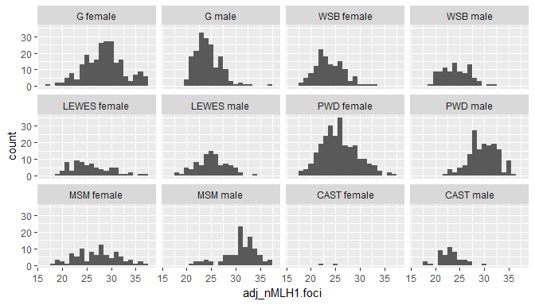

It seems like there is a population of lower cells in MSM males. This could be from slides which had bad staining.

#### Assessing the number of cells per mouse

latice plot of scatter plots for jitter plots of cell oberservations by quality

    ## [[1]]

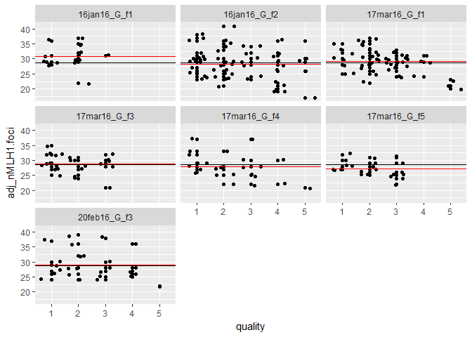

    ## 
    ## [[1]]

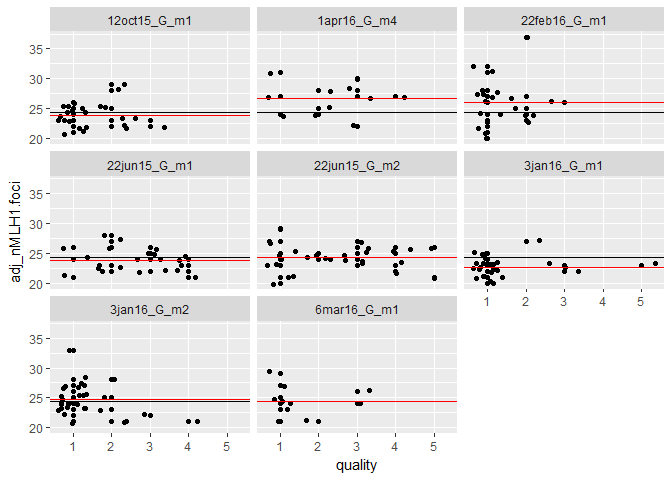

    ## 
    ## [[1]]


    ## 
    ## [[1]]

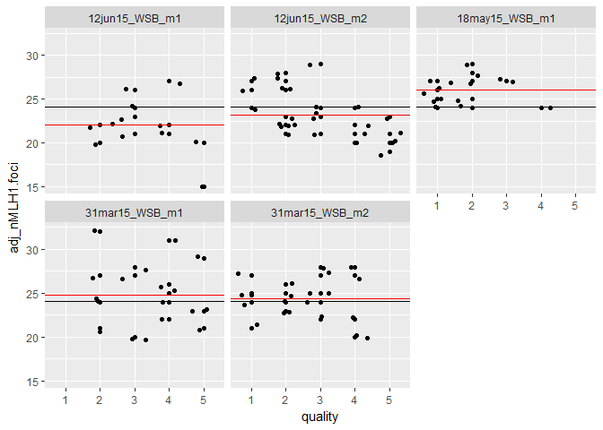

    ## 
    ## [[1]]

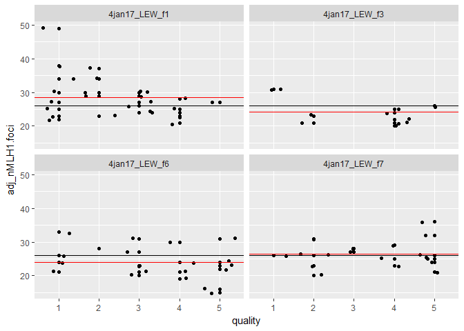

    ## 
    ## [[1]]

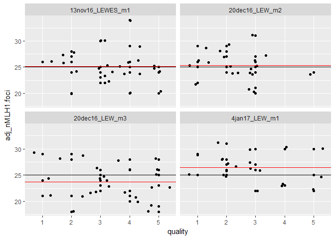

    ## 
    ## [[1]]


    ## 
    ## [[1]]

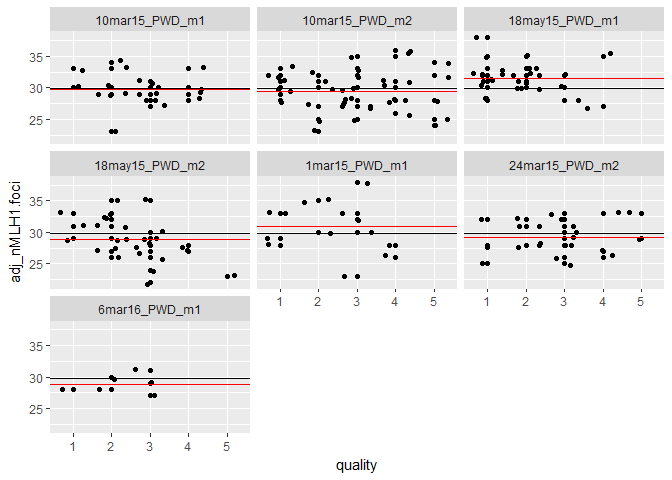

    ## 
    ## [[1]]

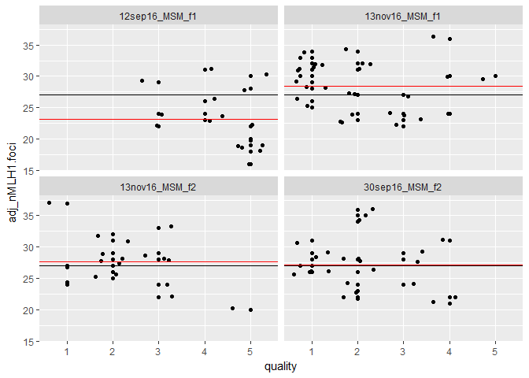

    ## 
    ## [[1]]

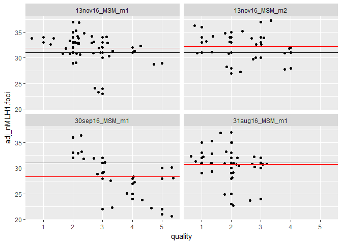

    ## 
    ## [[1]]

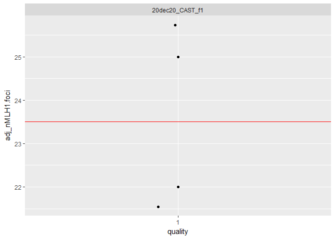

    ## 
    ## [[1]]

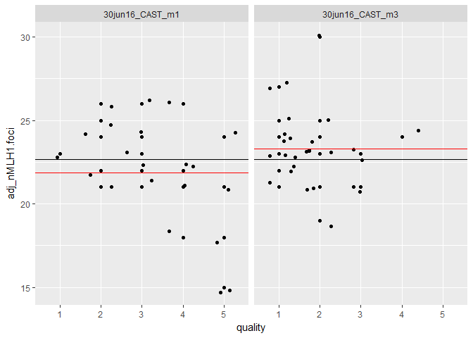

Making all of these scatter plots, allows us to look at the whole distributions.

In this analysis each mouse will have a sample of cells that are used to estimate the *true* distribution of nMLH1 foci per cell. Power calculations can be done to assess if the current sample of cells gives a good estimate of the true distrubtion of nMLH1 foci.

### power calqs

Think about a loop that will -- i) take ~100 different sized samples of total images (10%, 25%, 50%, 75%, 90%) (with varying degrees of quality) ii) then run t.tests across those samples, and report the p value iii) make a table of the p values for these sample permutations

Find those old R scripts and recreate here.

Diminishing return analysis. Take some of the mice identified above, simulate random sampling of 10,15,20,30. Display the raw mean and sd, and results from 10 simulations.

use 10mar15\_PWD\_m2 as example set,

make mouse specific data sets, and take different sized samples -- then display in boxplots by sample size.

 \#omg finally that took so long. main interpertations: the variance grows with larger sample size. \#these are representations of independant samples -- I need to think of a way to show an average of the stats for multiple simulations.

``` r
G_f_example = MLH1_data[MLH1_data$mouse == '17mar16_G_f1', ]

datf <- data.frame(
  MLH1_sample = c(sample(G_f_example$nMLH1.foci, 10, replace=FALSE),  sample(G_f_example$nMLH1.foci, 15, replace=FALSE),    sample(G_f_example$nMLH1.foci, 20, replace=FALSE), sample(G_f_example$nMLH1.foci, 30, replace=FALSE), sample(G_f_example$nMLH1.foci, 35, replace=FALSE) ),   
  samplesize = c(rep("10", 10), rep("15", 15), rep("20", 20), rep("30", 30), rep("35", 35)) )

v <- ggplot(data = datf, aes(x=samplesize, y=MLH1_sample)) + geom_boxplot(aes(fill=samplesize) ) 
v                                                                         
```

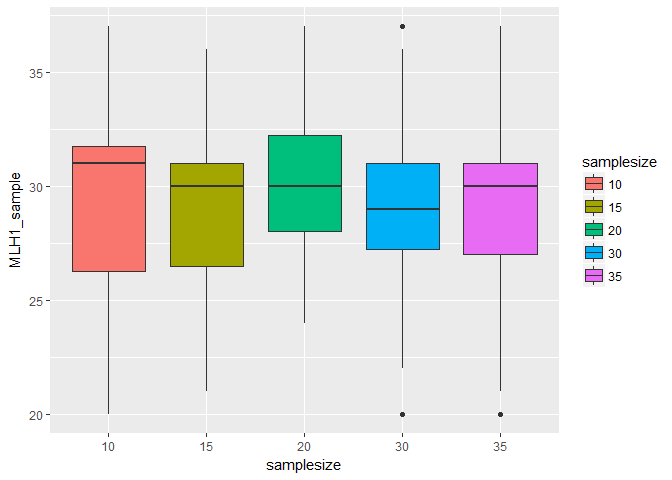

``` r
v + ggtitle("varying sample sizes") 
```

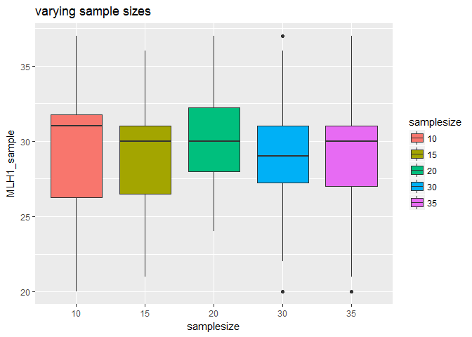 Can the above code be repeated for a larger number of mice (both passing and non-passing) to show the different effects across samples sizes?

power calculations.... from a preivous document --- I showed myself that for 15 (good) cells, would provide a sample big enough to detect a difference of 3 foci. I only did this for a couple mice, I'll try to re-code for every mouse

``` r
passed_mice_data <- MLH1_data[MLH1_data$mouse %in% passed_mice, ]
non_passed_mice_data <- MLH1_data[MLH1_data$mouse %in% not_passed, ]

#make a column to mark if observation comes from passed or not passed mouse
#turn this into boxplot and sort the category order, otherwise it's hard to any patterns
sc <- qplot(mouse, nMLH1.foci,  colour = category, data = non_passed_mice_data, main="s", xlab="s", ylab="es")
sc + theme(legend.position="none")
```

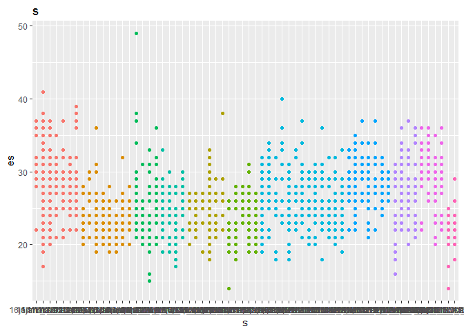

``` r
sc <- qplot(mouse, nMLH1.foci,  colour = category, data = passed_mice_data, main="s", xlab="s", ylab="es")
sc + theme(legend.position="none")
```

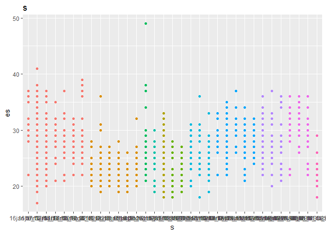

``` r
# not working not sure of the purpose
#count =1
#for(i in MLH1_data$file.name){
#  templist= strsplit(i, split="_")[[1]]
#  if(MLH1_data$mouse %in% passed_mice) 
#  MLH1_data$mouse[count] <- c
#  count= count +1
#}
```

#### 2. Power calculations

##### Strain specific

The code chunck below makes a table of t.test results. Each category has 2 rows. When I tried changing equal variance to false, the code breaks. c("strain", "sex"),

``` r
#for the record, this is a way to make a table with pwr and t.test results
category_pwr_stat <- ddply(MLH1_data, "category", function(x) {
Nmice <- length( unique(x$mouse) )
mean.count <- mean(x$adj_nMLH1.foci)
sd.count <- sd(x$adj_nMLH1.foci)
cv <- sd.count/mean.count

ttest <- t.test(x$adj_nMLH1.foci, (20), alternative = "two", var.equal=TRUE)$p.value
ttestCI.lowr <- t.test(x$adj_nMLH1.foci, (20), alternative = "two", var.equal=TRUE)$conf.int[1]
ttestCI.upr <- t.test(x$adj_nMLH1.foci, (20), alternative = "two", var.equal=TRUE)$conf.int[2]
ttest.est <- t.test(x$adj_nMLH1.foci, (20), alternative = "two", var.equal=TRUE)$estimate

pwr5mice <- pwr.norm.test(d = (3/sd.count), n = 20, sig.level = 0.05, alternative = "two")$power
data.frame(Nmice=Nmice, cv.count = cv, ttest=ttest, CIlower = ttestCI.lowr, 
           CIupr = ttestCI.upr,
 pwr = pwr5mice, ttest.est=ttest.est)
})
category_pwr_stat
```

    ##        category Nmice   cv.count       ttest     CIlower     CIupr
    ## 1      G female     7 0.14724645 0.041610467   0.3322745 17.003970
    ## 2      G female     7 0.14724645 0.041610467   0.3322745 17.003970
    ## 3        G male     8 0.10875443 0.103185228  -0.8907761  9.591341
    ## 4        G male     8 0.10875443 0.103185228  -0.8907761  9.591341
    ## 5    WSB female     7 0.13337323 0.222034625  -2.4073414 10.269937
    ## 6    WSB female     7 0.13337323 0.222034625  -2.4073414 10.269937
    ## 7      WSB male     5 0.12261217 0.173966973  -1.8263984  9.954058
    ## 8      WSB male     5 0.12261217 0.173966973  -1.8263984  9.954058
    ## 9  LEWES female     4 0.20189665 0.255766388  -4.4839278 16.613798
    ## 10 LEWES female     4 0.20189665 0.255766388  -4.4839278 16.613798
    ## 11   LEWES male     4 0.12450402 0.109877667  -1.1658338 11.293493
    ## 12   LEWES male     4 0.12450402 0.109877667  -1.1658338 11.293493
    ## 13   PWD female    13 0.14556600 0.123783612  -1.6008290 13.229288
    ## 14   PWD female    13 0.14556600 0.123783612  -1.6008290 13.229288
    ## 15     PWD male     7 0.10117677 0.001421823   3.8516591 15.810841
    ## 16     PWD male     7 0.10117677 0.001421823   3.8516591 15.810841
    ## 17   MSM female     4 0.16458646 0.120341567  -1.8712658 15.893488
    ## 18   MSM female     4 0.16458646 0.120341567  -1.8712658 15.893488
    ## 19     MSM male     4 0.10853217 0.001496341   4.3392023 17.778445
    ## 20     MSM male     4 0.10853217 0.001496341   4.3392023 17.778445
    ## 21  CAST female     1 0.09026895 0.406519728 -29.5116883 36.511688
    ## 22  CAST female     1 0.09026895 0.406519728 -29.5116883 36.511688
    ## 23    CAST male     2 0.12187340 0.344253468  -2.9482842  8.281618
    ## 24    CAST male     2 0.12187340 0.344253468  -2.9482842  8.281618
    ##          pwr ttest.est
    ## 1  0.8884482  28.66812
    ## 2  0.8884482  20.00000
    ## 3  0.9990527  24.35028
    ## 4  0.9990527  20.00000
    ## 5  0.9875658  23.93130
    ## 6  0.9875658  20.00000
    ## 7  0.9951616  24.06383
    ## 8  0.9951616  20.00000
    ## 9  0.7222435  26.06494
    ## 10 0.7222435  20.00000
    ## 11 0.9903429  25.06383
    ## 12 0.9903429  20.00000
    ## 13 0.9463489  25.81423
    ## 14 0.9463489  20.00000
    ## 15 0.9935254  29.83125
    ## 16 0.9935254  20.00000
    ## 17 0.8549499  27.01111
    ## 18 0.8549499  20.00000
    ## 19 0.9783148  31.05882
    ## 20 0.9783148  20.00000
    ## 21 0.9999936  23.50000
    ## 22 0.9999936  20.00000
    ## 23 0.9981146  22.66667
    ## 24 0.9981146  20.00000

``` r
plot(category_pwr_stat$category, category_pwr_stat$ttest.est)
```

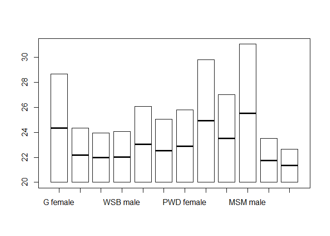 I am not sure how to interpert these power calqs. The estimates are all overlapping.. I guess I shouldn't be suprised by this?

### initial inferences of nMLH1 Patterns

(make boxplots, note differences, include caveats for low numbers or quality differences)

This Rmd file displays the boxplots of MLH1 distributions.

Below is a figure of boxplots all mice from current data batches.

This is the text above the table, this will show category wide stats of current MLH1 data set.

| strain | sex    |  Nmice|  Ncells| mean\_co | var    |     sd|     se| subsp     | dataset |
|:-------|:-------|------:|-------:|:---------|:-------|------:|------:|:----------|:--------|
| CAST   | male   |      2|      48| 21.667   | 7.631  |  2.762|  0.399| Cast      | AP      |
| G      | female |      7|     229| 28.668   | 17.819 |  4.221|  0.279| Dom       | AP      |
| G      | male   |      8|     178| 23.360   | 6.989  |  2.644|  0.198| Dom       | AP      |
| LEWES  | female |      4|      77| 26.065   | 27.693 |  5.262|  0.600| Dom       | AP      |
| LEWES  | male   |      4|      94| 24.064   | 9.738  |  3.121|  0.322| Dom       | AP      |
| MSM    | female |      4|      90| 27.011   | 19.764 |  4.446|  0.469| Musc-Cast | AP      |
| MSM    | male   |      4|     102| 30.059   | 11.363 |  3.371|  0.334| Musc-Cast | AP      |
| PWD    | female |     13|     255| 25.788   | 14.097 |  3.755|  0.235| Musc      | AP      |
| PWD    | male   |      7|     161| 28.863   | 9.219  |  3.036|  0.239| Musc      | AP      |
| WSB    | female |      7|     132| 23.917   | 10.138 |  3.184|  0.277| Dom       | AP      |
| WSB    | male   |      5|      95| 23.095   | 8.704  |  2.950|  0.303| Dom       | AP      |
