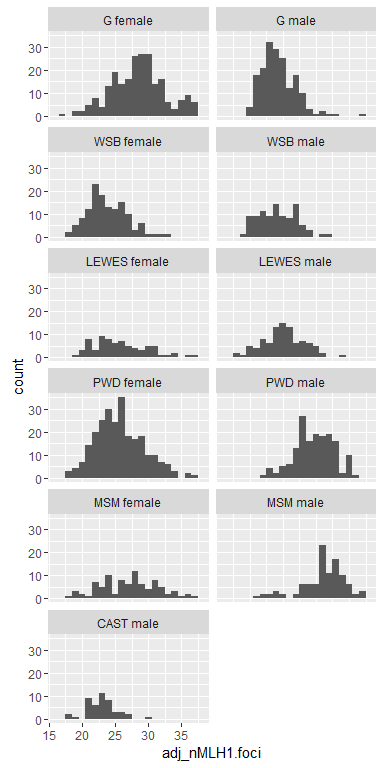
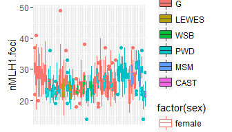
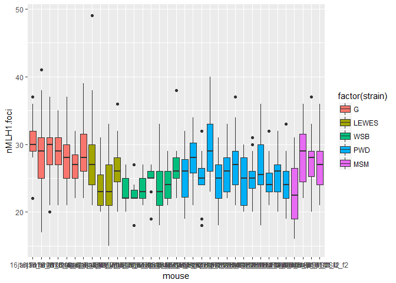

MLH1 Plots
================
April Peterson
August 29, 2017

    ## 
    ## Attaching package: 'dplyr'

    ## The following objects are masked from 'package:stats':
    ## 
    ##     filter, lag

    ## The following objects are masked from 'package:base':
    ## 
    ##     intersect, setdiff, setequal, union

This Rmd file displays the boxplots of MLH1 distributions.

Below is a figure of boxplots all mice from current data batches.



Below are the boxplots for female MLH1 distributions.



Below are the boxplots for male MLH1 distributions.



Entering tables is currently broken Rmd.

``` r
#q_cutoff_table <- ddply(MLH1_data, .(mouse), summarise,
 #                       total =  length(nMLH1.foci),
  #                      q5 = sum(as.numeric(quality) >= 4, na.rm = TRUE ), 
   #                     q_l3 = sum(as.numeric(as.numeric(quality)) <= 4, na.rm = TRUE)
#)
#q_cutoff_table
```
