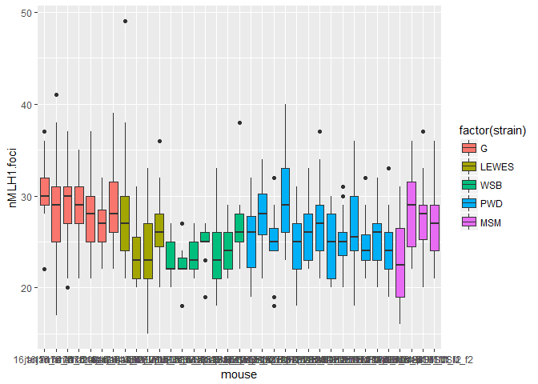
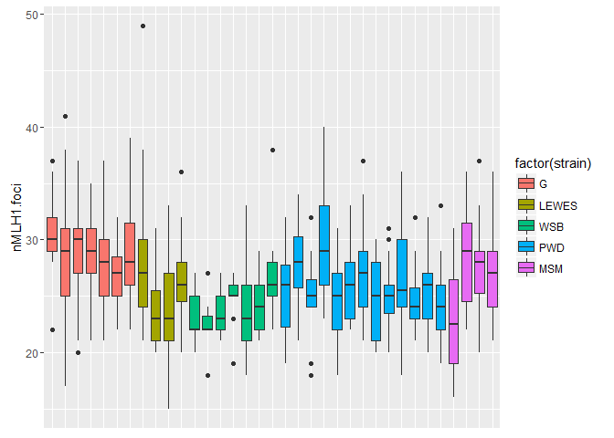

MLH1 data report
================
April Peterson
August 29, 2017

TODO data set up page; remove non quality observations, set strain colors to manual, remove the custom sizing for the later tables. 
make/include Rsetupdata script, power qualq, 'approved mouse list', start metadata merging and analysis

include is for blocking output messages. echo false is for silencing the code commands.

#### goals of research

Measure nMLH1 foci per meiotic cell to estimate recombination rate for diverse strains of house mice (rodents). Comparisons the differences in recombination rates across sexes and genetic background to inform models of how meiotic recombination rates evolve. (insert small picture of meixyte)

### Goal / Discription of Report

Goal of this report;

> *to keep track of the number of images for each category and mouse*

This is important for getting an idea of the 'power' I have to accurately estimate MLH1 distributions across the categories of cells I am quantifying.

#### Discription of data and quantification process

data frames are loaded of MLH1 data imagename, mouse name, strain, sex, nMLH1.

quanti process. anonymized, given quality score

This is the text above the table, this will show category wide stats of current MLH1 data set.

| strain | sex    |  Nmice|  Ncells| mean\_co | var    |     sd|     se| subsp     | dataset |
|:-------|:-------|------:|-------:|:---------|:-------|------:|------:|:----------|:--------|
| CAST   | male   |      2|      48| 21.667   | 7.631  |  2.762|  0.399| Cast      | AP      |
| G      | female |      7|     229| 28.668   | 17.819 |  4.221|  0.279| Dom       | AP      |
| G      | male   |      8|     178| 23.360   | 6.989  |  2.644|  0.198| Dom       | AP      |
| LEWES  | female |      4|      77| 26.065   | 27.693 |  5.262|  0.600| Dom       | AP      |
| LEWES  | male   |      4|      94| 24.064   | 9.738  |  3.121|  0.322| Dom       | AP      |
| MSM    | female |      4|      90| 27.011   | 19.764 |  4.446|  0.469| Musc-Cast | AP      |
| MSM    | male   |      4|     102| 30.059   | 11.363 |  3.371|  0.334| Musc-Cast | AP      |
| PWD    | female |     13|     255| 25.788   | 14.097 |  3.755|  0.235| Musc      | AP      |
| PWD    | male   |      7|     161| 28.863   | 9.219  |  3.036|  0.239| Musc      | AP      |
| WSB    | female |      7|     132| 23.917   | 10.138 |  3.184|  0.277| Dom       | AP      |
| WSB    | male   |      5|      95| 23.095   | 8.704  |  2.950|  0.303| Dom       | AP      |

### disctibutions based on quality

Assess pattern of quality score and nMLH1. why? The human scoring the cells may have introcudced biases by giving a higher quality to cells with more foci. Unbiased cell quality assignment, would not show a positive correlation with quality and nMLH1.

Quality score is 1 based, to a correlation of nMLH1 and quality will have a right dowward line.  hmm, not sure if scatter plots are the best for assessing this due to the discrite nature of nMLH1... Red point displays the

I ploted the mean of each quality bin with a red dot. From the pattern of the red dots, there is definately a negative relationship with quality and nMLH1 foci across the data. This is most pronounced in MSM males and least pronounced in G males.

Potential solutions? admit that the quality criteria are stupid..? does RW's data have this pattern? should the data be transformed/adjusted? Will looking at these figures bias how I score here on out?!

> *do some mice have better quality cells?* *Does this cause bias in the data?*

    ## Warning: Removed 8 rows containing non-finite values (stat_bin).

 bin width was adjusted to 1. x axis scale was adjusted. It seems like there is a population of lower cells in MSM males. This could be from slides which had bad staining.

### power calqs

Find those old R scripts and recreate here.

### initial inferences of nMLH1 Patterns

(make boxplots, note differences, include caveats for low numbers or quality differences)

This Rmd file displays the boxplots of MLH1 distributions.

Below is a figure of boxplots all mice from current data batches.


#### Assessing the number of cells per mouse

In this analysis each mouse will have a sample of cells that are used to estimate the *ture* distribution of nMLH1 foci per cell. Power calculations can be done to assess if the current sample of cells gives a good estimate of the true distrubtion of nMLH1 foci.

Below are the boxplots for female MLH1 distributions.



Below are the boxplots for male MLH1 distributions.



``` r
#q_cutoff_table <- ddply(MLH1_data, .(mouse), summarise,
 #                       total =  length(nMLH1.foci),
  #                      q5 = sum(as.numeric(quality) >= 4, na.rm = TRUE ), 
   #                     q_l3 = sum(as.numeric(as.numeric(quality)) <= 4, na.rm = TRUE)
#)
#q_cutoff_table
```

figure will be generated below. this is the text above that prefaces it, how and why the figure(s) are set up. The following figure will display the boxplots of MLH1 distributions seperated by sexes.

text before the table for mouse specific tables. (make them smaller and more compact?)
